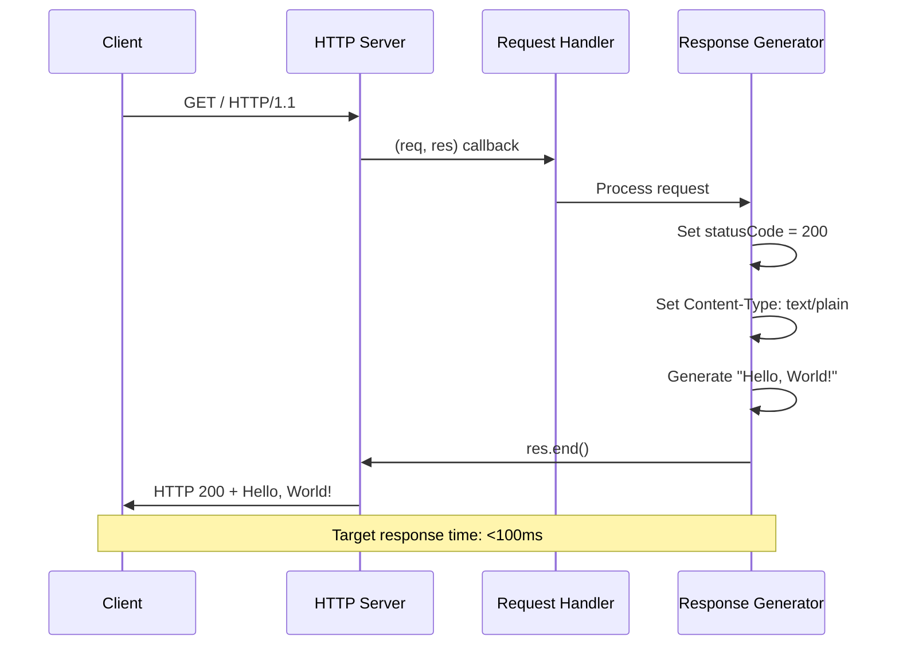
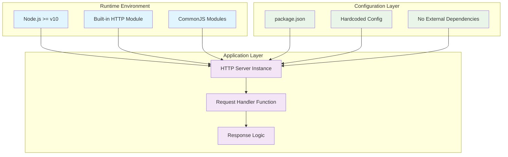

# hao-backprop-test

> **⚠️ Documentation Enhancement Notice**: This README has been enhanced from the original minimal version to provide comprehensive project documentation. The project maintains its core testing purpose while providing detailed setup and usage instructions.

## 📋 Table of Contents

- [Project Overview](#project-overview)
- [Prerequisites](#prerequisites)
- [Installation](#installation)
- [Quick Start](#quick-start)
- [API Documentation](#api-documentation)
- [Project Architecture](#project-architecture)
- [Deployment Guide](#deployment-guide)
- [Testing](#testing)
- [Troubleshooting](#troubleshooting)
- [Contributing](#contributing)
- [License](#license)

## 🔍 Project Overview

**hao-backprop-test** is a Node.js-based testing infrastructure designed for backpropagation algorithm integration testing. The project currently implements a foundational HTTP server that serves as the basis for future machine learning integration testing capabilities.

### Current Implementation Status

- ✅ **HTTP Server Foundation**: Basic web server infrastructure on `localhost:3000`
- ✅ **Zero Dependencies**: Pure Node.js implementation using only built-in modules
- ✅ **Request Handling**: Simple response mechanism returning "Hello, World!" output
- ⚠️ **Implementation Gap**: Backpropagation integration functionality planned but not yet implemented
- ⚠️ **Entry Point Issue**: Package.json references `index.js` but actual implementation is in `server.js`

### Project Purpose vs Current State

| Intended Purpose | Current Implementation | Future Development |
|------------------|----------------------|-------------------|
| Backpropagation testing framework | Basic HTTP server | Algorithm integration |
| Neural network validation | Simple request/response | NN validation endpoints |
| Integration test orchestration | Manual execution | Automated test suite |
| >95% test pass rate target | No tests implemented | Comprehensive test coverage |

### Naming Convention Resolution

**Repository Name**: `hao-backprop-test`  
**Package Name**: `hello_world` (package.json)  
**Resolution**: The repository name `hao-backprop-test` accurately reflects the project's intended purpose for backpropagation testing, while the package.json name `hello_world` represents the current simple implementation state.

## 🔧 Prerequisites

### System Requirements

| Requirement | Specification | Verification Command |
|-------------|---------------|---------------------|
| **Node.js** | >= v10.0.0 (Recommended: v22.x LTS) | `node --version` |
| **npm** | >= v7.0.0 (for lockfileVersion 3 support) | `npm --version` |
| **Operating System** | Cross-platform (Windows, macOS, Linux) | N/A |
| **Memory** | < 200MB peak usage during operation | Monitor via Activity Monitor/Task Manager |

### Environment Setup Verification

```bash
# Verify Node.js installation and version
node --version
# Expected: v10.0.0 or higher

# Verify npm installation and version
npm --version
# Expected: v7.0.0 or higher

# Check available memory (optional)
node -e "console.log(process.memoryUsage())"
```

## 📦 Installation

### Step 1: Clone Repository

```bash
git clone <repository-url>
cd hao-backprop-test
```

### Step 2: Verify Dependencies

```bash
# Install dependencies (validates npm setup, no external dependencies required)
npm install
```

**Note**: This project uses a **zero-dependency architecture**. The `npm install` command validates your npm setup but installs no external packages, as confirmed by the empty dependency tree in `package-lock.json`.

### Step 3: Verify Installation

```bash
# Check project structure
ls -la
# Expected files: server.js, package.json, package-lock.json, README.md
```

## 🚀 Quick Start

### Starting the Server

```bash
# Start the HTTP server
node server.js
```

**Expected Output:**
```
Server running at http://127.0.0.1:3000/
```

### Testing the Server

```bash
# In a new terminal, test the server response
curl http://127.0.0.1:3000/

# Expected response:
# Hello, World!
```

**Alternative Testing Methods:**
- **Browser**: Navigate to `http://127.0.0.1:3000/`
- **Node.js**: Use the built-in HTTP client
- **Postman**: GET request to `http://127.0.0.1:3000/`

### Stopping the Server

Press `Ctrl+C` in the terminal running the server to gracefully shut down.

## 📚 API Documentation

### HTTP Endpoints

#### GET /

**Description**: Primary endpoint returning a simple greeting message.

**Request:**
```http
GET / HTTP/1.1
Host: 127.0.0.1:3000
```

**Response:**
```http
HTTP/1.1 200 OK
Content-Type: text/plain

Hello, World!
```

**Response Details:**

| Property | Value |
|----------|-------|
| **Status Code** | 200 OK |
| **Content-Type** | text/plain |
| **Response Body** | Hello, World!\n |
| **Response Time Target** | < 100ms |

### Server Configuration

**Current Configuration** (Source: `server.js:3-4`):

```javascript
const hostname = '127.0.0.1';  // Localhost only
const port = 3000;             // Default port
```

**Configuration Parameters:**

| Parameter | Value | Purpose | Modifiable |
|-----------|-------|---------|------------|
| `hostname` | 127.0.0.1 | Bind to localhost only | Yes (source code) |
| `port` | 3000 | HTTP server port | Yes (source code) |
| `timeout` | None | Request timeout | Not implemented |

### Code Implementation Details

**Server Creation** (Source: `server.js:6-10`):

```javascript
const server = http.createServer((req, res) => {
  res.statusCode = 200;                    // Set HTTP 200 OK status
  res.setHeader('Content-Type', 'text/plain'); // Set content type
  res.end('Hello, World!\n');             // Send response and close
});
```

**Server Startup** (Source: `server.js:12-14`):

```javascript
server.listen(port, hostname, () => {
  console.log(`Server running at http://${hostname}:${port}/`);
});
```

## 🏗️ Project Architecture

### System Components

```mermaid
graph TD
    A[Client Request] --> B[HTTP Server<br/>Port 3000]
    B --> C[Request Handler<br/>server.js:6-10]
    C --> D[Response Generator<br/>res.end()]
    D --> E[Client Response<br/>Hello, World!]
    
    F[Package Configuration<br/>package.json] --> B
    G[Entry Point Issue<br/>index.js missing] -.-> B
    
    style B fill:#90EE90
    style C fill:#87CEEB
    style D fill:#DDA0DD
    style E fill:#F0E68C
    style F fill:#98FB98
    style G fill:#FFB6C1,stroke-dasharray: 5 5
    
    classDef implemented fill:#90EE90
    classDef missing fill:#FFB6C1
    
    class A,B,C,D,E,F implemented
    class G missing
```

### Request Flow Diagram



### Technology Stack



## 🚀 Deployment Guide

### Local Development Deployment

#### Prerequisites Check

```bash
# Verify Node.js installation
node --version  # Should be >= v10.0.0

# Verify npm setup
npm --version   # Should be >= v7.0.0

# Check available memory
node -e "console.log('Memory available:', Math.round(process.memoryUsage().heapTotal/1024/1024), 'MB')"
```

#### Deployment Steps

1. **Clone and Setup**:
   ```bash
   git clone <repository-url>
   cd hao-backprop-test
   npm install  # Validates npm setup
   ```

2. **Start Server**:
   ```bash
   node server.js
   ```

3. **Verify Deployment**:
   ```bash
   # Health check
   curl -w "@curl-format.txt" -o /dev/null -s http://127.0.0.1:3000/
   
   # Expected: HTTP 200, response time <100ms
   ```

### Production Deployment Considerations

⚠️ **Important**: Current implementation is designed for local development and testing only.

#### Security Considerations

| Aspect | Current State | Production Requirements |
|--------|---------------|------------------------|
| **Binding** | localhost only (127.0.0.1) | Configure appropriate network binding |
| **Authentication** | None | Implement authentication if needed |
| **HTTPS** | HTTP only | Consider HTTPS for production |
| **Input Validation** | None | Add input validation and sanitization |
| **Rate Limiting** | None | Implement rate limiting |
| **Logging** | Console only | Implement structured logging |

#### Configuration for Production

**Environment Variables** (recommended approach):

```javascript
// Proposed production configuration
const hostname = process.env.HOST || '127.0.0.1';
const port = process.env.PORT || 3000;
const environment = process.env.NODE_ENV || 'development';
```

#### Process Management

**Using PM2** (recommended for production):

```bash
# Install PM2 globally
npm install -g pm2

# Start application with PM2
pm2 start server.js --name "hao-backprop-test"

# Monitor
pm2 status
pm2 logs hao-backprop-test
```

#### Resource Monitoring

```bash
# Monitor memory usage
node -e "
setInterval(() => {
  const usage = process.memoryUsage();
  console.log(\`Memory: \${Math.round(usage.heapUsed/1024/1024)}MB\`);
}, 5000);
"
```

### Docker Deployment (Optional)

**Dockerfile** (if containerization is needed):

```dockerfile
FROM node:22-alpine

WORKDIR /app
COPY package*.json ./
RUN npm ci --only=production

COPY server.js ./
EXPOSE 3000

USER node
CMD ["node", "server.js"]
```

## 🧪 Testing

### Current Testing Status

⚠️ **Testing Infrastructure**: Currently not implemented.

**Package.json Test Script** (Source: `package.json:6-8`):
```json
"scripts": {
  "test": "echo \"Error: no test specified\" && exit 1"
}
```

### Planned Testing Framework

Based on the zero-dependency constraint, the testing framework will utilize **Node.js built-in capabilities exclusively**:

#### Test Categories

| Test Type | Purpose | Implementation | Target Coverage |
|-----------|---------|----------------|-----------------|
| **Unit Tests** | Individual function validation | Node.js `assert` module | >95% function coverage |
| **Integration Tests** | Component interaction testing | HTTP request simulation | >90% integration paths |
| **Performance Tests** | Response time validation | `process.hrtime.bigint()` | <100ms average response |
| **End-to-End Tests** | Complete workflow testing | Full server lifecycle | >90% E2E scenarios |

#### Test Runner Implementation Plan

```javascript
// Proposed custom test runner using Node.js built-ins
const assert = require('assert');
const http = require('http');

class TestRunner {
  constructor() {
    this.tests = [];
    this.results = [];
  }
  
  addTest(name, testFunction) {
    this.tests.push({ name, testFunction });
  }
  
  async runTests() {
    for (const test of this.tests) {
      try {
        await test.testFunction();
        this.results.push({ name: test.name, status: 'PASS' });
      } catch (error) {
        this.results.push({ name: test.name, status: 'FAIL', error });
      }
    }
    return this.results;
  }
}
```

#### Manual Testing

**Current Testing Approach**:

```bash
# 1. Start server
node server.js

# 2. Test basic functionality
curl -v http://127.0.0.1:3000/

# 3. Test response time
curl -w "@curl-format.txt" -o /dev/null -s http://127.0.0.1:3000/
```

**Expected Results**:
- HTTP Status: 200 OK
- Response: "Hello, World!"
- Response Time: <100ms
- Memory Usage: <200MB

### Testing Checklist

- [ ] Server starts successfully
- [ ] Responds to HTTP GET requests
- [ ] Returns correct content type (text/plain)
- [ ] Response time under 100ms
- [ ] Memory usage under 200MB
- [ ] Graceful shutdown on Ctrl+C

## 🔧 Troubleshooting

### Common Issues and Solutions

#### Issue 1: Server Won't Start

**Symptoms:**
- Error: `EADDRINUSE: address already in use`
- Port 3000 already occupied

**Solutions:**
```bash
# Check what's using port 3000
lsof -i :3000          # macOS/Linux
netstat -ano | findstr :3000  # Windows

# Kill the process using port 3000
kill -9 <PID>          # macOS/Linux
taskkill /PID <PID> /F # Windows

# Alternative: Use different port
# Modify server.js: const port = 3001;
```

#### Issue 2: Node.js Version Issues

**Symptoms:**
- Syntax errors with older Node.js versions
- CommonJS module issues

**Solutions:**
```bash
# Check Node.js version
node --version

# Update Node.js (recommended: v22.x LTS)
# Visit https://nodejs.org/ for latest version

# Use Node Version Manager (nvm)
nvm install 22
nvm use 22
```

#### Issue 3: Package.json Entry Point Mismatch

**Symptoms:**
- `npm start` fails
- Error: Cannot find module 'index.js'

**Current Status:** 
- Package.json references `"main": "index.js"`
- Actual file is `server.js`

**Workarounds:**
```bash
# Option 1: Direct execution (recommended)
node server.js

# Option 2: Create index.js (temporary solution)
echo "require('./server.js');" > index.js
npm start
```

#### Issue 4: Memory Issues

**Symptoms:**
- High memory usage (>200MB)
- Application slowdown

**Solutions:**
```bash
# Monitor memory usage
node -e "console.log(process.memoryUsage())"

# Check for memory leaks
node --inspect server.js
# Open Chrome DevTools for memory profiling
```

#### Issue 5: Network Connectivity Issues

**Symptoms:**
- Cannot access http://127.0.0.1:3000/
- Connection refused errors

**Solutions:**
```bash
# Test network binding
netstat -tlnp | grep 3000

# Test with different addresses
curl http://localhost:3000/
curl http://0.0.0.0:3000/
curl http://127.0.0.1:3000/

# Check firewall settings (if applicable)
```

### Performance Troubleshooting

#### Response Time Issues

**Target:** <100ms average response time

**Monitoring:**
```bash
# Create curl timing format file
cat > curl-format.txt << 'EOF'
     time_namelookup:  %{time_namelookup}\n
        time_connect:  %{time_connect}\n
     time_appconnect:  %{time_appconnect}\n
    time_pretransfer:  %{time_pretransfer}\n
       time_redirect:  %{time_redirect}\n
  time_starttransfer:  %{time_starttransfer}\n
                     ----------\n
          time_total:  %{time_total}\n
EOF

# Test response time
curl -w "@curl-format.txt" -o /dev/null -s http://127.0.0.1:3000/
```

### Debug Mode

**Enable Debug Output:**
```bash
# Add debug logging to server.js (temporarily)
const server = http.createServer((req, res) => {
  console.log(`${new Date().toISOString()} - ${req.method} ${req.url}`);
  res.statusCode = 200;
  res.setHeader('Content-Type', 'text/plain');
  res.end('Hello, World!\n');
});
```

### Support and Resources

**Getting Help:**
- Check Node.js documentation: https://nodejs.org/docs/
- Review HTTP module documentation: https://nodejs.org/api/http.html
- CommonJS module system: https://nodejs.org/api/modules.html

## 🤝 Contributing

### Development Guidelines

1. **Maintain Zero Dependencies**: Only use Node.js built-in modules
2. **Code Style**: Follow existing patterns in `server.js`
3. **Testing**: Add comprehensive tests for new functionality
4. **Documentation**: Update README.md for any changes
5. **Performance**: Maintain <100ms response time target

### Future Development Roadmap

#### Phase 1: Foundation (Current)
- ✅ Basic HTTP server implementation
- ✅ Zero-dependency architecture
- ✅ Documentation enhancement

#### Phase 2: Testing Infrastructure
- [ ] Custom test runner implementation
- [ ] Unit test coverage for server.js
- [ ] Performance testing framework
- [ ] Code coverage measurement

#### Phase 3: Backpropagation Integration
- [ ] Neural network validation endpoints
- [ ] Algorithm integration testing capabilities
- [ ] Test orchestration functionality
- [ ] >95% test pass rate achievement

#### Phase 4: Production Readiness
- [ ] Environment configuration system
- [ ] Comprehensive error handling
- [ ] Security enhancements
- [ ] Monitoring and observability

### Code Quality Standards

- **Test Coverage**: Target >90% for all new code
- **Response Time**: Maintain <100ms average
- **Memory Usage**: Keep under 200MB peak usage
- **Error Handling**: Comprehensive error coverage
- **Documentation**: Complete inline and README documentation

## 📄 License

MIT License

**Project Information:**
- **Author**: hxu (Source: `package.json:9`)
- **Version**: 1.0.0 (Source: `package.json:2`)
- **License**: MIT (Source: `package.json:10`)

---

## 📊 Project Status Summary

| Aspect | Status | Details |
|--------|--------|---------|
| **Core HTTP Server** | ✅ Complete | Basic functionality implemented |
| **Zero Dependencies** | ✅ Complete | No external packages required |
| **Documentation** | ✅ Enhanced | Comprehensive README created |
| **Testing Framework** | ⚠️ Planned | Custom test runner design complete |
| **Backpropagation Integration** | ❌ Not Started | Future development phase |
| **Production Readiness** | ⚠️ Partial | Development-ready, production considerations documented |

**Next Steps:**
1. Resolve package.json entry point (index.js vs server.js)
2. Implement custom testing framework
3. Add backpropagation algorithm integration
4. Enhance production deployment capabilities

---

*This documentation was enhanced to provide comprehensive project guidance while maintaining the original testing project intent. The server implementation remains unchanged, serving as the foundation for future backpropagation testing capabilities.*