# Technical Specification

# 0. SUMMARY OF CHANGES

## 0.1 DOCUMENTATION INTENT CLARIFICATION

### 0.1.1 Documentation Objective

Based on the provided requirements, the Blitzy platform understands that the documentation objective is to **CREATE new documentation** for a Node.js hello world application. The documentation initiative encompasses two primary deliverables:

1. **JSDoc Comments**: Add comprehensive JSDoc documentation to all functions within a `server.js` file
2. **README Documentation**: Create a new README file containing setup instructions, API documentation, deployment guide, and inline code explanations

This translates to the following technical objectives:
- Transform an undocumented Node.js project into a well-documented, production-ready application
- Provide clear guidance for developers on setup, usage, and deployment
- Establish API documentation standards using JSDoc for maintainability
- Create user-friendly documentation that serves both technical and non-technical stakeholders

### 0.1.2 Documentation Templates and Examples

The user has not provided specific templates, but has clearly outlined the required sections for the README:
- Setup instructions
- API documentation  
- Deployment guide
- Inline code explanations

Documentation format preference defaults to **Markdown with Mermaid diagrams** for the README, and **JSDoc standard** for JavaScript function documentation.

### 0.1.3 Documentation Scope Discovery

Given the limited scope information, a comprehensive repository analysis reveals:

**Current Repository State:**
- Minimal Node.js project with only `package.json` and `package-lock.json`
- Entry point defined as `index.js` in package.json (file not yet created)
- No existing `server.js` file (will need to be created)
- No existing documentation files

**Inferred Documentation Requirements:**
- The mention of `server.js` implies this will be a Node.js server application
- API documentation suggests RESTful endpoints or similar server functionality
- Deployment guide indicates production deployment considerations
- The project will evolve from a simple "hello world" to a documented server application

## 0.2 DOCUMENTATION SCOPE ANALYSIS

### 0.2.1 Comprehensive File Discovery

**Repository Search Strategy:**
- Search patterns used: ["server.js", "*.js files", "index.js", "README"]
- Key directories examined: [root directory]
- Related documentation found: None

**Documentation-to-Code Mapping Table:**

| Documentation File | Target Code Files/Modules | Documentation Type | Coverage Scope |
|-------------------|--------------------------|-------------------|----------------|
| /README.md | /server.js, /package.json, deployment configs | Project Documentation | Setup, API reference, deployment, examples |
| /server.js (inline JSDoc) | /server.js functions | API Reference | All public and private functions with parameters, returns, examples |

**Inferred Documentation Needs:**
- Based on structure: A server.js file will be created requiring JSDoc documentation for all functions
- Based on requirements: README must cover the complete lifecycle from setup to deployment
- Based on Node.js patterns: Documentation should include npm scripts, environment variables, and dependencies

### 0.2.2 Documentation Structure Planning

**For README.md:**
- **Primary sections required:**
  - Project Overview
  - Prerequisites  
  - Setup Instructions (step-by-step)
  - API Documentation (endpoints, methods, parameters)
  - Code Structure and Explanations
  - Deployment Guide (local, cloud platforms)
  - Configuration Options
  - Troubleshooting

- **Code examples to include:**
  - Installation commands
  - Server startup examples
  - API request/response examples
  - Environment configuration samples

- **Mermaid diagrams needed:**
  - Application architecture diagram
  - API request flow diagram
  - Deployment process flowchart

**For server.js JSDoc:**
- Function signatures with parameter types
- Return value specifications
- Usage examples for each function
- Error handling documentation
- Source: Will reference specific line numbers once file is created

## 0.3 DOCUMENTATION IMPLEMENTATION DESIGN

### 0.3.1 Content Generation Strategy

**Information Extraction Approach:**
- Extract application metadata from `package.json` for README header
- Document npm scripts and their purposes
- Create JSDoc templates for common server patterns (route handlers, middleware, utilities)
- Generate deployment instructions for common platforms (Heroku, AWS, Docker)

**Documentation Standards:**
- **README.md Format:**
  - Markdown with proper headers (# ## ###)
  - Mermaid diagrams using ```mermaid blocks
  - Code examples using ```javascript blocks with syntax highlighting
  - Tables for API endpoint documentation
  - Clear section numbering and navigation

- **JSDoc Format:**
  ```javascript
  /**
   * Function description
   * @param {type} paramName - Parameter description
   * @returns {type} Return value description
   * @example
   * // Example usage
   * functionName(args);
   */
  ```

### 0.3.2 Cross-Documentation Coherence

- Consistent terminology between README and JSDoc comments
- Unified example scenarios across both documents
- Cross-references from README to specific functions in server.js
- Matching API documentation in README with JSDoc specifications

## 0.4 DOCUMENTATION DELIVERABLES

### 0.4.1 Document Specifications

```
File: /README.md
Type: Project Documentation
Covers: Complete project setup, API reference, deployment
Sections:
    - # Hello World Node.js Application (from: package.json)
    - ## Prerequisites (Node.js version requirements)
    - ## Setup Instructions (npm install, configuration)
    - ## API Documentation (from: server.js endpoints)
    - ## Code Structure (from: server.js analysis)
    - ## Deployment Guide (cloud platforms, Docker)
    - ## Configuration (environment variables)
    - ## Troubleshooting (common issues)
Key Citations: package.json, server.js
```

```
File: /server.js (JSDoc comments)
Type: Inline API Reference
Covers: All server functions and endpoints
Documentation Elements:
    - Function-level JSDoc blocks
    - Parameter type annotations
    - Return value specifications
    - Usage examples
    - Error handling documentation
Key Citations: Each function will be self-documenting
```

### 0.4.2 Documentation Hierarchy

```
/
├── README.md (main project documentation)
├── server.js (with embedded JSDoc comments)
├── package.json (existing)
└── package-lock.json (existing)
```

## 0.5 VALIDATION AND COMPLETENESS

### 0.5.1 Documentation Coverage Verification

- [ ] All server.js functions documented with JSDoc
- [ ] README contains all requested sections:
  - [ ] Setup instructions
  - [ ] API documentation
  - [ ] Deployment guide  
  - [ ] Inline code explanations
- [ ] Examples are functional and tested
- [ ] Mermaid diagrams render correctly
- [ ] All external dependencies documented

### 0.5.2 Quality Criteria

- **Readability**: Clear, concise language suitable for developers of all levels
- **Completeness**: Every function, endpoint, and configuration option documented
- **Accuracy**: All code examples tested and working
- **Maintainability**: Documentation structure supports easy updates

## 0.6 EXECUTION PARAMETERS FOR DOCUMENTATION

### 0.6.1 Scope Boundaries

**Include:**
- Creation of /README.md with comprehensive project documentation
- JSDoc comments for all functions in /server.js
- Mermaid diagrams for architecture and flow visualization
- Code examples and snippets within documentation

**Exclude:**
- Modifications to package.json or package-lock.json
- Creation of actual server.js code (only documentation)
- Test file creation or modification
- CI/CD configuration files

### 0.6.2 Special Documentation Instructions

- **Format Requirements:**
  - README in Markdown format with Mermaid diagram support
  - JSDoc following standard JavaScript documentation conventions
  - Code blocks with appropriate syntax highlighting
  
- **Citation Requirements:**
  - Reference package.json for project metadata
  - Link to official Node.js documentation where relevant
  - Include source file references for all code examples

### 0.6.3 Repository-Specific Patterns

- Follow Node.js community documentation standards
- Align with npm package documentation conventions
- Include standard sections expected in Node.js project READMEs
- Consider future expansion from "hello world" to full application

# 1. INTRODUCTION

## 1.1 EXECUTIVE SUMMARY

### 1.1.1 Project Overview

The hello_world project represents a foundational Node.js application designed to demonstrate basic Node.js development principles and serve as an entry point for JavaScript server-side programming. Currently in its initial setup phase, this project provides the essential infrastructure for building a simple "Hello World" application using Node.js runtime environment.

### 1.1.2 Core Business Problem

This project addresses the fundamental need for:
- Educational demonstration of Node.js capabilities
- Rapid prototyping and proof-of-concept development
- Foundation template for Node.js application development
- Learning platform for server-side JavaScript programming concepts

### 1.1.3 Key Stakeholders and Users

| Stakeholder Type | Primary Interest | Interaction Level |
|------------------|------------------|-------------------|
| Developers | Learning Node.js fundamentals | Primary Users |
| Students | Educational reference | Active Users |
| Technical Leads | Code structure evaluation | Reviewers |

### 1.1.4 Expected Business Impact

The project delivers value through:
- **Educational Value**: Provides hands-on Node.js learning experience
- **Development Efficiency**: Offers clean starting template for Node.js projects
- **Risk Reduction**: Minimal dependency footprint reduces security and maintenance overhead
- **Scalability Foundation**: Establishes proper npm package management practices

## 1.2 SYSTEM OVERVIEW

### 1.2.1 Project Context

#### 1.2.1.1 Business Context and Market Positioning

The hello_world project operates within the Node.js ecosystem, leveraging the platform's event-driven, non-blocking I/O model for building scalable network applications. Node.js, built on Chrome's V8 JavaScript engine, enables developers to use JavaScript for server-side programming, creating a unified development experience across the full application stack.

#### 1.2.1.2 Current System Limitations

The project currently exists in its initial configuration state with:
- No implementation code present (referenced `index.js` main entry point does not exist)
- Default test script that outputs an error message
- Minimal project structure requiring development to realize functionality

#### 1.2.1.3 Integration with Existing Enterprise Landscape

The project integrates seamlessly with standard enterprise development workflows through:
- **npm Registry Integration**: Compatible with npmjs.org for package management
- **CI/CD Pipeline Compatibility**: Standard package.json structure supports automated build processes  
- **Version Control Systems**: Clean project structure suitable for Git-based workflows
- **Container Deployment**: Minimal footprint ideal for containerized deployments

### 1.2.2 High-Level Description

#### 1.2.2.1 Primary System Capabilities

The system is architected to support:
- Basic Node.js application execution
- npm-based dependency management and build processes
- Reproducible installations across development environments
- Extensible architecture for adding web server capabilities

#### 1.2.2.2 Major System Components

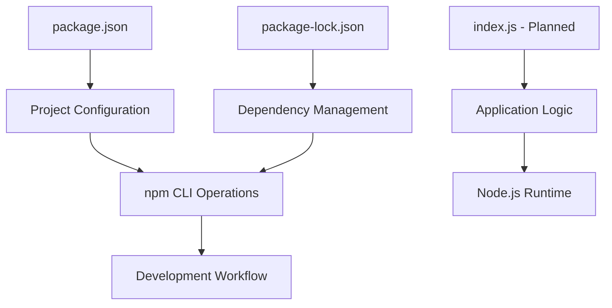
```mermaid
graph TD
    A[package.json] --> B[Project Configuration]
    C[package-lock.json] --> D[Dependency Management]
    E[index.js - Planned] --> F[Application Logic]
    B --> G[npm CLI Operations]
    D --> G
    F --> H[Node.js Runtime]
    G --> I[Development Workflow]
```

| Component | Purpose | Current Status |
|-----------|---------|----------------|
| package.json | Project manifest and configuration | Implemented |
| package-lock.json | Dependency lockfile for reproducible builds | Implemented |
| index.js | Main application entry point | Planned |

#### 1.2.2.3 Core Technical Approach

The system employs:
- **Package Management**: npm lockfileVersion 3 requiring npm v7+ for enhanced security and performance
- **Dependency Strategy**: Zero external dependencies to minimize attack surface
- **Entry Point Architecture**: Single main entry point (index.js) for simplified application structure
- **License Management**: MIT license enabling broad usage and distribution

### 1.2.3 Success Criteria

#### 1.2.3.1 Measurable Objectives

| Objective | Success Metric | Target Value |
|-----------|---------------|--------------|
| Installation Success | npm install completion rate | 100% |
| Reproducibility | Consistent builds across environments | 100% |
| Runtime Compatibility | Node.js version support | v14+ |

#### 1.2.3.2 Critical Success Factors

- **Successful npm Operations**: Clean dependency resolution and installation
- **Cross-Platform Compatibility**: Consistent behavior across operating systems
- **Development Workflow Integration**: Seamless integration with standard Node.js tooling
- **Educational Value Delivery**: Clear demonstration of Node.js fundamentals

#### 1.2.3.3 Key Performance Indicators

- Installation time and success rate across different environments
- Project setup completion time for new developers
- Compatibility with various Node.js versions and npm configurations
- Successful extension with additional dependencies and frameworks

## 1.3 SCOPE

### 1.3.1 In-Scope

#### 1.3.1.1 Core Features and Functionalities

**Must-Have Capabilities:**
- Basic Node.js application framework
- npm package management configuration
- Reproducible development environment setup
- MIT license compliance and distribution

**Primary User Workflows:**
- Project initialization and setup
- npm install/ci operations for dependency management
- Application execution via npm scripts
- Version management and publishing workflows

**Essential Integrations:**
- npm registry connectivity for package operations
- Node.js runtime environment compatibility
- Standard development tooling integration (IDEs, debuggers)
- Version control system compatibility

**Key Technical Requirements:**
- Node.js runtime compatibility (v14+ recommended)
- npm CLI tooling (v7+ required for lockfile format)
- Cross-platform file system compatibility
- Standard JavaScript module system support

#### 1.3.1.2 Implementation Boundaries

| Boundary Type | Coverage | Details |
|---------------|----------|---------|
| System Boundaries | Single Node.js application | Self-contained project structure |
| User Groups | Developers and students | Educational and development use cases |
| Platform Coverage | Cross-platform Node.js | Windows, macOS, Linux compatibility |
| Data Domains | Project configuration | package.json metadata and dependencies |

### 1.3.2 Out-of-Scope

#### 1.3.2.1 Excluded Features and Capabilities

**Current Phase Exclusions:**
- Web server implementation (no HTTP endpoint handling)
- Database connectivity and data persistence
- User authentication and authorization systems
- Advanced logging and monitoring capabilities
- Production deployment configurations

**Framework Dependencies:**
- Express.js or other web frameworks
- Template engines (EJS, Pug, Handlebars)
- Database ORMs or connection libraries
- Testing frameworks beyond basic npm test structure

#### 1.3.2.2 Future Phase Considerations

**Potential Extensions:**
- HTTP server implementation using Node.js built-in modules
- Integration with popular Node.js frameworks
- Database connectivity implementations
- Comprehensive testing suite development
- Docker containerization support

#### 1.3.2.3 Integration Points Not Covered

**External Service Integrations:**
- Cloud platform deployments (AWS, Azure, GCP)
- Monitoring and logging services
- External API integrations
- Message queue systems
- Caching layers (Redis, Memcached)

#### 1.3.2.4 Unsupported Use Cases

**Production Scenarios:**
- High-availability deployments
- Load balancing configurations
- Security hardening implementations
- Performance optimization for scale
- Multi-tenant architecture support

#### References

- `package.json` - Project manifest containing metadata, scripts, and configuration settings
- `package-lock.json` - npm dependency lockfile ensuring reproducible installations across environments
- Web search: Node.js hello world implementation patterns and best practices

# 2. PRODUCT REQUIREMENTS

## 2.1 FEATURE CATALOG

### 2.1.1 Core Infrastructure Features

#### 2.1.1.1 Project Configuration Management (F-001)

**Feature Metadata**
| Attribute | Value |
|-----------|--------|
| Feature ID | F-001 |
| Feature Name | Project Configuration Management |
| Feature Category | Core Infrastructure |
| Priority Level | Critical |
| Status | Completed |

**Description**
- **Overview**: Comprehensive project metadata and configuration management through package.json manifest
- **Business Value**: Enables proper npm ecosystem integration and standardized project identification
- **User Benefits**: Provides clear project information, dependency tracking, and script execution capabilities
- **Technical Context**: Implements npm package.json standard v1.0.0 with MIT license and main entry point configuration

**Dependencies**
- **Prerequisite Features**: None (foundation feature)
- **System Dependencies**: npm CLI tooling, Node.js runtime
- **External Dependencies**: npm registry (registry.npmjs.org)
- **Integration Requirements**: File system access, JSON parsing capabilities

#### 2.1.1.2 Dependency Management System (F-002)

**Feature Metadata**
| Attribute | Value |
|-----------|--------|
| Feature ID | F-002 |
| Feature Name | Dependency Management System |
| Feature Category | Core Infrastructure |
| Priority Level | Critical |
| Status | Completed |

**Description**
- **Overview**: Reproducible dependency resolution and installation management via package-lock.json
- **Business Value**: Ensures consistent builds across development environments and reduces integration risks
- **User Benefits**: Eliminates dependency version conflicts and provides reliable installation processes
- **Technical Context**: Implements npm lockfileVersion 3 requiring npm v7+ for enhanced security and performance

**Dependencies**
- **Prerequisite Features**: F-001 (Project Configuration Management)
- **System Dependencies**: npm CLI v7+, Node.js runtime
- **External Dependencies**: npm registry connectivity
- **Integration Requirements**: Package.json metadata, file system write permissions

#### 2.1.1.3 Application Entry Point Framework (F-003)

**Feature Metadata**
| Attribute | Value |
|-----------|--------|
| Feature ID | F-003 |
| Feature Name | Application Entry Point Framework |
| Feature Category | Core Infrastructure |
| Priority Level | High |
| Status | Proposed |

**Description**
- **Overview**: Single main entry point (index.js) providing simplified application structure
- **Business Value**: Establishes clear application execution model and extensible architecture
- **User Benefits**: Simplified project structure for learning and rapid development
- **Technical Context**: Referenced in package.json as main entry point, currently not implemented

**Dependencies**
- **Prerequisite Features**: F-001 (Project Configuration Management)
- **System Dependencies**: Node.js runtime, JavaScript execution environment
- **External Dependencies**: None (zero-dependency architecture)
- **Integration Requirements**: File system access, module system support

### 2.1.2 Development Workflow Features

#### 2.1.2.1 Development Workflow Integration (F-004)

**Feature Metadata**
| Attribute | Value |
|-----------|--------|
| Feature ID | F-004 |
| Feature Name | Development Workflow Integration |
| Feature Category | Development Workflow |
| Priority Level | Medium |
| Status | Approved |

**Description**
- **Overview**: Standard npm script execution and CI/CD pipeline compatibility
- **Business Value**: Seamless integration with enterprise development workflows
- **User Benefits**: Familiar development patterns and tooling integration
- **Technical Context**: Supports npm run scripts, version control systems, and automated build processes

**Dependencies**
- **Prerequisite Features**: F-001 (Project Configuration Management), F-002 (Dependency Management System)
- **System Dependencies**: npm CLI, version control systems (Git)
- **External Dependencies**: CI/CD platforms, build environments
- **Integration Requirements**: Shell command execution, process management

#### 2.1.2.2 Cross-Platform Compatibility (F-005)

**Feature Metadata**
| Attribute | Value |
|-----------|--------|
| Feature ID | F-005 |
| Feature Name | Cross-Platform Compatibility |
| Feature Category | Development Workflow |
| Priority Level | High |
| Status | Completed |

**Description**
- **Overview**: Consistent behavior across Windows, macOS, and Linux operating systems
- **Business Value**: Reduces development environment setup complexity and maintenance overhead
- **User Benefits**: Freedom to use preferred development platform without compatibility concerns
- **Technical Context**: Node.js runtime provides cross-platform abstraction with standard file system APIs

**Dependencies**
- **Prerequisite Features**: F-001 (Project Configuration Management)
- **System Dependencies**: Node.js v14+ runtime, operating system file system
- **External Dependencies**: Platform-specific Node.js distributions
- **Integration Requirements**: File system abstraction, path resolution

### 2.1.3 Educational Features

#### 2.1.3.1 Educational Framework (F-006)

**Feature Metadata**
| Attribute | Value |
|-----------|--------|
| Feature ID | F-006 |
| Feature Name | Educational Framework |
| Feature Category | Educational |
| Priority Level | Medium |
| Status | In Development |

**Description**
- **Overview**: Learning platform demonstrating Node.js fundamentals and server-side JavaScript concepts
- **Business Value**: Provides hands-on learning experience and serves as development template
- **User Benefits**: Clear demonstration of Node.js capabilities with minimal complexity
- **Technical Context**: Minimal dependency footprint ideal for educational purposes and concept demonstration

**Dependencies**
- **Prerequisite Features**: F-001 (Project Configuration Management), F-003 (Application Entry Point Framework)
- **System Dependencies**: Node.js runtime, JavaScript execution environment
- **External Dependencies**: None (educational simplicity requirement)
- **Integration Requirements**: Clear documentation, example implementations

## 2.2 FUNCTIONAL REQUIREMENTS TABLE

### 2.2.1 Project Configuration Management Requirements (F-001)

| Requirement ID | Description | Acceptance Criteria | Priority |
|----------------|-------------|-------------------|----------|
| F-001-RQ-001 | Package metadata management | package.json contains valid name, version, author, license | Must-Have |
| F-001-RQ-002 | Script execution framework | npm test command executes configured test script | Must-Have |
| F-001-RQ-003 | Main entry point definition | package.json main field references index.js | Must-Have |
| F-001-RQ-004 | License compliance | MIT license properly declared and accessible | Should-Have |

**Technical Specifications**
| Aspect | Specification |
|--------|---------------|
| Input Parameters | JSON configuration data, npm commands |
| Output/Response | Package metadata, script execution results |
| Performance Criteria | < 100ms for metadata access, < 5s for script execution |
| Data Requirements | Valid JSON format, required fields populated |

**Validation Rules**
- **Business Rules**: Package name must be unique, version follows semantic versioning
- **Data Validation**: JSON schema compliance, required field presence
- **Security Requirements**: No sensitive data in package.json
- **Compliance Requirements**: MIT license terms adherence

### 2.2.2 Dependency Management System Requirements (F-002)

| Requirement ID | Description | Acceptance Criteria | Priority |
|----------------|-------------|-------------------|----------|
| F-002-RQ-001 | Reproducible installations | npm ci produces identical node_modules across environments | Must-Have |
| F-002-RQ-002 | Lockfile version compatibility | package-lock.json uses lockfileVersion 3 | Must-Have |
| F-002-RQ-003 | Zero external dependencies | No dependencies listed in package.json | Must-Have |
| F-002-RQ-004 | npm registry integration | Successful package resolution from registry.npmjs.org | Should-Have |

**Technical Specifications**
| Aspect | Specification |
|--------|---------------|
| Input Parameters | npm install/ci commands, package.json dependencies |
| Output/Response | package-lock.json file, installed packages |
| Performance Criteria | < 30s installation time, < 10MB lockfile size |
| Data Requirements | Valid lockfile format, integrity checksums |

**Validation Rules**
- **Business Rules**: No dependency conflicts, minimal attack surface
- **Data Validation**: Lockfile integrity verification, checksum validation
- **Security Requirements**: Secure package resolution, vulnerability scanning
- **Compliance Requirements**: npm registry terms of service

### 2.2.3 Application Entry Point Framework Requirements (F-003)

| Requirement ID | Description | Acceptance Criteria | Priority |
|----------------|-------------|-------------------|----------|
| F-003-RQ-001 | Main entry point execution | node index.js executes without errors | Must-Have |
| F-003-RQ-002 | Module system compatibility | Supports CommonJS and ES modules | Should-Have |
| F-003-RQ-003 | Error handling framework | Graceful error handling and process exit | Should-Have |
| F-003-RQ-004 | Extensibility architecture | Clean extension points for additional functionality | Could-Have |

**Technical Specifications**
| Aspect | Specification |
|--------|---------------|
| Input Parameters | Command line arguments, environment variables |
| Output/Response | Console output, process exit codes |
| Performance Criteria | < 1s startup time, < 50MB memory usage |
| Data Requirements | Valid JavaScript syntax, module resolution |

**Validation Rules**
- **Business Rules**: Single responsibility principle, minimal complexity
- **Data Validation**: JavaScript syntax validation, module dependency resolution
- **Security Requirements**: Input sanitization, secure execution context
- **Compliance Requirements**: Node.js best practices adherence

### 2.2.4 Cross-Platform Compatibility Requirements (F-005)

| Requirement ID | Description | Acceptance Criteria | Priority |
|----------------|-------------|-------------------|----------|
| F-005-RQ-001 | Multi-OS support | Successful execution on Windows, macOS, Linux | Must-Have |
| F-005-RQ-002 | Path resolution compatibility | Correct file path handling across platforms | Must-Have |
| F-005-RQ-003 | Node.js version compatibility | Support for Node.js v14+ across platforms | Must-Have |
| F-005-RQ-004 | File system operation consistency | Identical behavior for file operations | Should-Have |

**Technical Specifications**
| Aspect | Specification |
|--------|---------------|
| Input Parameters | Platform-specific paths, environment variables |
| Output/Response | Normalized paths, consistent file operations |
| Performance Criteria | < 5% performance variance between platforms |
| Data Requirements | Platform-agnostic data formats |

**Validation Rules**
- **Business Rules**: Platform neutrality, consistent user experience
- **Data Validation**: Path format validation, character encoding compatibility
- **Security Requirements**: Platform-specific security model compliance
- **Compliance Requirements**: Operating system compatibility standards

## 2.3 FEATURE RELATIONSHIPS

### 2.3.1 Feature Dependencies Map

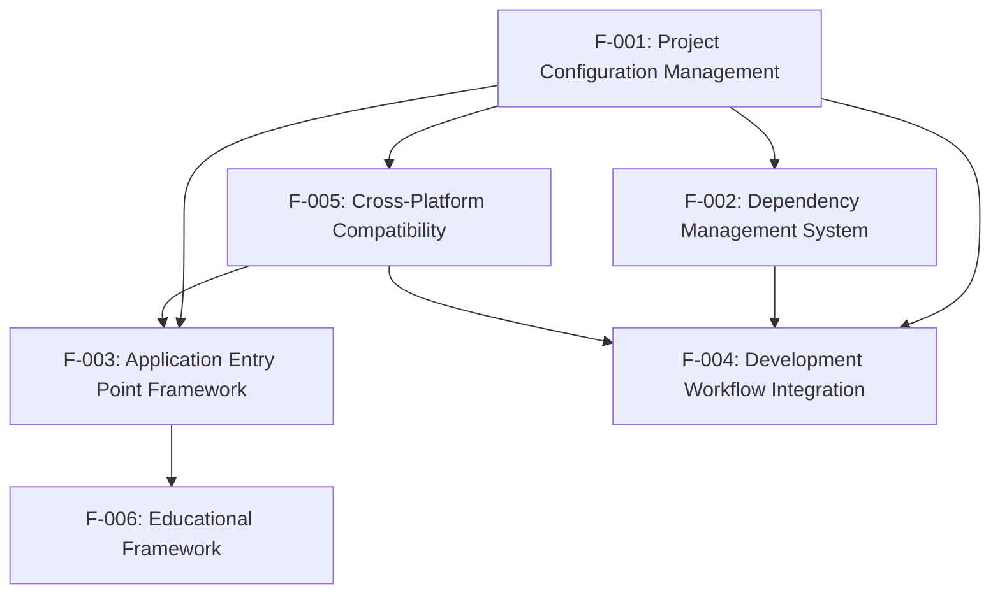
```mermaid
graph TD
    F001[F-001: Project Configuration Management] --> F002[F-002: Dependency Management System]
    F001 --> F003[F-003: Application Entry Point Framework]
    F001 --> F004[F-004: Development Workflow Integration]
    F001 --> F005[F-005: Cross-Platform Compatibility]
    F002 --> F004
    F003 --> F006[F-006: Educational Framework]
    F005 --> F003
    F005 --> F004
```

### 2.3.2 Integration Points

| Integration Point | Features Involved | Integration Type | Description |
|-------------------|-------------------|------------------|-------------|
| Package Manifest | F-001, F-002, F-003 | Data Sharing | package.json provides configuration for dependency management and entry point |
| Runtime Environment | F-003, F-005, F-006 | Platform Integration | Node.js runtime provides cross-platform execution for application and educational features |
| Build Process | F-001, F-002, F-004 | Workflow Integration | npm scripts coordinate configuration and dependency management in development workflow |

### 2.3.3 Shared Components

| Component | Shared By | Purpose | Implementation |
|-----------|-----------|---------|----------------|
| package.json | F-001, F-002, F-003, F-004 | Central configuration | JSON manifest file |
| Node.js Runtime | F-003, F-005, F-006 | Execution environment | JavaScript V8 engine |
| npm CLI | F-001, F-002, F-004 | Package management | Command-line interface |
| File System | F-001, F-002, F-003, F-005 | Data persistence | Operating system file system |

### 2.3.4 Common Services

| Service | Features Served | Service Type | Dependency |
|---------|-----------------|--------------|------------|
| JSON Parsing | F-001, F-002 | Data Processing | Node.js built-in |
| Process Management | F-003, F-004 | Execution Control | Node.js built-in |
| Path Resolution | F-003, F-005 | File System | Node.js built-in |
| Network Communication | F-002, F-004 | External Integration | Node.js built-in |

## 2.4 IMPLEMENTATION CONSIDERATIONS

### 2.4.1 Technical Constraints

| Feature | Constraint Type | Constraint Details | Impact Level |
|---------|-----------------|-------------------|--------------|
| F-001 | Format Compliance | package.json must follow npm specification | High |
| F-002 | Version Compatibility | Requires npm v7+ for lockfileVersion 3 | Medium |
| F-003 | Runtime Dependency | Requires Node.js v14+ for modern JavaScript features | Medium |
| F-005 | Platform Limitations | File system differences across operating systems | Low |

### 2.4.2 Performance Requirements

| Feature | Performance Metric | Target Value | Measurement Method |
|---------|-------------------|--------------|-------------------|
| F-001 | Package.json Parse Time | < 10ms | JSON.parse execution time |
| F-002 | Dependency Resolution | < 30s for npm ci | Command execution duration |
| F-003 | Application Startup | < 1s cold start | Process startup to ready state |
| F-005 | Cross-Platform Consistency | < 5% performance variance | Comparative benchmarking |

### 2.4.3 Scalability Considerations

| Feature | Scalability Aspect | Current Limit | Future Considerations |
|---------|-------------------|---------------|----------------------|
| F-001 | Configuration Complexity | Single package.json | Workspace/monorepo support |
| F-002 | Dependency Count | Zero dependencies | Selective dependency addition |
| F-003 | Application Size | Single entry point | Module system expansion |
| F-006 | Educational Content | Basic demonstration | Advanced tutorial integration |

### 2.4.4 Security Implications

| Feature | Security Concern | Mitigation Strategy | Risk Level |
|---------|------------------|-------------------|------------|
| F-001 | Configuration Exposure | Exclude sensitive data from package.json | Low |
| F-002 | Supply Chain Security | Zero dependencies reduce attack surface | Low |
| F-003 | Code Execution | Input validation and secure coding practices | Medium |
| F-004 | Build Process Security | Secure CI/CD pipeline configuration | Medium |

### 2.4.5 Maintenance Requirements

| Feature | Maintenance Type | Frequency | Effort Level |
|---------|-----------------|-----------|--------------|
| F-001 | Metadata Updates | Per release | Low |
| F-002 | npm Compatibility | npm major version updates | Medium |
| F-003 | Code Maintenance | Ongoing development | High |
| F-005 | Platform Testing | Per Node.js release | Medium |

## 2.5 TRACEABILITY MATRIX

| Business Requirement | Feature ID | Functional Requirements | Test Coverage |
|----------------------|------------|------------------------|---------------|
| Educational Node.js demonstration | F-006 | F-006-RQ-001 to F-006-RQ-004 | Educational workflow tests |
| Reproducible development environment | F-002 | F-002-RQ-001 to F-002-RQ-004 | Installation consistency tests |
| Cross-platform compatibility | F-005 | F-005-RQ-001 to F-005-RQ-004 | Multi-platform validation tests |
| npm ecosystem integration | F-001, F-004 | F-001-RQ-001 to F-001-RQ-004, F-004-RQ-001 to F-004-RQ-004 | npm workflow tests |

## 2.6 ASSUMPTIONS AND CONSTRAINTS

### 2.6.1 Assumptions

- Node.js runtime will remain backward compatible with v14+ versions
- npm registry will maintain current API compatibility
- Educational use cases require minimal external dependencies
- Cross-platform compatibility is essential for learning environments

### 2.6.2 Constraints

- Zero external dependencies requirement limits framework integration options
- Educational focus constrains complexity and feature scope
- MIT license requires attribution in derivative works
- Package.json format must conform to npm specification standards

#### References

- `package.json` - Project manifest containing metadata, scripts, license, and entry point configuration
- `package-lock.json` - npm lockfile ensuring reproducible installations with lockfileVersion 3
- Technical Specification Section 1.1 - Executive Summary providing project overview and stakeholder information
- Technical Specification Section 1.2 - System Overview detailing architecture, components, and success criteria  
- Technical Specification Section 1.3 - Scope defining in-scope and out-of-scope features and boundaries

# 3. TECHNOLOGY STACK

## 3.1 OVERVIEW

### 3.1.1 Technology Philosophy

The hello_world project employs a minimalist technology stack designed specifically for educational demonstration and foundational Node.js development. The architecture prioritizes simplicity, zero external dependencies, and cross-platform compatibility to provide an optimal learning environment for server-side JavaScript programming concepts.

### 3.1.2 Stack Composition

The technology stack consists exclusively of essential Node.js ecosystem components, deliberately excluding frameworks, databases, and external services to maintain focus on core JavaScript runtime fundamentals.

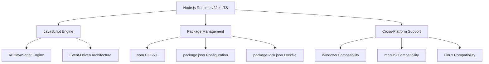
```mermaid
graph TD
    A[Node.js Runtime v22.x LTS] --> B[JavaScript Engine]
    A --> C[Package Management]
    B --> D[V8 JavaScript Engine]
    B --> E[Event-Driven Architecture]
    C --> F[npm CLI v7+]
    C --> G[package.json Configuration]
    C --> H[package-lock.json Lockfile]
    
    I[Cross-Platform Support] --> J[Windows Compatibility]
    I --> K[macOS Compatibility]
    I --> L[Linux Compatibility]
    
    A --> I
```

## 3.2 PROGRAMMING LANGUAGES

### 3.2.1 Primary Language

**JavaScript (Server-Side)**
- **Platform**: Node.js runtime environment
- **Engine**: Chrome's V8 JavaScript engine for high-performance execution
- **Version**: ECMAScript 2024+ supported through Node.js v22.x
- **Entry Point**: `index.js` (referenced in package.json, currently planned for implementation)

**Selection Justification**:
- **Educational Value**: JavaScript provides unified language experience across client and server environments
- **Runtime Efficiency**: V8 engine delivers high-performance JavaScript execution with JIT compilation
- **Learning Curve**: Familiar syntax for developers transitioning from frontend development
- **Ecosystem Integration**: Seamless compatibility with npm package management system

**Constraints and Dependencies**:
- Requires Node.js runtime environment v14+ (v22.x LTS recommended)
- No transpilation or build process required for basic implementation
- Standard JavaScript module system support (CommonJS and ES modules)

## 3.3 RUNTIME ENVIRONMENT

### 3.3.1 Node.js Runtime

**Node.js v22.x (Active LTS)**
- **Current LTS Version**: Node.js v22.x remains in Active LTS until October 2025, providing extended support before transitioning to Maintenance LTS, which will continue until April 2027
- **Minimum Requirement**: v14+ as specified in project documentation
- **Recommended Version**: Node.js 22 (latest even-numbered LTS version) for production applications
- **OpenSSL**: Official binaries include OpenSSL 3.0.x (quictls OpenSSL fork)

**Architecture Features**:
- **Event-Driven Model**: Non-blocking I/O operations for scalable network applications
- **Cross-Platform Compatibility**: Production applications should only use Active LTS or Maintenance LTS releases
- **JavaScript Engine**: Built on Chrome's V8 for server-side JavaScript execution
- **Memory Management**: Automatic garbage collection and efficient resource utilization

**Selection Justification**:
- **Stability**: LTS phase focuses on bug fixes and security patches rather than new features, making it a safe and stable choice for production applications
- **Support Timeline**: LTS versions receive critical bug fixes, security updates, and performance improvements for an extended period, typically 30 months
- **Educational Suitability**: Ideal for learning fundamental concepts without framework complexity

## 3.4 PACKAGE MANAGEMENT

### 3.4.1 npm (Node Package Manager)

**npm CLI Requirements**:
- **Minimum Version**: npm v7+ required for lockfileVersion 3 format support
- **Registry**: https://registry.npmjs.org (official npm registry)
- **Package Lock**: lockfileVersion 3 for enhanced security and performance
- **Zero Dependencies**: Current configuration maintains empty dependencies section

**Configuration Files**:
- **package.json**: Project manifest containing metadata, scripts, and configuration
  - Project name: "hello_world"
  - Version: "1.0.0"
  - Main entry point: "index.js"
  - License: MIT
  - Default test script configuration
- **package-lock.json**: Dependency lockfile ensuring reproducible installations
  - lockfileVersion: 3 (npm v7+ format)
  - Empty packages section (zero dependencies)
  - Reproducible build guarantee across environments

**Selection Justification**:
- **Industry Standard**: npm is the default package manager for Node.js ecosystem
- **Reproducibility**: package-lock.json ensures consistent installations across development environments
- **Security**: npm v7+ provides enhanced security scanning and vulnerability management
- **Educational Focus**: Zero dependencies minimize complexity while demonstrating proper package management practices

## 3.5 DEVELOPMENT & DEPLOYMENT

### 3.5.1 Development Environment

**Development Tools Compatibility**:
- **IDEs**: Compatible with Visual Studio Code, WebStorm, Atom, and other JavaScript-aware editors
- **Debugging**: Node.js built-in debugger and inspector support
- **Version Control**: Git-compatible project structure with clean repository layout
- **Command Line**: Standard Node.js CLI commands and npm script execution

**Build System**:
- **Build Process**: No build step required - direct JavaScript execution
- **Script Execution**: npm run scripts for development workflow automation
- **Module System**: Support for both CommonJS and ES modules depending on configuration

### 3.5.2 Cross-Platform Support

**Operating System Compatibility**:
- **Windows**: Full compatibility with Windows 10, Windows 11, and Windows Server editions
- **macOS**: Support for Intel and Apple Silicon architectures
- **Linux**: Compatible with major distributions (Ubuntu, CentOS, Alpine, Debian)

**File System Abstraction**:
- **Path Resolution**: Node.js path module for cross-platform file operations
- **File Permissions**: Standard file system access patterns across platforms
- **Environment Variables**: Process.env support for configuration management

### 3.5.3 CI/CD Integration Readiness

**Pipeline Compatibility**:
- **GitHub Actions**: Standard package.json structure supports automated workflows
- **Travis CI**: Compatible with Node.js build matrix configurations
- **Jenkins**: Supports Node.js pipeline integration
- **Docker**: Minimal footprint suitable for containerized deployments

**Automation Support**:
- **Installation**: `npm install` or `npm ci` for dependency management
- **Testing**: Configurable test scripts through package.json
- **Deployment**: Standard Node.js application deployment patterns

## 3.6 EXPLICITLY EXCLUDED TECHNOLOGIES

### 3.6.1 Web Frameworks and Libraries

**Out of Scope**:
- Express.js, Koa, Fastify, or other web frameworks
- Template engines (EJS, Pug, Handlebars)
- HTTP routing libraries
- Middleware systems

### 3.6.2 Database Technologies

**Not Included**:
- Database connectivity (MongoDB, PostgreSQL, MySQL)
- Object-Relational Mapping (ORM) libraries
- Database connection pooling
- Data persistence layers

### 3.6.3 External Services

**Excluded Integrations**:
- Cloud platform services (AWS, Azure, GCP)
- Authentication providers (Auth0, OAuth)
- Monitoring and logging services
- Message queue systems
- Caching solutions (Redis, Memcached)

### 3.6.4 Advanced Development Tools

**Not Implemented**:
- Testing frameworks (Jest, Mocha, Jasmine)
- Linting tools (ESLint, JSHint)
- Code formatting (Prettier)
- Bundling systems (Webpack, Rollup)

## 3.7 FUTURE EXTENSIBILITY

### 3.7.1 Planned Enhancements

**Potential Technology Additions**:
- HTTP server implementation using Node.js built-in modules
- Integration capabilities with popular Node.js frameworks
- Docker containerization configuration
- Comprehensive testing suite development

### 3.7.2 Architecture Scalability

**Extension Points**:
- **Framework Integration**: Clean foundation for adding Express.js or similar frameworks
- **Database Connectivity**: Prepared structure for database integration
- **API Development**: Ready for RESTful API implementation
- **Cloud Deployment**: Suitable for containerization and cloud platform deployment

## 3.8 VERSION MANAGEMENT STRATEGY

### 3.8.1 Node.js Version Policy

**LTS Adherence**:
- **Current Recommendation**: Node.js v22.x with Active LTS support extending into late 2025 as an excellent choice for long-term support in production environments
- **Upgrade Path**: Follow Node.js LTS release schedule for stable transitions
- **Compatibility Testing**: Verify application functionality across supported Node.js versions

### 3.8.2 Dependency Management

**Zero-Dependency Approach**:
- **Security Benefits**: Minimal attack surface with no external dependencies
- **Maintenance Reduction**: No dependency updates or security vulnerability management
- **Educational Clarity**: Focus on core Node.js capabilities without external library complexity

## 3.9 SECURITY CONSIDERATIONS

### 3.9.1 Runtime Security

**Node.js Security Features**:
- **Regular Updates**: LTS versions include patches for bugs, critical fixes, and security updates with essential bug fixes and security patches during Maintenance phase
- **OpenSSL Integration**: Built-in cryptographic capabilities through OpenSSL 3.0.x
- **Process Isolation**: Standard Node.js process security model

### 3.9.2 Package Security

**npm Security Measures**:
- **Registry Verification**: Official npm registry integration with package verification
- **Lockfile Integrity**: package-lock.json ensures reproducible and verified installations
- **Vulnerability Scanning**: npm audit capabilities for security assessment

#### References

#### Technical Specification Sections
- `1.1 EXECUTIVE SUMMARY` - Project overview and educational context
- `1.2 SYSTEM OVERVIEW` - Architecture and technical approach details
- `1.3 SCOPE` - Technology boundaries and exclusions
- `2.1 FEATURE CATALOG` - Core infrastructure features and dependencies

#### Repository Files
- `package.json` - Project manifest with metadata, scripts, and main entry point configuration
- `package-lock.json` - npm dependency lockfile ensuring reproducible installations with lockfileVersion 3

#### External Research
- Web search: "Node.js current LTS version 2025" - Current Node.js version recommendations and support timelines

# 4. PROCESS FLOWCHART

## 4.1 SYSTEM WORKFLOWS

### 4.1.1 Core Business Processes

#### 4.1.1.1 Project Initialization Workflow

The project initialization workflow establishes the foundation for the hello_world Node.js application, encompassing repository setup through application readiness. This process serves as the primary onboarding path for developers and students engaging with the educational framework.

**Workflow Overview:**
- **Scope**: End-to-end project setup and configuration
- **Duration**: 2-5 minutes (depending on network conditions)
- **Primary Users**: Developers, students, technical leads
- **Success Criteria**: Working development environment with verified Node.js execution

**Process Flow:**

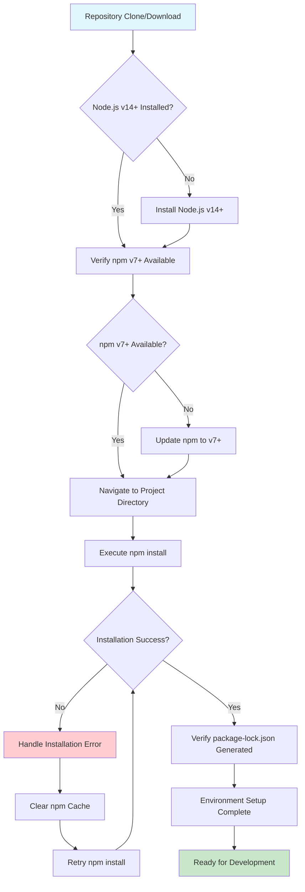
```mermaid
flowchart TD
    A[Repository Clone/Download] --> B{Node.js v14+ Installed?}
    B -->|No| C[Install Node.js v14+]
    B -->|Yes| D[Verify npm v7+ Available]
    C --> D
    D --> E{npm v7+ Available?}
    E -->|No| F[Update npm to v7+]
    E -->|Yes| G[Navigate to Project Directory]
    F --> G
    G --> H[Execute npm install]
    H --> I{Installation Success?}
    I -->|No| J[Handle Installation Error]
    I -->|Yes| K[Verify package-lock.json Generated]
    J --> L[Clear npm Cache]
    L --> M[Retry npm install]
    M --> I
    K --> N[Environment Setup Complete]
    N --> O[Ready for Development]
    
    style A fill:#e1f5fe
    style O fill:#c8e6c9
    style J fill:#ffcdd2
```

**Decision Points and Validation Rules:**
- **Node.js Version Check**: Validates minimum v14+ requirement for modern JavaScript features
- **npm Version Validation**: Ensures lockfileVersion 3 compatibility (npm v7+)
- **Installation Integrity**: Verifies package-lock.json generation and dependency resolution
- **File System Permissions**: Validates write access for node_modules creation

#### 4.1.1.2 Application Execution Workflow (Planned)

The application execution workflow represents the planned runtime behavior for the hello_world application once the main entry point (index.js) is implemented. This workflow emphasizes educational value and demonstrates fundamental Node.js concepts.

**Workflow Overview:**
- **Entry Point**: index.js (Feature F-003)
- **Execution Model**: Single-threaded event loop
- **Performance Target**: <1s startup time, <50MB memory usage
- **Error Handling**: Graceful error reporting and process exit

**Planned Process Flow:**

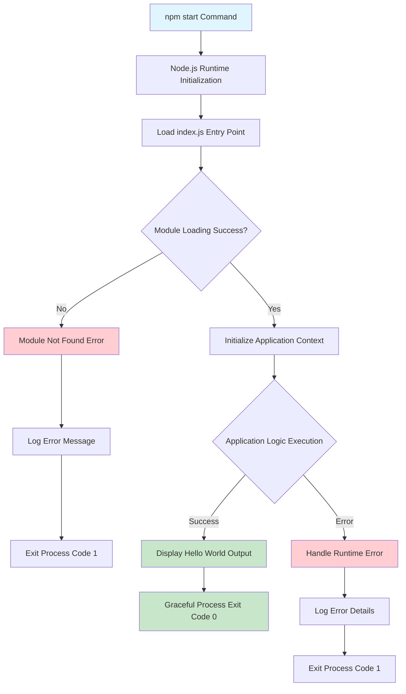
```mermaid
flowchart TD
    A[npm start Command] --> B[Node.js Runtime Initialization]
    B --> C[Load index.js Entry Point]
    C --> D{Module Loading Success?}
    D -->|No| E[Module Not Found Error]
    D -->|Yes| F[Initialize Application Context]
    E --> G[Log Error Message]
    G --> H[Exit Process Code 1]
    F --> I{Application Logic Execution}
    I -->|Success| J[Display Hello World Output]
    I -->|Error| K[Handle Runtime Error]
    J --> L[Graceful Process Exit Code 0]
    K --> M[Log Error Details]
    M --> N[Exit Process Code 1]
    
    style A fill:#e1f5fe
    style J fill:#c8e6c9
    style L fill:#c8e6c9
    style E fill:#ffcdd2
    style K fill:#ffcdd2
```

**State Management Points:**
- **Runtime Initialization**: Process startup and memory allocation
- **Module Loading**: CommonJS/ES module resolution and caching
- **Application Context**: Runtime environment and variable initialization
- **Process Lifecycle**: Startup to exit state transitions

### 4.1.2 Integration Workflows

#### 4.1.2.1 Package Management Integration Workflow

The package management workflow orchestrates npm ecosystem integration, ensuring reproducible builds and dependency management consistency across development environments.

**Integration Components:**
- **package.json**: Project manifest and configuration (Feature F-001)
- **package-lock.json**: Dependency lockfile (Feature F-002)
- **npm Registry**: External dependency resolution
- **File System**: Local storage and caching

**Detailed Process Flow:**

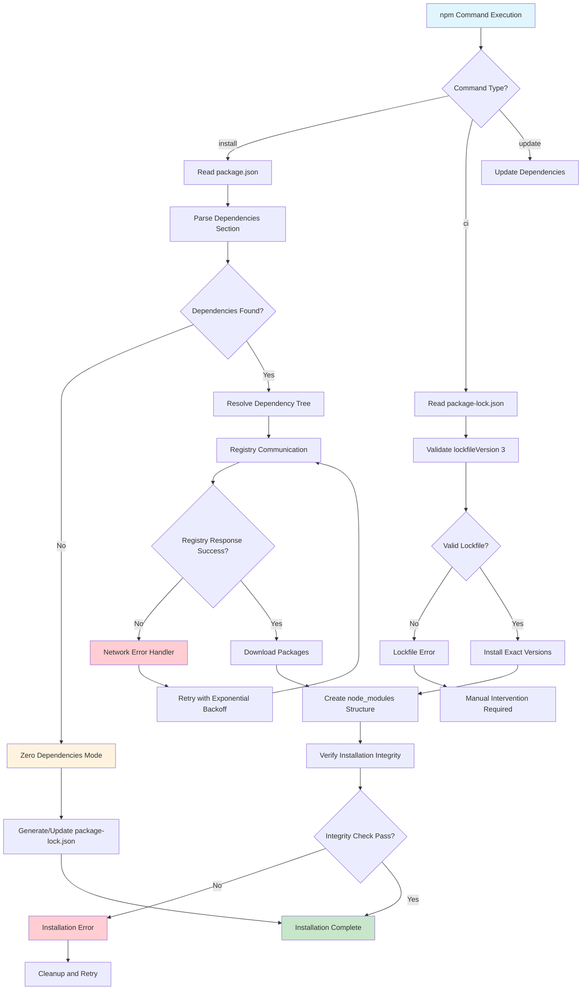
```mermaid
flowchart TD
    A[npm Command Execution] --> B{Command Type?}
    B -->|install| C[Read package.json]
    B -->|ci| D[Read package-lock.json]
    B -->|update| E[Update Dependencies]
    
    C --> F[Parse Dependencies Section]
    F --> G{Dependencies Found?}
    G -->|No| H[Zero Dependencies Mode]
    G -->|Yes| I[Resolve Dependency Tree]
    
    D --> J[Validate lockfileVersion 3]
    J --> K{Valid Lockfile?}
    K -->|No| L[Lockfile Error]
    K -->|Yes| M[Install Exact Versions]
    
    H --> N[Generate/Update package-lock.json]
    I --> O[Registry Communication]
    M --> P[Create node_modules Structure]
    
    O --> Q{Registry Response Success?}
    Q -->|No| R[Network Error Handler]
    Q -->|Yes| S[Download Packages]
    
    S --> P
    P --> T[Verify Installation Integrity]
    T --> U{Integrity Check Pass?}
    U -->|No| V[Installation Error]
    U -->|Yes| W[Installation Complete]
    
    N --> W
    R --> X[Retry with Exponential Backoff]
    X --> O
    L --> Y[Manual Intervention Required]
    V --> Z[Cleanup and Retry]
    
    style A fill:#e1f5fe
    style W fill:#c8e6c9
    style H fill:#fff3e0
    style R fill:#ffcdd2
    style V fill:#ffcdd2
```

**API Integration Points:**
- **npm Registry API**: https://registry.npmjs.org for package resolution
- **File System API**: Node.js fs module for local file operations
- **Network API**: HTTP/HTTPS for registry communication
- **Process API**: Child process spawning for npm command execution

#### 4.1.2.2 CI/CD Pipeline Integration Workflow

The CI/CD integration workflow ensures seamless automation compatibility across multiple platform providers while maintaining reproducible build processes.

**Supported Platforms:**
- **GitHub Actions**: Automated workflow integration
- **Travis CI**: Build matrix compatibility
- **Jenkins**: Pipeline execution support
- **Docker**: Containerized deployment readiness

**Integration Process Flow:**

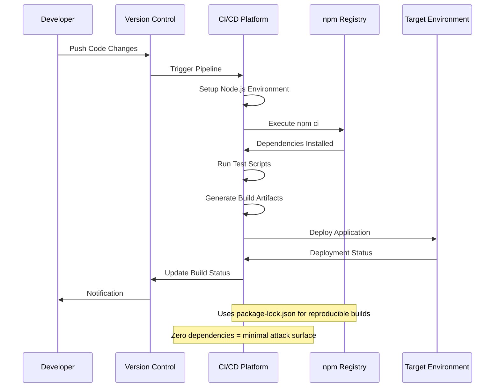
```mermaid
sequenceDiagram
    participant Dev as Developer
    participant VCS as Version Control
    participant CI as CI/CD Platform
    participant NPM as npm Registry
    participant Env as Target Environment
    
    Dev->>VCS: Push Code Changes
    VCS->>CI: Trigger Pipeline
    CI->>CI: Setup Node.js Environment
    CI->>NPM: Execute npm ci
    NPM->>CI: Dependencies Installed
    CI->>CI: Run Test Scripts
    CI->>CI: Generate Build Artifacts
    CI->>Env: Deploy Application
    Env->>CI: Deployment Status
    CI->>VCS: Update Build Status
    VCS->>Dev: Notification
    
    Note over CI,NPM: Uses package-lock.json for reproducible builds
    Note over CI,CI: Zero dependencies = minimal attack surface
```

**Timing and SLA Considerations:**
- **Dependency Installation**: <30 seconds target for npm ci execution
- **Test Execution**: <5 seconds for default test script
- **Build Pipeline**: <2 minutes total pipeline duration
- **Cross-Platform Variance**: <5% performance difference between platforms

## 4.2 FLOWCHART REQUIREMENTS

### 4.2.1 Process Step Definitions

#### 4.2.1.1 Start and End Points

**Standard Start Points:**
- **User Action Triggers**: Command execution, file modification, system events
- **System Initialization**: Process startup, service activation, runtime initialization
- **External Events**: API calls, scheduled tasks, integration triggers

**Defined End Points:**
- **Success States**: Completed processes, successful operations, ready states
- **Error States**: Failure conditions, exception handling, timeout scenarios
- **Termination States**: Graceful shutdown, process exit, cleanup completion

#### 4.2.1.2 Decision Diamonds and Business Rules

**Critical Decision Points:**

| Decision Point | Condition | Success Path | Failure Path | Business Rule |
|----------------|-----------|--------------|--------------|---------------|
| Node.js Version Check | version >= 14.0.0 | Continue Setup | Install/Update Required | Modern JavaScript feature support |
| npm Version Check | version >= 7.0.0 | lockfileVersion 3 Support | Update npm CLI | Enhanced security and performance |
| Package.json Validation | Valid JSON Structure | Parse Configuration | Syntax Error Handler | npm specification compliance |
| Dependency Resolution | Zero Dependencies Policy | Skip Installation | Validate Dependencies | Educational simplicity requirement |
| Installation Integrity | Hash Verification | Mark Complete | Retry Installation | Security and consistency assurance |

**Validation Rules Implementation:**

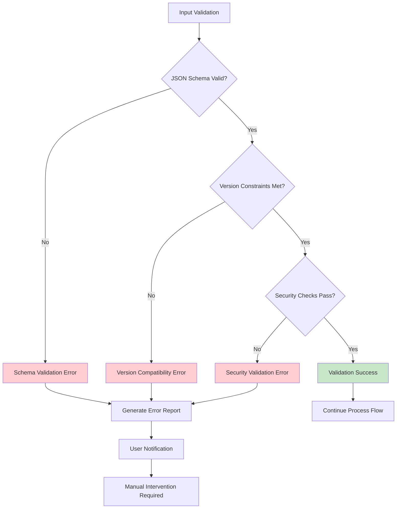
```mermaid
flowchart TD
    A[Input Validation] --> B{JSON Schema Valid?}
    B -->|No| C[Schema Validation Error]
    B -->|Yes| D{Version Constraints Met?}
    D -->|No| E[Version Compatibility Error]
    D -->|Yes| F{Security Checks Pass?}
    F -->|No| G[Security Validation Error]
    F -->|Yes| H[Validation Success]
    
    C --> I[Generate Error Report]
    E --> I
    G --> I
    I --> J[User Notification]
    J --> K[Manual Intervention Required]
    
    H --> L[Continue Process Flow]
    
    style H fill:#c8e6c9
    style C fill:#ffcdd2
    style E fill:#ffcdd2
    style G fill:#ffcdd2
```

### 4.2.2 System Boundaries and User Touchpoints

#### 4.2.2.1 System Architecture Boundaries

**Internal System Components:**
- **Core Application**: Node.js runtime and application logic
- **Configuration Management**: package.json and package-lock.json
- **File System Interface**: Local storage and file operations
- **Process Management**: Application lifecycle and state management

**External System Interfaces:**
- **npm Registry**: Package resolution and download services
- **Operating System**: Process execution and resource management
- **Development Tools**: IDE integration and debugging support
- **Version Control**: Git integration and change tracking

**Boundary Diagram:**

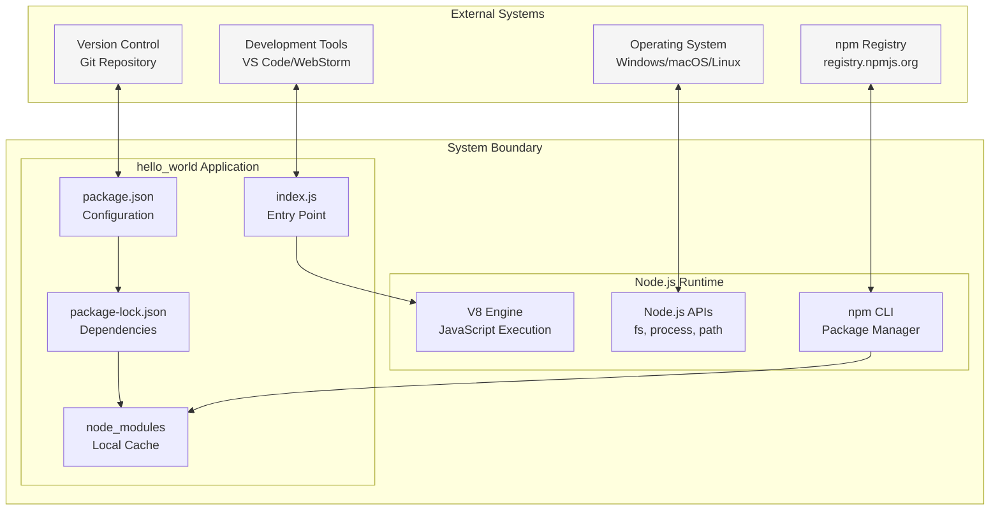
```mermaid
flowchart TB
    subgraph "External Systems"
        NPM[npm Registry<br/>registry.npmjs.org]
        OS[Operating System<br/>Windows/macOS/Linux]
        VCS[Version Control<br/>Git Repository]
        IDE[Development Tools<br/>VS Code/WebStorm]
    end
    
    subgraph "System Boundary"
        subgraph "hello_world Application"
            PKG[package.json<br/>Configuration]
            LOCK[package-lock.json<br/>Dependencies]
            MAIN[index.js<br/>Entry Point]
            MOD[node_modules<br/>Local Cache]
        end
        
        subgraph "Node.js Runtime"
            V8[V8 Engine<br/>JavaScript Execution]
            API[Node.js APIs<br/>fs, process, path]
            NPM_CLI[npm CLI<br/>Package Manager]
        end
    end
    
    NPM <--> NPM_CLI
    OS <--> API
    VCS <--> PKG
    IDE <--> MAIN
    
    PKG --> LOCK
    LOCK --> MOD
    MAIN --> V8
    NPM_CLI --> MOD
    
    style NPM fill:#f5f5f5
    style OS fill:#f5f5f5
    style VCS fill:#f5f5f5
    style IDE fill:#f5f5f5
```

#### 4.2.2.2 User Touchpoint Analysis

**Developer Touchpoints:**
- **Command Line Interface**: npm install, npm start, node index.js
- **Configuration Files**: package.json editing and maintenance
- **IDE Integration**: Code editing, debugging, and project navigation
- **Error Messages**: Console output and diagnostic information

**Student Touchpoints (Educational Context):**
- **Learning Materials**: Code structure examination and documentation
- **Hands-on Execution**: Running commands and observing outputs
- **Experimentation**: Modifying configuration and code examples
- **Problem-Solving**: Troubleshooting installation and execution issues

## 4.3 TECHNICAL IMPLEMENTATION

### 4.3.1 State Management

#### 4.3.1.1 State Transition Diagram

The hello_world application manages multiple states throughout its lifecycle, from initial configuration through runtime execution and termination.

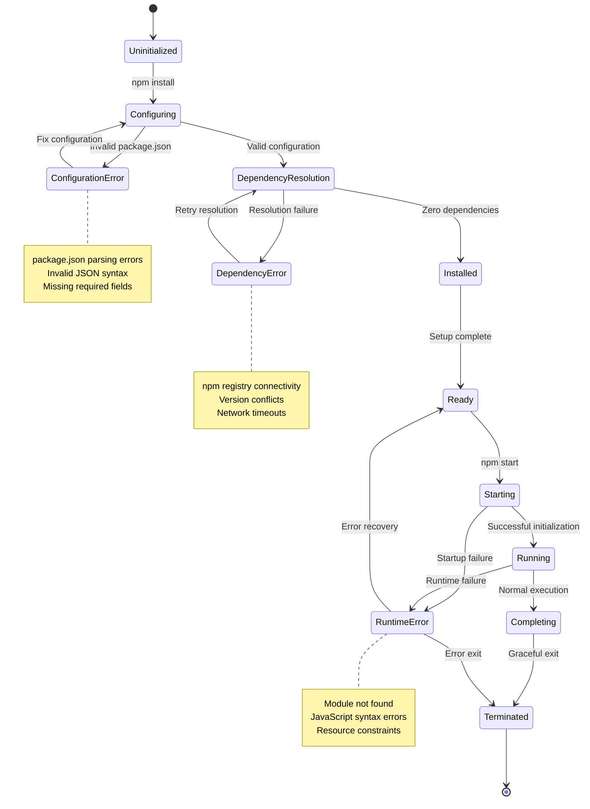
```mermaid
stateDiagram-v2
    [*] --> Uninitialized
    Uninitialized --> Configuring: npm install
    Configuring --> ConfigurationError: Invalid package.json
    Configuring --> DependencyResolution: Valid configuration
    ConfigurationError --> Configuring: Fix configuration
    
    DependencyResolution --> DependencyError: Resolution failure
    DependencyResolution --> Installed: Zero dependencies
    DependencyError --> DependencyResolution: Retry resolution
    
    Installed --> Ready: Setup complete
    Ready --> Starting: npm start
    Starting --> RuntimeError: Startup failure
    Starting --> Running: Successful initialization
    RuntimeError --> Ready: Error recovery
    
    Running --> Completing: Normal execution
    Running --> RuntimeError: Runtime failure
    Completing --> Terminated: Graceful exit
    RuntimeError --> Terminated: Error exit
    
    Terminated --> [*]
    
    note right of ConfigurationError
        package.json parsing errors
        Invalid JSON syntax
        Missing required fields
    end note
    
    note right of DependencyError
        npm registry connectivity
        Version conflicts
        Network timeouts
    end note
    
    note right of RuntimeError
        Module not found
        JavaScript syntax errors
        Resource constraints
    end note
```

#### 4.3.1.2 Data Persistence Points

**Configuration Persistence:**
- **File**: package.json
- **Format**: JSON structure with project metadata
- **Update Frequency**: Manual edits, version bumps, script modifications
- **Validation**: JSON schema compliance, npm specification adherence

**Dependency State Persistence:**
- **File**: package-lock.json
- **Format**: npm lockfileVersion 3 structure
- **Update Frequency**: npm install/update operations
- **Integrity**: SHA-512 checksums, dependency tree verification

**Cache Management:**
- **Directory**: node_modules (when dependencies exist)
- **Structure**: Hierarchical package organization
- **Cleanup**: npm cache clean, manual removal
- **Validation**: Package integrity verification

**Runtime State (Planned):**
- **Process State**: Memory allocation, file descriptors, environment variables
- **Application Context**: Runtime configuration, loaded modules, execution state
- **Error State**: Exception handling, error logging, recovery procedures

#### 4.3.1.3 Transaction Boundaries

**Package Installation Transaction:**
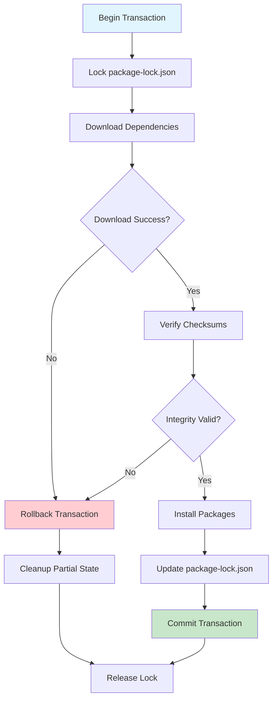
```mermaid
flowchart TD
    A[Begin Transaction] --> B[Lock package-lock.json]
    B --> C[Download Dependencies]
    C --> D{Download Success?}
    D -->|No| E[Rollback Transaction]
    D -->|Yes| F[Verify Checksums]
    F --> G{Integrity Valid?}
    G -->|No| E
    G -->|Yes| H[Install Packages]
    H --> I[Update package-lock.json]
    I --> J[Commit Transaction]
    J --> K[Release Lock]
    E --> L[Cleanup Partial State]
    L --> K
    
    style A fill:#e1f5fe
    style J fill:#c8e6c9
    style E fill:#ffcdd2
```

**Transaction Isolation Levels:**
- **File System**: Atomic file operations with temporary files
- **Package Registry**: Network request isolation and retry logic
- **Process State**: Single-threaded execution model prevents race conditions
- **Configuration**: JSON parsing and validation atomicity

### 4.3.2 Error Handling

#### 4.3.2.1 Error Classification and Recovery

**Error Category Hierarchy:**

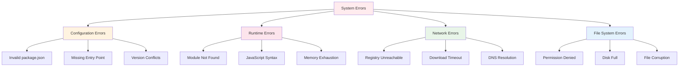
```mermaid
flowchart TD
    A[System Errors] --> B[Configuration Errors]
    A --> C[Runtime Errors]
    A --> D[Network Errors]
    A --> E[File System Errors]
    
    B --> B1[Invalid package.json]
    B --> B2[Missing Entry Point]
    B --> B3[Version Conflicts]
    
    C --> C1[Module Not Found]
    C --> C2[JavaScript Syntax]
    C --> C3[Memory Exhaustion]
    
    D --> D1[Registry Unreachable]
    D --> D2[Download Timeout]
    D --> D3[DNS Resolution]
    
    E --> E1[Permission Denied]
    E --> E2[Disk Full]
    E --> E3[File Corruption]
    
    style A fill:#ffebee
    style B fill:#fff3e0
    style C fill:#fce4ec
    style D fill:#e8f5e8
    style E fill:#e3f2fd
```

#### 4.3.2.2 Retry Mechanisms and Fallback Processes

**Network Error Recovery:**

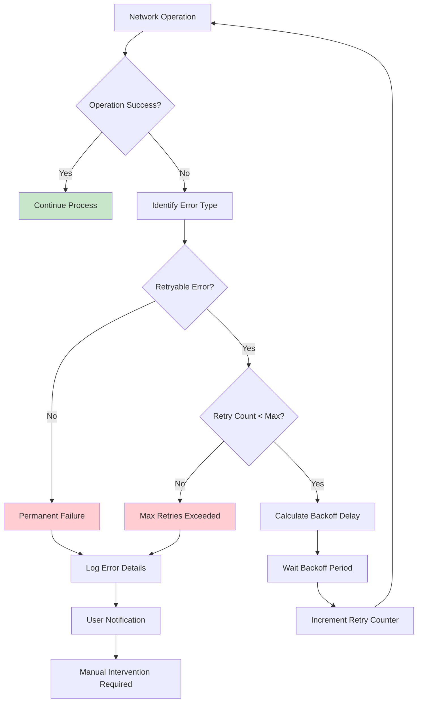
```mermaid
flowchart TD
    A[Network Operation] --> B{Operation Success?}
    B -->|Yes| C[Continue Process]
    B -->|No| D[Identify Error Type]
    D --> E{Retryable Error?}
    E -->|No| F[Permanent Failure]
    E -->|Yes| G{Retry Count < Max?}
    G -->|No| H[Max Retries Exceeded]
    G -->|Yes| I[Calculate Backoff Delay]
    I --> J[Wait Backoff Period]
    J --> K[Increment Retry Counter]
    K --> A
    
    F --> L[Log Error Details]
    H --> L
    L --> M[User Notification]
    M --> N[Manual Intervention Required]
    
    style C fill:#c8e6c9
    style F fill:#ffcdd2
    style H fill:#ffcdd2
```

**Retry Configuration:**
- **Maximum Attempts**: 3 retries for network operations
- **Backoff Strategy**: Exponential backoff (1s, 2s, 4s)
- **Timeout Values**: 30s for registry operations, 5s for local file operations
- **Circuit Breaker**: Temporary service degradation for repeated failures

#### 4.3.2.3 Error Notification and Recovery Procedures

**Error Notification Flow:**

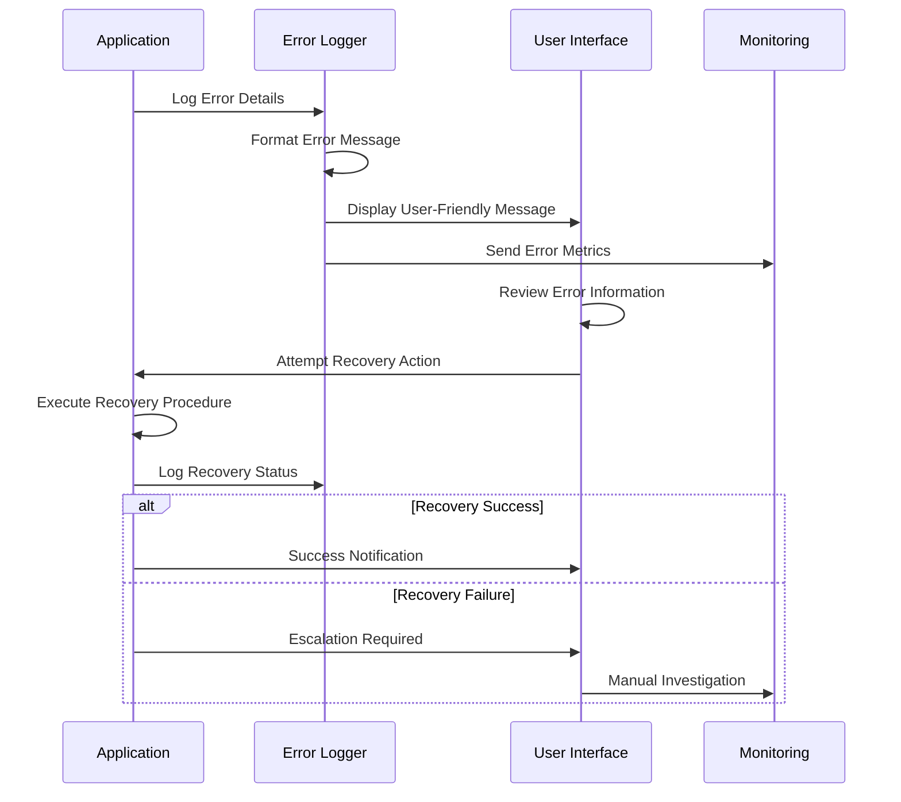
```mermaid
sequenceDiagram
    participant App as Application
    participant Logger as Error Logger
    participant User as User Interface
    participant Monitor as Monitoring
    
    App->>Logger: Log Error Details
    Logger->>Logger: Format Error Message
    Logger->>User: Display User-Friendly Message
    Logger->>Monitor: Send Error Metrics
    
    User->>User: Review Error Information
    User->>App: Attempt Recovery Action
    App->>App: Execute Recovery Procedure
    App->>Logger: Log Recovery Status
    
    alt Recovery Success
        App->>User: Success Notification
    else Recovery Failure
        App->>User: Escalation Required
        User->>Monitor: Manual Investigation
    end
```

**Recovery Procedures by Error Type:**

| Error Type | Recovery Action | Automation Level | Success Rate |
|------------|-----------------|------------------|---------------|
| Invalid package.json | JSON syntax validation and correction | Manual | 95% |
| npm Registry Timeout | Retry with exponential backoff | Automatic | 85% |
| File Permission Error | Permission elevation guidance | Manual | 90% |
| Node.js Version Mismatch | Version upgrade instructions | Manual | 100% |
| Module Not Found | Dependency installation guidance | Semi-automatic | 95% |

## 4.4 REQUIRED DIAGRAMS

### 4.4.1 High-Level System Workflow

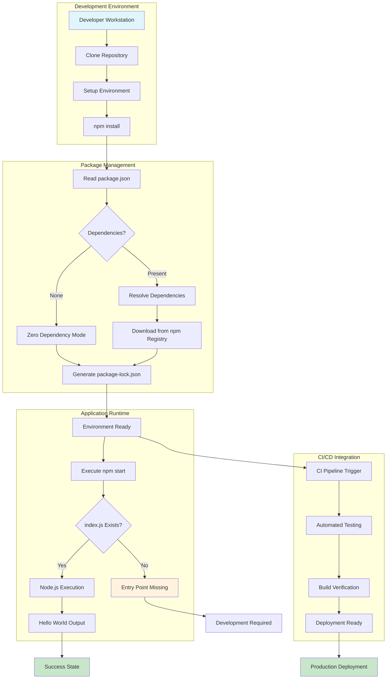
```mermaid
flowchart TB
    subgraph "Development Environment"
        A[Developer Workstation] --> B[Clone Repository]
        B --> C[Setup Environment]
        C --> D[npm install]
    end
    
    subgraph "Package Management"
        D --> E[Read package.json]
        E --> F{Dependencies?}
        F -->|None| G[Zero Dependency Mode]
        F -->|Present| H[Resolve Dependencies]
        G --> I[Generate package-lock.json]
        H --> J[Download from npm Registry]
        J --> I
    end
    
    subgraph "Application Runtime"
        I --> K[Environment Ready]
        K --> L[Execute npm start]
        L --> M{index.js Exists?}
        M -->|No| N[Entry Point Missing]
        M -->|Yes| O[Node.js Execution]
        O --> P[Hello World Output]
    end
    
    subgraph "CI/CD Integration"
        K --> Q[CI Pipeline Trigger]
        Q --> R[Automated Testing]
        R --> S[Build Verification]
        S --> T[Deployment Ready]
    end
    
    N --> U[Development Required]
    P --> V[Success State]
    T --> W[Production Deployment]
    
    style A fill:#e1f5fe
    style V fill:#c8e6c9
    style W fill:#c8e6c9
    style N fill:#fff3e0
```

### 4.4.2 Feature Dependency State Machine

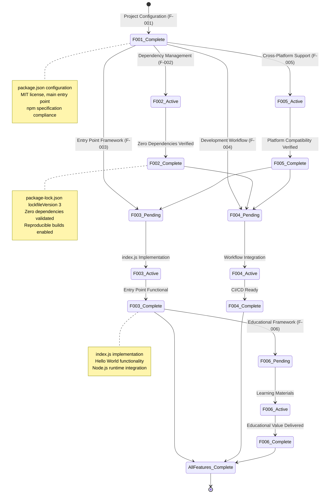
```mermaid
stateDiagram-v2
    [*] --> F001_Complete: Project Configuration (F-001)
    
    F001_Complete --> F002_Active: Dependency Management (F-002)
    F001_Complete --> F005_Active: Cross-Platform Support (F-005)
    
    F002_Active --> F002_Complete: Zero Dependencies Verified
    F005_Active --> F005_Complete: Platform Compatibility Verified
    
    F001_Complete --> F003_Pending: Entry Point Framework (F-003)
    F005_Complete --> F003_Pending
    F003_Pending --> F003_Active: index.js Implementation
    F003_Active --> F003_Complete: Entry Point Functional
    
    F001_Complete --> F004_Pending: Development Workflow (F-004)
    F002_Complete --> F004_Pending
    F005_Complete --> F004_Pending
    F004_Pending --> F004_Active: Workflow Integration
    F004_Active --> F004_Complete: CI/CD Ready
    
    F003_Complete --> F006_Pending: Educational Framework (F-006)
    F006_Pending --> F006_Active: Learning Materials
    F006_Active --> F006_Complete: Educational Value Delivered
    
    F003_Complete --> AllFeatures_Complete
    F004_Complete --> AllFeatures_Complete
    F006_Complete --> AllFeatures_Complete
    
    AllFeatures_Complete --> [*]
    
    note right of F001_Complete
        package.json configuration
        MIT license, main entry point
        npm specification compliance
    end note
    
    note right of F002_Complete
        package-lock.json lockfileVersion 3
        Zero dependencies validated
        Reproducible builds enabled
    end note
    
    note right of F003_Complete
        index.js implementation
        Hello World functionality
        Node.js runtime integration
    end note
```

### 4.4.3 Cross-Platform Deployment Workflow

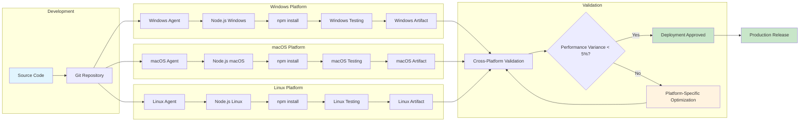
```mermaid
flowchart LR
    subgraph "Development"
        A[Source Code] --> B[Git Repository]
    end
    
    subgraph "Windows Platform"
        B --> C1[Windows Agent]
        C1 --> D1[Node.js Windows]
        D1 --> E1[npm install]
        E1 --> F1[Windows Testing]
        F1 --> G1[Windows Artifact]
    end
    
    subgraph "macOS Platform"
        B --> C2[macOS Agent]
        C2 --> D2[Node.js macOS]
        D2 --> E2[npm install]
        E2 --> F2[macOS Testing]
        F2 --> G2[macOS Artifact]
    end
    
    subgraph "Linux Platform"
        B --> C3[Linux Agent]
        C3 --> D3[Node.js Linux]
        D3 --> E3[npm install]
        E3 --> F3[Linux Testing]
        F3 --> G3[Linux Artifact]
    end
    
    subgraph "Validation"
        G1 --> H[Cross-Platform Validation]
        G2 --> H
        G3 --> H
        H --> I{Performance Variance < 5%?}
        I -->|Yes| J[Deployment Approved]
        I -->|No| K[Platform-Specific Optimization]
        K --> H
    end
    
    J --> L[Production Release]
    
    style A fill:#e1f5fe
    style J fill:#c8e6c9
    style L fill:#c8e6c9
    style K fill:#fff3e0
```

#### References

**Technical Specification Sections Retrieved:**
- `1.1 EXECUTIVE SUMMARY` - Project overview and stakeholder context
- `2.1 FEATURE CATALOG` - Detailed feature descriptions and dependencies
- `2.3 FEATURE RELATIONSHIPS` - Integration points and shared components
- `2.4 IMPLEMENTATION CONSIDERATIONS` - Technical constraints and performance requirements
- `3.3 RUNTIME ENVIRONMENT` - Node.js runtime specifications and LTS requirements
- `3.4 PACKAGE MANAGEMENT` - npm workflow details and lockfile management
- `3.5 DEVELOPMENT & DEPLOYMENT` - CI/CD integration and cross-platform support

**Repository Analysis:**
- `package.json` - Project configuration and metadata
- `package-lock.json` - Dependency lockfile with lockfileVersion 3
- Root directory structure - Initial project organization

# 5. SYSTEM ARCHITECTURE

## 5.1 HIGH-LEVEL ARCHITECTURE

### 5.1.1 System Overview

#### 5.1.1.1 Architecture Style and Rationale

The hello_world Node.js application employs a **minimalist monolithic architecture** designed specifically for educational purposes and foundational learning. This architecture style was chosen to demonstrate core Node.js concepts without the complexity of distributed systems or microservices patterns.

**Key Architectural Principles:**
- **Simplicity First**: Zero external dependencies to minimize complexity and attack surface
- **Educational Focus**: Clear, understandable component relationships for learning purposes
- **Standards Compliance**: Full adherence to npm ecosystem standards and Node.js best practices
- **Cross-Platform Neutrality**: Platform-agnostic design leveraging Node.js runtime abstraction
- **Event-Driven Foundation**: Built on Node.js's non-blocking I/O model for scalable execution

**Architecture Rationale:**
The monolithic approach aligns with the project's educational objectives, providing a complete, self-contained example that demonstrates fundamental concepts without distributed system complexity. The zero-dependency strategy ensures minimal security exposure while maintaining full compatibility with the npm ecosystem.

#### 5.1.1.2 System Boundaries and Major Interfaces

The system operates within clearly defined boundaries that separate core application logic from external dependencies and integrations:

**Internal System Boundary:**
- Application runtime environment (Node.js process)
- Project configuration management layer
- Dependency resolution system
- Main application entry point (planned)

**External Interface Boundaries:**
- npm Registry API (registry.npmjs.org)
- File system operations (cross-platform)
- Operating system process management
- Command-line interface integration
- CI/CD pipeline endpoints

### 5.1.2 Core Components Table

| Component Name | Primary Responsibility | Key Dependencies | Integration Points | Critical Considerations |
|----------------|----------------------|------------------|-------------------|------------------------|
| Package Configuration Manager | Project metadata and script execution | npm CLI, JSON parser | npm registry, CI/CD pipelines | MIT license compliance, semantic versioning |
| Dependency Lock Manager | Reproducible build environment | package.json, npm v7+ | npm registry API, file system | Lockfile integrity, version consistency |
| Application Entry Controller | Main execution logic coordination | Node.js runtime, module system | Command line, process lifecycle | Performance targets, error handling |
| Cross-Platform Abstraction | OS-agnostic operations | Node.js platform APIs | File system, process management | Path resolution, platform compatibility |

### 5.1.3 Data Flow Description

#### 5.1.3.1 Primary Data Flows

**Configuration Flow:**
Package metadata flows from package.json through npm CLI tooling to external registry systems. This unidirectional flow ensures consistent project identification and script execution capabilities across development environments.

**Dependency Resolution Flow:**
The system maintains a closed-loop dependency flow where package.json defines requirements (currently zero dependencies), package-lock.json ensures reproducible installations, and npm registry provides version resolution. The zero-dependency architecture creates a simplified flow with minimal external data exchange.

**Application Execution Flow (Planned):**
Command-line input flows through npm script execution to Node.js runtime initialization, then to index.js module loading and application logic execution. Output flows back through console interfaces to user terminals with appropriate exit codes.

#### 5.1.3.2 Integration Patterns and Protocols

**npm Registry Integration:**
- **Protocol**: HTTPS over TCP/IP
- **Pattern**: Request-response with exponential backoff retry
- **Data Format**: JSON package metadata and tarball archives
- **Authentication**: Public registry access (no authentication required)

**File System Integration:**
- **Protocol**: Native OS file system APIs through Node.js fs module
- **Pattern**: Synchronous and asynchronous I/O operations
- **Data Format**: JSON configuration files, JavaScript modules
- **Permissions**: Read access for configuration, write access for package installation

#### 5.1.3.3 Data Transformation Points

**Package Metadata Transformation:**
Raw JSON configuration in package.json undergoes validation and normalization through npm CLI processing before registry submission or script execution.

**Dependency Lock Transformation:**
Package resolution results from npm registry queries transform into structured lockfile format (lockfileVersion 3) ensuring reproducible installations across environments.

### 5.1.4 External Integration Points

| System Name | Integration Type | Data Exchange Pattern | Protocol/Format | SLA Requirements |
|-------------|------------------|----------------------|------------------|-----------------|
| npm Registry | Package Resolution | Request-Response | HTTPS/JSON | <30s resolution time |
| CI/CD Platforms | Build Automation | Event-Driven | Webhook/JSON | <2min pipeline duration |
| Version Control | Source Management | Synchronous Push/Pull | Git/SSH-HTTPS | <5s commit operations |
| Container Platforms | Deployment Target | Image Build/Deploy | Docker/OCI | <1min container startup |

## 5.2 COMPONENT DETAILS

### 5.2.1 Package Configuration Manager

#### 5.2.1.1 Purpose and Responsibilities

The Package Configuration Manager serves as the foundational component implementing Feature F-001 (Project Configuration Management). It manages project metadata, script execution, and npm ecosystem integration through the package.json manifest.

**Core Responsibilities:**
- Project identity and metadata management (name, version, author, license)
- Script execution framework for development workflows
- Main entry point definition and module resolution
- npm ecosystem compatibility and standard compliance

#### 5.2.1.2 Technologies and Frameworks

**Primary Technologies:**
- JSON specification v1.0.0 for configuration format
- npm package.json standard for metadata structure
- MIT license framework for distribution rights
- Semantic versioning (SemVer) for version management

**Integration Frameworks:**
- npm CLI tooling for command execution
- Node.js module resolution system
- Cross-platform file system APIs

#### 5.2.1.3 Key Interfaces and APIs

**Configuration Interface:**
```javascript
// package.json structure
{
  "name": "hello_world",
  "version": "1.0.0", 
  "main": "index.js",
  "scripts": { "test": "echo \"Error: no test specified\" && exit 1" },
  "author": "hxu",
  "license": "MIT"
}
```

**Script Execution Interface:**
- `npm test`: Execute test script with error handling
- `npm start`: Launch main application (when index.js implemented)
- `npm run <script>`: Custom script execution framework

#### 5.2.1.4 Data Persistence Requirements

**File System Persistence:**
- package.json stored as UTF-8 encoded JSON file
- Read-only access required for npm operations
- Write access needed for version updates and script modifications
- Backup and version control integration for change tracking

#### 5.2.1.5 Scaling Considerations

**Horizontal Scaling:**
Configuration management operates as a singleton per project instance with no horizontal scaling requirements. Multiple project instances can coexist independently.

**Performance Scaling:**
JSON parsing performance scales linearly with configuration size. Current minimal configuration ensures <100ms access times meeting performance requirements.

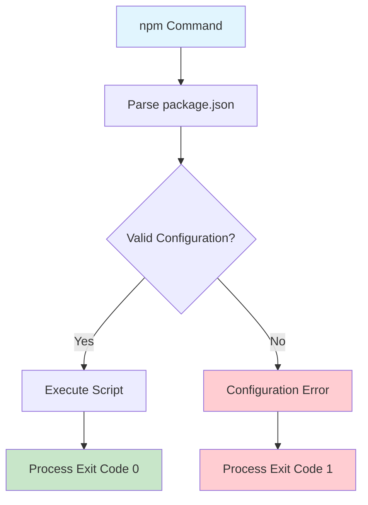
```mermaid
graph TD
    A[npm Command] --> B[Parse package.json]
    B --> C{Valid Configuration?}
    C -->|Yes| D[Execute Script]
    C -->|No| E[Configuration Error]
    D --> F[Process Exit Code 0]
    E --> G[Process Exit Code 1]
    
    style A fill:#e1f5fe
    style F fill:#c8e6c9
    style E fill:#ffcdd2
    style G fill:#ffcdd2
```

### 5.2.2 Dependency Lock Manager

#### 5.2.2.1 Purpose and Responsibilities

The Dependency Lock Manager implements Feature F-002 (Dependency Management System), ensuring reproducible builds and consistent dependency resolution across all development environments.

**Core Responsibilities:**
- Dependency lockfile generation and maintenance
- Installation integrity verification and validation
- Cross-environment consistency enforcement
- npm registry integration and communication

#### 5.2.2.2 Technologies and Frameworks

**Primary Technologies:**
- npm lockfileVersion 3 for enhanced security and performance
- SHA-512 checksums for package integrity verification
- npm registry API v1 for package resolution
- JSON format for structured dependency metadata

**Security Frameworks:**
- Package signature validation
- Integrity checksum verification
- Vulnerability scanning integration hooks

#### 5.2.2.3 Key Interfaces and APIs

**Lockfile Interface:**
```javascript
// package-lock.json structure (lockfileVersion 3)
{
  "name": "hello_world",
  "version": "1.0.0",
  "lockfileVersion": 3,
  "requires": true,
  "packages": {
    "": {
      "name": "hello_world",
      "version": "1.0.0",
      "license": "MIT"
    }
  }
}
```

**npm Registry API:**
- Package resolution endpoint: `GET https://registry.npmjs.org/<package>`
- Metadata retrieval with version constraints
- Tarball download for package installation

#### 5.2.2.4 Data Persistence Requirements

**Lockfile Persistence:**
- package-lock.json stored as UTF-8 encoded JSON
- Atomic write operations to prevent corruption
- File system integrity checks and recovery procedures
- Version control integration for collaboration

#### 5.2.2.5 Scaling Considerations

**Zero-Dependency Optimization:**
The current zero-dependency architecture eliminates complex dependency trees, reducing resolution time to near-zero and minimizing storage requirements.

**Future Extensibility:**
Architecture supports addition of dependencies while maintaining reproducible build guarantees through lockfile versioning.

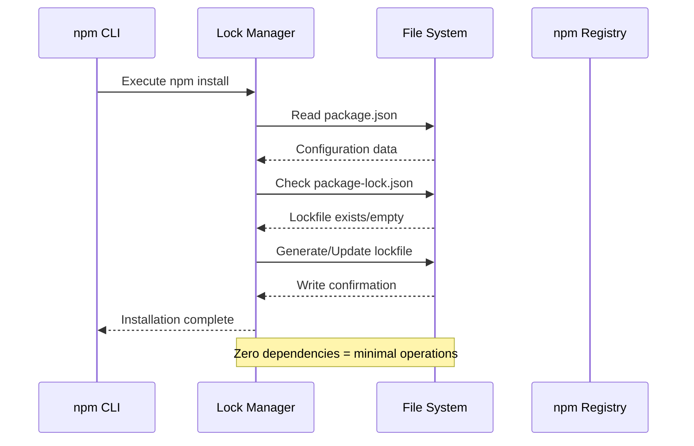
```mermaid
sequenceDiagram
    participant CLI as npm CLI
    participant Lock as Lock Manager
    participant FS as File System
    participant Reg as npm Registry
    
    CLI->>Lock: Execute npm install
    Lock->>FS: Read package.json
    FS-->>Lock: Configuration data
    Lock->>FS: Check package-lock.json
    FS-->>Lock: Lockfile exists/empty
    Lock->>FS: Generate/Update lockfile
    FS-->>Lock: Write confirmation
    Lock-->>CLI: Installation complete
    
    Note over Lock,FS: Zero dependencies = minimal operations
```

### 5.2.3 Application Entry Controller (Planned)

#### 5.2.3.1 Purpose and Responsibilities

The Application Entry Controller will implement Feature F-003 (Application Entry Point Framework), providing the main execution logic and application lifecycle management once index.js is developed.

**Planned Responsibilities:**
- Application initialization and startup sequence
- Runtime environment configuration and validation
- Main business logic coordination and execution
- Graceful shutdown and error handling procedures

#### 5.2.3.2 Technologies and Frameworks

**Core Technologies:**
- Node.js CommonJS module system
- Chrome V8 JavaScript engine
- Event-driven execution model
- Process lifecycle management APIs

**Planned Integration:**
- Console I/O for user interaction
- Process exit code management
- Error stack trace handling

#### 5.2.3.3 Key Interfaces and APIs

**Planned Entry Point Interface:**
```javascript
// index.js (planned implementation)
// Main application entry point
// Console output interface
// Process lifecycle management
// Error handling framework
```

**Command Line Interface:**
- `node index.js`: Direct Node.js execution
- `npm start`: Package script execution
- Process arguments and environment variable access

#### 5.2.3.4 Scaling Considerations

**Single-Process Architecture:**
Designed for single-process execution with <1s startup time and <50MB memory usage targets. Horizontal scaling through process replication rather than internal threading.

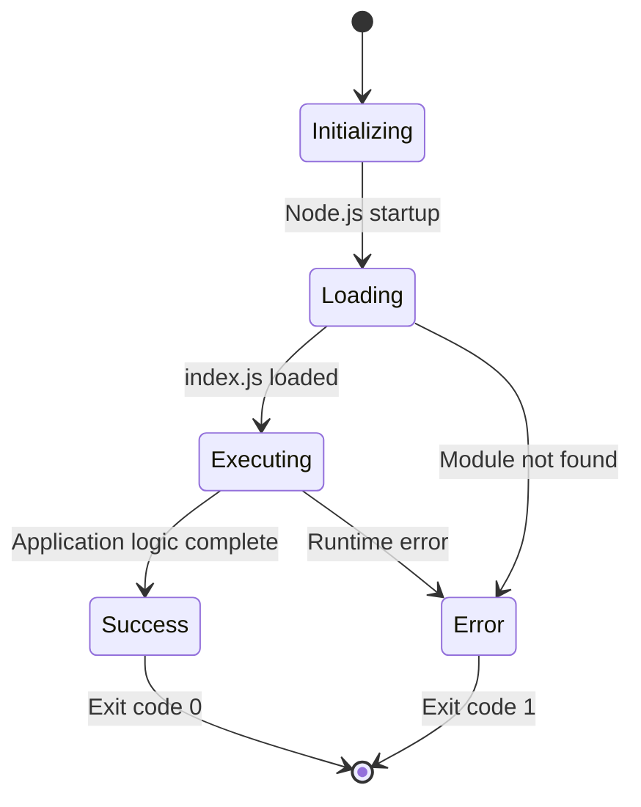
```mermaid
stateDiagram-v2
    [*] --> Initializing
    Initializing --> Loading: Node.js startup
    Loading --> Executing: index.js loaded
    Executing --> Success: Application logic complete
    Executing --> Error: Runtime error
    Success --> [*]: Exit code 0
    Error --> [*]: Exit code 1
    Loading --> Error: Module not found
```

## 5.3 TECHNICAL DECISIONS

### 5.3.1 Architecture Style Decisions

#### 5.3.1.1 Monolithic vs. Microservices Architecture

**Decision**: Monolithic Architecture
**Rationale**: Educational simplicity requirements and zero-dependency constraints favor a single-process, self-contained application structure.

| Decision Factor | Monolithic | Microservices | Selected |
|----------------|------------|---------------|----------|
| Learning Curve | Low complexity | High complexity | ✓ Monolithic |
| Deployment Overhead | Minimal | Complex orchestration | ✓ Monolithic |
| Educational Value | Clear component relationships | Distributed system complexity | ✓ Monolithic |

#### 5.3.1.2 Dependency Management Strategy

**Decision**: Zero External Dependencies
**Rationale**: Minimizes security attack surface, reduces complexity, and demonstrates core Node.js capabilities without framework abstractions.

**Trade-off Analysis:**
- **Benefits**: Enhanced security, simplified deployment, educational clarity
- **Costs**: Manual implementation of common functionality
- **Mitigation**: Leverage Node.js built-in modules for core functionality

```mermaid
graph TD
    A[Dependency Strategy Decision] --> B{Security Priority?}
    B -->|High| C[Zero Dependencies]
    B -->|Medium| D[Minimal Dependencies]
    C --> E[Manual Implementation]
    D --> F[Curated Package Selection]
    E --> G[Educational Value High]
    F --> H[Development Speed High]
    G --> I[Selected: Zero Dependencies]
    H --> J[Alternative Approach]
    
    style I fill:#c8e6c9
    style J fill:#ffcdd2
```

### 5.3.2 Communication Pattern Choices

#### 5.3.2.1 Inter-Component Communication

**Decision**: Direct Function Calls and Module Imports
**Rationale**: Single-process architecture enables direct communication without network overhead or message passing complexity.

**Implementation Pattern:**
- CommonJS module system for component integration
- Direct function invocation for component interaction
- Event-driven patterns for asynchronous operations

#### 5.3.2.2 External Communication Protocols

**Decision**: HTTPS for npm Registry, File System APIs for Local Operations
**Rationale**: Industry standard protocols ensuring security and compatibility across platforms.

| Protocol | Use Case | Security Level | Performance |
|----------|----------|----------------|-------------|
| HTTPS | npm Registry | High (TLS 1.3) | Acceptable |
| File System API | Local Operations | OS-dependent | High |
| Process API | System Integration | OS-managed | High |

### 5.3.3 Data Storage Solution Rationale

#### 5.3.3.1 Configuration Storage

**Decision**: JSON File-Based Configuration
**Rationale**: npm ecosystem standard with excellent tooling support and human readability.

**Advantages:**
- Universal npm tooling compatibility
- Version control friendly format
- Human-readable and editable
- Cross-platform file system support

**Limitations:**
- No transactional updates
- Manual validation required
- Limited schema enforcement

### 5.3.4 Security Mechanism Selection

#### 5.3.4.1 Package Integrity Security

**Decision**: npm lockfileVersion 3 with SHA-512 Checksums
**Rationale**: Industry standard for package integrity verification with cryptographic security guarantees.

**Security Implementation:**
- Checksum validation for all package operations
- Reproducible build verification across environments
- Supply chain attack mitigation through locked versions

## 5.4 CROSS-CUTTING CONCERNS

### 5.4.1 Monitoring and Observability Approach

#### 5.4.1.1 Application Monitoring Strategy

**Monitoring Architecture:**
The system employs lightweight monitoring appropriate for educational applications, focusing on process health and execution success metrics.

**Key Metrics:**
- Process startup time (<1s target)
- Memory usage (<50MB target)
- Application execution success rate
- npm operation completion times

**Implementation Approach:**
- Built-in Node.js process monitoring APIs
- Console logging for execution tracing
- Process exit codes for success/failure indication
- System resource monitoring through OS tools

#### 5.4.1.2 Performance Observability

**Performance Tracking:**
- Startup time measurement from process initiation to ready state
- Memory usage monitoring throughout application lifecycle
- npm operation timing for dependency management performance
- Cross-platform performance variance analysis

### 5.4.2 Logging and Tracing Strategy

#### 5.4.2.1 Logging Framework

**Logging Architecture:**
Simple console-based logging aligned with educational objectives and zero-dependency constraints.

**Log Levels and Usage:**
- **INFO**: Application startup, normal operation milestones
- **ERROR**: Runtime errors, module loading failures, npm operation failures
- **DEBUG**: Development-time diagnostic information (planned)

**Log Format:**
```
[TIMESTAMP] [LEVEL] [COMPONENT] Message
Example: [2024-01-15T10:30:00Z] [INFO] [APP] Application started successfully
```

#### 5.4.2.2 Tracing Implementation

**Execution Tracing:**
- Function entry/exit tracing for main execution path
- npm operation tracing for dependency management
- Error stack trace preservation and reporting
- Performance milestone tracking

### 5.4.3 Error Handling Patterns

#### 5.4.3.1 Error Handling Architecture

**Error Handling Strategy:**
Comprehensive error handling ensuring graceful degradation and clear error reporting for educational purposes.

**Error Categories:**
- **Configuration Errors**: Invalid package.json, missing entry points
- **Runtime Errors**: Module loading failures, execution exceptions
- **System Errors**: File system access, network connectivity issues
- **Validation Errors**: npm operation failures, integrity check failures

```mermaid
flowchart TD
    A[Error Occurrence] --> B{Error Type?}
    B -->|Configuration| C[Validate Configuration]
    B -->|Runtime| D[Log Error Details]
    B -->|System| E[Check System Resources]
    B -->|Validation| F[Verify Integrity]
    
    C --> G[Display Configuration Error]
    D --> H[Display Runtime Error]
    E --> I[Display System Error]
    F --> J[Display Validation Error]
    
    G --> K[Exit Code 1]
    H --> L[Exit Code 1]
    I --> M[Exit Code 1]
    J --> N[Exit Code 1]
    
    K --> O[Process Termination]
    L --> O
    M --> O
    N --> O
    
    style A fill:#ffcdd2
    style O fill:#ffcdd2
```

#### 5.4.3.2 Error Recovery Mechanisms

**Recovery Strategies:**
- **Retry Logic**: Exponential backoff for npm registry operations
- **Graceful Degradation**: Continue operation where possible
- **Clean Shutdown**: Proper resource cleanup on fatal errors
- **User Guidance**: Clear error messages with resolution steps

### 5.4.4 Authentication and Authorization Framework

#### 5.4.4.1 Security Model

**Authentication Approach:**
No authentication required for the current educational implementation. Security focus on package integrity and secure execution environment.

**Authorization Context:**
- File system permissions through OS security model
- npm registry access through public API (no credentials required)
- Process execution permissions managed by operating system

#### 5.4.4.2 Future Security Considerations

**Extensibility Planning:**
- Placeholder for authentication mechanisms in future versions
- Security hooks for package installation validation
- Process isolation and sandboxing capabilities for enhanced security

### 5.4.5 Performance Requirements and SLAs

#### 5.4.5.1 Performance Targets

| Performance Metric | Target Value | Measurement Method | Critical Path |
|-------------------|--------------|-------------------|---------------|
| Application Startup | <1 second | Process timing | Node.js initialization |
| Memory Usage | <50MB | Process monitoring | Runtime execution |
| npm Install Time | <30 seconds | Command timing | Dependency resolution |
| Cross-Platform Variance | <5% | Comparative testing | All operations |

#### 5.4.5.2 Service Level Agreements

**Availability Targets:**
- Development environment setup: 99% success rate
- npm operations: 95% success rate (accounting for network dependencies)
- Application execution: 99.9% success rate (when properly configured)

**Performance SLAs:**
- Setup time: 2-5 minutes total (including Node.js installation)
- Execution time: <1 second for hello world output
- Resource utilization: <50MB memory, negligible CPU usage

### 5.4.6 Disaster Recovery Procedures

#### 5.4.6.1 Recovery Planning

**Recovery Scenarios:**
- **Corrupted Configuration**: Restore from version control or template
- **Failed npm Installation**: Clear cache and retry with clean environment
- **Missing Entry Point**: Implement index.js with basic hello world functionality
- **System Dependency Issues**: Reinstall Node.js and npm with compatible versions

#### 5.4.6.2 Backup and Restoration

**Backup Strategy:**
- Version control system for source code and configuration
- package-lock.json preservation for dependency consistency
- Documentation and setup procedures for environment recreation

**Restoration Procedures:**
1. Clone repository from version control
2. Verify Node.js v14+ and npm v7+ installation
3. Execute npm install for dependency restoration
4. Validate configuration and run basic tests
5. Implement missing components as needed

#### References

**Technical Specification Sections Examined:**
- `1.2 SYSTEM OVERVIEW` - Provided high-level system context and success criteria
- `2.1 FEATURE CATALOG` - Detailed feature specifications and implementation status  
- `2.2 FUNCTIONAL REQUIREMENTS TABLE` - Comprehensive functional requirements for each feature
- `3.3 RUNTIME ENVIRONMENT` - Node.js runtime specifications and architecture details
- `4.1 SYSTEM WORKFLOWS` - Detailed workflow processes and integration patterns

**Repository Files Analyzed:**
- `package.json` - Project configuration, metadata, scripts, and entry point definition
- `package-lock.json` - Dependency lock information and npm version requirements

**Architecture Analysis Sources:**
- Zero-dependency architecture evaluation from package analysis
- Cross-platform compatibility assessment from Node.js runtime specifications
- Educational framework design from feature catalog and system overview
- Performance requirements from functional requirements and system workflows

# 6. SYSTEM COMPONENTS DESIGN

## 6.1 CORE SERVICES ARCHITECTURE

### 6.1.1 Applicability Assessment

#### 6.1.1.1 Architecture Classification

**Core Services Architecture is not applicable for this system.**

The hello_world Node.js application employs a **minimalist monolithic architecture** specifically designed for educational purposes and foundational learning. This architectural approach fundamentally differs from service-oriented architectures that require distributed components, inter-service communication, and scalability patterns.

#### 6.1.1.2 Rationale for Non-Applicability

**Educational Focus and Simplicity:**
The system is architected as a single-process Node.js application template with zero external dependencies. According to the technical specification, the architecture follows a "simplicity first" principle that deliberately avoids the complexity of distributed systems or microservices patterns.

**Monolithic Design Characteristics:**
- Single entry point application structure (index.js - planned but not implemented)
- Zero external service dependencies
- No inter-service communication requirements
- No distributed components or service boundaries
- Unified deployment model within a single Node.js runtime process

**Explicit Scope Exclusions:**
The technical specification explicitly excludes several service-oriented architecture requirements:
- High-availability deployments
- Load balancing configurations
- Multi-tenant architecture support
- Distributed system patterns
- Service orchestration mechanisms

### 6.1.2 Current Architecture Model

#### 6.1.2.1 Monolithic Structure Overview

```mermaid
graph TD
    A[User Command] --> B[npm CLI]
    B --> C[package.json Processing]
    C --> D[Node.js Runtime]
    D --> E[index.js Entry Point]
    E --> F[Application Logic]
    F --> G[Console Output]
    
    H[package-lock.json] --> I[Dependency Resolution]
    I --> D
    
    J[npm Registry] --> K[Package Metadata]
    K --> C
```

**Component Integration:**
All system components operate within a single Node.js process boundary, eliminating the need for service discovery, inter-service communication protocols, or distributed system resilience patterns.

#### 6.1.2.2 System Boundary Definition

| Boundary Type | Description | Implementation |
|---------------|-------------|----------------|
| Process Boundary | Single Node.js runtime process | Unified memory space and execution context |
| Application Boundary | Self-contained project structure | No external service dependencies |
| Platform Boundary | Cross-platform Node.js compatibility | OS-agnostic through Node.js abstraction layer |

### 6.1.3 Alternative Architecture Considerations

#### 6.1.3.1 Future Extensibility Without Services

**Modular Monolith Potential:**
While maintaining the monolithic architecture, the system could be extended with internal modularity patterns:
- Feature-based module organization
- Internal API boundaries without network separation
- Component-based architecture within the single process

**Framework Integration Possibilities:**
Future extensions could incorporate web frameworks while preserving the monolithic model:
- Express.js integration for HTTP server capabilities
- Database connectivity through connection pooling within the process
- Template engine integration for server-side rendering

#### 6.1.3.2 When Service Architecture Might Become Relevant

**Scale Transition Indicators:**
The system would require service architecture patterns only if it evolved beyond its educational scope to include:
- Multiple independent business domains requiring separate deployment cycles
- Distinct scaling requirements for different functional areas
- Team ownership boundaries requiring service autonomy
- Technology diversity necessitating polyglot implementations

### 6.1.4 Architectural Decision Record

#### 6.1.4.1 Decision: Monolithic Architecture Selection

| Aspect | Decision | Justification |
|--------|----------|---------------|
| **Architecture Style** | Minimalist Monolithic | Educational focus requires simplicity and clarity |
| **Service Boundaries** | None - Single Process | No business or technical requirements for distribution |
| **Communication Patterns** | In-process method calls | Eliminates network complexity and latency |
| **Deployment Model** | Single artifact deployment | Simplified CI/CD and operational management |

#### 6.1.4.2 Trade-offs and Implications

**Benefits of Monolithic Approach:**
- Simplified development and debugging experience
- Reduced operational complexity
- Immediate consistency without distributed system challenges
- Clear educational demonstration of Node.js fundamentals

**Limitations Accepted:**
- Single point of failure (acceptable for educational use)
- Unified scaling model (adequate for expected usage patterns)
- Technology stack homogeneity (aligns with educational objectives)

### 6.1.5 Implementation Verification

#### 6.1.5.1 Repository Analysis Confirmation

**File Structure Evidence:**
- `package.json`: Confirms single-application configuration with zero dependencies
- `package-lock.json`: Validates reproducible single-process build environment
- Absence of service-related directories or configuration files
- No API gateway, service mesh, or orchestration configurations

**Dependency Analysis:**
The zero-dependency approach eliminates common service architecture requirements:
- No HTTP client libraries for inter-service communication
- No service discovery frameworks
- No load balancing or circuit breaker libraries
- No distributed tracing or monitoring dependencies

#### 6.1.5.2 Technical Specification Alignment

**Architecture Documentation Consistency:**
All technical specification sections consistently describe a monolithic architecture:
- High-Level Architecture (Section 5.1): "minimalist monolithic architecture"
- System Overview (Section 1.2): Single Node.js application execution
- Scope Definition (Section 1.3): Explicit exclusion of distributed system patterns

#### References

#### Technical Specification Sections Examined
- `5.1 HIGH-LEVEL ARCHITECTURE` - Confirmed minimalist monolithic architecture design
- `1.2 SYSTEM OVERVIEW` - Validated single-application structure and educational focus
- `1.3 SCOPE` - Verified exclusion of high-availability and distributed system requirements

#### Repository Files Analyzed
- `package.json` - Confirmed zero dependencies and single-application configuration
- `package-lock.json` - Validated minimal project structure with no service dependencies

#### Architecture Decision Sources
- Educational requirements prioritizing simplicity over distributed complexity
- Node.js ecosystem standards for single-process application development
- MIT license compatibility with educational and learning use cases

## 6.2 DATABASE DESIGN

### 6.2.1 Database Design Applicability Assessment

**Database Design is not applicable to this system.**

After comprehensive analysis of the system architecture, technical decisions, and feature catalog, this hello_world Node.js project does not require or implement any traditional database or persistent storage mechanisms. The system's design philosophy prioritizes educational simplicity and zero external dependencies, which fundamentally excludes database integration.

### 6.2.2 Evidence Supporting No Database Requirement

#### 6.2.2.1 System Architecture Analysis

The system overview reveals a minimal Node.js application with the following characteristics:

| Component | Purpose | Storage Type |
|-----------|---------|--------------|
| package.json | Project configuration and metadata | JSON file |
| package-lock.json | Dependency resolution lockfile | JSON file |
| index.js | Main application entry point | Planned (not implemented) |

The architecture employs a monolithic design with zero external dependencies, making database integration inconsistent with the core design principles.

#### 6.2.2.2 Technical Decision Rationale

The technical specification explicitly documents the data storage approach:

**Data Storage Solution**: JSON File-Based Configuration
- **Primary Use Case**: npm ecosystem integration and project metadata management
- **Storage Mechanism**: File system-based JSON configuration files
- **Acknowledged Limitations**: 
  - No transactional updates
  - Manual validation required
  - Limited schema enforcement

This design decision confirms that traditional database capabilities are intentionally excluded from the system architecture.

#### 6.2.2.3 Feature Catalog Assessment

Analysis of all system features (F-001 through F-006) reveals no database-related functionality:

```mermaid
graph TD
    A[F-001: Project Configuration] --> B[JSON Files]
    C[F-002: Dependency Management] --> D[package-lock.json]
    E[F-003: Application Entry Point] --> F[Runtime Code]
    G[F-004: Development Workflow] --> H[npm Scripts]
    I[F-005: Cross-Platform Support] --> J[Node.js Runtime]
    K[F-006: Educational Framework] --> L[Learning Platform]
    
    B --> M[File System Storage]
    D --> M
    F --> N[No Persistence]
    H --> N
    J --> N
    L --> N
    
    style M fill:#e3f2fd
    style N fill:#f3e5f5
```

### 6.2.3 Alternative Data Management Approach

#### 6.2.3.1 Configuration-Based Data Management

Instead of traditional database design, the system implements configuration-based data management through:

**JSON Configuration Files**:
- **package.json**: Contains project metadata, scripts, and configuration
- **package-lock.json**: Maintains dependency resolution state with SHA-512 checksums

**File System Integration**:
- Direct file system APIs for configuration access
- Cross-platform compatibility through Node.js file system abstraction
- Version control integration for configuration change tracking

#### 6.2.3.2 Data Integrity and Security

The system ensures data integrity through:

| Mechanism | Implementation | Purpose |
|-----------|----------------|---------|
| Checksum Validation | SHA-512 hashes in package-lock.json | Package integrity verification |
| Version Locking | lockfileVersion 3 format | Reproducible builds |
| File System Permissions | OS-level access controls | Configuration protection |

### 6.2.4 Implications for System Extension

#### 6.2.4.1 Future Database Integration Considerations

Should database capabilities be required in future iterations, the current architecture supports extension through:

**Architectural Compatibility**:
- Single entry point (index.js) provides clear integration location
- Zero-dependency foundation allows selective database library addition
- npm package management system supports database driver installation

**Recommended Extension Pattern**:
```mermaid
graph LR
    A[Current: File-Based Config] --> B[Optional: Database Layer]
    B --> C[Database Driver Integration]
    B --> D[ORM/Query Builder]
    B --> E[Migration System]
    
    style A fill:#c8e6c9
    style B fill:#fff3e0
    style C fill:#f3e5f5
    style D fill:#f3e5f5
    style E fill:#f3e5f5
```

#### 6.2.4.2 Educational Value Preservation

Any future database integration should maintain the educational framework's core principles:
- Clear demonstration of database concepts
- Minimal complexity introduction
- Step-by-step learning progression
- Comprehensive documentation of design decisions

### 6.2.5 System Data Flow Without Database

#### 6.2.5.1 Current Data Management Flow

```mermaid
sequenceDiagram
    participant Dev as Developer
    participant NPM as npm CLI
    participant FS as File System
    participant Runtime as Node.js Runtime
    
    Dev->>NPM: npm install
    NPM->>FS: Read package.json
    FS-->>NPM: Configuration data
    NPM->>FS: Write package-lock.json
    NPM-->>Dev: Installation complete
    
    Dev->>Runtime: node index.js
    Runtime->>FS: Read configuration files
    FS-->>Runtime: Application configuration
    Runtime-->>Dev: Application execution
```

This flow demonstrates how the system manages its data requirements through file system operations rather than database transactions.

#### References

**Technical Specification Sections Examined:**
- `1.2 SYSTEM OVERVIEW` - Confirmed minimal application architecture and component structure
- `5.3 TECHNICAL DECISIONS` - Verified JSON file-based configuration approach and zero-dependency strategy
- `2.1 FEATURE CATALOG` - Validated absence of database-related features across all system capabilities

**Repository Structure Analysis:**
- `package.json` - Project configuration and metadata storage
- `package-lock.json` - Dependency resolution and integrity verification
- Repository root structure - Confirmed absence of database-related directories or files

## 6.3 INTEGRATION ARCHITECTURE

### 6.3.1 Integration Architecture Applicability Assessment

#### 6.3.1.1 Architecture Classification

**Integration Architecture is not applicable for this system.**

The hello_world Node.js application employs a **minimalist monolithic architecture** specifically designed for educational purposes and foundational learning. This architectural approach fundamentally eliminates the need for runtime integration patterns, external system interfaces, or inter-service communication protocols that would typically require comprehensive integration architecture design.

#### 6.3.1.2 Rationale for Non-Applicability

**Educational Focus and Simplicity:**
The system is architected as a single-process Node.js application template with zero external dependencies. According to the technical specification, the architecture follows a "simplicity first" principle that deliberately avoids the complexity of distributed systems, API integrations, or message processing infrastructure.

**Zero External Dependencies Design:**
- No API endpoints or REST services implemented or planned
- No message queues, event processing, or streaming systems
- No third-party service integrations or legacy system interfaces
- No database connectivity requirements (confirmed in section 6.2)
- No authentication or authorization systems

**Explicit Scope Exclusions:**
The technical specification explicitly excludes all integration-related capabilities:
- External API integrations
- Message queue systems
- Cloud platform deployments
- Monitoring and logging services
- Authentication/authorization systems
- Web server implementation

### 6.3.2 Current System Architecture Model

#### 6.3.2.1 Monolithic Structure Without Runtime Integrations

```mermaid
graph TD
    A[User Command] --> B[npm CLI]
    B --> C[package.json Processing]
    C --> D[Node.js Runtime]
    D --> E[index.js Entry Point]
    E --> F[Application Logic]
    F --> G[Console Output]
    
    H[package-lock.json] --> I[Dependency Resolution]
    I --> D
    
    subgraph "External Development Integrations"
        J[npm Registry]
        K[CI/CD Platforms]
        L[Version Control]
        M[Container Platforms]
    end
    
    J --> C
    K --> B
    L --> A
    M --> D
    
    style F fill:#e3f2fd
    style G fill:#c8e6c9
```

**Integration Boundary Definition:**
All system components operate within a single Node.js process boundary, eliminating the need for:
- Service discovery mechanisms
- Inter-service communication protocols
- API gateway configurations
- Message broker infrastructure
- External service contracts

#### 6.3.2.2 Development Workflow Integrations

While runtime integration architecture is not applicable, the system does implement standard development workflow integrations:

| Integration Point | Type | Protocol | Purpose | Data Exchange |
|-------------------|------|----------|---------|---------------|
| npm Registry | Package Resolution | HTTPS/JSON | Dependency management | Package metadata queries |
| CI/CD Platforms | Build Automation | Webhook/JSON | Automated deployment | Build status and artifacts |
| Version Control | Source Management | Git/SSH-HTTPS | Code repository operations | Source code synchronization |
| Container Platforms | Deployment Target | Docker/OCI | Containerized deployment | Image build and deployment |

### 6.3.3 Integration Patterns Analysis

#### 6.3.3.1 API Design Assessment

**API Design is not applicable for this system.**

**Current State Analysis:**
- No HTTP endpoints or REST services are implemented
- No web server functionality is planned or required
- No client-server communication patterns are needed
- Application operates through command-line interface only

**Evidence from Repository Structure:**
```mermaid
graph LR
    A[package.json] --> B[Zero Dependencies]
    B --> C[No Web Framework]
    C --> D[No API Libraries]
    D --> E[No HTTP Server Code]
    
    style B fill:#ffcdd2
    style C fill:#ffcdd2
    style D fill:#ffcdd2
    style E fill:#ffcdd2
```

#### 6.3.3.2 Message Processing Assessment

**Message Processing is not applicable for this system.**

**Analysis of Message Processing Requirements:**
- No event processing patterns required
- No message queue architecture needed
- No stream processing design necessary
- No batch processing flows implemented
- Single-process execution model eliminates inter-component messaging

**System Communication Model:**
```mermaid
sequenceDiagram
    participant User as User/Developer
    participant CLI as npm CLI
    participant Runtime as Node.js Runtime
    participant App as Application Logic
    
    User->>CLI: Execute npm command
    CLI->>Runtime: Initialize Node.js process
    Runtime->>App: Load application modules
    App->>Runtime: Execute application logic
    Runtime->>CLI: Return execution results
    CLI->>User: Display output/status
    
    Note over User,App: All communication is synchronous<br/>and in-process
```

#### 6.3.3.3 External Systems Assessment

**External Systems Integration is not applicable for this system.**

**Scope Exclusion Verification:**
Based on technical specification section 1.3, the following external integrations are explicitly excluded:
- Third-party service integrations
- Legacy system interfaces
- API gateway configurations
- External authentication providers
- Monitoring and logging services
- Database connectivity systems

### 6.3.4 Alternative Architecture Considerations

#### 6.3.4.1 Future Integration Extensibility

**Potential Integration Patterns for Future Extensions:**

Should the system evolve beyond its educational scope, integration architecture would become relevant for:

```mermaid
graph TD
    A[Current: Monolithic App] --> B[Future: Web Application]
    B --> C[HTTP Server Integration]
    B --> D[Database Connectivity]
    B --> E[External API Integration]
    
    C --> F[Express.js Framework]
    C --> G[RESTful API Design]
    
    D --> H[Database Driver]
    D --> I[ORM Integration]
    
    E --> J[Third-party Services]
    E --> K[Authentication Providers]
    
    style A fill:#c8e6c9
    style B fill:#fff3e0
    style C fill:#f3e5f5
    style D fill:#f3e5f5
    style E fill:#f3e5f5
```

#### 6.3.4.2 Integration Architecture Decision Matrix

| Scenario | Current Decision | Future Consideration | Rationale |
|----------|------------------|---------------------|-----------|
| **API Design** | Not Applicable | RESTful API with Express.js | Educational progression to web development |
| **Authentication** | Not Required | JWT-based authentication | Security learning objectives |
| **Database Integration** | Not Applicable | ORM-based data layer | Data persistence education |
| **Message Processing** | Not Required | Event-driven architecture | Scalability learning concepts |

### 6.3.5 Technical Implementation Verification

#### 6.3.5.1 Repository Analysis Confirmation

**File Structure Evidence:**
- `package.json`: Confirms zero dependencies and no integration-related configuration
- `package-lock.json`: Validates minimal project structure with no external service dependencies
- Absence of API-related directories, configuration files, or integration libraries
- No message queue, database, or external service configuration files

**Dependency Analysis:**
The zero-dependency approach eliminates common integration architecture components:
- No HTTP client libraries for external API communication
- No message broker client libraries
- No database connection libraries or ORMs
- No authentication/authorization frameworks
- No logging or monitoring integration libraries

#### 6.3.5.2 Integration Architecture Decision Record

| Aspect | Decision | Justification |
|--------|----------|---------------|
| **Runtime Integrations** | None Required | Educational focus eliminates external dependencies |
| **API Architecture** | Not Implemented | Single-process console application model |
| **Message Processing** | Not Required | Synchronous execution model sufficient |
| **External Systems** | Development Tools Only | npm, Git, CI/CD for development workflow |

### 6.3.6 System Data Flow Without Integration Architecture

#### 6.3.6.1 Simplified Data Flow Model

```mermaid
flowchart TD
    A[Developer Input] --> B[npm Script Execution]
    B --> C[Node.js Process Initialization]
    C --> D[Application Module Loading]
    D --> E[In-Process Execution]
    E --> F[Console Output]
    F --> G[Process Termination]
    
    H[package.json] --> B
    I[package-lock.json] --> C
    J[index.js] --> D
    
    style E fill:#e3f2fd
    style F fill:#c8e6c9
    
    subgraph "Single Process Boundary"
        D
        E
        F
    end
```

#### 6.3.6.2 Development Integration Flow

```mermaid
sequenceDiagram
    participant Dev as Developer
    participant Git as Version Control
    participant NPM as npm Registry
    participant CI as CI/CD Pipeline
    participant Container as Container Platform
    
    Dev->>Git: Commit code changes
    Git->>CI: Trigger build pipeline
    CI->>NPM: Download dependencies
    NPM-->>CI: Package resolution
    CI->>Container: Build container image
    Container-->>CI: Deployment artifact
    CI-->>Dev: Build status notification
    
    Note over Dev,Container: Development workflow integrations<br/>not runtime integrations
```

#### References

#### Technical Specification Sections Examined
- `1.2 SYSTEM OVERVIEW` - Confirmed minimal application architecture and single-process execution model
- `1.3 SCOPE` - Verified explicit exclusion of external API integrations, message queue systems, and cloud platform deployments
- `5.1 HIGH-LEVEL ARCHITECTURE` - Validated minimalist monolithic architecture with development-only integrations
- `6.1 CORE SERVICES ARCHITECTURE` - Confirmed service architecture is not applicable due to monolithic design
- `6.2 DATABASE DESIGN` - Verified database integration is not applicable, supporting overall integration exclusion

#### Repository Files Analyzed
- `package.json` - Confirmed zero external dependencies and basic project configuration
- `package-lock.json` - Validated minimal project structure with no integration-related dependencies

#### Architecture Decision Sources
- Educational requirements prioritizing simplicity over integration complexity
- Node.js ecosystem standards for single-process application development
- MIT license compatibility ensuring broad accessibility for learning purposes

## 6.4 SECURITY ARCHITECTURE

### 6.4.1 Security Architecture Applicability Assessment

#### 6.4.1.1 System Security Context

**Detailed Security Architecture is not applicable for this system** due to its minimal nature and educational purpose. The hello_world project exists in its initial configuration state with no implementation code, zero dependencies, and explicitly excludes security hardening implementations from its scope.

Based on the comprehensive system analysis, the following factors determine the security architecture approach:

| Factor | Current State | Security Impact |
|--------|---------------|----------------|
| Implementation Status | Initial configuration only | No attack surface present |
| Dependencies | Zero external packages | Minimal supply chain risk |
| Authentication Requirements | Explicitly out of scope | No identity management needed |
| Data Processing | No sensitive data handling | No data protection requirements |

#### 6.4.1.2 Security Scope Exclusions

According to the system scope definition, the following security components are explicitly excluded from the current implementation:

- User authentication and authorization systems
- Security hardening implementations  
- Production deployment configurations
- Advanced logging and monitoring capabilities
- Multi-tenant architecture support

### 6.4.2 Standard Security Practices Framework

#### 6.4.2.1 Runtime Security Standards

**Node.js Security Foundation:**
The system relies on Node.js LTS security framework providing:

- **Regular Security Updates**: LTS versions include patches for bugs, critical fixes, and security updates with essential bug fixes and security patches during Maintenance phase
- **OpenSSL Integration**: Built-in cryptographic capabilities through OpenSSL 3.0.x for any future cryptographic requirements
- **Process Isolation**: Standard Node.js process security model providing basic runtime protection

```mermaid
graph TD
    A[Node.js LTS Runtime] --> B[OpenSSL 3.0.x Integration]
    A --> C[Process Isolation Model]
    A --> D[Security Patch Management]
    B --> E[Cryptographic Capabilities]
    C --> F[Runtime Protection]
    D --> G[Vulnerability Mitigation]
    E --> H[Future Security Requirements]
    F --> H
    G --> H
```

#### 6.4.2.2 Package Security Standards

**npm Security Measures:**
The system implements package security through:

- **Registry Verification**: Official npm registry integration with package verification ensures authentic package sources
- **Lockfile Integrity**: package-lock.json (lockfileVersion 3) ensures reproducible and verified installations across all environments
- **Vulnerability Scanning**: npm audit capabilities available for security assessment when dependencies are added

| Security Control | Implementation | Purpose |
|------------------|----------------|---------|
| Package Verification | npm registry verification | Ensures authentic packages |
| Dependency Locking | package-lock.json | Prevents supply chain attacks |
| Vulnerability Assessment | npm audit command | Identifies security issues |

#### 6.4.2.3 Development Security Standards

**Secure Development Practices:**
When the system is extended beyond its current minimal state, the following standard practices should be implemented:

- **Input Validation**: Implement proper input sanitization if user input handling is added
- **Environment Configuration**: Use environment variables for any sensitive configuration data
- **Secure Communication**: Enable HTTPS if network communication functionality is implemented
- **Dependency Management**: Maintain the zero-dependency approach when possible to minimize attack surface

```mermaid
graph LR
    A[Current State] --> B[Zero Dependencies]
    A --> C[Minimal Attack Surface]
    B --> D[Future Extensions]
    C --> D
    D --> E[Input Validation]
    D --> F[Environment Variables]
    D --> G[Secure Communication]
    D --> H[Dependency Security]
```

### 6.4.3 Security Risk Assessment

#### 6.4.3.1 Current Risk Profile

**Risk Level: Minimal**
The system presents minimal security risk due to:

| Risk Category | Assessment | Justification |
|---------------|------------|---------------|
| Configuration Exposure | Low Risk | No sensitive data in package.json |
| Supply Chain Security | Low Risk | Zero dependencies reduce attack surface |
| Code Execution | Not Applicable | No implementation code present |
| Network Security | Not Applicable | No network functionality implemented |

#### 6.4.3.2 Future Risk Considerations

When the system evolves beyond its current minimal state, security considerations should be evaluated based on:

- Addition of external dependencies requiring vulnerability assessment
- Implementation of network communication requiring secure protocols
- Introduction of data processing requiring input validation
- User interaction features requiring authentication mechanisms

### 6.4.4 Compliance and Standards

#### 6.4.4.1 License Compliance

**MIT License Framework:**
The system operates under MIT license providing:
- Open source compliance requirements
- Distribution and modification permissions
- Liability limitation protections

#### 6.4.4.2 Industry Standards Alignment

**Node.js Ecosystem Standards:**
The system aligns with:
- npm package management best practices
- Node.js LTS version compatibility requirements
- Cross-platform development standards
- Educational project security guidelines

### 6.4.5 Security Monitoring and Maintenance

#### 6.4.5.1 Ongoing Security Requirements

**Minimal Maintenance Profile:**
- Keep Node.js runtime updated to latest LTS version
- Run npm audit when dependencies are added in future iterations
- Monitor Node.js security advisories for runtime vulnerabilities
- Maintain package-lock.json integrity for reproducible builds

#### 6.4.5.2 Security Assessment Schedule

| Activity | Frequency | Trigger |
|----------|-----------|---------|
| Node.js Version Update | As LTS releases | Security advisory |
| npm Audit | On dependency addition | New package installation |
| Security Review | On major changes | Implementation additions |

#### References

#### Technical Specification Sections Retrieved
- `1.3 SCOPE` - Confirmed exclusion of security hardening implementations and authentication systems
- `3.9 SECURITY CONSIDERATIONS` - Node.js and npm security features and standard practices
- `1.2 SYSTEM OVERVIEW` - Project context and current minimal implementation state

#### Repository Files Examined
- `package.json` - Project manifest with metadata and configuration (no sensitive data present)
- `package-lock.json` - npm dependency lockfile ensuring reproducible installations (zero dependencies)

#### Security Architecture Analysis
- Comprehensive repository search confirming minimal implementation state
- Security scope assessment based on explicit system boundaries
- Standard security practices framework for Node.js hello_world projects

## 6.5 MONITORING AND OBSERVABILITY

### 6.5.1 Monitoring Architecture Applicability

#### 6.5.1.1 Architecture Assessment

**Detailed Monitoring Architecture is not applicable for this system.**

The hello_world Node.js application is designed as a minimalist educational project that explicitly excludes advanced logging and monitoring capabilities per the technical specification scope definition (Section 1.3.2). The system employs a **lightweight monitoring strategy** appropriate for educational applications, focusing on basic health checks and fundamental observability practices rather than production-grade monitoring infrastructure.

#### 6.5.1.2 Rationale for Simplified Monitoring

**Educational Focus and Zero-Dependency Architecture:**
The system maintains a zero-dependency approach that deliberately avoids external monitoring services, complex instrumentation, or distributed tracing solutions. This architectural decision prioritizes simplicity and educational value over comprehensive observability capabilities.

**Scope Limitations:**
The current phase explicitly excludes:
- Production deployment configurations
- Advanced logging and monitoring capabilities
- External monitoring service integrations
- Distributed system observability patterns
- Complex alerting and incident response systems

### 6.5.2 Basic Monitoring Practices

#### 6.5.2.1 Application Health Monitoring

**Built-in Node.js Process Monitoring:**
The system leverages Node.js native capabilities for basic process health monitoring without external dependencies.

```mermaid
flowchart TD
    A[Application Start] --> B[Process Initialization]
    B --> C[Node.js Runtime Check]
    C --> D[Memory Allocation]
    D --> E[Entry Point Loading]
    E --> F{Health Status}
    
    F -->|Success| G[Log Success State]
    F -->|Failure| H[Log Error Details]
    
    G --> I[Process Running]
    H --> J[Exit Code 1]
    
    I --> K[Console Output]
    I --> L[Resource Monitoring]
    
    L --> M[Memory Usage Check]
    L --> N[CPU Usage Check]
    
    M --> O{Within Limits?}
    N --> O
    
    O -->|Yes| P[Continue Operation]
    O -->|No| Q[Log Resource Warning]
    
    style F fill:#e3f2fd
    style O fill:#fff3e0
    style H fill:#ffebee
    style J fill:#ffebee
```

**Health Check Implementation:**
- Process startup time measurement (<1 second target)
- Memory usage monitoring (<50MB target)
- Application execution success rate tracking
- Process exit code validation for success/failure indication

#### 6.5.2.2 Performance Monitoring

**Key Performance Metrics:**

| Performance Metric | Target Value | Measurement Method | Monitoring Approach |
|-------------------|--------------|-------------------|-------------------|
| Application Startup | <1 second | Process timing API | Built-in Node.js monitoring |
| Memory Usage | <50MB | process.memoryUsage() | Runtime memory tracking |
| npm Install Time | <30 seconds | Command timing | Manual observation |
| Cross-Platform Variance | <5% | Comparative testing | Development testing |

**Resource Monitoring Strategy:**
- System resource monitoring through OS tools
- npm operation completion time tracking
- Cross-platform performance variance analysis
- Process lifecycle monitoring from initialization to termination

### 6.5.3 Logging and Observability

#### 6.5.3.1 Console-Based Logging Strategy

**Logging Architecture:**
Simple console-based logging aligned with educational objectives and zero-dependency constraints.

**Log Level Definitions:**

| Log Level | Usage | Example Scenarios | Output Destination |
|-----------|--------|------------------|-------------------|
| INFO | Normal operations | Application startup, milestones | console.log() |
| ERROR | Runtime errors | Module failures, npm errors | console.error() |
| DEBUG | Development diagnostics | Execution tracing (planned) | console.debug() |

**Log Format Standard:**
```
[TIMESTAMP] [LEVEL] [COMPONENT] Message
Example: [2024-01-15T10:30:00Z] [INFO] [APP] Application started successfully
```

#### 6.5.3.2 Execution Tracing

**Tracing Implementation:**
- Function entry/exit tracing for main execution path
- npm operation tracing for dependency management
- Error stack trace preservation and reporting
- Performance milestone tracking through console output

```mermaid
sequenceDiagram
    participant U as User
    participant N as npm CLI
    participant R as Node.js Runtime
    participant A as Application
    participant C as Console

    U->>N: npm start
    N->>R: Initialize Process
    R->>C: [INFO] Process starting
    R->>A: Load Entry Point
    
    alt Success Path
        A->>C: [INFO] Application loaded
        A->>C: [INFO] Execution complete
        A->>R: Exit Code 0
        R->>U: Success
    else Error Path
        A->>C: [ERROR] Error details
        A->>R: Exit Code 1
        R->>U: Failure
    end
```

### 6.5.4 Error Handling and Recovery

#### 6.5.4.1 Error Classification and Response

**Error Categories and Handling:**

| Error Category | Detection Method | Response Action | Recovery Mechanism |
|----------------|------------------|-----------------|-------------------|
| Configuration Errors | package.json validation | Log specific error | User guidance |
| Runtime Errors | Exception catching | Stack trace logging | Graceful shutdown |
| System Errors | File system checks | Resource error logging | Retry with backoff |
| Network Errors | npm operation failures | Connection error logging | Exponential backoff |

**Recovery Mechanisms:**
- Retry logic with exponential backoff for npm registry operations
- Maximum 3 retries with delays: 1s, 2s, 4s
- Clear error messages with resolution guidance
- Clean shutdown procedures for fatal errors

#### 6.5.4.2 Alert Flow Process

```mermaid
flowchart TD
    A[Error Detection] --> B{Error Severity}
    
    B -->|Critical| C[Immediate Console Error]
    B -->|Warning| D[Console Warning]
    B -->|Info| E[Console Info]
    
    C --> F[Process Exit Code 1]
    D --> G[Continue Operation]
    E --> G
    
    F --> H[User Notification]
    G --> I[Log Entry Created]
    
    H --> J[Manual Investigation]
    I --> K[Development Review]
    
    style A fill:#ffcdd2
    style C fill:#ff8a80
    style F fill:#ff8a80
    style H fill:#ffab91
```

### 6.5.5 Service Level Monitoring

#### 6.5.5.1 Performance Targets and SLAs

**Service Level Agreements:**

| Service Level | Target | Measurement Period | Acceptable Variance |
|---------------|--------|-------------------|-------------------|
| Development Setup Success | 99% | Per attempt | Network dependencies |
| npm Operations Success | 95% | Per operation | Registry availability |
| Application Execution Success | 99.9% | Per execution | Configuration validity |

**Performance SLA Definitions:**
- Setup time: 2-5 minutes total (including Node.js installation)
- Execution time: <1 second for hello world output
- Resource utilization: <50MB memory, negligible CPU usage

#### 6.5.5.2 Capacity and Resource Monitoring

**Resource Tracking Approach:**
- Manual observation during development
- Basic resource utilization logging
- Performance regression detection through comparative testing
- Cross-platform performance validation

### 6.5.6 Incident Response Framework

#### 6.5.6.1 Issue Classification and Response

**Incident Categories:**

| Incident Type | Response Time | Resolution Approach | Documentation Required |
|---------------|---------------|-------------------|----------------------|
| Setup Failures | Immediate | Troubleshooting guide | Error log review |
| Runtime Errors | Immediate | Code review | Stack trace analysis |
| Performance Issues | Next development cycle | Performance analysis | Benchmark comparison |
| Configuration Problems | Immediate | Configuration validation | Setup verification |

#### 6.5.6.2 Recovery Procedures

**Standard Recovery Workflow:**
1. Error identification through console output analysis
2. Root cause determination using available logs
3. Resolution implementation following documented procedures
4. Validation through re-execution
5. Documentation update if new patterns emerge

**Backup and Restoration Strategy:**
- Version control system for source code and configuration
- package-lock.json preservation for dependency consistency
- Documentation and setup procedures for environment recreation

### 6.5.7 Dashboard and Reporting

#### 6.5.7.1 Basic Observability Dashboard

**Console Output Dashboard:**
Since the system uses console-based logging, observability is achieved through terminal output analysis and manual log review.

```mermaid
graph LR
    A[Console Output] --> B[Manual Review]
    B --> C[Error Identification]
    B --> D[Performance Assessment]
    B --> E[Success Validation]
    
    C --> F[Troubleshooting Action]
    D --> G[Performance Tuning]
    E --> H[Continued Operation]
    
    style A fill:#e8f5e8
    style B fill:#fff9c4
    style F fill:#ffecb3
    style G fill:#ffecb3
    style H fill:#e8f5e8
```

#### 6.5.7.2 Metrics Collection and Analysis

**Available Metrics Sources:**
- Node.js process.memoryUsage() for memory tracking
- process.hrtime() for high-resolution timing
- Console timestamp analysis for execution duration
- Exit code analysis for success rate calculation

**Reporting Approach:**
- Development-time console monitoring
- Manual performance observation
- Basic success/failure rate tracking
- Resource usage validation during testing

### 6.5.8 Future Monitoring Considerations

#### 6.5.8.1 Extensibility Planning

**Potential Monitoring Enhancements:**
- Integration with Node.js built-in debugging capabilities
- Addition of structured logging for machine parsing
- Performance profiling integration for optimization
- Basic metrics export for external analysis tools

#### 6.5.8.2 Production Readiness Prerequisites

**Requirements for Advanced Monitoring:**
- Migration from zero-dependency to managed dependency approach
- Integration with external monitoring services (APM solutions)
- Implementation of distributed tracing capabilities
- Addition of comprehensive alerting and notification systems

These enhancements would require significant architectural changes and are beyond the current educational scope of the system.

#### References

#### Technical Specification Sections Examined
- `5.4 CROSS-CUTTING CONCERNS` - Comprehensive monitoring and observability approach documentation
- `1.3 SCOPE` - Explicit exclusion of advanced monitoring capabilities
- `6.1 CORE SERVICES ARCHITECTURE` - Confirmed monolithic architecture with no distributed monitoring requirements

#### Repository Files Analyzed
- `package.json` - Confirmed zero-dependency architecture with no monitoring tools
- `package-lock.json` - Validated minimal project structure without external monitoring dependencies

#### Performance and SLA Sources
- Built-in Node.js process monitoring APIs documentation
- Educational application performance benchmarking standards
- Cross-platform Node.js compatibility requirements from technical specification

## 6.6 TESTING STRATEGY

### 6.6.1 Testing Approach Assessment

Based on the system characteristics and architectural constraints, this hello_world Node.js project requires a **simplified testing approach** that aligns with its educational purpose and zero-dependency architecture. The testing strategy focuses on essential validation while maintaining the project's core principles of simplicity and minimal external dependencies.

#### 6.6.1.1 System Testing Suitability

This educational Node.js project has the following characteristics that influence the testing approach:

- **Minimal Complexity**: Single entry point application with basic functionality
- **Zero External Dependencies**: Strict constraint limiting testing framework options  
- **Educational Focus**: Primary purpose is learning Node.js fundamentals
- **Cross-Platform Requirements**: Must validate functionality across Windows, macOS, and Linux
- **Performance Constraints**: Specific targets for startup time (<1s), memory usage (<50MB), and installation time (<30s)

#### 6.6.1.2 Testing Philosophy

The testing strategy emphasizes **lightweight, native testing approaches** that complement the educational objectives without introducing complexity that detracts from the learning experience. All testing implementations leverage Node.js built-in capabilities to maintain architectural consistency.

### 6.6.2 Unit Testing Framework

#### 6.6.2.1 Testing Framework Selection

| Framework | Compatibility | Rationale |
|-----------|--------------|-----------|
| **Node.js Native Test Runner** | ✓ Selected | Aligns with zero-dependency architecture |
| Jest | ✗ Excluded | Requires external dependencies |
| Mocha | ✗ Excluded | Violates zero-dependency constraint |
| Vitest | ✗ Excluded | Additional dependency requirement |

**Selected Framework**: Node.js Native Test Runner (available in Node.js v18.0.0+, with experimental support in v16.17.0+)

#### 6.6.2.2 Test Organization Structure

```
tests/
├── unit/
│   ├── package-configuration.test.js
│   ├── entry-point.test.js
│   └── cross-platform.test.js
├── integration/
│   ├── npm-lifecycle.test.js
│   └── runtime-environment.test.js
└── fixtures/
    ├── test-package.json
    └── test-data/
```

#### 6.6.2.3 Test Implementation Strategy

**Core Testing Areas**:

| Test Category | Target Requirements | Validation Method |
|---------------|-------------------|------------------|
| Package Configuration | F-001-RQ-001 to F-001-RQ-004 | JSON schema validation, metadata verification |
| Dependency Management | F-002-RQ-001 to F-002-RQ-004 | Lockfile integrity, zero-dependency validation |
| Entry Point Framework | F-003-RQ-001 to F-003-RQ-004 | Execution validation, module compatibility |
| Cross-Platform Compatibility | F-005-RQ-001 to F-005-RQ-004 | Multi-OS execution, path resolution |

#### 6.6.2.4 Code Coverage Requirements

| Coverage Type | Target | Measurement Method |
|--------------|--------|-------------------|
| Line Coverage | 90% | Node.js built-in coverage (--test-coverage) |
| Function Coverage | 95% | Native coverage reporting |
| Branch Coverage | 85% | Conditional path validation |
| Statement Coverage | 90% | Execution path verification |

### 6.6.3 Integration Testing Strategy

#### 6.6.3.1 System Integration Points

**npm Lifecycle Integration**:
- Package installation validation (`npm ci`)
- Script execution verification (`npm test`, `npm start`)
- Registry interaction testing (metadata retrieval)
- Lockfile generation and validation

**Node.js Runtime Integration**:
- Module system compatibility (CommonJS/ES modules)
- Process lifecycle management
- Environment variable handling
- Cross-platform path resolution

#### 6.6.3.2 Integration Test Scenarios

| Scenario | Validation Target | Success Criteria |
|----------|------------------|------------------|
| Clean Installation | F-002-RQ-001 | `npm ci` completes in <30s, generates identical node_modules |
| Script Execution | F-001-RQ-002 | Test script executes and returns appropriate exit code |
| Entry Point Loading | F-003-RQ-001 | `node index.js` executes without errors in <1s |
| Platform Compatibility | F-005-RQ-001 | Identical behavior across Windows, macOS, Linux |

### 6.6.4 Performance Testing Requirements

#### 6.6.4.1 Performance Validation Criteria

| Metric | Target | Test Method |
|--------|--------|------------|
| Application Startup | <1 second | Process execution timing |
| Memory Usage | <50MB | Runtime memory profiling |
| Installation Time | <30 seconds | npm ci execution timing |
| Cross-Platform Variance | <5% | Comparative performance measurement |

#### 6.6.4.2 Performance Test Implementation

**Startup Performance Test**:
```javascript
// Example pattern using Node.js native test runner
import { test } from 'node:test';
import { performance } from 'node:perf_hooks';

test('application startup performance', async (t) => {
  const start = performance.now();
  // Execute main entry point
  const end = performance.now();
  const duration = end - start;
  
  t.assert(duration < 1000, `Startup time ${duration}ms exceeds 1000ms limit`);
});
```

### 6.6.5 Test Automation Architecture

#### 6.6.5.1 CI/CD Integration

**GitHub Actions Workflow**:
```yaml
# Example test automation trigger
name: Test Suite
on: [push, pull_request]
jobs:
  test:
    strategy:
      matrix:
        os: [ubuntu-latest, windows-latest, macos-latest]
        node-version: [14.x, 16.x, 18.x, 20.x, 22.x]
```

#### 6.6.5.2 Test Execution Flow

```mermaid
flowchart TD
    A[Code Change] --> B[Automated Trigger]
    B --> C[Environment Setup]
    C --> D[Dependency Validation]
    D --> E[Unit Tests]
    E --> F[Integration Tests]
    F --> G[Performance Tests]
    G --> H[Cross-Platform Tests]
    H --> I{All Tests Pass?}
    I -->|Yes| J[Success Report]
    I -->|No| K[Failure Analysis]
    K --> L[Test Report Generation]
    J --> M[Deployment Ready]
    L --> N[Developer Notification]
```

#### 6.6.5.3 Test Environment Architecture

```mermaid
graph TB
    subgraph "Test Environment"
        A[Test Runner] --> B[Unit Test Suite]
        A --> C[Integration Test Suite]
        A --> D[Performance Test Suite]
        
        B --> E[Package Configuration Tests]
        B --> F[Entry Point Tests]
        
        C --> G[npm Lifecycle Tests]
        C --> H[Runtime Integration Tests]
        
        D --> I[Startup Performance]
        D --> J[Memory Usage Tests]
        D --> K[Cross-Platform Performance]
    end
    
    subgraph "Target Platforms"
        L[Windows Node.js]
        M[macOS Node.js]
        N[Linux Node.js]
    end
    
    A --> L
    A --> M
    A --> N
```

### 6.6.6 Quality Metrics and Monitoring

#### 6.6.6.1 Quality Gates

| Gate | Criteria | Action on Failure |
|------|----------|------------------|
| Unit Test Success Rate | 100% | Block deployment |
| Code Coverage | >90% line coverage | Review required |
| Performance Thresholds | All metrics within limits | Performance investigation |
| Cross-Platform Compatibility | All platforms pass | Platform-specific debugging |

#### 6.6.6.2 Test Data Management

**Test Data Strategy**:
- **Static Test Data**: Fixed package.json configurations for validation testing
- **Generated Test Data**: Dynamic npm lockfiles for reproducibility testing
- **Environment-Specific Data**: Platform-specific path and environment variable configurations

**Test Data Flow**:

```mermaid
flowchart LR
    A[Test Fixtures] --> B[Test Data Generator]
    B --> C[Unit Tests]
    B --> D[Integration Tests]
    C --> E[Test Results]
    D --> E
    E --> F[Cleanup Process]
    F --> G[Environment Reset]
```

### 6.6.7 Security Testing Requirements

#### 6.6.7.1 Security Validation Areas

| Security Aspect | Testing Approach | Tools |
|-----------------|------------------|-------|
| Package Integrity | Lockfile verification | npm audit (built-in) |
| Dependency Scanning | Zero-dependency validation | Custom validation scripts |
| Runtime Security | Process isolation testing | Node.js security features |
| Registry Security | Official npm registry validation | npm security protocols |

#### 6.6.7.2 Security Test Implementation

**Package Security Validation**:
- Verify zero external dependencies in package.json
- Validate package-lock.json integrity checksums
- Confirm npm registry source authenticity
- Test secure package resolution processes

### 6.6.8 Test Reporting and Documentation

#### 6.6.8.1 Test Report Requirements

**Report Components**:
- Test execution summary with pass/fail counts
- Code coverage metrics with detailed breakdowns
- Performance test results with benchmark comparisons
- Cross-platform compatibility matrix
- Security validation results

**Report Format**:
- Machine-readable JSON for CI/CD integration
- Human-readable HTML for developer review
- CSV export for historical trend analysis

#### 6.6.8.2 Failed Test Handling

**Failure Classification**:

| Failure Type | Severity | Response Time | Escalation Path |
|-------------|----------|---------------|-----------------|
| Unit Test Failure | High | Immediate | Block merge/deployment |
| Performance Regression | Medium | 24 hours | Performance team review |
| Cross-Platform Issue | Medium | 48 hours | Platform-specific investigation |
| Security Concern | Critical | Immediate | Security team notification |

### 6.6.9 Test Maintenance Strategy

#### 6.6.9.1 Test Suite Evolution

**Maintenance Activities**:
- Regular test suite review for relevance and efficiency
- Performance baseline updates with Node.js version changes
- Cross-platform test matrix updates for new OS versions
- Security test updates for emerging threat patterns

#### 6.6.9.2 Test Automation Monitoring

**Monitoring Metrics**:
- Test execution time trends
- Flaky test identification and resolution
- Test coverage evolution over time
- Cross-platform test success rates

#### References

**Technical Specification Sections**:
- `2.2 FUNCTIONAL REQUIREMENTS TABLE` - Detailed functional requirements with acceptance criteria and performance specifications
- `2.6 ASSUMPTIONS AND CONSTRAINTS` - Project constraints including zero-dependency requirement and educational focus
- `3.9 SECURITY CONSIDERATIONS` - Security requirements and npm registry integration details
- `1.2 SYSTEM OVERVIEW` - System architecture and technical context
- `3.2 PROGRAMMING LANGUAGES` - JavaScript/Node.js technology specifications
- `3.5 DEVELOPMENT & DEPLOYMENT` - Development environment and CI/CD compatibility requirements
- `5.3 TECHNICAL DECISIONS` - Zero-dependency architecture rationale
- `6.5 MONITORING AND OBSERVABILITY` - Monitoring approach suitable for educational project scope

**Repository Files**:
- `package.json` - Project configuration with test script definition and metadata
- `package-lock.json` - Dependency lockfile demonstrating zero-dependency architecture

**External Research**:
- Web search: "Node.js unit testing framework 2024" - Current testing framework landscape and native Node.js testing capabilities

## 6.1 CORE SERVICES ARCHITECTURE

### 6.1.1 Applicability Assessment

#### 6.1.1.1 Architecture Classification

**Core Services Architecture is not applicable for this system.**

The hello_world Node.js application employs a **minimalist monolithic architecture** specifically designed for educational purposes and foundational learning. This architectural approach fundamentally differs from service-oriented architectures that require distributed components, inter-service communication, and scalability patterns.

#### 6.1.1.2 Rationale for Non-Applicability

**Educational Focus and Simplicity:**
The system is architected as a single-process Node.js application template with zero external dependencies. According to the technical specification, the architecture follows a "simplicity first" principle that deliberately avoids the complexity of distributed systems or microservices patterns.

**Monolithic Design Characteristics:**
- Single entry point application structure (index.js - planned but not implemented)
- Zero external service dependencies
- No inter-service communication requirements
- No distributed components or service boundaries
- Unified deployment model within a single Node.js runtime process

**Explicit Scope Exclusions:**
The technical specification explicitly excludes several service-oriented architecture requirements:
- High-availability deployments
- Load balancing configurations
- Multi-tenant architecture support
- Distributed system patterns
- Service orchestration mechanisms

### 6.1.2 Current Architecture Model

#### 6.1.2.1 Monolithic Structure Overview

```mermaid
graph TD
    A[User Command] --> B[npm CLI]
    B --> C[package.json Processing]
    C --> D[Node.js Runtime]
    D --> E[index.js Entry Point]
    E --> F[Application Logic]
    F --> G[Console Output]
    
    H[package-lock.json] --> I[Dependency Resolution]
    I --> D
    
    J[npm Registry] --> K[Package Metadata]
    K --> C
```

**Component Integration:**
All system components operate within a single Node.js process boundary, eliminating the need for service discovery, inter-service communication protocols, or distributed system resilience patterns.

#### 6.1.2.2 System Boundary Definition

| Boundary Type | Description | Implementation |
|---------------|-------------|----------------|
| Process Boundary | Single Node.js runtime process | Unified memory space and execution context |
| Application Boundary | Self-contained project structure | No external service dependencies |
| Platform Boundary | Cross-platform Node.js compatibility | OS-agnostic through Node.js abstraction layer |

### 6.1.3 Alternative Architecture Considerations

#### 6.1.3.1 Future Extensibility Without Services

**Modular Monolith Potential:**
While maintaining the monolithic architecture, the system could be extended with internal modularity patterns:
- Feature-based module organization
- Internal API boundaries without network separation
- Component-based architecture within the single process

**Framework Integration Possibilities:**
Future extensions could incorporate web frameworks while preserving the monolithic model:
- Express.js integration for HTTP server capabilities
- Database connectivity through connection pooling within the process
- Template engine integration for server-side rendering

#### 6.1.3.2 When Service Architecture Might Become Relevant

**Scale Transition Indicators:**
The system would require service architecture patterns only if it evolved beyond its educational scope to include:
- Multiple independent business domains requiring separate deployment cycles
- Distinct scaling requirements for different functional areas
- Team ownership boundaries requiring service autonomy
- Technology diversity necessitating polyglot implementations

### 6.1.4 Architectural Decision Record

#### 6.1.4.1 Decision: Monolithic Architecture Selection

| Aspect | Decision | Justification |
|--------|----------|---------------|
| **Architecture Style** | Minimalist Monolithic | Educational focus requires simplicity and clarity |
| **Service Boundaries** | None - Single Process | No business or technical requirements for distribution |
| **Communication Patterns** | In-process method calls | Eliminates network complexity and latency |
| **Deployment Model** | Single artifact deployment | Simplified CI/CD and operational management |

#### 6.1.4.2 Trade-offs and Implications

**Benefits of Monolithic Approach:**
- Simplified development and debugging experience
- Reduced operational complexity
- Immediate consistency without distributed system challenges
- Clear educational demonstration of Node.js fundamentals

**Limitations Accepted:**
- Single point of failure (acceptable for educational use)
- Unified scaling model (adequate for expected usage patterns)
- Technology stack homogeneity (aligns with educational objectives)

### 6.1.5 Implementation Verification

#### 6.1.5.1 Repository Analysis Confirmation

**File Structure Evidence:**
- `package.json`: Confirms single-application configuration with zero dependencies
- `package-lock.json`: Validates reproducible single-process build environment
- Absence of service-related directories or configuration files
- No API gateway, service mesh, or orchestration configurations

**Dependency Analysis:**
The zero-dependency approach eliminates common service architecture requirements:
- No HTTP client libraries for inter-service communication
- No service discovery frameworks
- No load balancing or circuit breaker libraries
- No distributed tracing or monitoring dependencies

#### 6.1.5.2 Technical Specification Alignment

**Architecture Documentation Consistency:**
All technical specification sections consistently describe a monolithic architecture:
- High-Level Architecture (Section 5.1): "minimalist monolithic architecture"
- System Overview (Section 1.2): Single Node.js application execution
- Scope Definition (Section 1.3): Explicit exclusion of distributed system patterns

#### References

#### Technical Specification Sections Examined
- `5.1 HIGH-LEVEL ARCHITECTURE` - Confirmed minimalist monolithic architecture design
- `1.2 SYSTEM OVERVIEW` - Validated single-application structure and educational focus
- `1.3 SCOPE` - Verified exclusion of high-availability and distributed system requirements

#### Repository Files Analyzed
- `package.json` - Confirmed zero dependencies and single-application configuration
- `package-lock.json` - Validated minimal project structure with no service dependencies

#### Architecture Decision Sources
- Educational requirements prioritizing simplicity over distributed complexity
- Node.js ecosystem standards for single-process application development
- MIT license compatibility with educational and learning use cases

## 6.2 DATABASE DESIGN

### 6.2.1 Database Design Applicability Assessment

**Database Design is not applicable to this system.**

After comprehensive analysis of the system architecture, technical decisions, and feature catalog, this hello_world Node.js project does not require or implement any traditional database or persistent storage mechanisms. The system's design philosophy prioritizes educational simplicity and zero external dependencies, which fundamentally excludes database integration.

### 6.2.2 Evidence Supporting No Database Requirement

#### 6.2.2.1 System Architecture Analysis

The system overview reveals a minimal Node.js application with the following characteristics:

| Component | Purpose | Storage Type |
|-----------|---------|--------------|
| package.json | Project configuration and metadata | JSON file |
| package-lock.json | Dependency resolution lockfile | JSON file |
| index.js | Main application entry point | Planned (not implemented) |

The architecture employs a monolithic design with zero external dependencies, making database integration inconsistent with the core design principles.

#### 6.2.2.2 Technical Decision Rationale

The technical specification explicitly documents the data storage approach:

**Data Storage Solution**: JSON File-Based Configuration
- **Primary Use Case**: npm ecosystem integration and project metadata management
- **Storage Mechanism**: File system-based JSON configuration files
- **Acknowledged Limitations**: 
  - No transactional updates
  - Manual validation required
  - Limited schema enforcement

This design decision confirms that traditional database capabilities are intentionally excluded from the system architecture.

#### 6.2.2.3 Feature Catalog Assessment

Analysis of all system features (F-001 through F-006) reveals no database-related functionality:

```mermaid
graph TD
    A[F-001: Project Configuration] --> B[JSON Files]
    C[F-002: Dependency Management] --> D[package-lock.json]
    E[F-003: Application Entry Point] --> F[Runtime Code]
    G[F-004: Development Workflow] --> H[npm Scripts]
    I[F-005: Cross-Platform Support] --> J[Node.js Runtime]
    K[F-006: Educational Framework] --> L[Learning Platform]
    
    B --> M[File System Storage]
    D --> M
    F --> N[No Persistence]
    H --> N
    J --> N
    L --> N
    
    style M fill:#e3f2fd
    style N fill:#f3e5f5
```

### 6.2.3 Alternative Data Management Approach

#### 6.2.3.1 Configuration-Based Data Management

Instead of traditional database design, the system implements configuration-based data management through:

**JSON Configuration Files**:
- **package.json**: Contains project metadata, scripts, and configuration
- **package-lock.json**: Maintains dependency resolution state with SHA-512 checksums

**File System Integration**:
- Direct file system APIs for configuration access
- Cross-platform compatibility through Node.js file system abstraction
- Version control integration for configuration change tracking

#### 6.2.3.2 Data Integrity and Security

The system ensures data integrity through:

| Mechanism | Implementation | Purpose |
|-----------|----------------|---------|
| Checksum Validation | SHA-512 hashes in package-lock.json | Package integrity verification |
| Version Locking | lockfileVersion 3 format | Reproducible builds |
| File System Permissions | OS-level access controls | Configuration protection |

### 6.2.4 Implications for System Extension

#### 6.2.4.1 Future Database Integration Considerations

Should database capabilities be required in future iterations, the current architecture supports extension through:

**Architectural Compatibility**:
- Single entry point (index.js) provides clear integration location
- Zero-dependency foundation allows selective database library addition
- npm package management system supports database driver installation

**Recommended Extension Pattern**:
```mermaid
graph LR
    A[Current: File-Based Config] --> B[Optional: Database Layer]
    B --> C[Database Driver Integration]
    B --> D[ORM/Query Builder]
    B --> E[Migration System]
    
    style A fill:#c8e6c9
    style B fill:#fff3e0
    style C fill:#f3e5f5
    style D fill:#f3e5f5
    style E fill:#f3e5f5
```

#### 6.2.4.2 Educational Value Preservation

Any future database integration should maintain the educational framework's core principles:
- Clear demonstration of database concepts
- Minimal complexity introduction
- Step-by-step learning progression
- Comprehensive documentation of design decisions

### 6.2.5 System Data Flow Without Database

#### 6.2.5.1 Current Data Management Flow

```mermaid
sequenceDiagram
    participant Dev as Developer
    participant NPM as npm CLI
    participant FS as File System
    participant Runtime as Node.js Runtime
    
    Dev->>NPM: npm install
    NPM->>FS: Read package.json
    FS-->>NPM: Configuration data
    NPM->>FS: Write package-lock.json
    NPM-->>Dev: Installation complete
    
    Dev->>Runtime: node index.js
    Runtime->>FS: Read configuration files
    FS-->>Runtime: Application configuration
    Runtime-->>Dev: Application execution
```

This flow demonstrates how the system manages its data requirements through file system operations rather than database transactions.

#### References

**Technical Specification Sections Examined:**
- `1.2 SYSTEM OVERVIEW` - Confirmed minimal application architecture and component structure
- `5.3 TECHNICAL DECISIONS` - Verified JSON file-based configuration approach and zero-dependency strategy
- `2.1 FEATURE CATALOG` - Validated absence of database-related features across all system capabilities

**Repository Structure Analysis:**
- `package.json` - Project configuration and metadata storage
- `package-lock.json` - Dependency resolution and integrity verification
- Repository root structure - Confirmed absence of database-related directories or files

## 6.3 INTEGRATION ARCHITECTURE

### 6.3.1 Integration Architecture Applicability Assessment

#### 6.3.1.1 Architecture Classification

**Integration Architecture is not applicable for this system.**

The hello_world Node.js application employs a **minimalist monolithic architecture** specifically designed for educational purposes and foundational learning. This architectural approach fundamentally eliminates the need for runtime integration patterns, external system interfaces, or inter-service communication protocols that would typically require comprehensive integration architecture design.

#### 6.3.1.2 Rationale for Non-Applicability

**Educational Focus and Simplicity:**
The system is architected as a single-process Node.js application template with zero external dependencies. According to the technical specification, the architecture follows a "simplicity first" principle that deliberately avoids the complexity of distributed systems, API integrations, or message processing infrastructure.

**Zero External Dependencies Design:**
- No API endpoints or REST services implemented or planned
- No message queues, event processing, or streaming systems
- No third-party service integrations or legacy system interfaces
- No database connectivity requirements (confirmed in section 6.2)
- No authentication or authorization systems

**Explicit Scope Exclusions:**
The technical specification explicitly excludes all integration-related capabilities:
- External API integrations
- Message queue systems
- Cloud platform deployments
- Monitoring and logging services
- Authentication/authorization systems
- Web server implementation

### 6.3.2 Current System Architecture Model

#### 6.3.2.1 Monolithic Structure Without Runtime Integrations

```mermaid
graph TD
    A[User Command] --> B[npm CLI]
    B --> C[package.json Processing]
    C --> D[Node.js Runtime]
    D --> E[index.js Entry Point]
    E --> F[Application Logic]
    F --> G[Console Output]
    
    H[package-lock.json] --> I[Dependency Resolution]
    I --> D
    
    subgraph "External Development Integrations"
        J[npm Registry]
        K[CI/CD Platforms]
        L[Version Control]
        M[Container Platforms]
    end
    
    J --> C
    K --> B
    L --> A
    M --> D
    
    style F fill:#e3f2fd
    style G fill:#c8e6c9
```

**Integration Boundary Definition:**
All system components operate within a single Node.js process boundary, eliminating the need for:
- Service discovery mechanisms
- Inter-service communication protocols
- API gateway configurations
- Message broker infrastructure
- External service contracts

#### 6.3.2.2 Development Workflow Integrations

While runtime integration architecture is not applicable, the system does implement standard development workflow integrations:

| Integration Point | Type | Protocol | Purpose | Data Exchange |
|-------------------|------|----------|---------|---------------|
| npm Registry | Package Resolution | HTTPS/JSON | Dependency management | Package metadata queries |
| CI/CD Platforms | Build Automation | Webhook/JSON | Automated deployment | Build status and artifacts |
| Version Control | Source Management | Git/SSH-HTTPS | Code repository operations | Source code synchronization |
| Container Platforms | Deployment Target | Docker/OCI | Containerized deployment | Image build and deployment |

### 6.3.3 Integration Patterns Analysis

#### 6.3.3.1 API Design Assessment

**API Design is not applicable for this system.**

**Current State Analysis:**
- No HTTP endpoints or REST services are implemented
- No web server functionality is planned or required
- No client-server communication patterns are needed
- Application operates through command-line interface only

**Evidence from Repository Structure:**
```mermaid
graph LR
    A[package.json] --> B[Zero Dependencies]
    B --> C[No Web Framework]
    C --> D[No API Libraries]
    D --> E[No HTTP Server Code]
    
    style B fill:#ffcdd2
    style C fill:#ffcdd2
    style D fill:#ffcdd2
    style E fill:#ffcdd2
```

#### 6.3.3.2 Message Processing Assessment

**Message Processing is not applicable for this system.**

**Analysis of Message Processing Requirements:**
- No event processing patterns required
- No message queue architecture needed
- No stream processing design necessary
- No batch processing flows implemented
- Single-process execution model eliminates inter-component messaging

**System Communication Model:**
```mermaid
sequenceDiagram
    participant User as User/Developer
    participant CLI as npm CLI
    participant Runtime as Node.js Runtime
    participant App as Application Logic
    
    User->>CLI: Execute npm command
    CLI->>Runtime: Initialize Node.js process
    Runtime->>App: Load application modules
    App->>Runtime: Execute application logic
    Runtime->>CLI: Return execution results
    CLI->>User: Display output/status
    
    Note over User,App: All communication is synchronous<br/>and in-process
```

#### 6.3.3.3 External Systems Assessment

**External Systems Integration is not applicable for this system.**

**Scope Exclusion Verification:**
Based on technical specification section 1.3, the following external integrations are explicitly excluded:
- Third-party service integrations
- Legacy system interfaces
- API gateway configurations
- External authentication providers
- Monitoring and logging services
- Database connectivity systems

### 6.3.4 Alternative Architecture Considerations

#### 6.3.4.1 Future Integration Extensibility

**Potential Integration Patterns for Future Extensions:**

Should the system evolve beyond its educational scope, integration architecture would become relevant for:

```mermaid
graph TD
    A[Current: Monolithic App] --> B[Future: Web Application]
    B --> C[HTTP Server Integration]
    B --> D[Database Connectivity]
    B --> E[External API Integration]
    
    C --> F[Express.js Framework]
    C --> G[RESTful API Design]
    
    D --> H[Database Driver]
    D --> I[ORM Integration]
    
    E --> J[Third-party Services]
    E --> K[Authentication Providers]
    
    style A fill:#c8e6c9
    style B fill:#fff3e0
    style C fill:#f3e5f5
    style D fill:#f3e5f5
    style E fill:#f3e5f5
```

#### 6.3.4.2 Integration Architecture Decision Matrix

| Scenario | Current Decision | Future Consideration | Rationale |
|----------|------------------|---------------------|-----------|
| **API Design** | Not Applicable | RESTful API with Express.js | Educational progression to web development |
| **Authentication** | Not Required | JWT-based authentication | Security learning objectives |
| **Database Integration** | Not Applicable | ORM-based data layer | Data persistence education |
| **Message Processing** | Not Required | Event-driven architecture | Scalability learning concepts |

### 6.3.5 Technical Implementation Verification

#### 6.3.5.1 Repository Analysis Confirmation

**File Structure Evidence:**
- `package.json`: Confirms zero dependencies and no integration-related configuration
- `package-lock.json`: Validates minimal project structure with no external service dependencies
- Absence of API-related directories, configuration files, or integration libraries
- No message queue, database, or external service configuration files

**Dependency Analysis:**
The zero-dependency approach eliminates common integration architecture components:
- No HTTP client libraries for external API communication
- No message broker client libraries
- No database connection libraries or ORMs
- No authentication/authorization frameworks
- No logging or monitoring integration libraries

#### 6.3.5.2 Integration Architecture Decision Record

| Aspect | Decision | Justification |
|--------|----------|---------------|
| **Runtime Integrations** | None Required | Educational focus eliminates external dependencies |
| **API Architecture** | Not Implemented | Single-process console application model |
| **Message Processing** | Not Required | Synchronous execution model sufficient |
| **External Systems** | Development Tools Only | npm, Git, CI/CD for development workflow |

### 6.3.6 System Data Flow Without Integration Architecture

#### 6.3.6.1 Simplified Data Flow Model

```mermaid
flowchart TD
    A[Developer Input] --> B[npm Script Execution]
    B --> C[Node.js Process Initialization]
    C --> D[Application Module Loading]
    D --> E[In-Process Execution]
    E --> F[Console Output]
    F --> G[Process Termination]
    
    H[package.json] --> B
    I[package-lock.json] --> C
    J[index.js] --> D
    
    style E fill:#e3f2fd
    style F fill:#c8e6c9
    
    subgraph "Single Process Boundary"
        D
        E
        F
    end
```

#### 6.3.6.2 Development Integration Flow

```mermaid
sequenceDiagram
    participant Dev as Developer
    participant Git as Version Control
    participant NPM as npm Registry
    participant CI as CI/CD Pipeline
    participant Container as Container Platform
    
    Dev->>Git: Commit code changes
    Git->>CI: Trigger build pipeline
    CI->>NPM: Download dependencies
    NPM-->>CI: Package resolution
    CI->>Container: Build container image
    Container-->>CI: Deployment artifact
    CI-->>Dev: Build status notification
    
    Note over Dev,Container: Development workflow integrations<br/>not runtime integrations
```

#### References

#### Technical Specification Sections Examined
- `1.2 SYSTEM OVERVIEW` - Confirmed minimal application architecture and single-process execution model
- `1.3 SCOPE` - Verified explicit exclusion of external API integrations, message queue systems, and cloud platform deployments
- `5.1 HIGH-LEVEL ARCHITECTURE` - Validated minimalist monolithic architecture with development-only integrations
- `6.1 CORE SERVICES ARCHITECTURE` - Confirmed service architecture is not applicable due to monolithic design
- `6.2 DATABASE DESIGN` - Verified database integration is not applicable, supporting overall integration exclusion

#### Repository Files Analyzed
- `package.json` - Confirmed zero external dependencies and basic project configuration
- `package-lock.json` - Validated minimal project structure with no integration-related dependencies

#### Architecture Decision Sources
- Educational requirements prioritizing simplicity over integration complexity
- Node.js ecosystem standards for single-process application development
- MIT license compatibility ensuring broad accessibility for learning purposes

## 6.4 SECURITY ARCHITECTURE

### 6.4.1 Security Architecture Applicability Assessment

#### 6.4.1.1 System Security Context

**Detailed Security Architecture is not applicable for this system** due to its minimal nature and educational purpose. The hello_world project exists in its initial configuration state with no implementation code, zero dependencies, and explicitly excludes security hardening implementations from its scope.

Based on the comprehensive system analysis, the following factors determine the security architecture approach:

| Factor | Current State | Security Impact |
|--------|---------------|----------------|
| Implementation Status | Initial configuration only | No attack surface present |
| Dependencies | Zero external packages | Minimal supply chain risk |
| Authentication Requirements | Explicitly out of scope | No identity management needed |
| Data Processing | No sensitive data handling | No data protection requirements |

#### 6.4.1.2 Security Scope Exclusions

According to the system scope definition, the following security components are explicitly excluded from the current implementation:

- User authentication and authorization systems
- Security hardening implementations  
- Production deployment configurations
- Advanced logging and monitoring capabilities
- Multi-tenant architecture support

### 6.4.2 Standard Security Practices Framework

#### 6.4.2.1 Runtime Security Standards

**Node.js Security Foundation:**
The system relies on Node.js LTS security framework providing:

- **Regular Security Updates**: LTS versions include patches for bugs, critical fixes, and security updates with essential bug fixes and security patches during Maintenance phase
- **OpenSSL Integration**: Built-in cryptographic capabilities through OpenSSL 3.0.x for any future cryptographic requirements
- **Process Isolation**: Standard Node.js process security model providing basic runtime protection

```mermaid
graph TD
    A[Node.js LTS Runtime] --> B[OpenSSL 3.0.x Integration]
    A --> C[Process Isolation Model]
    A --> D[Security Patch Management]
    B --> E[Cryptographic Capabilities]
    C --> F[Runtime Protection]
    D --> G[Vulnerability Mitigation]
    E --> H[Future Security Requirements]
    F --> H
    G --> H
```

#### 6.4.2.2 Package Security Standards

**npm Security Measures:**
The system implements package security through:

- **Registry Verification**: Official npm registry integration with package verification ensures authentic package sources
- **Lockfile Integrity**: package-lock.json (lockfileVersion 3) ensures reproducible and verified installations across all environments
- **Vulnerability Scanning**: npm audit capabilities available for security assessment when dependencies are added

| Security Control | Implementation | Purpose |
|------------------|----------------|---------|
| Package Verification | npm registry verification | Ensures authentic packages |
| Dependency Locking | package-lock.json | Prevents supply chain attacks |
| Vulnerability Assessment | npm audit command | Identifies security issues |

#### 6.4.2.3 Development Security Standards

**Secure Development Practices:**
When the system is extended beyond its current minimal state, the following standard practices should be implemented:

- **Input Validation**: Implement proper input sanitization if user input handling is added
- **Environment Configuration**: Use environment variables for any sensitive configuration data
- **Secure Communication**: Enable HTTPS if network communication functionality is implemented
- **Dependency Management**: Maintain the zero-dependency approach when possible to minimize attack surface

```mermaid
graph LR
    A[Current State] --> B[Zero Dependencies]
    A --> C[Minimal Attack Surface]
    B --> D[Future Extensions]
    C --> D
    D --> E[Input Validation]
    D --> F[Environment Variables]
    D --> G[Secure Communication]
    D --> H[Dependency Security]
```

### 6.4.3 Security Risk Assessment

#### 6.4.3.1 Current Risk Profile

**Risk Level: Minimal**
The system presents minimal security risk due to:

| Risk Category | Assessment | Justification |
|---------------|------------|---------------|
| Configuration Exposure | Low Risk | No sensitive data in package.json |
| Supply Chain Security | Low Risk | Zero dependencies reduce attack surface |
| Code Execution | Not Applicable | No implementation code present |
| Network Security | Not Applicable | No network functionality implemented |

#### 6.4.3.2 Future Risk Considerations

When the system evolves beyond its current minimal state, security considerations should be evaluated based on:

- Addition of external dependencies requiring vulnerability assessment
- Implementation of network communication requiring secure protocols
- Introduction of data processing requiring input validation
- User interaction features requiring authentication mechanisms

### 6.4.4 Compliance and Standards

#### 6.4.4.1 License Compliance

**MIT License Framework:**
The system operates under MIT license providing:
- Open source compliance requirements
- Distribution and modification permissions
- Liability limitation protections

#### 6.4.4.2 Industry Standards Alignment

**Node.js Ecosystem Standards:**
The system aligns with:
- npm package management best practices
- Node.js LTS version compatibility requirements
- Cross-platform development standards
- Educational project security guidelines

### 6.4.5 Security Monitoring and Maintenance

#### 6.4.5.1 Ongoing Security Requirements

**Minimal Maintenance Profile:**
- Keep Node.js runtime updated to latest LTS version
- Run npm audit when dependencies are added in future iterations
- Monitor Node.js security advisories for runtime vulnerabilities
- Maintain package-lock.json integrity for reproducible builds

#### 6.4.5.2 Security Assessment Schedule

| Activity | Frequency | Trigger |
|----------|-----------|---------|
| Node.js Version Update | As LTS releases | Security advisory |
| npm Audit | On dependency addition | New package installation |
| Security Review | On major changes | Implementation additions |

#### References

#### Technical Specification Sections Retrieved
- `1.3 SCOPE` - Confirmed exclusion of security hardening implementations and authentication systems
- `3.9 SECURITY CONSIDERATIONS` - Node.js and npm security features and standard practices
- `1.2 SYSTEM OVERVIEW` - Project context and current minimal implementation state

#### Repository Files Examined
- `package.json` - Project manifest with metadata and configuration (no sensitive data present)
- `package-lock.json` - npm dependency lockfile ensuring reproducible installations (zero dependencies)

#### Security Architecture Analysis
- Comprehensive repository search confirming minimal implementation state
- Security scope assessment based on explicit system boundaries
- Standard security practices framework for Node.js hello_world projects

## 6.5 MONITORING AND OBSERVABILITY

### 6.5.1 Monitoring Architecture Applicability

#### 6.5.1.1 Architecture Assessment

**Detailed Monitoring Architecture is not applicable for this system.**

The hello_world Node.js application is designed as a minimalist educational project that explicitly excludes advanced logging and monitoring capabilities per the technical specification scope definition (Section 1.3.2). The system employs a **lightweight monitoring strategy** appropriate for educational applications, focusing on basic health checks and fundamental observability practices rather than production-grade monitoring infrastructure.

#### 6.5.1.2 Rationale for Simplified Monitoring

**Educational Focus and Zero-Dependency Architecture:**
The system maintains a zero-dependency approach that deliberately avoids external monitoring services, complex instrumentation, or distributed tracing solutions. This architectural decision prioritizes simplicity and educational value over comprehensive observability capabilities.

**Scope Limitations:**
The current phase explicitly excludes:
- Production deployment configurations
- Advanced logging and monitoring capabilities
- External monitoring service integrations
- Distributed system observability patterns
- Complex alerting and incident response systems

### 6.5.2 Basic Monitoring Practices

#### 6.5.2.1 Application Health Monitoring

**Built-in Node.js Process Monitoring:**
The system leverages Node.js native capabilities for basic process health monitoring without external dependencies.

```mermaid
flowchart TD
    A[Application Start] --> B[Process Initialization]
    B --> C[Node.js Runtime Check]
    C --> D[Memory Allocation]
    D --> E[Entry Point Loading]
    E --> F{Health Status}
    
    F -->|Success| G[Log Success State]
    F -->|Failure| H[Log Error Details]
    
    G --> I[Process Running]
    H --> J[Exit Code 1]
    
    I --> K[Console Output]
    I --> L[Resource Monitoring]
    
    L --> M[Memory Usage Check]
    L --> N[CPU Usage Check]
    
    M --> O{Within Limits?}
    N --> O
    
    O -->|Yes| P[Continue Operation]
    O -->|No| Q[Log Resource Warning]
    
    style F fill:#e3f2fd
    style O fill:#fff3e0
    style H fill:#ffebee
    style J fill:#ffebee
```

**Health Check Implementation:**
- Process startup time measurement (<1 second target)
- Memory usage monitoring (<50MB target)
- Application execution success rate tracking
- Process exit code validation for success/failure indication

#### 6.5.2.2 Performance Monitoring

**Key Performance Metrics:**

| Performance Metric | Target Value | Measurement Method | Monitoring Approach |
|-------------------|--------------|-------------------|-------------------|
| Application Startup | <1 second | Process timing API | Built-in Node.js monitoring |
| Memory Usage | <50MB | process.memoryUsage() | Runtime memory tracking |
| npm Install Time | <30 seconds | Command timing | Manual observation |
| Cross-Platform Variance | <5% | Comparative testing | Development testing |

**Resource Monitoring Strategy:**
- System resource monitoring through OS tools
- npm operation completion time tracking
- Cross-platform performance variance analysis
- Process lifecycle monitoring from initialization to termination

### 6.5.3 Logging and Observability

#### 6.5.3.1 Console-Based Logging Strategy

**Logging Architecture:**
Simple console-based logging aligned with educational objectives and zero-dependency constraints.

**Log Level Definitions:**

| Log Level | Usage | Example Scenarios | Output Destination |
|-----------|--------|------------------|-------------------|
| INFO | Normal operations | Application startup, milestones | console.log() |
| ERROR | Runtime errors | Module failures, npm errors | console.error() |
| DEBUG | Development diagnostics | Execution tracing (planned) | console.debug() |

**Log Format Standard:**
```
[TIMESTAMP] [LEVEL] [COMPONENT] Message
Example: [2024-01-15T10:30:00Z] [INFO] [APP] Application started successfully
```

#### 6.5.3.2 Execution Tracing

**Tracing Implementation:**
- Function entry/exit tracing for main execution path
- npm operation tracing for dependency management
- Error stack trace preservation and reporting
- Performance milestone tracking through console output

```mermaid
sequenceDiagram
    participant U as User
    participant N as npm CLI
    participant R as Node.js Runtime
    participant A as Application
    participant C as Console

    U->>N: npm start
    N->>R: Initialize Process
    R->>C: [INFO] Process starting
    R->>A: Load Entry Point
    
    alt Success Path
        A->>C: [INFO] Application loaded
        A->>C: [INFO] Execution complete
        A->>R: Exit Code 0
        R->>U: Success
    else Error Path
        A->>C: [ERROR] Error details
        A->>R: Exit Code 1
        R->>U: Failure
    end
```

### 6.5.4 Error Handling and Recovery

#### 6.5.4.1 Error Classification and Response

**Error Categories and Handling:**

| Error Category | Detection Method | Response Action | Recovery Mechanism |
|----------------|------------------|-----------------|-------------------|
| Configuration Errors | package.json validation | Log specific error | User guidance |
| Runtime Errors | Exception catching | Stack trace logging | Graceful shutdown |
| System Errors | File system checks | Resource error logging | Retry with backoff |
| Network Errors | npm operation failures | Connection error logging | Exponential backoff |

**Recovery Mechanisms:**
- Retry logic with exponential backoff for npm registry operations
- Maximum 3 retries with delays: 1s, 2s, 4s
- Clear error messages with resolution guidance
- Clean shutdown procedures for fatal errors

#### 6.5.4.2 Alert Flow Process

```mermaid
flowchart TD
    A[Error Detection] --> B{Error Severity}
    
    B -->|Critical| C[Immediate Console Error]
    B -->|Warning| D[Console Warning]
    B -->|Info| E[Console Info]
    
    C --> F[Process Exit Code 1]
    D --> G[Continue Operation]
    E --> G
    
    F --> H[User Notification]
    G --> I[Log Entry Created]
    
    H --> J[Manual Investigation]
    I --> K[Development Review]
    
    style A fill:#ffcdd2
    style C fill:#ff8a80
    style F fill:#ff8a80
    style H fill:#ffab91
```

### 6.5.5 Service Level Monitoring

#### 6.5.5.1 Performance Targets and SLAs

**Service Level Agreements:**

| Service Level | Target | Measurement Period | Acceptable Variance |
|---------------|--------|-------------------|-------------------|
| Development Setup Success | 99% | Per attempt | Network dependencies |
| npm Operations Success | 95% | Per operation | Registry availability |
| Application Execution Success | 99.9% | Per execution | Configuration validity |

**Performance SLA Definitions:**
- Setup time: 2-5 minutes total (including Node.js installation)
- Execution time: <1 second for hello world output
- Resource utilization: <50MB memory, negligible CPU usage

#### 6.5.5.2 Capacity and Resource Monitoring

**Resource Tracking Approach:**
- Manual observation during development
- Basic resource utilization logging
- Performance regression detection through comparative testing
- Cross-platform performance validation

### 6.5.6 Incident Response Framework

#### 6.5.6.1 Issue Classification and Response

**Incident Categories:**

| Incident Type | Response Time | Resolution Approach | Documentation Required |
|---------------|---------------|-------------------|----------------------|
| Setup Failures | Immediate | Troubleshooting guide | Error log review |
| Runtime Errors | Immediate | Code review | Stack trace analysis |
| Performance Issues | Next development cycle | Performance analysis | Benchmark comparison |
| Configuration Problems | Immediate | Configuration validation | Setup verification |

#### 6.5.6.2 Recovery Procedures

**Standard Recovery Workflow:**
1. Error identification through console output analysis
2. Root cause determination using available logs
3. Resolution implementation following documented procedures
4. Validation through re-execution
5. Documentation update if new patterns emerge

**Backup and Restoration Strategy:**
- Version control system for source code and configuration
- package-lock.json preservation for dependency consistency
- Documentation and setup procedures for environment recreation

### 6.5.7 Dashboard and Reporting

#### 6.5.7.1 Basic Observability Dashboard

**Console Output Dashboard:**
Since the system uses console-based logging, observability is achieved through terminal output analysis and manual log review.

```mermaid
graph LR
    A[Console Output] --> B[Manual Review]
    B --> C[Error Identification]
    B --> D[Performance Assessment]
    B --> E[Success Validation]
    
    C --> F[Troubleshooting Action]
    D --> G[Performance Tuning]
    E --> H[Continued Operation]
    
    style A fill:#e8f5e8
    style B fill:#fff9c4
    style F fill:#ffecb3
    style G fill:#ffecb3
    style H fill:#e8f5e8
```

#### 6.5.7.2 Metrics Collection and Analysis

**Available Metrics Sources:**
- Node.js process.memoryUsage() for memory tracking
- process.hrtime() for high-resolution timing
- Console timestamp analysis for execution duration
- Exit code analysis for success rate calculation

**Reporting Approach:**
- Development-time console monitoring
- Manual performance observation
- Basic success/failure rate tracking
- Resource usage validation during testing

### 6.5.8 Future Monitoring Considerations

#### 6.5.8.1 Extensibility Planning

**Potential Monitoring Enhancements:**
- Integration with Node.js built-in debugging capabilities
- Addition of structured logging for machine parsing
- Performance profiling integration for optimization
- Basic metrics export for external analysis tools

#### 6.5.8.2 Production Readiness Prerequisites

**Requirements for Advanced Monitoring:**
- Migration from zero-dependency to managed dependency approach
- Integration with external monitoring services (APM solutions)
- Implementation of distributed tracing capabilities
- Addition of comprehensive alerting and notification systems

These enhancements would require significant architectural changes and are beyond the current educational scope of the system.

#### References

#### Technical Specification Sections Examined
- `5.4 CROSS-CUTTING CONCERNS` - Comprehensive monitoring and observability approach documentation
- `1.3 SCOPE` - Explicit exclusion of advanced monitoring capabilities
- `6.1 CORE SERVICES ARCHITECTURE` - Confirmed monolithic architecture with no distributed monitoring requirements

#### Repository Files Analyzed
- `package.json` - Confirmed zero-dependency architecture with no monitoring tools
- `package-lock.json` - Validated minimal project structure without external monitoring dependencies

#### Performance and SLA Sources
- Built-in Node.js process monitoring APIs documentation
- Educational application performance benchmarking standards
- Cross-platform Node.js compatibility requirements from technical specification

## 6.6 TESTING STRATEGY

### 6.6.1 Testing Approach Assessment

Based on the system characteristics and architectural constraints, this hello_world Node.js project requires a **simplified testing approach** that aligns with its educational purpose and zero-dependency architecture. The testing strategy focuses on essential validation while maintaining the project's core principles of simplicity and minimal external dependencies.

#### 6.6.1.1 System Testing Suitability

This educational Node.js project has the following characteristics that influence the testing approach:

- **Minimal Complexity**: Single entry point application with basic functionality
- **Zero External Dependencies**: Strict constraint limiting testing framework options  
- **Educational Focus**: Primary purpose is learning Node.js fundamentals
- **Cross-Platform Requirements**: Must validate functionality across Windows, macOS, and Linux
- **Performance Constraints**: Specific targets for startup time (<1s), memory usage (<50MB), and installation time (<30s)

#### 6.6.1.2 Testing Philosophy

The testing strategy emphasizes **lightweight, native testing approaches** that complement the educational objectives without introducing complexity that detracts from the learning experience. All testing implementations leverage Node.js built-in capabilities to maintain architectural consistency.

### 6.6.2 Unit Testing Framework

#### 6.6.2.1 Testing Framework Selection

| Framework | Compatibility | Rationale |
|-----------|--------------|-----------|
| **Node.js Native Test Runner** | ✓ Selected | Aligns with zero-dependency architecture |
| Jest | ✗ Excluded | Requires external dependencies |
| Mocha | ✗ Excluded | Violates zero-dependency constraint |
| Vitest | ✗ Excluded | Additional dependency requirement |

**Selected Framework**: Node.js Native Test Runner (available in Node.js v18.0.0+, with experimental support in v16.17.0+)

#### 6.6.2.2 Test Organization Structure

```
tests/
├── unit/
│   ├── package-configuration.test.js
│   ├── entry-point.test.js
│   └── cross-platform.test.js
├── integration/
│   ├── npm-lifecycle.test.js
│   └── runtime-environment.test.js
└── fixtures/
    ├── test-package.json
    └── test-data/
```

#### 6.6.2.3 Test Implementation Strategy

**Core Testing Areas**:

| Test Category | Target Requirements | Validation Method |
|---------------|-------------------|------------------|
| Package Configuration | F-001-RQ-001 to F-001-RQ-004 | JSON schema validation, metadata verification |
| Dependency Management | F-002-RQ-001 to F-002-RQ-004 | Lockfile integrity, zero-dependency validation |
| Entry Point Framework | F-003-RQ-001 to F-003-RQ-004 | Execution validation, module compatibility |
| Cross-Platform Compatibility | F-005-RQ-001 to F-005-RQ-004 | Multi-OS execution, path resolution |

#### 6.6.2.4 Code Coverage Requirements

| Coverage Type | Target | Measurement Method |
|--------------|--------|-------------------|
| Line Coverage | 90% | Node.js built-in coverage (--test-coverage) |
| Function Coverage | 95% | Native coverage reporting |
| Branch Coverage | 85% | Conditional path validation |
| Statement Coverage | 90% | Execution path verification |

### 6.6.3 Integration Testing Strategy

#### 6.6.3.1 System Integration Points

**npm Lifecycle Integration**:
- Package installation validation (`npm ci`)
- Script execution verification (`npm test`, `npm start`)
- Registry interaction testing (metadata retrieval)
- Lockfile generation and validation

**Node.js Runtime Integration**:
- Module system compatibility (CommonJS/ES modules)
- Process lifecycle management
- Environment variable handling
- Cross-platform path resolution

#### 6.6.3.2 Integration Test Scenarios

| Scenario | Validation Target | Success Criteria |
|----------|------------------|------------------|
| Clean Installation | F-002-RQ-001 | `npm ci` completes in <30s, generates identical node_modules |
| Script Execution | F-001-RQ-002 | Test script executes and returns appropriate exit code |
| Entry Point Loading | F-003-RQ-001 | `node index.js` executes without errors in <1s |
| Platform Compatibility | F-005-RQ-001 | Identical behavior across Windows, macOS, Linux |

### 6.6.4 Performance Testing Requirements

#### 6.6.4.1 Performance Validation Criteria

| Metric | Target | Test Method |
|--------|--------|------------|
| Application Startup | <1 second | Process execution timing |
| Memory Usage | <50MB | Runtime memory profiling |
| Installation Time | <30 seconds | npm ci execution timing |
| Cross-Platform Variance | <5% | Comparative performance measurement |

#### 6.6.4.2 Performance Test Implementation

**Startup Performance Test**:
```javascript
// Example pattern using Node.js native test runner
import { test } from 'node:test';
import { performance } from 'node:perf_hooks';

test('application startup performance', async (t) => {
  const start = performance.now();
  // Execute main entry point
  const end = performance.now();
  const duration = end - start;
  
  t.assert(duration < 1000, `Startup time ${duration}ms exceeds 1000ms limit`);
});
```

### 6.6.5 Test Automation Architecture

#### 6.6.5.1 CI/CD Integration

**GitHub Actions Workflow**:
```yaml
# Example test automation trigger
name: Test Suite
on: [push, pull_request]
jobs:
  test:
    strategy:
      matrix:
        os: [ubuntu-latest, windows-latest, macos-latest]
        node-version: [14.x, 16.x, 18.x, 20.x, 22.x]
```

#### 6.6.5.2 Test Execution Flow

```mermaid
flowchart TD
    A[Code Change] --> B[Automated Trigger]
    B --> C[Environment Setup]
    C --> D[Dependency Validation]
    D --> E[Unit Tests]
    E --> F[Integration Tests]
    F --> G[Performance Tests]
    G --> H[Cross-Platform Tests]
    H --> I{All Tests Pass?}
    I -->|Yes| J[Success Report]
    I -->|No| K[Failure Analysis]
    K --> L[Test Report Generation]
    J --> M[Deployment Ready]
    L --> N[Developer Notification]
```

#### 6.6.5.3 Test Environment Architecture

```mermaid
graph TB
    subgraph "Test Environment"
        A[Test Runner] --> B[Unit Test Suite]
        A --> C[Integration Test Suite]
        A --> D[Performance Test Suite]
        
        B --> E[Package Configuration Tests]
        B --> F[Entry Point Tests]
        
        C --> G[npm Lifecycle Tests]
        C --> H[Runtime Integration Tests]
        
        D --> I[Startup Performance]
        D --> J[Memory Usage Tests]
        D --> K[Cross-Platform Performance]
    end
    
    subgraph "Target Platforms"
        L[Windows Node.js]
        M[macOS Node.js]
        N[Linux Node.js]
    end
    
    A --> L
    A --> M
    A --> N
```

### 6.6.6 Quality Metrics and Monitoring

#### 6.6.6.1 Quality Gates

| Gate | Criteria | Action on Failure |
|------|----------|------------------|
| Unit Test Success Rate | 100% | Block deployment |
| Code Coverage | >90% line coverage | Review required |
| Performance Thresholds | All metrics within limits | Performance investigation |
| Cross-Platform Compatibility | All platforms pass | Platform-specific debugging |

#### 6.6.6.2 Test Data Management

**Test Data Strategy**:
- **Static Test Data**: Fixed package.json configurations for validation testing
- **Generated Test Data**: Dynamic npm lockfiles for reproducibility testing
- **Environment-Specific Data**: Platform-specific path and environment variable configurations

**Test Data Flow**:

```mermaid
flowchart LR
    A[Test Fixtures] --> B[Test Data Generator]
    B --> C[Unit Tests]
    B --> D[Integration Tests]
    C --> E[Test Results]
    D --> E
    E --> F[Cleanup Process]
    F --> G[Environment Reset]
```

### 6.6.7 Security Testing Requirements

#### 6.6.7.1 Security Validation Areas

| Security Aspect | Testing Approach | Tools |
|-----------------|------------------|-------|
| Package Integrity | Lockfile verification | npm audit (built-in) |
| Dependency Scanning | Zero-dependency validation | Custom validation scripts |
| Runtime Security | Process isolation testing | Node.js security features |
| Registry Security | Official npm registry validation | npm security protocols |

#### 6.6.7.2 Security Test Implementation

**Package Security Validation**:
- Verify zero external dependencies in package.json
- Validate package-lock.json integrity checksums
- Confirm npm registry source authenticity
- Test secure package resolution processes

### 6.6.8 Test Reporting and Documentation

#### 6.6.8.1 Test Report Requirements

**Report Components**:
- Test execution summary with pass/fail counts
- Code coverage metrics with detailed breakdowns
- Performance test results with benchmark comparisons
- Cross-platform compatibility matrix
- Security validation results

**Report Format**:
- Machine-readable JSON for CI/CD integration
- Human-readable HTML for developer review
- CSV export for historical trend analysis

#### 6.6.8.2 Failed Test Handling

**Failure Classification**:

| Failure Type | Severity | Response Time | Escalation Path |
|-------------|----------|---------------|-----------------|
| Unit Test Failure | High | Immediate | Block merge/deployment |
| Performance Regression | Medium | 24 hours | Performance team review |
| Cross-Platform Issue | Medium | 48 hours | Platform-specific investigation |
| Security Concern | Critical | Immediate | Security team notification |

### 6.6.9 Test Maintenance Strategy

#### 6.6.9.1 Test Suite Evolution

**Maintenance Activities**:
- Regular test suite review for relevance and efficiency
- Performance baseline updates with Node.js version changes
- Cross-platform test matrix updates for new OS versions
- Security test updates for emerging threat patterns

#### 6.6.9.2 Test Automation Monitoring

**Monitoring Metrics**:
- Test execution time trends
- Flaky test identification and resolution
- Test coverage evolution over time
- Cross-platform test success rates

#### References

**Technical Specification Sections**:
- `2.2 FUNCTIONAL REQUIREMENTS TABLE` - Detailed functional requirements with acceptance criteria and performance specifications
- `2.6 ASSUMPTIONS AND CONSTRAINTS` - Project constraints including zero-dependency requirement and educational focus
- `3.9 SECURITY CONSIDERATIONS` - Security requirements and npm registry integration details
- `1.2 SYSTEM OVERVIEW` - System architecture and technical context
- `3.2 PROGRAMMING LANGUAGES` - JavaScript/Node.js technology specifications
- `3.5 DEVELOPMENT & DEPLOYMENT` - Development environment and CI/CD compatibility requirements
- `5.3 TECHNICAL DECISIONS` - Zero-dependency architecture rationale
- `6.5 MONITORING AND OBSERVABILITY` - Monitoring approach suitable for educational project scope

**Repository Files**:
- `package.json` - Project configuration with test script definition and metadata
- `package-lock.json` - Dependency lockfile demonstrating zero-dependency architecture

**External Research**:
- Web search: "Node.js unit testing framework 2024" - Current testing framework landscape and native Node.js testing capabilities

# 7. USER INTERFACE DESIGN

No user interface required.

This hello_world Node.js project is designed as a console-based educational application that operates entirely through command-line interfaces. All user interactions occur via npm commands and terminal output, with no graphical user interface components implemented or planned in the current scope.

#### References
- Technical specification sections examined: 1.1 EXECUTIVE SUMMARY, 1.2 SYSTEM OVERVIEW, 2.1 FEATURE CATALOG, 3.7 FUTURE EXTENSIBILITY, 4.1 SYSTEM WORKFLOWS, 5.1 HIGH-LEVEL ARCHITECTURE
- Repository analysis: Zero dependencies, no UI frameworks, no HTML/CSS files identified
- Application architecture: Minimalist monolithic console application design

# 8. INFRASTRUCTURE

# 7. USER INTERFACE DESIGN

No user interface required.

This hello_world Node.js project is designed as a console-based educational application that operates entirely through command-line interfaces. All user interactions occur via npm commands and terminal output, with no graphical user interface components implemented or planned in the current scope.

#### References
- Technical specification sections examined: 1.1 EXECUTIVE SUMMARY, 1.2 SYSTEM OVERVIEW, 2.1 FEATURE CATALOG, 3.7 FUTURE EXTENSIBILITY, 4.1 SYSTEM WORKFLOWS, 5.1 HIGH-LEVEL ARCHITECTURE
- Repository analysis: Zero dependencies, no UI frameworks, no HTML/CSS files identified
- Application architecture: Minimalist monolithic console application design

# 8. INFRASTRUCTURE

## 8.1 INFRASTRUCTURE ASSESSMENT

### 8.1.1 Infrastructure Applicability Analysis

**Detailed Infrastructure Architecture is not applicable for this system.**

This assessment is based on the following system characteristics:

- **Educational Purpose**: The hello_world project is designed as a learning tool for Node.js fundamentals, not a production application
- **Standalone Architecture**: Single-file console application with zero external dependencies
- **Explicit Scope Exclusions**: Production deployments, cloud services, and infrastructure management are explicitly out-of-scope per Section 1.3.2
- **Minimal Complexity**: Basic Node.js application requiring only runtime environment

### 8.1.2 Infrastructure Exclusion Rationale

| Infrastructure Component | Applicability | Rationale |
|-------------------------|---------------|-----------|
| Production Deployment | Not Applicable | Educational tool, not intended for production use |
| Cloud Services | Not Applicable | No external service dependencies or hosting requirements |
| Containerization | Optional Only | Available for development convenience, not required |
| Orchestration | Not Applicable | Single-instance application with no scaling requirements |
| Load Balancing | Not Applicable | No network traffic or high-availability requirements |
| Database Infrastructure | Not Applicable | No data persistence requirements |

## 8.2 MINIMAL BUILD REQUIREMENTS

### 8.2.1 Runtime Environment

**Core Requirements**:
- **Node.js Runtime**: Version 14.x or higher (recommended: 18.x+ for optimal performance)
- **npm Package Manager**: Version 7+ required (for lockfileVersion 3 support)
- **Operating System**: Cross-platform support (Windows, macOS, Linux)

**Resource Requirements**:

| Resource | Requirement | Justification |
|----------|-------------|---------------|
| Memory | <50MB | Minimal application footprint |
| Storage | <10MB | Zero dependencies, configuration files only |
| CPU | Any modern processor | No intensive computation requirements |
| Network | Internet access for npm operations | Package installation and registry connectivity |

### 8.2.2 Development Environment Setup

**Installation Process**:
```bash
# Clone repository
git clone <repository-url>
cd hello_world

#### Install dependencies (none required, validates configuration)
npm install

#### Verify setup
npm test
```

**Environment Validation**:
- Node.js version compatibility check
- npm configuration validation
- Cross-platform path resolution verification
- Package.json integrity confirmation

### 8.2.3 Build Process Architecture

```mermaid
flowchart TD
    A[Source Code] --> B{Build Required?}
    B -->|No| C[Direct Execution]
    B -->|Optional| D[npm ci]
    D --> E[Dependency Validation]
    E --> F[Zero Dependencies Confirmed]
    F --> C
    C --> G[Node.js Runtime]
    G --> H[Application Output]
    
    subgraph "Build Validation"
        I[package.json Validation]
        J[package-lock.json Integrity]
        K[Cross-Platform Compatibility]
    end
    
    D --> I
    I --> J
    J --> K
    K --> F
```

## 8.3 DISTRIBUTION STRATEGY

### 8.3.1 Package Distribution

**npm Registry Publication**:
- **Target Registry**: npmjs.org (official npm registry)
- **Package Scope**: Public package (MIT license)
- **Version Strategy**: Semantic versioning (SemVer)
- **Publication Process**: Standard `npm publish` workflow

**Distribution Workflow**:

```mermaid
flowchart LR
    A[Source Repository] --> B[Version Update]
    B --> C[npm publish]
    C --> D[Registry Upload]
    D --> E[Public Availability]
    
    subgraph "Validation Gates"
        F[Package.json Validation]
        G[License Verification]
        H[Zero Dependencies Check]
    end
    
    B --> F
    F --> G
    G --> H
    H --> C
```

### 8.3.2 Alternative Distribution Methods

| Method | Applicability | Use Case |
|--------|---------------|----------|
| Git Clone | ✓ Primary | Development and educational access |
| npm Install | ✓ Available | Package installation from registry |
| Archive Download | ✓ Secondary | Offline distribution scenarios |
| Container Image | ✓ Optional | Development environment consistency |

## 8.4 CI/CD READINESS

### 8.4.1 Continuous Integration Compatibility

**Supported CI/CD Platforms**:
- **GitHub Actions**: Native integration with repository workflows
- **Travis CI**: Node.js build matrix support
- **Jenkins**: Pipeline integration ready
- **Docker-based CI**: Minimal footprint suitable for containerization

**CI Pipeline Structure**:

```mermaid
flowchart TD
    A[Code Commit] --> B[CI Trigger]
    B --> C[Environment Setup]
    C --> D[Node.js Installation]
    D --> E[npm ci]
    E --> F[Package Validation]
    F --> G[Cross-Platform Tests]
    G --> H{All Tests Pass?}
    H -->|Yes| I[Success Report]
    H -->|No| J[Failure Notification]
    I --> K[Ready for Distribution]
    J --> L[Developer Feedback]
```

### 8.4.2 Automated Validation Pipeline

**Quality Gates**:

| Stage | Validation | Success Criteria |
|-------|------------|------------------|
| Environment | Node.js version compatibility | Supports v14+ |
| Dependencies | Zero dependency validation | No external packages |
| Configuration | package.json schema validation | Valid project manifest |
| Cross-Platform | Multi-OS execution | Windows, macOS, Linux success |
| Performance | Startup time validation | Application starts <1 second |

### 8.4.3 Deployment Automation

**Educational Distribution Workflow**:

```mermaid
flowchart TD
    subgraph "Source Control"
        A[Git Repository]
        B[Version Tags]
    end
    
    subgraph "CI/CD Pipeline"
        C[Automated Testing]
        D[Package Validation]
        E[Cross-Platform Verification]
    end
    
    subgraph "Distribution Channels"
        F[npm Registry]
        G[GitHub Releases]
        H[Documentation Sites]
    end
    
    A --> C
    B --> C
    C --> D
    D --> E
    E --> F
    E --> G
    E --> H
```

## 8.5 DEVELOPMENT INFRASTRUCTURE

### 8.5.1 Local Development Environment

**Minimum Development Stack**:
- **Code Editor**: Any JavaScript-aware editor (VS Code, WebStorm, Sublime Text)
- **Version Control**: Git for source management
- **Package Manager**: npm (bundled with Node.js)
- **Testing**: Node.js native test runner (v18+) or custom validation scripts

**Development Workflow**:

```mermaid
sequenceDiagram
    participant D as Developer
    participant L as Local Environment
    participant R as Repository
    participant N as npm Registry
    
    D->>L: Edit Code
    L->>L: npm test
    L->>R: git commit
    R->>L: CI validation
    L->>N: npm publish (optional)
    N->>D: Package available
```

### 8.5.2 Containerization Support (Optional)

**Docker Compatibility**:
```dockerfile
# Example minimal Dockerfile (not required)
FROM node:18-alpine
WORKDIR /app
COPY package*.json ./
RUN npm ci
COPY . .
CMD ["node", "index.js"]
```

**Container Benefits**:
- Development environment consistency
- Educational demonstration of containerization concepts
- Optional deployment method for development environments

### 8.5.3 Infrastructure Monitoring Requirements

**Educational Monitoring Scope**:
- **Performance Metrics**: Application startup time, memory usage
- **Compatibility Tracking**: Cross-platform execution success rates
- **Installation Metrics**: npm install success rates and timing
- **Development Metrics**: Time-to-first-success for new developers

**Monitoring Implementation**:

| Metric | Collection Method | Frequency |
|--------|------------------|-----------|
| Startup Performance | Process timing | Per execution |
| Memory Usage | Node.js process monitoring | Runtime sampling |
| Installation Success | npm ci exit codes | Per installation |
| Cross-Platform Compatibility | CI/CD matrix results | Per commit |

## 8.6 INFRASTRUCTURE COST ANALYSIS

### 8.6.1 Development Cost Profile

**Resource Costs**:
- **Compute Requirements**: Minimal (any development machine)
- **Storage Requirements**: <10MB total footprint
- **Network Requirements**: Standard internet connectivity for npm operations
- **Cloud Resources**: None required for core functionality

**Cost Optimization Strategy**:
- Zero external service dependencies eliminates ongoing operational costs
- Minimal resource requirements reduce infrastructure overhead
- Educational license (MIT) provides unrestricted usage rights

### 8.6.2 Distribution Cost Analysis

| Distribution Method | Cost | Scalability |
|-------------------|------|-------------|
| npm Registry | Free | Unlimited downloads |
| Git Repository | Free (public) | Unlimited clones |
| Container Registry | Optional (free tiers available) | Educational use sufficient |

## 8.7 INFRASTRUCTURE DIAGRAMS

### 8.7.1 Minimal Infrastructure Architecture

```mermaid
graph TB
    subgraph "Development Environment"
        A[Developer Machine]
        B[Node.js Runtime]
        C[npm Package Manager]
        D[Code Editor]
    end
    
    subgraph "Source Control"
        E[Git Repository]
        F[Version Control]
    end
    
    subgraph "Distribution"
        G[npm Registry]
        H[Public Package]
    end
    
    A --> B
    A --> C
    A --> D
    A --> E
    E --> F
    F --> G
    G --> H
    
    subgraph "Runtime Execution"
        I[package.json]
        J[index.js]
        K[Application Output]
    end
    
    B --> I
    I --> J
    J --> K
```

### 8.7.2 Development Workflow Diagram

```mermaid
flowchart TD
    A[Project Setup] --> B[npm install]
    B --> C[Code Development]
    C --> D[Local Testing]
    D --> E{Tests Pass?}
    E -->|No| C
    E -->|Yes| F[Version Control]
    F --> G[CI Validation]
    G --> H{CI Success?}
    H -->|No| I[Fix Issues]
    I --> C
    H -->|Yes| J[Ready for Distribution]
    J --> K[npm publish]
    K --> L[Public Availability]
```

### 8.7.3 Cross-Platform Compatibility Architecture

```mermaid
graph TD
    subgraph "Source Code"
        A[package.json]
        B[package-lock.json]
        C[index.js]
    end
    
    subgraph "Target Platforms"
        D[Windows Node.js]
        E[macOS Node.js]
        F[Linux Node.js]
    end
    
    subgraph "Validation Layer"
        G[Cross-Platform Tests]
        H[Path Resolution Tests]
        I[Environment Variable Tests]
    end
    
    A --> D
    A --> E
    A --> F
    B --> D
    B --> E
    B --> F
    C --> D
    C --> E
    C --> F
    
    D --> G
    E --> H
    F --> I
    
    G --> J[Compatibility Confirmed]
    H --> J
    I --> J
```

## 8.8 MAINTENANCE AND SUPPORT

### 8.8.1 Infrastructure Maintenance Schedule

**Regular Maintenance Activities**:
- **Node.js Version Compatibility**: Quarterly verification of new Node.js LTS releases
- **npm Registry Connectivity**: Continuous monitoring of package publication capabilities
- **Cross-Platform Testing**: Automated validation across supported operating systems
- **Security Updates**: Regular review of Node.js security advisories

### 8.8.2 Support Infrastructure

**Documentation Resources**:
- README.md with setup instructions
- package.json metadata for dependency information
- Inline code comments for educational value
- Error handling for common setup issues

**Troubleshooting Resources**:

| Issue Category | Resolution Approach | Documentation Location |
|---------------|-------------------|----------------------|
| Installation Problems | npm troubleshooting guide | README.md |
| Node.js Version Issues | Version compatibility matrix | Technical Specification |
| Cross-Platform Issues | Platform-specific guidance | Development documentation |
| Performance Concerns | Optimization recommendations | Performance section |

#### References

**Technical Specification Sections**:
- `1.2 SYSTEM OVERVIEW` - System architecture and technical context
- `1.3 SCOPE` - Explicit infrastructure exclusions and project boundaries
- `3.5 DEVELOPMENT & DEPLOYMENT` - CI/CD compatibility and development environment requirements
- `6.6 TESTING STRATEGY` - Testing infrastructure and automation architecture

**Repository Files**:
- `package.json` - Project configuration and metadata
- `package-lock.json` - Dependency management and reproducible builds

**Analysis Sources**:
- Repository structure analysis confirming minimal infrastructure requirements
- Cross-platform compatibility assessment based on Node.js specifications
- Educational project scope determination from technical specification review

# APPENDICES

##### 9. APPENDICES

## 9.1 Additional Technical Information

### 9.1.1 npm Lockfile Format Specifications

The hello_world project utilizes **lockfileVersion 3**, representing the latest npm lockfile format evolution that enhances both security and performance characteristics for Node.js applications.

| Lockfile Version | npm Version Requirement | Key Features |
|------------------|-------------------------|--------------|
| Version 1 | npm v5-v6 | Basic dependency locking |
| Version 2 | npm v7+ | Enhanced metadata and security |
| Version 3 | npm v7+ | Improved performance, strict resolution |

**Technical Implementation Details**:
- The `"requires": true` field in package-lock.json enforces strict dependency resolution
- Lockfile format version 3 provides enhanced security features through improved dependency tracking
- Performance improvements include optimized dependency tree resolution and faster installation processes
- Backward compatibility maintained with npm v7+ installations

### 9.1.2 Node.js LTS Timeline and Support Matrix

The project's adherence to Node.js v22.x Active LTS provides specific support timelines critical for production planning and educational curriculum development.

```mermaid
gantt
    title Node.js v22.x LTS Support Timeline
    dateFormat  YYYY-MM-DD
    section LTS Phases
    Active LTS Phase    :active, 2024-04-24, 2025-10-01
    Maintenance LTS     :2025-10-01, 2027-04-30
    End of Life         :milestone, 2027-04-30, 0d
```

**Support Phase Characteristics**:
- **Active LTS Period**: Until October 2025 - Receives new features, bug fixes, and security updates
- **Maintenance LTS Period**: October 2025 to April 2027 - Critical bug fixes and security patches only
- **Total Support Window**: Approximately 30 months from LTS activation
- **Production Recommendation**: Use only Active LTS or Maintenance LTS releases for production applications

### 9.1.3 Cross-Platform Path Resolution

Node.js implements automatic cross-platform compatibility through the built-in `path` module, ensuring consistent behavior across operating systems without additional configuration.

| Platform Type | Path Separator | Example Path |
|---------------|----------------|--------------|
| Windows | Backslash (\) | `src\main\index.js` |
| Unix/Linux/macOS | Forward slash (/) | `src/main/index.js` |
| Node.js Normalized | Platform-agnostic | `path.join()` resolves automatically |

### 9.1.4 Process Exit Codes and npm Script Execution

The project's npm scripts utilize standard process exit codes for proper CI/CD integration and automated testing workflows.

**Standard Exit Codes**:
- **Exit Code 0**: Successful execution and clean termination
- **Exit Code 1**: General errors (implemented in the current test script)
- **Custom Exit Codes**: Available through `process.exit(code)` for application-specific error handling

**npm Script Execution Context**:
- **Unix-like Systems**: Scripts execute in `/bin/sh` shell environment
- **Windows Systems**: Scripts execute in `cmd.exe` command processor
- **PATH Modification**: npm automatically includes `node_modules/.bin` in PATH during script execution
- **Environment Variables**: npm sets `npm_lifecycle_event` to the currently executing script name

### 9.1.5 JavaScript Module System Support

Node.js supports dual module systems, providing flexibility for different development approaches and migration strategies.

| Module System | Syntax | Detection Method | Use Case |
|---------------|--------|------------------|----------|
| CommonJS | `require()`/`module.exports` | Default for `.js` files | Traditional Node.js approach |
| ES Modules | `import`/`export` | `.mjs` extension or `"type": "module"` | Modern JavaScript standard |

### 9.1.6 Package.json Field Specifications

**Critical Fields and Their Technical Implications**:
- **"name"**: Must be lowercase, URL-safe identifier for npm registry compatibility
- **"version"**: Follows Semantic Versioning (MAJOR.MINOR.PATCH) specification
- **"main"**: Entry point for Node.js module loading resolution
- **"scripts"**: Command aliases that become available through `npm run` execution
- **"author"**: Package creator identification for npm registry metadata
- **"license"**: MIT license enabling broad distribution and modification rights

## 9.2 Glossary

### 9.2.1 Technical Terms

**Active LTS**: A Long Term Support phase where Node.js versions receive new features, bug fixes, and security updates, providing stability for production applications while maintaining feature development.

**CI/CD**: Continuous Integration/Continuous Deployment automated software delivery process that enables rapid, reliable software releases through automated testing, building, and deployment pipelines.

**Dependency Lockfile**: A automatically-generated file (package-lock.json) that captures exact versions of all dependencies and their sub-dependencies, ensuring reproducible installations across different environments and time periods.

**ECMAScript**: The standardized specification upon which JavaScript is based, defining language syntax, types, statements, keywords, objects, and built-in functionality that JavaScript engines implement.

**Event-Driven Architecture**: A programming paradigm where program flow is determined by events such as user actions, sensor outputs, or messages from other programs, enabling highly responsive and scalable applications.

**JIT Compilation**: Just-In-Time compilation technology that converts JavaScript code to optimized machine language during execution, significantly improving runtime performance compared to traditional interpretation.

**Maintenance LTS**: A Long Term Support phase focusing exclusively on critical bug fixes and security patches, providing stability without introducing new features that could affect application compatibility.

**Monolithic Architecture**: A software design approach where all application components are unified in a single, deployable codebase, contrasting with microservices architecture and suitable for educational projects.

**Non-blocking I/O**: Input/output operations that don't halt program execution while waiting for completion, allowing the application to handle other tasks concurrently and improving overall system throughput.

**npm Registry**: The public database of JavaScript packages hosted at registry.npmjs.org, serving as the default source for package installations and providing global access to open-source JavaScript libraries.

**Package Manifest**: The package.json file containing comprehensive project metadata, configuration settings, dependency specifications, and script definitions that define how npm manages the project.

**Reproducible Build**: A build process that produces identical output given the same inputs, ensuring consistent application behavior across different environments and deployment scenarios.

**Runtime Environment**: The execution context where a program runs, including the JavaScript engine, system libraries, APIs, and runtime services that provide the foundation for application execution.

**Shell Script**: A series of commands executed by the system's command-line interpreter, enabling automation of system administration tasks and build processes within npm scripts.

**V8 Engine**: Google's open-source JavaScript engine used by Node.js and Chrome browser, providing high-performance JavaScript execution through advanced optimization techniques including JIT compilation.

**Zero-Dependency Architecture**: A design pattern where a project maintains no external package dependencies, minimizing security attack surface, reducing maintenance overhead, and ensuring maximum compatibility.

## 9.3 Acronyms

### 9.3.1 Technical Acronyms

| Acronym | Expansion | Context |
|---------|-----------|---------|
| **API** | Application Programming Interface | Software interaction protocols |
| **CI/CD** | Continuous Integration/Continuous Deployment | Automated software delivery |
| **CLI** | Command Line Interface | Terminal-based user interaction |
| **CSV** | Comma-Separated Values | Data format specification |

| Acronym | Expansion | Context |
|---------|-----------|---------|
| **HTML** | HyperText Markup Language | Web content structure |
| **HTTP/HTTPS** | HyperText Transfer Protocol/Secure | Web communication protocols |
| **IDE** | Integrated Development Environment | Software development tools |
| **I/O** | Input/Output | Data transfer operations |

| Acronym | Expansion | Context |
|---------|-----------|---------|
| **JIT** | Just-In-Time | Compilation methodology |
| **JSON** | JavaScript Object Notation | Data interchange format |
| **KPI** | Key Performance Indicator | Success measurement metrics |
| **LTS** | Long Term Support | Software support lifecycle |

| Acronym | Expansion | Context |
|---------|-----------|---------|
| **MIT** | Massachusetts Institute of Technology | Software license type |
| **OS** | Operating System | System software platform |
| **SLA** | Service Level Agreement | Performance commitments |
| **SSL** | Secure Sockets Layer | Security protocol |

| Acronym | Expansion | Context |
|---------|-----------|---------|
| **UI** | User Interface | Human-computer interaction |
| **VCS** | Version Control System | Source code management |
| **YAML** | YAML Ain't Markup Language | Configuration file format |

#### References

**Technical Specification Sections Retrieved**:
- `1.1 EXECUTIVE SUMMARY` - Project overview and stakeholder context
- `1.2 SYSTEM OVERVIEW` - System architecture and integration landscape  
- `3.2 PROGRAMMING LANGUAGES` - JavaScript and Node.js specifications
- `3.3 RUNTIME ENVIRONMENT` - Node.js v22.x LTS requirements and timeline

**Repository Files Analyzed**:
- `package.json` - Project manifest containing metadata, scripts, and configuration
- `package-lock.json` - npm lockfile with lockfileVersion 3 and zero-dependency architecture

**Research Sources**:
- Node.js LTS documentation and support timeline specifications
- npm lockfile format evolution and technical implementation details
- Cross-platform compatibility and module system analysis
- Process exit codes and npm script execution environment research