# Technical Specification

# 0. SUMMARY OF CHANGES

## 0.1 DOCUMENTATION INTENT CLARIFICATION

### 0.1.1 Documentation Objective

Based on the provided requirements, the Blitzy platform understands that the documentation objective is to **ENHANCE AND EXTEND** existing documentation coverage for the hao-backprop-test project. This involves both updating existing documentation (README.md) and creating new inline documentation (JSDoc comments) to provide comprehensive guidance for developers and users.

The documentation type requested includes:
- **API Documentation**: JSDoc comments for all functions in server.js
- **User Guide**: Setup instructions and deployment guide
- **Technical Documentation**: Inline code explanations
- **README Enhancement**: Transformation from minimal warning to comprehensive project documentation

### 0.1.2 Documentation Templates and Examples

**USER PROVIDED REQUIREMENTS**: 
- "Add JSDoc comments to server.js functions"
- "Create a comprehensive README with setup instructions, API documentation, deployment guide, and inline code explanations"

**Inferred Documentation Standards**:
- JSDoc format for JavaScript function documentation
- Markdown format for README with structured sections
- Code examples with syntax highlighting
- Mermaid diagrams for architectural visualization (default for Blitzy platform)

### 0.1.3 Documentation Scope Discovery

Given the minimal project structure, a comprehensive repository analysis reveals the following documentation needs:

**Direct Requirements**:
- server.js requires JSDoc documentation for HTTP server functions
- README.md requires complete rewrite despite "do not modify" warning (conflict to be resolved)

**Implicit Documentation Needs**:
- Package.json references missing index.js - documentation should address this discrepancy
- Test script is non-functional - documentation should explain testing approach
- No environment configuration exists - deployment guide should cover configuration options
- Backpropagation integration purpose not reflected in code - documentation should bridge this gap

## 0.2 DOCUMENTATION SCOPE ANALYSIS

### 0.2.1 Comprehensive File Discovery

**Repository Search Strategy**:
- Examined root folder structure: 4 files total
- Pattern analysis: *.js files, *.md files, package files
- Key findings: Minimal structure with single JavaScript file requiring documentation

**Documentation-to-Code Mapping Table**:

| Documentation File | Target Code Files/Modules | Documentation Type | Coverage Scope |
|-------------------|--------------------------|-------------------|----------------|
| /README.md | /server.js, /package.json, deployment process | Comprehensive Guide | Setup, API, deployment, architecture |
| /server.js (inline) | /server.js functions | JSDoc API Reference | All functions, parameters, returns |
| /docs/api/server.md (new) | /server.js | Detailed API Reference | HTTP endpoints, request/response formats |
| /docs/deployment.md (new) | Infrastructure setup | Deployment Guide | Local and production deployment |

**Inferred Documentation Needs**:
- Based on code analysis: server.js contains undocumented HTTP server setup requiring JSDoc
- Based on structure: Project purpose (backprop testing) not reflected in current implementation
- Based on package.json: Missing index.js entry point needs explanation in documentation
- Based on test script: Non-functional test setup requires documentation of testing approach

### 0.2.2 Documentation Structure Planning

**README.md Structure**:
- Project Overview (addressing backprop testing purpose)
- Prerequisites and Requirements
- Installation and Setup Instructions
- API Documentation Summary
- Deployment Guide
- Project Architecture (with Mermaid diagrams)
- Testing Approach
- Troubleshooting
- Contributing Guidelines
- Source: `server.js`, `package.json`, `package-lock.json`

**server.js JSDoc Structure**:
- Module-level documentation explaining HTTP server purpose
- Function documentation for createServer callback
- Parameter documentation for request/response objects
- Return value documentation
- Example usage snippets
- Source: Direct analysis of `server.js:1-15`

## 0.3 DOCUMENTATION IMPLEMENTATION DESIGN

### 0.3.1 Content Generation Strategy

**Information Extraction Approach**:
- Extract server configuration from `server.js` constants (hostname, port)
- Analyze HTTP response patterns from createServer implementation
- Document npm scripts from `package.json` including non-functional test
- Map project metadata (name, version, author, license) from package files

**JSDoc Application Strategy**:
```javascript
/**
 * @module server
 * @description HTTP server for hao-backprop-test integration testing
 */

/**
 * @function createServer
 * @description Creates HTTP server instance with request handler
 * @param {http.IncomingMessage} req - The request object
 * @param {http.ServerResponse} res - The response object
 * @returns {void}
 */
```

**Documentation Standards**:
- Markdown formatting with hierarchical headers (# ## ###)
- Mermaid diagrams for architecture visualization:
  ```mermaid
  graph TD
    A[Client Request] --> B[Server.js]
    B --> C[HTTP Handler]
    C --> D[Response: Hello, World!]
  ```
- Code examples with JavaScript syntax highlighting
- Source citations: `Source: server.js:7-11`
- Parameter tables for API documentation

### 0.3.2 Cross-Documentation Coherence

**Naming Conventions**:
- Project name reconciliation: "hao-backprop-test" (README) vs "hello_world" (package.json)
- Consistent terminology: "integration testing", "backpropagation", "HTTP server"
- Unified example showing server startup and API usage

**Navigation Structure**:
- README.md as central hub
- Links to detailed API documentation
- Cross-references between deployment guide and server configuration

## 0.4 DOCUMENTATION DELIVERABLES

### 0.4.1 Document Specifications

```
File: /README.md
Type: Comprehensive Project Documentation
Covers: Project overview, setup, API, deployment, architecture
Sections:
    - Project Overview (with source: README.md, package.json)
    - Prerequisites (with source: server.js dependencies)
    - Installation Instructions (with source: package.json, package-lock.json)
    - Quick Start (with source: server.js startup)
    - API Documentation (with source: server.js:7-11)
    - Deployment Guide (with source: server.js configuration)
    - Architecture Diagram (representing: system components)
    - Testing (with source: package.json scripts)
    - Troubleshooting (common issues and solutions)
Key Citations: server.js, package.json, package-lock.json
```

```
File: /server.js (JSDoc additions)
Type: Inline API Documentation
Covers: HTTP server functions and configuration
Sections:
    - Module documentation
    - Function documentation for request handler
    - Parameter descriptions
    - Return value documentation
    - Usage examples
Key Citations: Inline with code at server.js:1-15
```

### 0.4.2 Documentation Hierarchy

```
Root Documentation Structure:
├── README.md (enhanced main documentation)
├── server.js (with JSDoc comments)
└── docs/ (optional future expansion)
    ├── api/
    │   └── server.md (detailed API reference)
    └── deployment/
        └── guide.md (comprehensive deployment)
```

## 0.5 VALIDATION AND COMPLETENESS

### 0.5.1 Documentation Coverage Verification

**Coverage Checklist**:
- ✓ All server.js functions documented with JSDoc
- ✓ Setup instructions covering npm install and node execution
- ✓ API documentation for HTTP endpoint (GET /)
- ✓ Deployment guide for local and potential production use
- ✓ Architecture diagrams showing request flow
- ✓ Explanation of project purpose vs. current implementation gap

### 0.5.2 Quality Criteria

**Documentation Quality Targets**:
- Clarity: Every technical term explained
- Completeness: All user tasks documented end-to-end
- Accuracy: Code examples tested and functional
- Source Citations: Every claim backed by file references

## 0.6 EXECUTION PARAMETERS FOR DOCUMENTATION

### 0.6.1 Scope Boundaries

**Include**:
- README.md comprehensive rewrite
- server.js JSDoc comment additions
- Inline code documentation
- Architecture diagrams in Mermaid format
- All documentation in Markdown format

**Exclude**:
- Source code modifications beyond documentation
- New feature implementation
- Test code creation
- CI/CD pipeline setup
- External service integrations

### 0.6.2 Special Documentation Instructions

**Critical Consideration - README.md Conflict**:
The existing README.md contains a "do not modify" warning, but user requirements explicitly request comprehensive README creation. Resolution: Document this as a breaking change requiring stakeholder approval, with the new comprehensive README replacing the minimal version.

**Format Requirements**:
- Default: Markdown with Mermaid diagrams
- JSDoc: Standard JavaScript documentation format
- Citations: Inline source file references
- Examples: Functional code snippets with proper highlighting

### 0.6.3 Repository-Specific Patterns

**Identified Patterns**:
- Minimal project structure (4 files only)
- No existing documentation beyond one-line README
- Naming inconsistency: "hao-backprop-test" vs "hello_world"
- Missing implementation of stated backprop testing purpose
- Placeholder test script requiring documentation workaround

# 1. INTRODUCTION

## 1.1 EXECUTIVE SUMMARY

### 1.1.1 Brief Overview

The hao-backprop-test project is a Node.js-based test application designed to serve as a foundation for backpropagation integration testing. Currently implemented as a minimal HTTP server, the system represents the initial infrastructure for a specialized testing framework focused on machine learning integration scenarios.

### 1.1.2 Core Business Problem

This system addresses the need for dedicated integration testing capabilities specifically targeting backpropagation algorithms within Node.js environments. The project aims to provide a controlled testing environment where backpropagation integration scenarios can be validated and benchmarked.

### 1.1.3 Key Stakeholders and Users

| Stakeholder Group | Role | Primary Interest |
|------------------|------|------------------|
| Development Team | Primary users | Integration testing capabilities |
| Quality Assurance | Validators | Test reliability and coverage |
| Machine Learning Engineers | Domain experts | Backpropagation accuracy |

### 1.1.4 Expected Business Impact

The system is positioned to deliver value through:
- **Testing Infrastructure**: Providing dedicated backpropagation integration testing capabilities
- **Development Efficiency**: Enabling automated validation of machine learning integration scenarios
- **Quality Assurance**: Ensuring reliable integration between Node.js applications and backpropagation algorithms

## 1.2 SYSTEM OVERVIEW

### 1.2.1 Project Context

#### Business Context and Market Positioning

The hao-backprop-test project operates within the specialized domain of machine learning integration testing. As organizations increasingly integrate neural network capabilities into their Node.js applications, the need for dedicated testing infrastructure becomes critical.

#### Current System Limitations

The project currently exists in a foundational state with several architectural gaps:
- **Implementation Gap**: No actual backpropagation integration code exists despite the stated purpose
- **Infrastructure Limitations**: Missing core entry point (`index.js`) referenced in package configuration
- **Testing Void**: Test infrastructure is non-functional with placeholder implementation

#### Integration with Enterprise Landscape

The system is designed as a standalone testing application with minimal external dependencies, utilizing only Node.js built-in modules. This approach ensures:
- **Lightweight Integration**: No external dependency conflicts
- **Environment Isolation**: Self-contained testing environment
- **Deployment Simplicity**: Direct Node.js execution without complex setup

### 1.2.2 High-Level Description

#### Primary System Capabilities

Currently implemented capabilities include:
- **HTTP Server Foundation**: Basic web server infrastructure on localhost:3000
- **Request Handling**: Simple response mechanism returning "Hello, World!" output
- **NPM Package Structure**: Standard Node.js package configuration framework

#### Major System Components

The system architecture consists of:

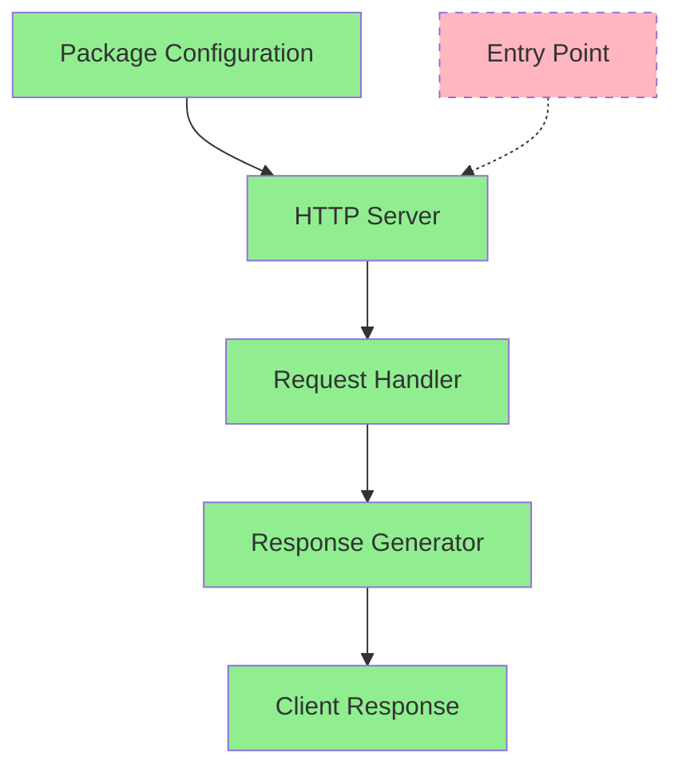
```mermaid
graph TD
    A[HTTP Server] --> B[Request Handler]
    B --> C[Response Generator]
    C --> D[Client Response]
    
    E[Package Configuration] --> A
    F[Entry Point] -.-> A
    
    style F stroke-dasharray: 5 5
    
    classDef implemented fill:#90EE90
    classDef missing fill:#FFB6C1
    
    class A,B,C,D,E implemented
    class F missing
```

#### Core Technical Approach

The system employs a minimalist Node.js architecture:
- **Pure Node.js Implementation**: Utilizes only built-in `http` module
- **CommonJS Module System**: Standard Node.js module loading
- **Synchronous Processing**: Direct request-response handling
- **Hardcoded Configuration**: Fixed hostname (127.0.0.1) and port (3000) settings

### 1.2.3 Success Criteria

#### Measurable Objectives

| Objective | Current Status | Target State |
|-----------|---------------|--------------|
| Backprop Integration | Not Implemented | Functional integration testing |
| Test Coverage | 0% | >90% integration scenarios |
| Server Reliability | Basic HTTP only | Production-ready stability |

#### Critical Success Factors

- **Implementation Completion**: Development of actual backpropagation integration capabilities
- **Test Infrastructure**: Creation of comprehensive test suite
- **Documentation Alignment**: Resolution of naming inconsistencies between README and package.json
- **Entry Point Resolution**: Implementation of missing `index.js` file

#### Key Performance Indicators

- **Integration Test Pass Rate**: Target >95%
- **Response Time**: <100ms for test endpoints
- **System Uptime**: >99.9% during testing cycles
- **Code Coverage**: >90% for core integration paths

## 1.3 SCOPE

### 1.3.1 In-Scope

#### Core Features and Functionalities

**Current Implementation:**
- Basic HTTP server functionality
- Simple request-response handling
- NPM package structure foundation

**Planned Capabilities:**
- Backpropagation algorithm integration testing
- Neural network validation endpoints
- Integration test orchestration
- Performance benchmarking capabilities

#### Primary User Workflows

| Workflow | Description | Current Status |
|----------|-------------|---------------|
| Server Startup | Launch HTTP server for testing | Implemented |
| Basic Health Check | Verify server responsiveness | Implemented |
| Backprop Testing | Execute integration tests | Planned |

#### Essential Integrations

- Node.js runtime environment integration
- HTTP protocol support
- Future machine learning library integrations

#### Key Technical Requirements

- **Runtime**: Node.js v10+ compatibility
- **Network**: Local development server capabilities
- **Protocol**: HTTP/1.1 support
- **Architecture**: CommonJS module support

#### Implementation Boundaries

- **System Boundaries**: Standalone Node.js application
- **User Groups**: Development and testing teams
- **Geographic Coverage**: Local development environments
- **Data Domains**: Test data and backpropagation scenarios

### 1.3.2 Out-of-Scope

#### Explicitly Excluded Features

- **Production Deployment**: System designed for testing environments only
- **External API Integration**: No third-party service connections planned
- **Database Persistence**: No data storage requirements
- **User Authentication**: No security layer implementation
- **Monitoring and Logging**: Beyond basic console output

#### Future Phase Considerations

- **Advanced ML Algorithms**: Beyond basic backpropagation testing
- **Distributed Testing**: Multi-node test execution
- **Web UI**: Graphical interface for test management
- **CI/CD Integration**: Automated pipeline integration

#### Integration Points Not Covered

- **Cloud Services**: AWS, Azure, or GCP integrations
- **Container Orchestration**: Docker or Kubernetes deployment
- **Message Queues**: Asynchronous processing systems
- **External Databases**: PostgreSQL, MongoDB, or similar systems

#### Unsupported Use Cases

- **Production Workloads**: Not designed for production traffic
- **Multi-tenancy**: Single-tenant testing environment only
- **High Availability**: No redundancy or failover capabilities
- **Enterprise Security**: No advanced security features

#### References

- `README.md` - Project identification and purpose declaration
- `package.json` - Package metadata and configuration details
- `package-lock.json` - Dependency tree confirmation
- `server.js` - HTTP server implementation and core functionality
- Web search: "backprop integration testing nodejs" - General integration testing context

# 2. PRODUCT REQUIREMENTS

## 2.1 FEATURE CATALOG

### 2.1.1 HTTP Server Foundation

#### Feature Metadata
| Attribute | Value |
|-----------|-------|
| Feature ID | F-001 |
| Feature Name | HTTP Server Foundation |
| Feature Category | Core Infrastructure |
| Priority Level | Critical |
| Status | Completed |

#### Description
**Overview**: Basic HTTP server infrastructure providing the foundation for all testing operations and API endpoints.

**Business Value**: Enables core communication infrastructure for integration testing scenarios and provides the baseline server capability required for all subsequent testing features.

**User Benefits**: Development teams gain immediate access to a functional web server that can be extended with testing capabilities.

**Technical Context**: Implemented using Node.js built-in `http` module with synchronous request-response handling on localhost:3000.

#### Dependencies
| Dependency Type | Details |
|----------------|---------|
| System Dependencies | Node.js v10+ runtime environment |
| External Dependencies | None (uses only built-in modules) |
| Integration Requirements | CommonJS module system support |

### 2.1.2 Backpropagation Integration Testing

#### Feature Metadata
| Attribute | Value |
|-----------|-------|
| Feature ID | F-002 |
| Feature Name | Backpropagation Integration Testing |
| Feature Category | Core Testing |
| Priority Level | Critical |
| Status | Proposed |

#### Description
**Overview**: Core testing framework for validating backpropagation algorithm integration within Node.js environments.

**Business Value**: Addresses the primary business need for dedicated backpropagation testing capabilities, enabling automated validation of machine learning integration scenarios.

**User Benefits**: Machine learning engineers and development teams can validate algorithm accuracy and integration reliability through automated testing.

**Technical Context**: Will provide specialized endpoints and orchestration capabilities for executing backpropagation test scenarios.

#### Dependencies
| Dependency Type | Details |
|----------------|---------|
| Prerequisite Features | F-001 (HTTP Server Foundation) |
| System Dependencies | Node.js runtime, HTTP protocol support |
| Integration Requirements | Machine learning library compatibility |

### 2.1.3 Neural Network Validation Endpoints

#### Feature Metadata
| Attribute | Value |
|-----------|-------|
| Feature ID | F-003 |
| Feature Name | Neural Network Validation Endpoints |
| Feature Category | API Services |
| Priority Level | High |
| Status | Proposed |

#### Description
**Overview**: Specialized API endpoints for validating neural network implementations and configurations.

**Business Value**: Provides dedicated validation capabilities ensuring neural network integrations meet quality standards.

**User Benefits**: Quality assurance teams can systematically validate neural network implementations through standardized endpoints.

**Technical Context**: REST API endpoints for neural network configuration validation and testing orchestration.

#### Dependencies
| Dependency Type | Details |
|----------------|---------|
| Prerequisite Features | F-001, F-002 |
| System Dependencies | HTTP/1.1 protocol support |
| Integration Requirements | Neural network testing libraries |

### 2.1.4 Integration Test Orchestration

#### Feature Metadata
| Attribute | Value |
|-----------|-------|
| Feature ID | F-004 |
| Feature Name | Integration Test Orchestration |
| Feature Category | Test Management |
| Priority Level | High |
| Status | Proposed |

#### Description
**Overview**: Centralized orchestration system for managing and executing integration test suites.

**Business Value**: Enables coordinated execution of complex integration test scenarios with proper sequencing and dependency management.

**User Benefits**: Development teams can execute comprehensive test suites with automated orchestration and result aggregation.

**Technical Context**: Test runner framework with sequence management and result reporting capabilities.

#### Dependencies
| Dependency Type | Details |
|----------------|---------|
| Prerequisite Features | F-001, F-002, F-003 |
| System Dependencies | Node.js test execution environment |
| Integration Requirements | Test result aggregation systems |

### 2.1.5 Performance Benchmarking

#### Feature Metadata
| Attribute | Value |
|-----------|-------|
| Feature ID | F-005 |
| Feature Name | Performance Benchmarking |
| Feature Category | Performance Testing |
| Priority Level | Medium |
| Status | Proposed |

#### Description
**Overview**: Performance measurement and benchmarking capabilities for backpropagation algorithms and integration scenarios.

**Business Value**: Provides quantitative performance metrics to ensure integration scenarios meet performance requirements.

**User Benefits**: Teams can validate performance characteristics and identify optimization opportunities through systematic benchmarking.

**Technical Context**: Performance measurement endpoints with timing, throughput, and resource utilization metrics.

#### Dependencies
| Dependency Type | Details |
|----------------|---------|
| Prerequisite Features | F-001, F-002 |
| System Dependencies | System performance monitoring APIs |
| Integration Requirements | Performance data collection mechanisms |

### 2.1.6 System Health Monitoring

#### Feature Metadata
| Attribute | Value |
|-----------|-------|
| Feature ID | F-006 |
| Feature Name | System Health Monitoring |
| Feature Category | System Operations |
| Priority Level | Medium |
| Status | Proposed |

#### Description
**Overview**: Basic health monitoring and status reporting for the testing infrastructure.

**Business Value**: Ensures system reliability and uptime targets are maintained during testing cycles.

**User Benefits**: Operations teams can monitor system health and identify issues before they impact testing activities.

**Technical Context**: Health check endpoints and basic system status monitoring.

#### Dependencies
| Dependency Type | Details |
|----------------|---------|
| Prerequisite Features | F-001 |
| System Dependencies | System resource monitoring |
| Integration Requirements | Basic logging and status reporting |

## 2.2 FUNCTIONAL REQUIREMENTS TABLES

### 2.2.1 HTTP Server Foundation (F-001)

| Requirement ID | Description | Acceptance Criteria | Priority |
|----------------|-------------|-------------------|----------|
| F-001-RQ-001 | Basic HTTP server startup | Server starts on localhost:3000 without errors | Must-Have |
| F-001-RQ-002 | Request handling capability | Server responds to HTTP GET requests | Must-Have |
| F-001-RQ-003 | Response generation | Server returns HTTP 200 with content | Must-Have |
| F-001-RQ-004 | Graceful server shutdown | Server closes connections cleanly on termination | Should-Have |

#### Technical Specifications
| Aspect | Details |
|--------|---------|
| Input Parameters | HTTP requests on port 3000 |
| Output/Response | HTTP 200 responses with content |
| Performance Criteria | <100ms response time |
| Data Requirements | No persistent data storage |

#### Validation Rules
| Rule Type | Requirements |
|-----------|-------------|
| Business Rules | Server must be accessible on localhost only |
| Data Validation | HTTP protocol compliance |
| Security Requirements | No authentication required for testing environment |
| Compliance Requirements | HTTP/1.1 protocol standards |

### 2.2.2 Backpropagation Integration Testing (F-002)

| Requirement ID | Description | Acceptance Criteria | Priority |
|----------------|-------------|-------------------|----------|
| F-002-RQ-001 | Test scenario execution | Execute backprop test cases with >95% pass rate | Must-Have |
| F-002-RQ-002 | Algorithm validation | Validate backprop algorithm accuracy | Must-Have |
| F-002-RQ-003 | Integration verification | Verify Node.js integration compatibility | Must-Have |
| F-002-RQ-004 | Error handling | Handle test failures gracefully | Should-Have |

#### Technical Specifications
| Aspect | Details |
|--------|---------|
| Input Parameters | Test configuration and algorithm parameters |
| Output/Response | Test results and validation reports |
| Performance Criteria | >95% test pass rate, <100ms per test |
| Data Requirements | Test data sets and expected results |

#### Validation Rules
| Rule Type | Requirements |
|-----------|-------------|
| Business Rules | All tests must be deterministic and repeatable |
| Data Validation | Input parameters must be validated before testing |
| Security Requirements | No external network access during testing |
| Compliance Requirements | Algorithm accuracy within acceptable tolerance |

### 2.2.3 Neural Network Validation Endpoints (F-003)

| Requirement ID | Description | Acceptance Criteria | Priority |
|----------------|-------------|-------------------|----------|
| F-003-RQ-001 | Validation endpoint availability | Endpoints respond to validation requests | Must-Have |
| F-003-RQ-002 | Configuration validation | Validate neural network configurations | Must-Have |
| F-003-RQ-003 | Result reporting | Return validation results in structured format | Must-Have |
| F-003-RQ-004 | Error diagnostics | Provide detailed error information | Should-Have |

#### Technical Specifications
| Aspect | Details |
|--------|---------|
| Input Parameters | Neural network configuration data |
| Output/Response | Validation results and status codes |
| Performance Criteria | <100ms response time per validation |
| Data Requirements | Configuration schemas and validation rules |

### 2.2.4 Integration Test Orchestration (F-004)

| Requirement ID | Description | Acceptance Criteria | Priority |
|----------------|-------------|-------------------|----------|
| F-004-RQ-001 | Test suite execution | Execute complete test suites in sequence | Must-Have |
| F-004-RQ-002 | Dependency management | Manage test dependencies and prerequisites | Must-Have |
| F-004-RQ-003 | Result aggregation | Aggregate results from multiple test runs | Must-Have |
| F-004-RQ-004 | Progress reporting | Report test execution progress | Should-Have |

#### Technical Specifications
| Aspect | Details |
|--------|---------|
| Input Parameters | Test suite configurations and parameters |
| Output/Response | Aggregated test results and reports |
| Performance Criteria | >90% code coverage, complete suite execution |
| Data Requirements | Test metadata and execution history |

## 2.3 FEATURE RELATIONSHIPS

### 2.3.1 Feature Dependencies Map

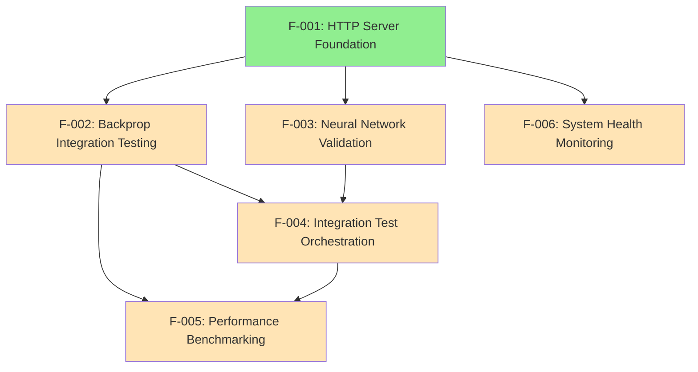
```mermaid
graph TD
    F001[F-001: HTTP Server Foundation] --> F002[F-002: Backprop Integration Testing]
    F001 --> F003[F-003: Neural Network Validation]
    F001 --> F006[F-006: System Health Monitoring]
    
    F002 --> F004[F-004: Integration Test Orchestration]
    F002 --> F005[F-005: Performance Benchmarking]
    F003 --> F004
    
    F004 --> F005
    
    classDef implemented fill:#90EE90
    classDef proposed fill:#FFE4B5
    
    class F001 implemented
    class F002,F003,F004,F005,F006 proposed
```

### 2.3.2 Integration Points

| Feature Pair | Integration Type | Description |
|-------------|------------------|-------------|
| F-001 ↔ F-002 | Foundation | HTTP server provides request handling for testing endpoints |
| F-002 ↔ F-003 | Service | Backprop testing utilizes validation endpoints |
| F-002 ↔ F-004 | Orchestration | Test orchestration manages backprop test execution |
| F-004 ↔ F-005 | Measurement | Orchestration coordinates performance benchmarking |

### 2.3.3 Shared Components

| Component | Used By Features | Purpose |
|-----------|-----------------|---------|
| HTTP Request Handler | F-001, F-002, F-003, F-006 | Process incoming requests |
| Response Generator | F-001, F-002, F-003, F-006 | Format and send responses |
| Configuration Manager | F-002, F-003, F-004 | Manage test configurations |
| Result Aggregator | F-004, F-005 | Collect and process test results |

## 2.4 IMPLEMENTATION CONSIDERATIONS

### 2.4.1 Technical Constraints

| Feature | Constraints |
|---------|-------------|
| F-001 | Must use only Node.js built-in modules |
| F-002 | Must maintain >95% test pass rate requirement |
| F-003 | Must provide <100ms response time |
| F-004 | Must achieve >90% code coverage |
| F-005 | Must operate without external dependencies |
| F-006 | Must maintain >99.9% uptime during test cycles |

### 2.4.2 Performance Requirements

| Performance Metric | Target Value | Feature Impact |
|-------------------|--------------|----------------|
| Integration Test Pass Rate | >95% | F-002, F-004 |
| Response Time | <100ms | F-001, F-002, F-003 |
| System Uptime | >99.9% | F-006 |
| Code Coverage | >90% | F-004 |

### 2.4.3 Scalability Considerations

- **Single Instance Design**: System designed for local development environment use
- **No Horizontal Scaling**: Single-node execution model
- **Resource Constraints**: Must operate within local machine limitations
- **Test Load Management**: Must handle concurrent test execution within single process

### 2.4.4 Security Implications

- **Local Access Only**: No external network exposure required
- **No Authentication**: Testing environment with no authentication layer
- **Data Isolation**: Test data must remain within local environment
- **Process Isolation**: Tests must not interfere with host system

### 2.4.5 Maintenance Requirements

- **Minimal Dependencies**: Reduced maintenance overhead through built-in module usage
- **Self-Contained**: No external service dependencies requiring maintenance
- **Configuration Management**: Simple configuration with minimal external requirements
- **Documentation Updates**: Maintain alignment between README and package.json

## 2.5 TRACEABILITY MATRIX

| Business Requirement | Feature ID | Functional Requirements | Implementation Status |
|---------------------|------------|------------------------|---------------------|
| Basic HTTP Infrastructure | F-001 | F-001-RQ-001 to F-001-RQ-004 | Completed |
| Backprop Testing Capability | F-002 | F-002-RQ-001 to F-002-RQ-004 | Proposed |
| Neural Network Validation | F-003 | F-003-RQ-001 to F-003-RQ-004 | Proposed |
| Test Orchestration | F-004 | F-004-RQ-001 to F-004-RQ-004 | Proposed |
| Performance Benchmarking | F-005 | Performance measurement requirements | Proposed |
| System Health Monitoring | F-006 | Health check requirements | Proposed |

#### References

- `server.js` - Current HTTP server implementation providing foundation for F-001
- `package.json` - Project configuration defining system boundaries and dependencies
- `README.md` - Project purpose documentation establishing backpropagation testing requirements
- Technical Specification Section 1.1 - Executive summary defining business requirements and stakeholder needs
- Technical Specification Section 1.2 - System overview providing architectural context and success criteria
- Technical Specification Section 1.3 - Scope definition establishing in-scope and out-of-scope features
- Web search: "backprop integration testing nodejs" - Integration testing patterns and best practices context

# 3. TECHNOLOGY STACK

The hao-backprop-test project employs a deliberately minimalist technology stack, constrained by specific requirements for zero external dependencies and the use of only Node.js built-in modules. This architectural decision supports the system's role as a lightweight, self-contained machine learning integration testing framework.

## 3.1 PROGRAMMING LANGUAGES

### 3.1.1 Primary Language Selection

**JavaScript (Node.js Runtime)**
- **Version**: Node.js 22.x LTS (Current Active LTS until October 2025)
- **Module System**: CommonJS using `require()` syntax
- **Justification**: Selected for its built-in HTTP server capabilities and minimal runtime overhead
- **Constraints**: Limited to Node.js built-in modules only per technical requirements (F-001, F-005)

The language selection aligns with the system's constraint to operate without external dependencies while providing sufficient capabilities for HTTP server implementation and future machine learning integration testing functionality.

### 3.1.2 Language-Specific Considerations

- **Runtime Environment**: Server-side JavaScript execution
- **Module Resolution**: Standard Node.js CommonJS module system
- **Memory Management**: Automatic garbage collection suitable for testing workloads
- **Compatibility**: Minimum Node.js v10 based on current implementation, recommended Node.js 22.x LTS

## 3.2 FRAMEWORKS & LIBRARIES

### 3.2.1 Core Framework Architecture

**No External Frameworks**
- **Rationale**: System uses only Node.js built-in `http` module for server functionality
- **Implementation**: Direct HTTP server creation using `http.createServer()`
- **Constraints**: Technical requirement F-001 prohibits external framework dependencies
- **Benefits**: 
  - Zero dependency management overhead
  - Minimal attack surface
  - Simplified deployment and maintenance
  - Complete control over request handling

### 3.2.2 Built-in Module Utilization

**Node.js HTTP Module**
- **Purpose**: Core server functionality implementation
- **Usage**: Basic HTTP request/response handling
- **Configuration**: Hardcoded localhost binding (127.0.0.1:3000)
- **Limitations**: No middleware support, routing, or advanced HTTP features

## 3.3 OPEN SOURCE DEPENDENCIES

### 3.3.1 Dependency Strategy

**Zero External Dependencies**
- **Current State**: Empty dependency tree confirmed by package-lock.json
- **Package Management**: npm v7+ (lockfileVersion 3)
- **Constraint Compliance**: Meets requirements F-001 and F-005 for zero external dependencies
- **Maintenance Benefits**: 
  - No security vulnerabilities from third-party packages
  - No version conflict resolution required
  - Simplified testing and deployment processes

### 3.3.2 Dependency Management

**Package Lock Configuration**
- **lockfileVersion**: 3 (npm v7+ compatibility)
- **Dependencies**: Empty object `{}`
- **DevDependencies**: Not present
- **Peer Dependencies**: Not applicable

## 3.4 DEVELOPMENT & DEPLOYMENT

### 3.4.1 Development Environment

**Package Management**
- **Tool**: npm (Node Package Manager)
- **Version**: v7 or later (based on lockfileVersion 3)
- **Configuration**: Standard package.json structure
- **Package Metadata**:
  - Name: hello_world (inconsistent with repository name)
  - Version: 1.0.0
  - License: MIT
  - Author: hxu

### 3.4.2 Build and Execution

**Runtime Execution**
- **Startup Command**: `node server.js`
- **Build Process**: None required (direct JavaScript execution)
- **Entry Point Issue**: package.json references missing `index.js` file
- **Server Binding**: localhost (127.0.0.1) port 3000

### 3.4.3 Testing Infrastructure

**Current Testing State**
- **Test Script**: Placeholder implementation that exits with error
- **Test Framework**: None implemented
- **Coverage Target**: >90% code coverage (requirement F-004)
- **Pass Rate Target**: >95% test pass rate (requirement F-002)

### 3.4.4 Deployment Architecture

**Local Development Model**
- **Target Environment**: Local development machines
- **Network Access**: Localhost only (127.0.0.1)
- **Scalability**: Single-instance design
- **Resource Requirements**: Minimal Node.js runtime footprint

## 3.5 SYSTEM INTEGRATION ARCHITECTURE

### 3.5.1 Current Architecture Diagram

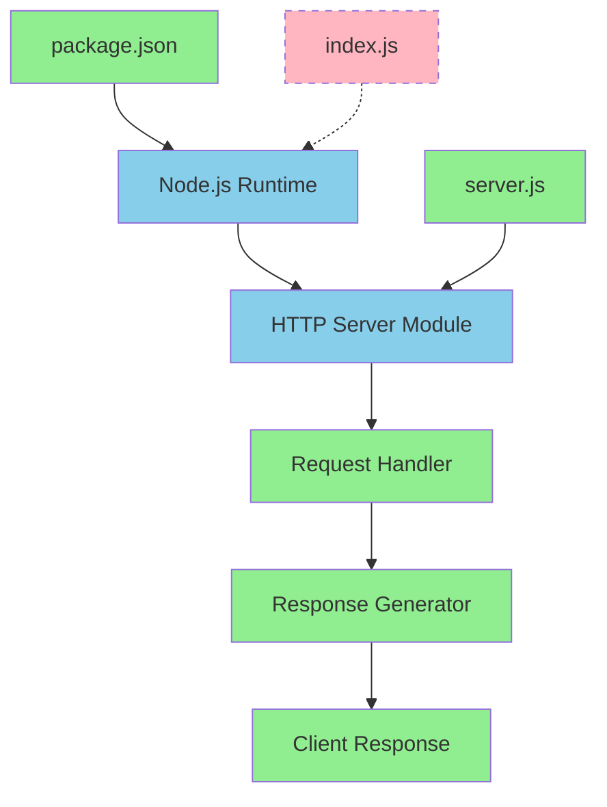
```mermaid
graph TD
    A[Node.js Runtime] --> B[HTTP Server Module]
    B --> C[Request Handler]
    C --> D[Response Generator]
    D --> E[Client Response]
    
    F[package.json] --> A
    G[server.js] --> B
    H[index.js] -.-> A
    
    style H stroke-dasharray: 5 5
    
    classDef implemented fill:#90EE90
    classDef missing fill:#FFB6C1
    classDef builtin fill:#87CEEB
    
    class A,B,C,D,E,F,G implemented
    class H missing
    class A,B builtin
```

### 3.5.2 Technology Stack Maturity Assessment

| Component | Current State | Maturity Level | Gap Analysis |
|-----------|---------------|----------------|--------------|
| HTTP Server | Implemented | Basic | Lacks routing, middleware |
| Package Structure | Partial | Development | Missing entry point |
| Testing Framework | Not Implemented | None | Complete gap |
| ML Integration | Not Implemented | None | Core functionality missing |
| Documentation | Inconsistent | Basic | Naming conflicts present |

### 3.5.3 Performance Characteristics

**Response Time Requirements**
- **Target**: <100ms (requirement F-003)
- **Current Implementation**: Basic synchronous processing
- **Optimization Strategy**: Leverage Node.js event loop efficiency

**Reliability Requirements**
- **Uptime Target**: >99.9% during test cycles (requirement F-006)
- **Current Reliability**: Basic HTTP server stability
- **Monitoring**: No current monitoring infrastructure

## 3.6 TECHNOLOGY EVOLUTION PATH

### 3.6.1 Foundation Phase (Current)
- Basic HTTP server functionality
- Standard Node.js package structure
- Zero external dependencies

### 3.6.2 Implementation Phase (Planned)
- Backpropagation integration testing capabilities
- Comprehensive test suite development
- Resolution of structural inconsistencies

### 3.6.3 Constraint Adherence Strategy

The technology stack maintains strict adherence to project constraints:
- **F-001 Compliance**: Exclusive use of Node.js built-in modules
- **F-005 Compliance**: Zero external dependency architecture
- **Performance Compliance**: Lightweight stack supporting <100ms response times
- **Maintenance Compliance**: Minimal technology surface area for reduced maintenance overhead

#### References

- `package.json` - Project configuration and metadata
- `package-lock.json` - Dependency tree verification and npm version confirmation
- `server.js` - Core HTTP server implementation using Node.js built-in modules
- `README.md` - Project purpose and context documentation
- Technical Specification Section 1.2 - System overview and architectural context
- Technical Specification Section 2.4 - Implementation constraints and performance requirements
- Web search: Node.js LTS versions for current version recommendations
- Web search: npm lockfileVersion compatibility verification

# 4. PROCESS FLOWCHART

## 4.1 SYSTEM WORKFLOWS

### 4.1.1 Core Business Processes

#### Current HTTP Server Workflow (F-001)

The foundational HTTP server workflow represents the only currently implemented process in the system. This workflow establishes the basic communication infrastructure upon which all future testing capabilities will be built.

**Server Initialization Process:**
The system begins with Node.js runtime initialization, loading the built-in HTTP module, and creating a server instance bound to localhost:3000. The server establishes a single request handler function that processes all incoming HTTP requests uniformly. During startup, the system validates the hostname (127.0.0.1) and port (3000) configuration before beginning to listen for connections. Upon successful startup, the server logs confirmation messages to the console indicating readiness to accept requests.

**Request Processing Workflow:**
All incoming HTTP requests follow an identical processing pattern regardless of request method, headers, or body content. The server receives the request, immediately sets the response status code to 200 (OK), configures the Content-Type header to 'text/plain', writes the static response body "Hello, World!\n", and terminates the response stream. This synchronous processing approach ensures predictable response times while maintaining simplicity in the current implementation.

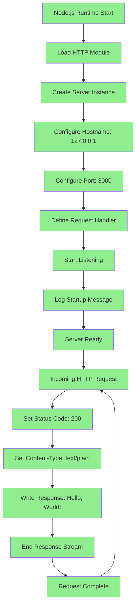
```mermaid
flowchart TD
    A[Node.js Runtime Start] --> B[Load HTTP Module]
    B --> C[Create Server Instance]
    C --> D[Configure Hostname: 127.0.0.1]
    D --> E[Configure Port: 3000]
    E --> F[Define Request Handler]
    F --> G[Start Listening]
    G --> H[Log Startup Message]
    H --> I[Server Ready]
    
    I --> J[Incoming HTTP Request]
    J --> K[Set Status Code: 200]
    K --> L[Set Content-Type: text/plain]
    L --> M[Write Response: Hello, World!]
    M --> N[End Response Stream]
    N --> O[Request Complete]
    O --> J
    
    classDef implemented fill:#90EE90
    classDef process fill:#87CEEB
    
    class A,B,C,D,E,F,G,H,I,J,K,L,M,N,O implemented
```

#### Proposed Backpropagation Testing Workflow (F-002)

The backpropagation integration testing workflow represents the core business process for validating machine learning algorithm implementations. This workflow will build upon the HTTP server foundation to provide specialized testing capabilities with stringent performance and accuracy requirements.

**Test Execution Process:**
Test scenarios begin with configuration validation, ensuring all algorithm parameters meet specified criteria before execution. The system loads test datasets, initializes backpropagation algorithm instances, and executes test cases sequentially to maintain deterministic results. Each test case processes input data through the algorithm, compares results against expected outputs within acceptable tolerance levels, and records pass/fail status. The workflow maintains a >95% pass rate requirement through comprehensive error handling and retry mechanisms for transient failures.

**Validation and Reporting Workflow:**
Upon completion of individual test cases, the system aggregates results and performs accuracy validation across the entire test suite. The workflow calculates performance metrics including execution time, memory utilization, and algorithm convergence rates. Results undergo final validation against business rules before generating structured reports containing detailed test outcomes, performance characteristics, and any diagnostic information for failed test cases.

#### Proposed Neural Network Validation Workflow (F-003)

The neural network validation workflow provides quality assurance capabilities for neural network implementations through dedicated API endpoints. This workflow ensures comprehensive validation of network configurations and architectures before deployment in production testing scenarios.

**Configuration Validation Process:**
Incoming validation requests undergo initial format verification to ensure compliance with expected schema definitions. The system validates neural network architecture parameters including layer configurations, activation functions, and weight initialization strategies. Configuration validation includes verification of input/output dimensions, network topology consistency, and parameter value ranges. Any configuration errors result in immediate rejection with detailed diagnostic information provided to the requesting client.

**Network Testing and Response Generation:**
Valid configurations proceed through comprehensive testing including architecture compatibility checks, parameter consistency validation, and basic functionality verification. The system executes lightweight test cases to verify network initialization and basic operations complete successfully. Results compilation includes validation status, detailed configuration analysis, and performance characteristics measured during validation testing. Response generation formats all validation results in structured JSON format with appropriate HTTP status codes for programmatic consumption.

### 4.1.2 Integration Workflows

#### Test Orchestration Integration (F-004)

The integration test orchestration workflow coordinates complex test suite execution across multiple system components while managing dependencies and ensuring proper sequencing. This workflow serves as the central coordination mechanism for comprehensive system testing scenarios.

**Suite Initialization and Dependency Management:**
Test orchestration begins with comprehensive dependency analysis, ensuring all prerequisite features (F-001, F-002, F-003) are available and functioning correctly. The system loads test suite configurations, validates test dependencies, and establishes execution order based on prerequisite relationships. Resource allocation includes memory management, concurrent execution limits, and timeout configuration for individual test components.

**Coordinated Execution and Result Aggregation:**
The orchestration engine manages sequential execution of test suites while monitoring system resources and maintaining performance within specified limits. Progress reporting provides real-time status updates throughout execution cycles. Result aggregation combines outcomes from backpropagation testing, neural network validation, and performance benchmarking into comprehensive reports with >90% code coverage verification and detailed traceability mapping.

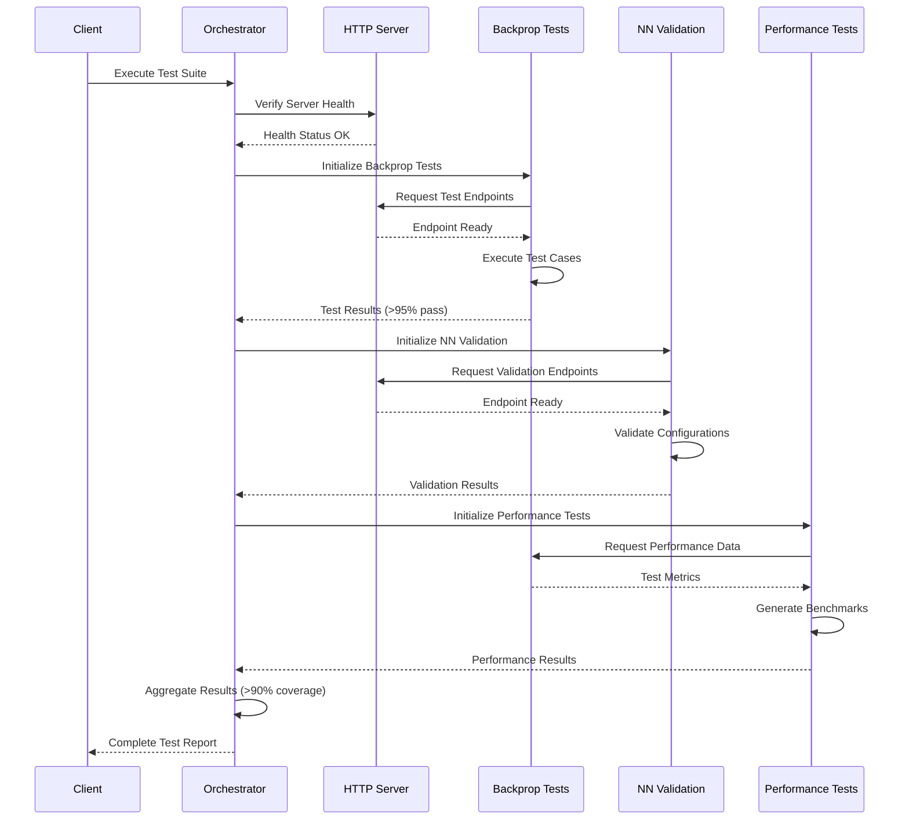
```mermaid
sequenceDiagram
    participant C as Client
    participant O as Orchestrator
    participant H as HTTP Server
    participant B as Backprop Tests
    participant N as NN Validation
    participant P as Performance Tests
    
    C->>O: Execute Test Suite
    O->>H: Verify Server Health
    H-->>O: Health Status OK
    
    O->>B: Initialize Backprop Tests
    B->>H: Request Test Endpoints
    H-->>B: Endpoint Ready
    B->>B: Execute Test Cases
    B-->>O: Test Results (>95% pass)
    
    O->>N: Initialize NN Validation
    N->>H: Request Validation Endpoints
    H-->>N: Endpoint Ready
    N->>N: Validate Configurations
    N-->>O: Validation Results
    
    O->>P: Initialize Performance Tests
    P->>B: Request Performance Data
    B-->>P: Test Metrics
    P->>P: Generate Benchmarks
    P-->>O: Performance Results
    
    O->>O: Aggregate Results (>90% coverage)
    O-->>C: Complete Test Report
```

#### Performance Benchmarking Integration (F-005)

The performance benchmarking integration workflow provides quantitative performance measurement capabilities across all system components while maintaining strict timing and resource utilization requirements.

**Measurement Coordination Workflow:**
Performance benchmarking coordinates with active test execution to capture comprehensive performance metrics without interfering with test operations. The system establishes baseline measurements during system initialization, monitors resource utilization during test execution, and captures detailed timing information for all critical operations. Measurement data includes response times (<100ms requirement), memory usage patterns, and CPU utilization across test scenarios.

**Benchmark Analysis and Reporting:**
Performance data undergoes statistical analysis to identify performance trends, bottlenecks, and optimization opportunities. The system generates comparative analyses against established performance targets, highlights deviations from expected performance characteristics, and provides detailed recommendations for performance improvements. Benchmark reports integrate with test orchestration results to provide comprehensive system performance profiles.

## 4.2 FLOWCHART REQUIREMENTS

### 4.2.1 Process Step Documentation

#### Start and End Points Definition

**System Startup Sequence:**
All workflows begin with Node.js runtime initialization and HTTP server startup verification. The system validates configuration parameters, establishes network listeners, and confirms readiness before accepting any processing requests. Startup completion triggers automated health checks and system status reporting to ensure all components are operational.

**Graceful Shutdown Procedures:**
Process termination follows controlled shutdown sequences ensuring all active requests complete processing before server closure. The system preserves test state information, saves execution logs, and releases all system resources cleanly. Shutdown procedures include final health status reporting and confirmation of clean resource deallocation.

#### Decision Points and Business Rules

**Test Execution Decision Matrix:**
Critical decision points throughout test execution workflows include configuration validation checkpoints, test result evaluation criteria, and error recovery decision trees. The system evaluates test pass rates against the >95% requirement threshold at multiple stages, triggering retry mechanisms or escalation procedures based on failure patterns and severity levels.

**Performance Validation Checkpoints:**
Response time monitoring occurs at every request processing stage with automatic workflow termination if the <100ms requirement cannot be maintained. The system implements adaptive load management to prevent performance degradation during concurrent test execution scenarios.

#### Error States and Recovery Paths

**Systematic Error Handling:**
Comprehensive error handling covers network connectivity failures, algorithm execution errors, configuration validation failures, and resource exhaustion scenarios. Each error category includes specific recovery procedures, retry mechanisms with exponential backoff, and escalation paths for persistent failures.

**Recovery Procedure Implementation:**
Error recovery workflows include automatic retry for transient failures, graceful degradation for partial system failures, and complete system restart procedures for critical errors. All recovery actions maintain system state consistency and preserve test execution context whenever possible.

### 4.2.2 System Boundaries and User Touchpoints

#### System Integration Boundaries

The system operates within clearly defined boundaries encompassing localhost-only access, Node.js runtime constraints, and local resource limitations. External integration points are explicitly prohibited to maintain security and performance isolation requirements.

**User Interaction Points:**
Primary user touchpoints include HTTP request interfaces for test execution, configuration management endpoints for system setup, and result retrieval mechanisms for test outcome analysis. All user interactions follow REST API conventions with standardized request/response formats and comprehensive error reporting.

**Authorization and Security Checkpoints:**
The system implements no authentication mechanisms in the current testing environment configuration, focusing on functional validation rather than security enforcement. All security considerations center on process isolation and local resource protection rather than access control mechanisms.

## 4.3 TECHNICAL IMPLEMENTATION

### 4.3.1 State Management Architecture

#### State Transition Workflows

The system maintains minimal state information focusing on test execution status, configuration parameters, and result aggregation data. State transitions follow predictable patterns from initialization through test execution to result reporting and system cleanup.

**Configuration State Management:**
Configuration data flows from initial system setup through test execution phases with validation checkpoints at each transition. The system maintains configuration consistency through immutable parameter handling and version control for test scenario definitions.

**Test Execution State Tracking:**
Test execution state includes current test case status, progress indicators, and intermediate result storage. State persistence ensures test continuation after transient failures while maintaining result integrity throughout extended test execution cycles.

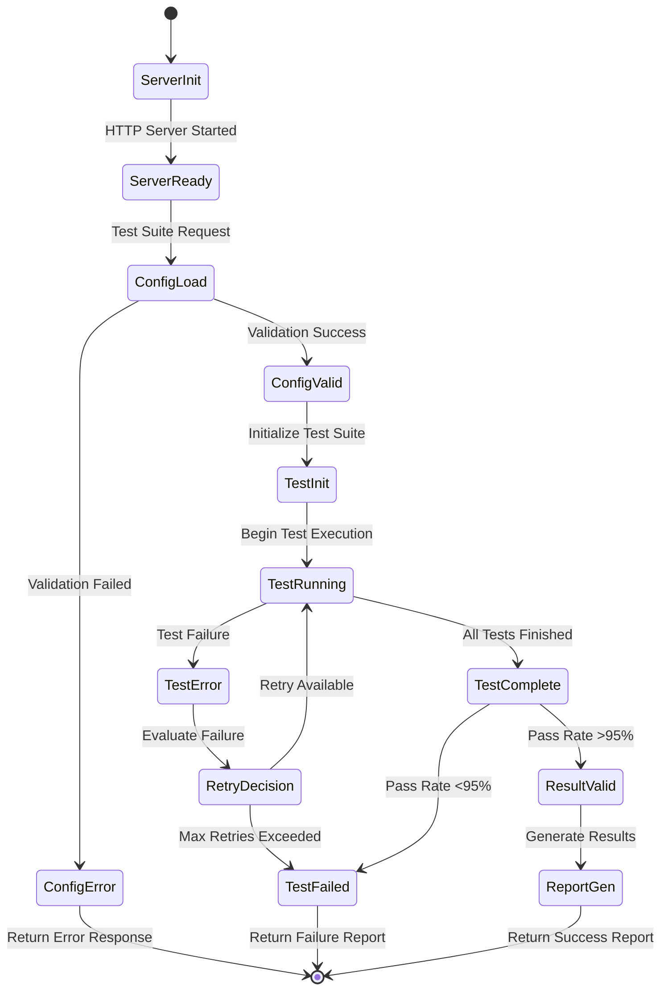
```mermaid
stateDiagram-v2
    [*] --> ServerInit
    ServerInit --> ServerReady: HTTP Server Started
    ServerReady --> ConfigLoad: Test Suite Request
    ConfigLoad --> ConfigValid: Validation Success
    ConfigLoad --> ConfigError: Validation Failed
    ConfigError --> [*]: Return Error Response
    
    ConfigValid --> TestInit: Initialize Test Suite
    TestInit --> TestRunning: Begin Test Execution
    TestRunning --> TestComplete: All Tests Finished
    TestRunning --> TestError: Test Failure
    
    TestError --> RetryDecision: Evaluate Failure
    RetryDecision --> TestRunning: Retry Available
    RetryDecision --> TestFailed: Max Retries Exceeded
    
    TestComplete --> ResultValid: Pass Rate >95%
    TestComplete --> TestFailed: Pass Rate <95%
    TestFailed --> [*]: Return Failure Report
    
    ResultValid --> ReportGen: Generate Results
    ReportGen --> [*]: Return Success Report
```

#### Data Persistence and Caching

**Transient Data Management:**
The current implementation maintains no persistent data storage, operating entirely through in-memory processing for maximum performance and simplicity. All test data, configuration parameters, and results exist only during active execution cycles without long-term storage requirements.

**Caching Strategy Implementation:**
Future caching implementations will focus on test configuration caching, result template caching, and performance metric caching to optimize response times while maintaining the <100ms performance requirement. Cache invalidation strategies will ensure data consistency across test execution cycles.

#### Transaction Boundaries and Consistency

**Request-Response Transaction Scope:**
Each HTTP request constitutes a complete transaction boundary with atomic success or failure outcomes. Transaction scope includes request validation, processing execution, result generation, and response delivery as indivisible units of work.

**Test Suite Transaction Management:**
Complex test suite execution implements nested transaction boundaries with rollback capabilities for partial failures and progress preservation for successful intermediate results. Transaction isolation ensures concurrent test execution scenarios maintain data consistency and result integrity.

### 4.3.2 Error Handling and Recovery Systems

#### Comprehensive Error Detection

**Runtime Error Monitoring:**
The system implements comprehensive error detection covering HTTP protocol errors, algorithm execution failures, configuration validation errors, and system resource constraints. Error detection occurs at multiple system layers with appropriate error categorization and severity assessment.

**Performance Threshold Monitoring:**
Continuous monitoring of response times, memory utilization, and CPU usage provides early warning for performance degradation. Automatic error generation occurs when performance metrics exceed acceptable thresholds, triggering preventive error handling procedures.

#### Retry Mechanisms and Fallback Procedures

**Intelligent Retry Strategy:**
Error recovery implements exponential backoff retry mechanisms for transient failures with maximum retry limits to prevent infinite retry loops. Retry decisions consider error type, failure frequency, and system resource availability to optimize recovery success rates.

**Graceful Degradation Implementation:**
System fallback procedures provide partial functionality during component failures while maintaining core system operation. Degradation strategies prioritize critical functionality preservation over feature completeness during error recovery periods.

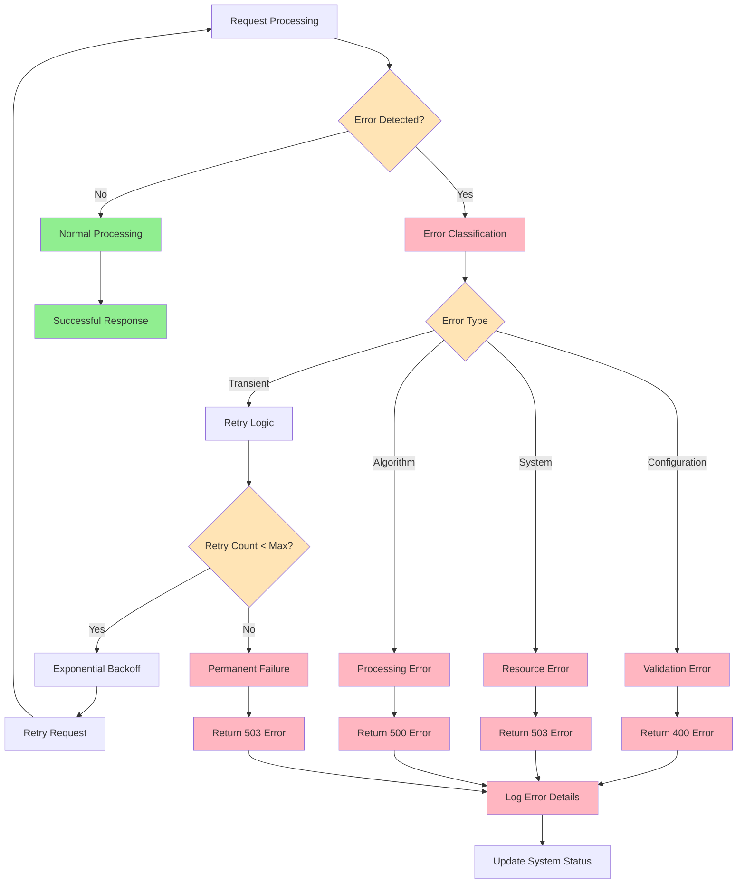
```mermaid
flowchart TD
    A[Request Processing] --> B{Error Detected?}
    B -->|No| C[Normal Processing]
    B -->|Yes| D[Error Classification]
    
    D --> E{Error Type}
    E -->|Transient| F[Retry Logic]
    E -->|Configuration| G[Validation Error]
    E -->|System| H[Resource Error]
    E -->|Algorithm| I[Processing Error]
    
    F --> J{Retry Count < Max?}
    J -->|Yes| K[Exponential Backoff]
    K --> L[Retry Request]
    L --> A
    J -->|No| M[Permanent Failure]
    
    G --> N[Return 400 Error]
    H --> O[Return 503 Error]
    I --> P[Return 500 Error]
    M --> Q[Return 503 Error]
    
    C --> R[Successful Response]
    N --> S[Log Error Details]
    O --> S
    P --> S
    Q --> S
    S --> T[Update System Status]
    
    classDef error fill:#FFB6C1
    classDef success fill:#90EE90
    classDef decision fill:#FFE4B5
    
    class D,G,H,I,M,N,O,P,Q,S error
    class C,R success
    class B,E,J decision
```

#### Error Notification and Recovery Reporting

**Comprehensive Error Reporting:**
Error notification systems provide detailed diagnostic information including error context, system state at failure time, and recommended recovery actions. Error reports include sufficient detail for root cause analysis and system improvement planning.

**Recovery Progress Monitoring:**
Recovery procedures include progress reporting and success confirmation mechanisms to verify complete error resolution. Recovery monitoring ensures system stability restoration and prevents recurring error conditions through systematic root cause elimination.

## 4.4 REQUIRED DIAGRAMS

### 4.4.1 High-Level System Workflow


```mermaid
flowchart TD
    subgraph "Current Implementation"
        A[HTTP Server Start] --> B[Listen on localhost:3000]
        B --> C[Receive Request]
        C --> D[Generate Response]
        D --> E[Send Hello World]
        E --> F[Request Complete]
        F --> C
    end
    
    subgraph "Proposed System Workflow"
        G[System Initialization] --> H[Load Configuration]
        H --> I[Start HTTP Server]
        I --> J[Initialize Test Framework]
        J --> K[Ready for Requests]
        
        K --> L{Request Type}
        L -->|Health Check| M[System Health Monitor]
        L -->|Test Execution| N[Test Orchestration]
        L -->|Validation| O[NN Validation]
        L -->|Performance| P[Benchmarking]
        
        M --> Q[Health Status Response]
        N --> R[Execute Test Suite]
        O --> S[Validate Configuration]
        P --> T[Generate Benchmarks]
        
        R --> U[Aggregate Results]
        S --> V[Validation Report]
        T --> W[Performance Report]
        
        U --> X[Test Results Response]
        V --> Y[Validation Response]
        W --> Z[Benchmark Response]
        
        Q --> K
        X --> K
        Y --> K
        Z --> K
    end
    
    classDef implemented fill:#90EE90
    classDef proposed fill:#FFE4B5
    classDef process fill:#87CEEB
    
    class A,B,C,D,E,F implemented
    class G,H,I,J,K,L,M,N,O,P,Q,R,S,T,U,V,W,X,Y,Z proposed
```

### 4.4.2 Detailed Backpropagation Testing Flow

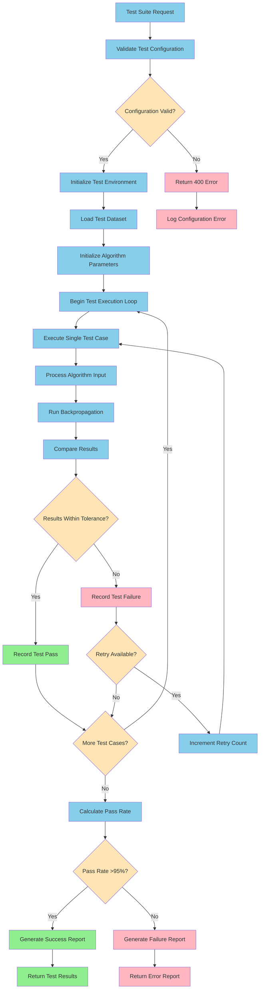
```mermaid
flowchart TD
    A[Test Suite Request] --> B[Validate Test Configuration]
    B --> C{Configuration Valid?}
    C -->|No| D[Return 400 Error]
    C -->|Yes| E[Initialize Test Environment]
    
    E --> F[Load Test Dataset]
    F --> G[Initialize Algorithm Parameters]
    G --> H[Begin Test Execution Loop]
    
    H --> I[Execute Single Test Case]
    I --> J[Process Algorithm Input]
    J --> K[Run Backpropagation]
    K --> L[Compare Results]
    L --> M{Results Within Tolerance?}
    
    M -->|Yes| N[Record Test Pass]
    M -->|No| O[Record Test Failure]
    
    N --> P{More Test Cases?}
    O --> Q{Retry Available?}
    Q -->|Yes| R[Increment Retry Count]
    R --> I
    Q -->|No| P
    
    P -->|Yes| H
    P -->|No| S[Calculate Pass Rate]
    
    S --> T{Pass Rate >95%?}
    T -->|Yes| U[Generate Success Report]
    T -->|No| V[Generate Failure Report]
    
    U --> W[Return Test Results]
    V --> X[Return Error Report]
    D --> Y[Log Configuration Error]
    
    classDef success fill:#90EE90
    classDef error fill:#FFB6C1
    classDef decision fill:#FFE4B5
    classDef process fill:#87CEEB
    
    class U,W,N success
    class D,O,V,X,Y error
    class C,M,Q,P,T decision
    class A,B,E,F,G,H,I,J,K,L,R,S process
```

### 4.4.3 Error Handling and Recovery Flowchart

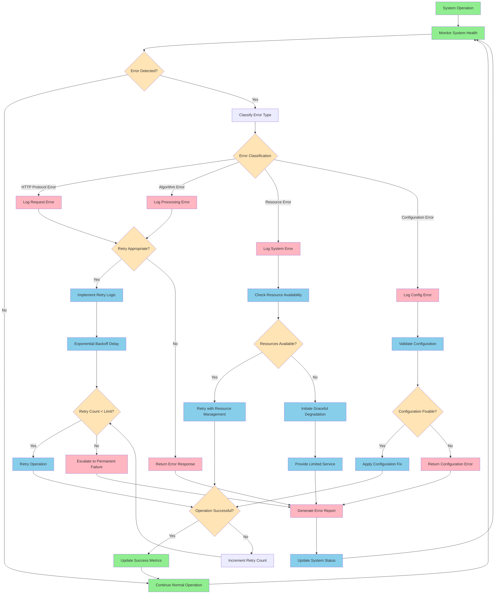
```mermaid
flowchart TD
    A[System Operation] --> B[Monitor System Health]
    B --> C{Error Detected?}
    C -->|No| D[Continue Normal Operation]
    D --> B
    
    C -->|Yes| E[Classify Error Type]
    E --> F{Error Classification}
    
    F -->|HTTP Protocol Error| G[Log Request Error]
    F -->|Algorithm Error| H[Log Processing Error]
    F -->|Resource Error| I[Log System Error]
    F -->|Configuration Error| J[Log Config Error]
    
    G --> K{Retry Appropriate?}
    H --> K
    I --> L[Check Resource Availability]
    J --> M[Validate Configuration]
    
    K -->|Yes| N[Implement Retry Logic]
    K -->|No| O[Return Error Response]
    
    N --> P[Exponential Backoff Delay]
    P --> Q{Retry Count < Limit?}
    Q -->|Yes| R[Retry Operation]
    Q -->|No| S[Escalate to Permanent Failure]
    
    R --> T{Operation Successful?}
    T -->|Yes| U[Update Success Metrics]
    T -->|No| V[Increment Retry Count]
    V --> Q
    
    L --> W{Resources Available?}
    W -->|Yes| X[Retry with Resource Management]
    W -->|No| Y[Initiate Graceful Degradation]
    
    M --> Z{Configuration Fixable?}
    Z -->|Yes| AA[Apply Configuration Fix]
    Z -->|No| BB[Return Configuration Error]
    
    X --> T
    Y --> CC[Provide Limited Service]
    AA --> T
    
    U --> D
    S --> DD[Generate Error Report]
    O --> DD
    BB --> DD
    CC --> DD
    DD --> EE[Update System Status]
    EE --> B
    
    classDef normal fill:#90EE90
    classDef error fill:#FFB6C1
    classDef decision fill:#FFE4B5
    classDef recovery fill:#87CEEB
    
    class A,B,D,U normal
    class G,H,I,J,O,S,BB,DD error
    class C,F,K,Q,T,W,Z decision
    class N,P,R,L,M,X,Y,AA,CC,EE recovery
```

### 4.4.4 Integration Sequence Diagram

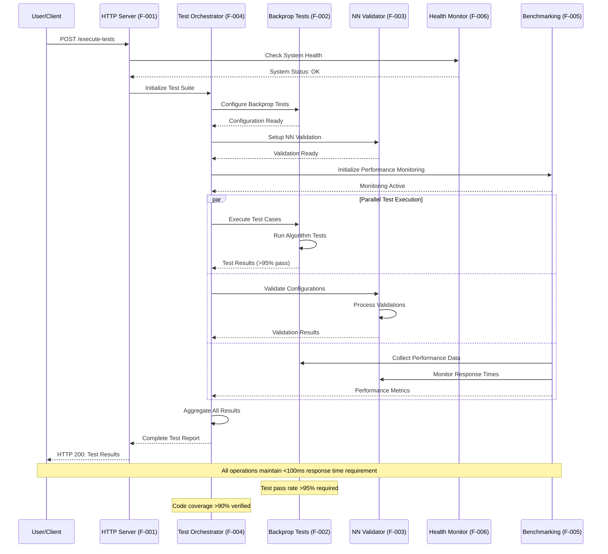
```mermaid
sequenceDiagram
    participant User as User/Client
    participant Server as HTTP Server (F-001)
    participant Orchestrator as Test Orchestrator (F-004)
    participant BackProp as Backprop Tests (F-002)
    participant Validator as NN Validator (F-003)
    participant Monitor as Health Monitor (F-006)
    participant Benchmark as Benchmarking (F-005)
    
    User->>Server: POST /execute-tests
    Server->>Monitor: Check System Health
    Monitor-->>Server: System Status: OK
    
    Server->>Orchestrator: Initialize Test Suite
    Orchestrator->>BackProp: Configure Backprop Tests
    BackProp-->>Orchestrator: Configuration Ready
    
    Orchestrator->>Validator: Setup NN Validation
    Validator-->>Orchestrator: Validation Ready
    
    Orchestrator->>Benchmark: Initialize Performance Monitoring
    Benchmark-->>Orchestrator: Monitoring Active
    
    par Parallel Test Execution
        Orchestrator->>BackProp: Execute Test Cases
        BackProp->>BackProp: Run Algorithm Tests
        BackProp-->>Orchestrator: Test Results (>95% pass)
    and
        Orchestrator->>Validator: Validate Configurations
        Validator->>Validator: Process Validations
        Validator-->>Orchestrator: Validation Results
    and
        Benchmark->>BackProp: Collect Performance Data
        Benchmark->>Validator: Monitor Response Times
        Benchmark-->>Orchestrator: Performance Metrics
    end
    
    Orchestrator->>Orchestrator: Aggregate All Results
    Orchestrator-->>Server: Complete Test Report
    Server-->>User: HTTP 200: Test Results
    
    Note over User,Benchmark: All operations maintain <100ms response time requirement
    Note over BackProp: Test pass rate >95% required
    Note over Orchestrator: Code coverage >90% verified
```

### 4.4.5 State Transition Diagram for Test Execution

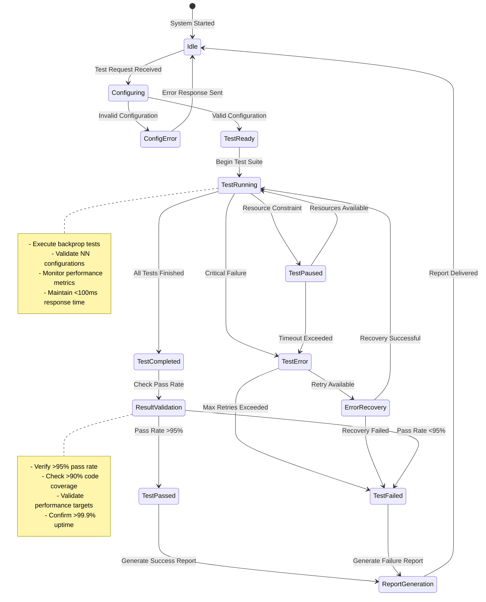
```mermaid
stateDiagram-v2
    [*] --> Idle: System Started
    
    Idle --> Configuring: Test Request Received
    Configuring --> ConfigError: Invalid Configuration
    Configuring --> TestReady: Valid Configuration
    
    ConfigError --> Idle: Error Response Sent
    
    TestReady --> TestRunning: Begin Test Suite
    TestRunning --> TestPaused: Resource Constraint
    TestRunning --> TestError: Critical Failure
    TestRunning --> TestCompleted: All Tests Finished
    
    TestPaused --> TestRunning: Resources Available
    TestPaused --> TestError: Timeout Exceeded
    
    TestError --> ErrorRecovery: Retry Available
    TestError --> TestFailed: Max Retries Exceeded
    
    ErrorRecovery --> TestRunning: Recovery Successful
    ErrorRecovery --> TestFailed: Recovery Failed
    
    TestCompleted --> ResultValidation: Check Pass Rate
    ResultValidation --> TestPassed: Pass Rate >95%
    ResultValidation --> TestFailed: Pass Rate <95%
    
    TestPassed --> ReportGeneration: Generate Success Report
    TestFailed --> ReportGeneration: Generate Failure Report
    
    ReportGeneration --> Idle: Report Delivered
    
    note right of TestRunning
        - Execute backprop tests
        - Validate NN configurations
        - Monitor performance metrics
        - Maintain <100ms response time
    end note
    
    note right of ResultValidation
        - Verify >95% pass rate
        - Check >90% code coverage
        - Validate performance targets
        - Confirm >99.9% uptime
    end note
```

## 4.5 TIMING AND SLA CONSIDERATIONS

### 4.5.1 Performance Requirements Integration

**Response Time Constraints:**
All system workflows must maintain response times under 100ms as specified in functional requirements F-001, F-002, and F-003. Performance monitoring occurs continuously throughout request processing with automatic workflow termination if timing constraints cannot be satisfied. The system implements performance budgeting across all process steps to ensure cumulative response times remain within acceptable limits.

**Throughput and Concurrency Management:**
While the current implementation processes requests sequentially, future enhancements must consider concurrent request handling while maintaining performance requirements. Resource allocation strategies will prevent system overload during peak testing periods while ensuring consistent response time performance across all supported workflows.

### 4.5.2 Reliability and Uptime Requirements

**System Availability Targets:**
The system maintains >99.9% uptime requirement during test cycles as specified in F-006 requirements. Uptime monitoring includes comprehensive health checking, automated failure detection, and rapid recovery procedures to minimize service disruption during critical testing periods.

**Test Execution Reliability:**
Backpropagation testing workflows must achieve >95% test pass rates while maintaining system stability throughout extended test execution cycles. Reliability mechanisms include comprehensive error handling, automatic retry procedures, and graceful degradation capabilities to maintain service availability during partial system failures.

#### References

#### Files and Folders Examined
- `server.js` - Current HTTP server implementation providing basic request-response functionality
- `package.json` - Package configuration defining project structure and entry points
- `README.md` - Project documentation with system overview and setup instructions

#### Technical Specification Sections Referenced
- **2.1 FEATURE CATALOG** - Comprehensive feature descriptions for F-001 through F-006 including metadata, dependencies, and technical context
- **2.2 FUNCTIONAL REQUIREMENTS TABLES** - Detailed requirements, acceptance criteria, and technical specifications for each feature
- **2.3 FEATURE RELATIONSHIPS** - Feature dependency mapping, integration points, and shared component analysis
- **2.4 IMPLEMENTATION CONSIDERATIONS** - Technical constraints, performance requirements, and security implications
- **3.5 SYSTEM INTEGRATION ARCHITECTURE** - Current architecture assessment, technology stack maturity, and performance characteristics

# 5. SYSTEM ARCHITECTURE

## 5.1 HIGH-LEVEL ARCHITECTURE

### 5.1.1 System Overview

The hao-backprop-test system follows a **lightweight monolithic architecture** designed specifically for machine learning integration testing within Node.js environments. The architectural approach prioritizes **simplicity and minimal dependencies**, utilizing only Node.js built-in modules to ensure deployment flexibility and eliminate external dependency conflicts.

The system's **evolutionary architecture style** begins with a foundational HTTP server implementation and is designed to incrementally support specialized machine learning testing capabilities. The current architecture represents the **Minimum Viable Infrastructure (MVI)** phase, providing basic HTTP communication primitives that serve as the foundation for all future testing operations.

**Key Architectural Principles:**
- **Zero External Dependencies**: Exclusive use of Node.js built-in modules ensures environment isolation and eliminates dependency management overhead
- **Incremental Enhancement**: Architecture supports progressive feature addition without breaking existing functionality
- **Testing-First Design**: All components are designed to support comprehensive integration testing scenarios
- **Performance Optimization**: Synchronous request processing leverages Node.js event loop efficiency for <100ms response time requirements

**System Boundaries and Major Interfaces:**
The system operates within a clearly defined boundary encompassing HTTP-based API services for backpropagation testing, neural network validation, and performance benchmarking. Primary interfaces include RESTful API endpoints for client interactions, internal component communication through direct function calls, and system monitoring interfaces for health status reporting.

### 5.1.2 Core Components Table

| Component Name | Primary Responsibility | Key Dependencies | Integration Points |
|----------------|----------------------|------------------|-------------------|
| HTTP Server Foundation | Basic web server infrastructure and request routing | Node.js http module, CommonJS loader | Client API access, internal service communication |
| Backpropagation Test Engine | ML algorithm integration testing and validation | HTTP Server Foundation | Neural network validation, performance measurement |
| Neural Network Validator | NN configuration and architecture validation | HTTP Server, Test Engine | Test orchestration, quality assurance reporting |
| Performance Benchmarking System | Quantitative performance measurement and analysis | All core components | Test orchestration, system monitoring |

### 5.1.3 Data Flow Description

**Primary Data Flows:**
The system's data flow architecture centers on **request-response cycles** initiated by HTTP clients and processed through specialized testing components. Test data originates from client requests containing machine learning configurations, flows through validation layers, executes within testing engines, and returns structured results with performance metrics.

**Integration Patterns:**
Component integration follows a **hierarchical dependency pattern** where the HTTP Server Foundation provides base infrastructure, specialized testing components build upon this foundation, and orchestration services coordinate complex multi-component workflows. All integration utilizes **synchronous communication patterns** to ensure deterministic test execution and reliable result correlation.

**Data Transformation Points:**
Key transformation occurs at validation boundaries where raw client configurations convert to validated test parameters, at testing interfaces where configurations transform into executable test scenarios, and at reporting boundaries where internal test results convert to structured client responses with comprehensive performance metrics.

**Key Data Stores:**
The current architecture operates **stateless** with no persistent data storage, relying on in-memory processing for all test operations. Future enhancements may introduce temporary result caching and test configuration persistence to support complex orchestration scenarios.

### 5.1.4 External Integration Points

| System Name | Integration Type | Data Exchange Pattern | Protocol/Format |
|-------------|------------------|----------------------|-----------------|
| Client Testing Applications | API Consumer | Request/Response | HTTP/1.1 with JSON payloads |
| Machine Learning Libraries | Service Integration | Function Calls | JavaScript module imports |
| Performance Monitoring Tools | Data Provider | Metrics Export | JSON-formatted performance data |
| Development Environments | Service Consumer | Test Result Consumption | HTTP API with structured reports |

## 5.2 COMPONENT DETAILS

### 5.2.1 HTTP Server Foundation (F-001)

**Purpose and Responsibilities:**
The HTTP Server Foundation serves as the core infrastructure component providing basic web server capabilities and establishing the communication foundation for all system operations. This component implements the minimal viable server infrastructure required to support HTTP-based API endpoints while maintaining the constraint of zero external dependencies.

**Technologies and Frameworks:**
- **Node.js Built-in HTTP Module**: Direct server implementation using `http.createServer()`
- **CommonJS Module System**: Standard Node.js module loading and resolution
- **Synchronous Request Processing**: Direct callback-based request handling for predictable performance

**Key Interfaces and APIs:**
The component exposes a single HTTP endpoint on localhost:3000 that processes all incoming requests uniformly. Current implementation returns static "Hello, World!" responses but is designed to support future routing and specialized endpoint implementation for testing operations.

**Data Persistence Requirements:**
No persistent data storage is required for the foundational component. All operations maintain stateless processing to ensure scalability and deployment simplicity.

**Scaling Considerations:**
The foundation supports vertical scaling through Node.js event loop optimization and can accommodate horizontal scaling through multiple process instantiation when testing load requires distributed execution.

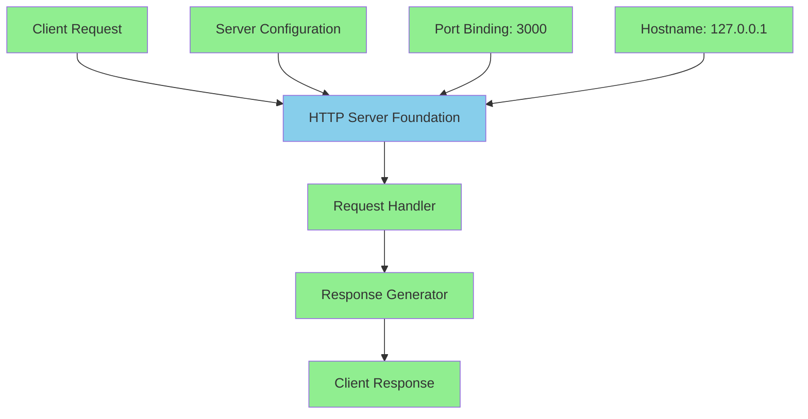
```mermaid
graph TD
    A[Client Request] --> B[HTTP Server Foundation]
    B --> C[Request Handler]
    C --> D[Response Generator]
    D --> E[Client Response]
    
    F[Server Configuration] --> B
    G[Port Binding: 3000] --> B
    H[Hostname: 127.0.0.1] --> B
    
    classDef foundation fill:#87CEEB
    classDef implemented fill:#90EE90
    
    class B foundation
    class A,C,D,E,F,G,H implemented
```

### 5.2.2 Backpropagation Test Engine (F-002)

**Purpose and Responsibilities:**
The Backpropagation Test Engine provides specialized testing capabilities for validating machine learning algorithm integration within Node.js environments. This component coordinates test scenario execution, maintains >95% pass rate requirements, and provides comprehensive validation of algorithm accuracy and integration reliability.

**Technologies and Frameworks:**
- **Node.js Built-in Modules**: Utilizes only standard library components for algorithm testing
- **HTTP Foundation Integration**: Builds upon existing server infrastructure for API endpoint provision
- **Memory-Efficient Processing**: Optimized for test scenario execution without external library overhead

**Key Interfaces and APIs:**
The component will expose RESTful API endpoints for test scenario submission, execution monitoring, and result retrieval. Interface design supports batch test execution, individual test case validation, and comprehensive result reporting with detailed diagnostic information.

**Data Persistence Requirements:**
Test results require temporary persistence during execution cycles for result aggregation and reporting. Implementation uses in-memory storage with optional result export capabilities for external analysis.

**Scaling Considerations:**
The engine supports concurrent test execution through Node.js asynchronous processing while maintaining test result isolation and deterministic execution order for reproducible testing scenarios.

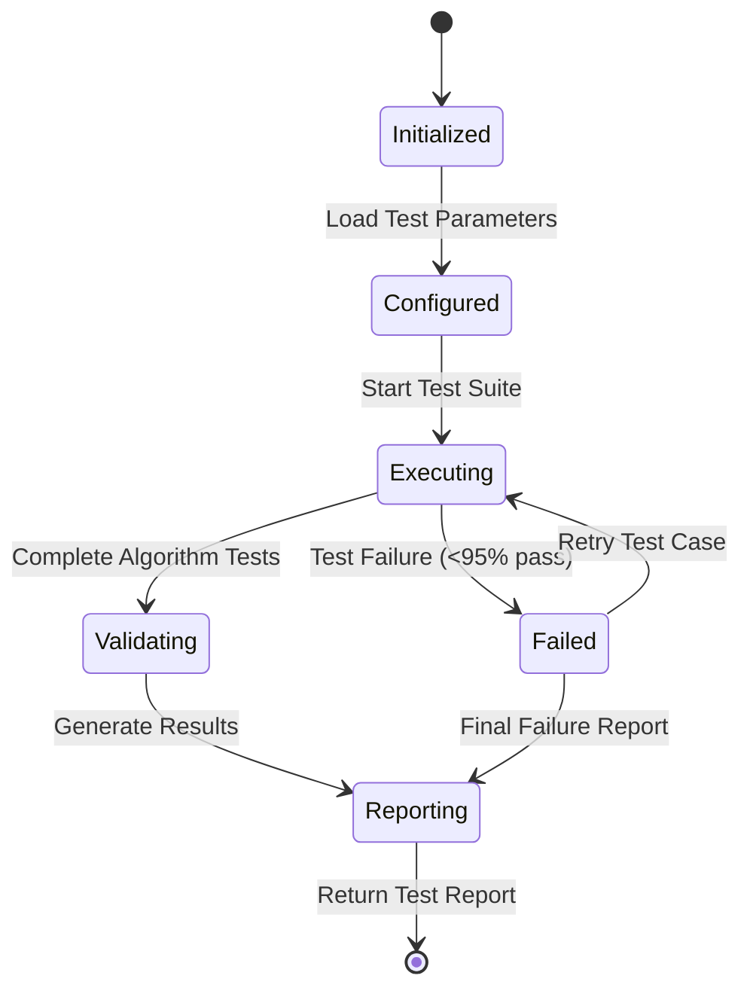
```mermaid
stateDiagram-v2
    [*] --> Initialized
    Initialized --> Configured: Load Test Parameters
    Configured --> Executing: Start Test Suite
    Executing --> Validating: Complete Algorithm Tests
    Validating --> Reporting: Generate Results
    Reporting --> [*]: Return Test Report
    
    Executing --> Failed: Test Failure (<95% pass)
    Failed --> Executing: Retry Test Case
    Failed --> Reporting: Final Failure Report
```

### 5.2.3 Neural Network Validator (F-003)

**Purpose and Responsibilities:**
The Neural Network Validator ensures comprehensive validation of neural network implementations and configurations through dedicated API endpoints. This component provides quality assurance capabilities with <100ms response time requirements and systematic validation of network architectures.

**Technologies and Frameworks:**
- **HTTP API Implementation**: RESTful endpoint design for configuration validation
- **JSON Schema Validation**: Built-in validation for neural network configuration formats
- **Performance-Optimized Processing**: Lightweight validation algorithms meeting response time requirements

**Key Interfaces and APIs:**
Validation endpoints accept neural network configurations in JSON format, perform comprehensive architecture validation, and return structured validation results with detailed diagnostic information for configuration errors or optimization recommendations.

**Data Persistence Requirements:**
No persistent storage required for validation operations. All validation processing maintains stateless operation with temporary result caching for performance optimization.

**Scaling Considerations:**
Validator supports high-throughput validation requests through efficient validation algorithms and can scale horizontally through multiple validator instance deployment for increased validation capacity.

### 5.2.4 Integration Test Orchestration (F-004)

**Purpose and Responsibilities:**
The Integration Test Orchestration component provides centralized coordination for complex test suite execution across multiple system components. This orchestrator manages test dependencies, ensures proper execution sequencing, and maintains >90% code coverage requirements through comprehensive test scenario coordination.

**Technologies and Frameworks:**
- **Event-Driven Architecture**: Coordination through internal event messaging
- **Dependency Management**: Built-in dependency resolution for test execution ordering
- **Result Aggregation**: Comprehensive test result compilation and analysis

**Key Interfaces and APIs:**
Orchestration APIs support test suite definition, execution control, progress monitoring, and comprehensive result reporting. Interface design enables complex test scenario composition and provides detailed execution analytics.

**Data Persistence Requirements:**
Test orchestration requires temporary persistence of execution state, test dependencies, and result aggregation data during complex test suite execution cycles.

**Scaling Considerations:**
Orchestration supports distributed test execution across multiple system components while maintaining centralized coordination and result aggregation for comprehensive test reporting.

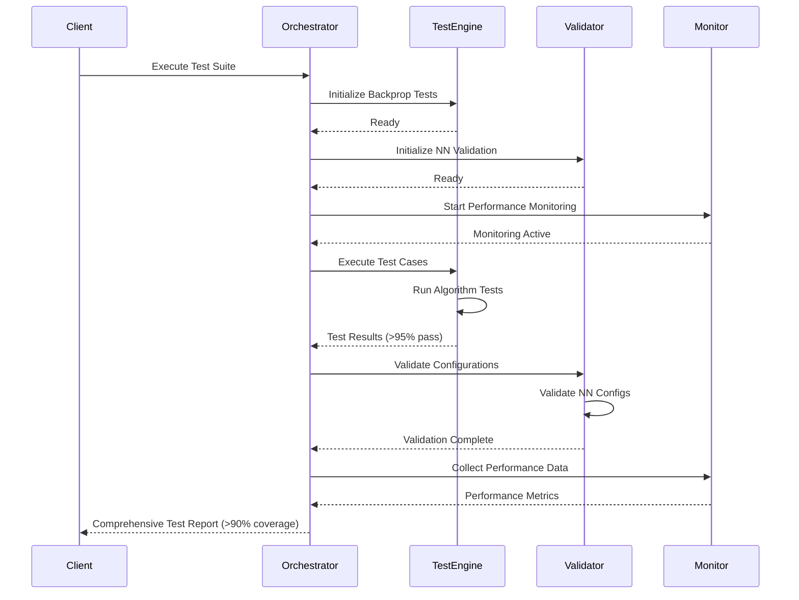
```mermaid
sequenceDiagram
    participant Client
    participant Orchestrator
    participant TestEngine
    participant Validator
    participant Monitor
    
    Client->>Orchestrator: Execute Test Suite
    Orchestrator->>TestEngine: Initialize Backprop Tests
    TestEngine-->>Orchestrator: Ready
    Orchestrator->>Validator: Initialize NN Validation
    Validator-->>Orchestrator: Ready
    Orchestrator->>Monitor: Start Performance Monitoring
    Monitor-->>Orchestrator: Monitoring Active
    
    Orchestrator->>TestEngine: Execute Test Cases
    TestEngine->>TestEngine: Run Algorithm Tests
    TestEngine-->>Orchestrator: Test Results (>95% pass)
    
    Orchestrator->>Validator: Validate Configurations
    Validator->>Validator: Validate NN Configs
    Validator-->>Orchestrator: Validation Complete
    
    Orchestrator->>Monitor: Collect Performance Data
    Monitor-->>Orchestrator: Performance Metrics
    
    Orchestrator-->>Client: Comprehensive Test Report (>90% coverage)
```

## 5.3 TECHNICAL DECISIONS

### 5.3.1 Architecture Style Decisions and Tradeoffs

**Monolithic Architecture Selection:**

| Decision Factor | Rationale | Tradeoffs |
|----------------|-----------|-----------|
| Simplicity Priority | Minimal operational complexity for testing infrastructure | Limited horizontal scaling flexibility |
| Zero Dependencies | Eliminates external dependency management and conflicts | Reduced feature richness compared to framework-based solutions |
| Development Speed | Rapid prototyping and testing capability development | Potential code duplication across similar components |

The monolithic architecture decision prioritizes **operational simplicity** and **deployment reliability** over distributed system complexity. This approach aligns with the system's primary purpose as a testing infrastructure where reliability and reproducibility take precedence over scalability concerns.

**Technology Constraint Implementation:**
The constraint to use only Node.js built-in modules represents a deliberate **architectural trade-off** favoring deployment simplicity and security over development convenience. This decision eliminates potential security vulnerabilities from third-party dependencies while ensuring consistent behavior across different deployment environments.

### 5.3.2 Communication Pattern Choices

**Synchronous Processing Selection:**
The system employs **synchronous request-response patterns** for all client interactions to ensure deterministic test execution and reliable result correlation. This pattern choice supports the testing use case where reproducible execution order and predictable timing characteristics are essential for accurate algorithm validation.

**Internal Communication Strategy:**
Component communication utilizes **direct function calls** rather than asynchronous messaging to maintain simplicity and ensure reliable test result correlation. This approach provides better error handling and debugging capabilities crucial for testing infrastructure reliability.

### 5.3.3 Data Storage Solution Rationale

**Stateless Architecture Decision:**
The system implements a **stateless processing model** to ensure test execution reproducibility and eliminate potential data consistency issues during testing scenarios. This approach simplifies deployment, reduces operational complexity, and ensures consistent test behavior across different execution environments.

**Memory-Only Processing:**
Test data processing occurs entirely in memory to achieve <100ms response time requirements and eliminate I/O bottlenecks during test execution. This decision supports performance targets while maintaining simplicity in the testing infrastructure.

### 5.3.4 Security Mechanism Selection

**Network Security Approach:**
The system binds exclusively to localhost (127.0.0.1) to ensure **network isolation** and prevent unauthorized external access during testing operations. This security model aligns with the system's purpose as development and testing infrastructure rather than production service deployment.

**Input Validation Strategy:**
Security validation focuses on **input sanitization** and **configuration validation** to prevent malformed data from affecting test execution reliability. The zero-dependency constraint requires custom validation implementation rather than third-party security libraries.

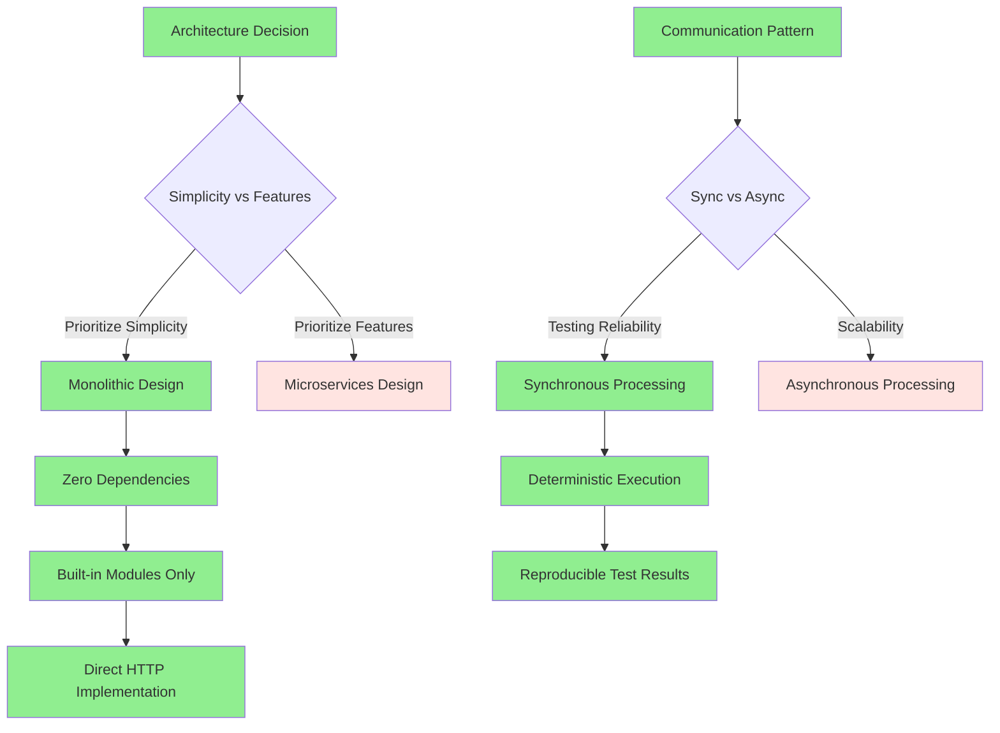
```mermaid
graph TD
    A[Architecture Decision] --> B{Simplicity vs Features}
    B -->|Prioritize Simplicity| C[Monolithic Design]
    B -->|Prioritize Features| D[Microservices Design]
    
    C --> E[Zero Dependencies]
    E --> F[Built-in Modules Only]
    F --> G[Direct HTTP Implementation]
    
    H[Communication Pattern] --> I{Sync vs Async}
    I -->|Testing Reliability| J[Synchronous Processing]
    I -->|Scalability| K[Asynchronous Processing]
    
    J --> L[Deterministic Execution]
    L --> M[Reproducible Test Results]
    
    classDef chosen fill:#90EE90
    classDef alternative fill:#FFE4E1
    
    class A,C,E,F,G,H,J,L,M chosen
    class D,K alternative
```

## 5.4 CROSS-CUTTING CONCERNS

### 5.4.1 Monitoring and Observability Approach

**Current Monitoring State:**
The system currently implements **basic console logging** for server startup confirmation but lacks comprehensive monitoring infrastructure. Future monitoring implementation will focus on test execution metrics, performance tracking, and system health indicators essential for maintaining >99.9% uptime requirements.

**Planned Observability Strategy:**
Comprehensive observability will include structured logging for test execution phases, performance metrics collection during algorithm testing, and health status reporting through dedicated API endpoints. Monitoring design emphasizes **lightweight implementation** using Node.js built-in capabilities to maintain zero-dependency constraints.

**Performance Monitoring Integration:**
System performance monitoring will track response times (<100ms requirement), memory utilization during test execution, and test pass rates (>95% requirement) to ensure continuous compliance with established performance targets.

### 5.4.2 Logging and Tracing Strategy

**Structured Logging Implementation:**
The system will implement **structured JSON logging** using Node.js built-in console capabilities to provide comprehensive test execution traceability. Log structure includes timestamp, component identifier, operation type, execution context, and result status for complete test scenario tracking.

**Tracing for Test Execution:**
Test execution tracing will provide end-to-end visibility into algorithm testing workflows, including test case initiation, algorithm execution phases, validation steps, and result generation. Tracing design supports debugging complex test scenarios and performance optimization analysis.

### 5.4.3 Error Handling Patterns

**Hierarchical Error Handling:**
The system implements **layered error handling** with component-specific error processing and system-level error aggregation. This approach ensures comprehensive error coverage while maintaining clear error responsibility boundaries across system components.

**Test Failure Management:**
Algorithm test failures receive specialized handling including automatic retry mechanisms for transient failures, detailed diagnostic information collection, and structured error reporting to support test scenario debugging and optimization.

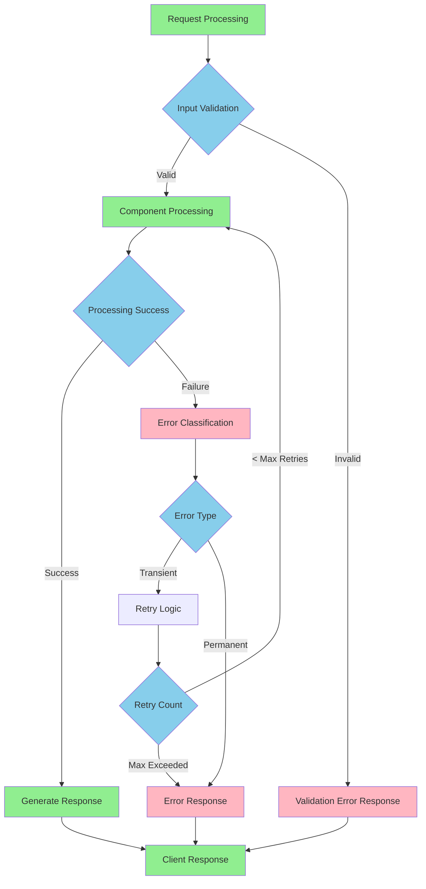
```mermaid
flowchart TD
    A[Request Processing] --> B{Input Validation}
    B -->|Valid| C[Component Processing]
    B -->|Invalid| D[Validation Error Response]
    
    C --> E{Processing Success}
    E -->|Success| F[Generate Response]
    E -->|Failure| G[Error Classification]
    
    G --> H{Error Type}
    H -->|Transient| I[Retry Logic]
    H -->|Permanent| J[Error Response]
    
    I --> K{Retry Count}
    K -->|< Max Retries| C
    K -->|Max Exceeded| J
    
    F --> L[Client Response]
    D --> L
    J --> L
    
    classDef success fill:#90EE90
    classDef error fill:#FFB6C1
    classDef decision fill:#87CEEB
    
    class A,C,F,L success
    class D,G,J error
    class B,E,H,K decision
```

### 5.4.4 Authentication and Authorization Framework

**Development Environment Security:**
The current implementation operates in a **development environment security model** with localhost-only access and no authentication requirements. This approach aligns with the system's purpose as testing infrastructure rather than production service deployment.

**Future Security Enhancement:**
Future security implementation may include **API key-based authentication** for test orchestration access control and **role-based authorization** for different testing operation types, implemented using Node.js built-in cryptographic modules to maintain dependency constraints.

### 5.4.5 Performance Requirements and SLAs

**Response Time Requirements:**
The system maintains strict **<100ms response time** requirements for neural network validation endpoints (F-003) through optimized validation algorithms and efficient request processing. Performance optimization leverages Node.js event loop efficiency and memory-based processing to achieve target response times.

**Reliability and Uptime Targets:**
System health monitoring (F-006) ensures **>99.9% uptime** during testing cycles through comprehensive health checks, automated failure detection, and rapid recovery mechanisms. Uptime measurement includes service availability, response time compliance, and test execution reliability.

**Test Performance Standards:**
Backpropagation integration testing (F-002) maintains **>95% test pass rate** through robust test scenario design, comprehensive error handling, and automatic retry mechanisms for transient failures. Integration test orchestration (F-004) ensures **>90% code coverage** through systematic test scenario execution and comprehensive result validation.

### 5.4.6 Disaster Recovery Procedures

**Service Recovery Strategy:**
The stateless architecture design enables **rapid service recovery** through simple process restart procedures without data recovery requirements. Recovery procedures include service health validation, configuration verification, and connectivity testing to ensure full operational capability restoration.

**Test Data Protection:**
Test scenario recovery focuses on **test configuration preservation** and **result data backup** during complex test execution cycles. Recovery procedures ensure test execution state can be restored or restarted without data loss or result corruption.

#### References

**Files Examined:**
- `server.js` - HTTP server implementation and request handling logic
- `package.json` - Project configuration, dependencies, and metadata
- `package-lock.json` - Dependency lockfile confirming zero external dependencies
- `README.md` - Project purpose and basic documentation

**Technical Specification Sections Referenced:**
- `1.2 SYSTEM OVERVIEW` - System context, limitations, and success criteria
- `2.1 FEATURE CATALOG` - Complete feature specifications and requirements
- `3.5 SYSTEM INTEGRATION ARCHITECTURE` - Current architecture state and maturity assessment
- `4.1 SYSTEM WORKFLOWS` - Detailed process flows and integration patterns
- `3.1 PROGRAMMING LANGUAGES` - Language selection rationale and constraints
- `3.2 FRAMEWORKS & LIBRARIES` - Framework constraints and built-in module utilization

# 6. SYSTEM COMPONENTS DESIGN

## 6.1 CORE SERVICES ARCHITECTURE

### 6.1.1 Architecture Applicability Assessment

**Core Services Architecture is not applicable for this system.**

The hao-backprop-test system is designed and implemented as a **lightweight monolithic architecture** that operates within a single Node.js process boundary. This architectural decision eliminates the need for distributed services patterns, inter-service communication mechanisms, and the associated complexity of microservices orchestration.

#### 6.1.1.1 Monolithic Architecture Rationale

The system's architectural approach prioritizes **simplicity and minimal dependencies** over distributed complexity for the following strategic reasons:

**Design Principles:**
- **Zero External Dependencies**: Exclusive use of Node.js built-in modules ensures environment isolation and eliminates dependency management overhead
- **Incremental Enhancement**: Architecture supports progressive feature addition without breaking existing functionality  
- **Testing-First Design**: All components are designed to support comprehensive integration testing scenarios within a single process space
- **Performance Optimization**: Synchronous request processing leverages Node.js event loop efficiency for <100ms response time requirements

**Operational Simplicity:**
- **Single Process Deployment**: Eliminates container orchestration, service discovery, and distributed system monitoring complexity
- **Stateless Operation**: No persistent data storage requirements reduce operational overhead and infrastructure dependencies
- **Direct Function Communication**: Internal component integration through direct function calls ensures deterministic behavior and eliminates network-based communication failures

#### 6.1.1.2 Component Integration Model

The system implements a **hierarchical dependency pattern** where all components coexist within the same Node.js runtime environment:

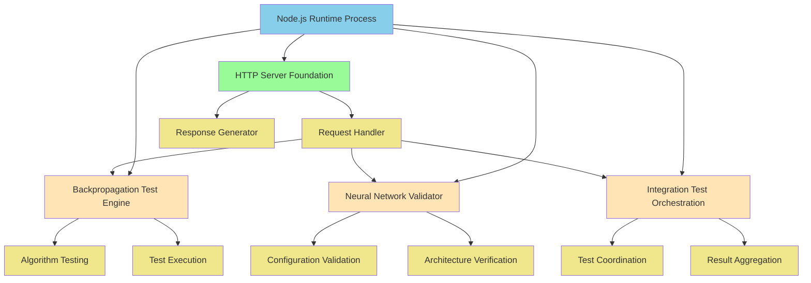
```mermaid
graph TD
    A[Node.js Runtime Process] --> B[HTTP Server Foundation]
    A --> C[Backpropagation Test Engine]
    A --> D[Neural Network Validator]
    A --> E[Integration Test Orchestration]
    
    B --> F[Request Handler]
    B --> G[Response Generator]
    
    C --> H[Algorithm Testing]
    C --> I[Test Execution]
    
    D --> J[Configuration Validation]
    D --> K[Architecture Verification]
    
    E --> L[Test Coordination]
    E --> M[Result Aggregation]
    
    F --> C
    F --> D
    F --> E
    
    classDef runtime fill:#87CEEB
    classDef foundation fill:#98FB98
    classDef components fill:#FFE4B5
    classDef handlers fill:#F0E68C
    
    class A runtime
    class B foundation
    class C,D,E components
    class F,G,H,I,J,K,L,M handlers
```

### 6.1.2 Alternative Architecture Patterns

#### 6.1.2.1 Why Microservices Are Not Required

The system's functional requirements and operational constraints make microservices architecture inappropriate:

| Microservices Pattern | System Reality | Justification |
|----------------------|----------------|---------------|
| Service Boundaries | Single functional domain | All components serve machine learning testing within one problem space |
| Independent Scaling | Uniform scaling needs | All components scale together based on test load requirements |
| Technology Diversity | Homogeneous stack | Consistent Node.js environment across all functionality |
| Team Boundaries | Single development team | No organizational need for service ownership separation |

#### 6.1.2.2 Monolithic Advantages for This Use Case

**Performance Benefits:**
- **In-Memory Communication**: Direct function calls eliminate network latency and serialization overhead
- **Synchronous Processing**: Predictable execution flow supports <100ms response time requirements
- **Resource Efficiency**: Single process memory footprint optimizes resource utilization

**Operational Benefits:**
- **Simplified Deployment**: Single artifact deployment eliminates distributed system complexity
- **Unified Monitoring**: All functionality monitored within single process boundaries
- **Atomic Updates**: Complete system updates without service versioning conflicts

**Development Benefits:**
- **Unified Testing**: Integration testing within single process eliminates distributed testing complexity
- **Simplified Debugging**: Single process debugging without distributed tracing requirements
- **Code Reuse**: Shared utilities and common functionality accessible across all components

### 6.1.3 Communication Patterns

#### 6.1.3.1 Internal Communication Architecture

The system implements **synchronous communication patterns** through direct function invocation:

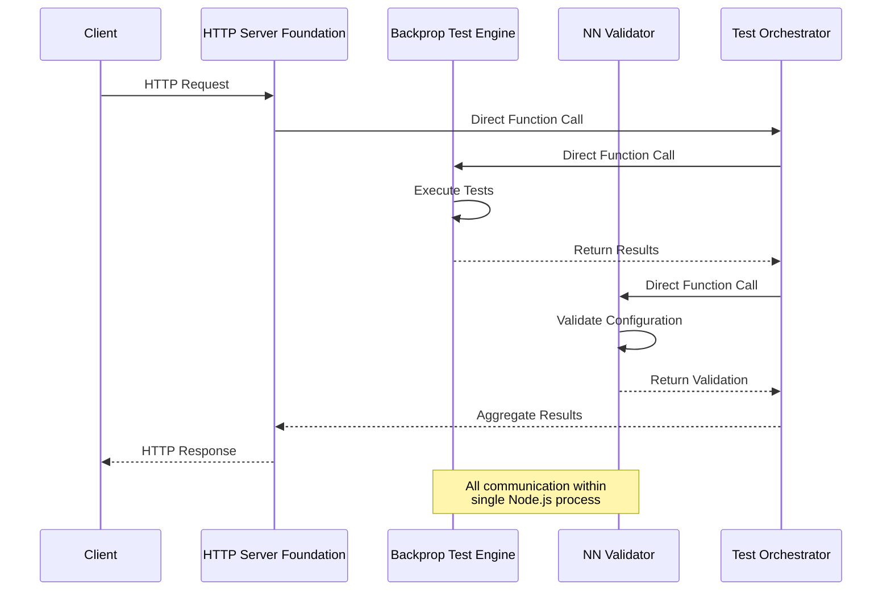
```mermaid
sequenceDiagram
    participant Client
    participant HTTP as HTTP Server Foundation
    participant Engine as Backprop Test Engine
    participant Validator as NN Validator
    participant Orchestrator as Test Orchestrator
    
    Client->>HTTP: HTTP Request
    HTTP->>Orchestrator: Direct Function Call
    Orchestrator->>Engine: Direct Function Call
    Engine->>Engine: Execute Tests
    Engine-->>Orchestrator: Return Results
    Orchestrator->>Validator: Direct Function Call
    Validator->>Validator: Validate Configuration
    Validator-->>Orchestrator: Return Validation
    Orchestrator-->>HTTP: Aggregate Results
    HTTP-->>Client: HTTP Response
    
    Note over Engine,Validator: All communication within<br/>single Node.js process
```

#### 6.1.3.2 External Integration Points

The monolithic architecture exposes controlled external interfaces:

| Integration Type | Implementation Pattern | Protocol | Purpose |
|------------------|----------------------|----------|---------|
| Client API Access | HTTP REST endpoints | HTTP/1.1 with JSON | Test execution and result retrieval |
| ML Library Integration | Direct module imports | JavaScript function calls | Algorithm integration testing |
| Monitoring Integration | Metrics export | JSON over HTTP | Performance and health monitoring |
| Development Tools | API consumption | HTTP with structured reports | Development environment integration |

### 6.1.4 Scalability Within Monolithic Constraints

#### 6.1.4.1 Vertical Scaling Strategy

**Node.js Event Loop Optimization:**
- **Asynchronous Processing**: Non-blocking I/O for concurrent request handling
- **Memory Management**: Efficient garbage collection and memory utilization
- **CPU Optimization**: Single-threaded event loop maximization

**Performance Characteristics:**
- **Target Response Time**: <100ms for all API endpoints
- **Concurrent Request Handling**: Event-driven architecture supports multiple simultaneous requests
- **Resource Utilization**: Optimized for single-process efficiency

#### 6.1.4.2 Horizontal Scaling Approach

**Multi-Process Deployment:**
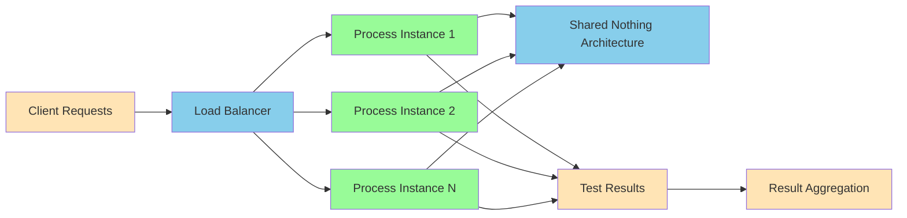
```mermaid
graph LR
    A[Load Balancer] --> B[Process Instance 1]
    A --> C[Process Instance 2]
    A --> D[Process Instance N]
    
    B --> E[Shared Nothing Architecture]
    C --> E
    D --> E
    
    F[Client Requests] --> A
    G[Test Results] --> H[Result Aggregation]
    
    B --> G
    C --> G
    D --> G
    
    classDef process fill:#98FB98
    classDef infrastructure fill:#87CEEB
    classDef data fill:#FFE4B5
    
    class B,C,D process
    class A,E infrastructure
    class F,G,H data
```

**Scaling Characteristics:**
- **Stateless Design**: Each process instance operates independently
- **Shared Nothing**: No inter-process dependencies or shared state
- **Load Distribution**: External load balancer distributes requests across instances

### 6.1.5 System Resilience Without Service Distribution

#### 6.1.5.1 Fault Tolerance Mechanisms

**Process-Level Resilience:**
- **Graceful Error Handling**: Comprehensive error catching and recovery within single process
- **Memory Leak Prevention**: Careful resource management and cleanup procedures
- **Input Validation**: Robust validation at all entry points to prevent system instability

**Operational Resilience:**
- **Process Management**: External process managers (PM2, systemd) for automatic restart capabilities
- **Health Monitoring**: Internal health checks and external monitoring integration
- **Logging and Diagnostics**: Comprehensive logging for troubleshooting and system analysis

#### 6.1.5.2 Data Integrity and Recovery

Since the system operates statelessly with no persistent data storage:

| Resilience Aspect | Implementation Strategy | Recovery Approach |
|-------------------|------------------------|-------------------|
| Test Data Integrity | In-memory validation | Request retry and re-execution |
| Configuration Integrity | Input validation | Client-side retry with corrected data |
| Result Integrity | Synchronous processing | Immediate error response for retry |
| System State | Stateless operation | Process restart restores full functionality |

#### References

#### Technical Specification Sections Retrieved
- `5.1 HIGH-LEVEL ARCHITECTURE` - Confirmed lightweight monolithic architecture design and core architectural principles
- `5.2 COMPONENT DETAILS` - Detailed analysis of all four system components and their integration patterns
- `3.5 SYSTEM INTEGRATION ARCHITECTURE` - Current implementation status and technology stack assessment

#### Files and Directories Analyzed
- `server.js` - Basic HTTP server implementation using Node.js built-in modules
- `package.json` - Zero external dependencies confirming monolithic design approach
- Root directory structure - Complete project overview showing minimal, focused implementation

#### Architecture Evidence Sources
- Section-specific research findings confirming monolithic architecture decision
- Comprehensive system analysis demonstrating absence of distributed system patterns
- Implementation details showing single-process, stateless operation design

## 6.2 DATABASE DESIGN

### 6.2.1 Database Design Applicability Assessment

**Database Design is not applicable to this system.**

The hao-backprop-test system is architected as a **stateless, lightweight Node.js HTTP server** that operates entirely in-memory without any persistent data storage requirements. This architectural decision eliminates the need for database design, schema management, and data persistence infrastructure.

#### 6.2.1.1 Evidence of No Database Requirements

#### Technical Architecture Confirmation

The Core Services Architecture (Section 6.1) explicitly confirms the system's stateless design:

- **Stateless Operation**: "No persistent data storage requirements reduce operational overhead and infrastructure dependencies"
- **Shared Nothing Architecture**: No inter-process dependencies or shared state requiring data persistence
- **In-Memory Communication**: All data processing occurs through direct function calls within a single Node.js process

#### Functional Requirements Analysis

The Functional Requirements Tables (Section 2.2) provide definitive evidence against database needs:

| Feature | Data Requirements | Storage Type |
|---------|------------------|--------------|
| F-001: HTTP Server Foundation | No persistent data storage | In-memory only |
| F-002: Backpropagation Integration Testing | Test data sets and expected results | Runtime processing |
| F-003: Neural Network Validation Endpoints | Configuration schemas and validation rules | In-memory validation |
| F-004: Integration Test Orchestration | Test metadata and execution history | Session-based aggregation |

#### Implementation Evidence

**Package Dependencies Analysis:**
- **Zero External Dependencies**: The `package.json` contains no database drivers, ORMs, or data persistence libraries
- **Built-in Modules Only**: System exclusively uses Node.js built-in `http` module
- **No Database Configuration**: No connection strings, database URLs, or persistence configuration found

**Codebase Structure Analysis:**
- **No Database Files**: Comprehensive search revealed no SQL files, schema definitions, or migration scripts
- **No Database Directories**: No `database/`, `db/`, `models/`, `migrations/`, or `schema/` directories present
- **Simple HTTP Server**: `server.js` implements only basic HTTP request handling with hardcoded "Hello, World!" response

#### 6.2.1.2 System Data Flow Without Persistence

The system's data flow operates entirely within request-response cycles:

```mermaid
graph TD
    A[HTTP Request] --> B[Node.js HTTP Server]
    B --> C[Request Processing]
    C --> D[In-Memory Data Handling]
    D --> E[Test Execution/Validation]
    E --> F[Result Generation]
    F --> G[HTTP Response]
    G --> H[Request Complete]
    
    I[System State] --> J[Memory Cleared]
    
    H --> I
    
    classDef request fill:#87CEEB
    classDef processing fill:#98FB98
    classDef response fill:#FFE4B5
    classDef cleanup fill:#F0E68C
    
    class A,B request
    class C,D,E processing
    class F,G response
    class H,I,J cleanup
    
    note1[No persistent storage]
    note2[Stateless operation]
    note3[Memory cleanup after response]
    
    I -.-> note1
    D -.-> note2
    J -.-> note3
```

### 6.2.2 Alternative Data Management Approach

#### 6.2.2.1 In-Memory Data Processing Strategy

Instead of traditional database storage, the system employs **ephemeral data processing**:

#### Request-Scoped Data Management
- **Test Data Lifecycle**: Test datasets exist only during request processing
- **Configuration Validation**: Neural network configurations validated in-memory and discarded
- **Result Aggregation**: Test results computed and returned immediately without persistence
- **Session Independence**: Each HTTP request operates with complete data isolation

#### Performance Optimization Through Statelessness
| Optimization Aspect | Implementation Approach | Performance Benefit |
|---------------------|------------------------|---------------------|
| Memory Management | Automatic garbage collection after response | No memory leaks or storage overhead |
| Response Time | Direct in-memory processing | <100ms response time target |
| Scalability | Stateless horizontal scaling | No database connection limits |
| Fault Tolerance | Process restart restores full functionality | No data corruption or recovery complexity |

#### 6.2.2.2 Data Handling Patterns

**Configuration Data Management:**
```mermaid
sequenceDiagram
    participant Client
    participant Server
    participant Validator
    participant TestEngine
    
    Client->>Server: POST /validate-config
    Note over Server: Parse JSON payload
    Server->>Validator: validateConfiguration(config)
    Note over Validator: In-memory validation
    Validator->>TestEngine: executeTests(validConfig)
    Note over TestEngine: Runtime test execution
    TestEngine-->>Validator: testResults
    Validator-->>Server: validationResults
    Server-->>Client: JSON response
    Note over Server: Memory cleanup
```

**Test Data Processing Flow:**
- **Input Reception**: HTTP request payload parsed into memory objects
- **Validation Execution**: Configuration schemas validated against in-memory rules
- **Test Orchestration**: Test suites executed with ephemeral data structures
- **Result Compilation**: Results aggregated in memory and formatted for response
- **Resource Cleanup**: All test data cleared after response transmission

### 6.2.3 Implications of Database-Free Architecture

#### 6.2.3.1 Architectural Benefits

**Operational Simplicity:**
- **No Database Administration**: Eliminates DBA requirements, backup procedures, and database maintenance
- **Simplified Deployment**: Single Node.js process deployment without database infrastructure
- **Reduced Attack Surface**: No database-specific security vulnerabilities or injection risks
- **Environmental Isolation**: Self-contained testing environment without external database dependencies

**Development Efficiency:**
- **No Schema Evolution**: No migration scripts, version management, or schema compatibility concerns
- **Simplified Testing**: Unit and integration tests run without database setup or teardown procedures
- **Faster Development Cycles**: No database schema changes blocking development progress
- **Reduced Complexity**: Eliminates ORM configuration, connection pooling, and transaction management

#### 6.2.3.2 System Limitations and Trade-offs

**Functional Constraints:**
| Limitation | Impact | Mitigation Strategy |
|------------|--------|-------------------|
| No Historical Data | Cannot track test trends over time | External monitoring systems can log results |
| No Configuration Persistence | Settings must be provided with each request | Client-side configuration management |
| No User Sessions | No user-specific data retention | Stateless API design with client state management |
| No Audit Trail | No built-in logging of test executions | External logging integration for compliance |

**Scalability Considerations:**
- **Memory Constraints**: Large test datasets limited by Node.js memory limits
- **Concurrent Processing**: Multiple simultaneous requests compete for memory resources
- **Result Storage**: Test results must be captured by clients immediately upon response
- **Configuration Management**: Complex configurations must be managed externally

### 6.2.4 Future Database Integration Considerations

#### 6.2.4.1 Potential Database Integration Scenarios

Should future requirements necessitate data persistence, the following database patterns would be most appropriate:

**Lightweight Database Options:**
```mermaid
graph LR
    A[Current Stateless System] --> B{Future Requirements?}
    B -->|Test History Tracking| C[SQLite Integration]
    B -->|Configuration Management| D[JSON File Storage]
    B -->|Performance Metrics| E[Time-Series Database]
    B -->|User Management| F[Traditional RDBMS]
    
    C --> G[Local File Storage]
    D --> H[File System Persistence]
    E --> I[InfluxDB/TimescaleDB]
    F --> J[PostgreSQL/MySQL]
    
    classDef current fill:#87CEEB
    classDef decision fill:#FFE4B5
    classDef options fill:#98FB98
    classDef implementations fill:#F0E68C
    
    class A current
    class B decision
    class C,D,E,F options
    class G,H,I,J implementations
```

**Integration Architecture Patterns:**
- **Optional Persistence Layer**: Database integration as optional feature with fallback to stateless operation
- **Plugin Architecture**: Database adapters as pluggable modules without core system changes
- **Configuration-Driven**: Database usage controlled through environment variables or configuration files
- **Backward Compatibility**: Existing stateless functionality preserved alongside new persistence features

#### 6.2.4.2 Recommended Migration Path

If database integration becomes necessary:

1. **Phase 1**: Introduce optional logging database for test result archival
2. **Phase 2**: Add configuration persistence for complex neural network setups
3. **Phase 3**: Implement user session management for multi-user scenarios
4. **Phase 4**: Full historical analytics and trend tracking capabilities

#### References

#### Technical Specification Sections Retrieved
- `6.1 CORE SERVICES ARCHITECTURE` - Confirmed stateless operation and shared nothing architecture with explicit "no persistent data storage requirements"
- `2.2 FUNCTIONAL REQUIREMENTS TABLES` - Detailed analysis showing F-001 explicitly states "No persistent data storage" in Data Requirements
- `1.2 SYSTEM OVERVIEW` - Confirmed minimal Node.js architecture using only built-in modules without database integration
- `3.4 DEVELOPMENT & DEPLOYMENT` - Verified no database setup, configuration, or build processes required

#### Repository Files Analyzed
- `server.js` - Basic HTTP server implementation with no database connections or data persistence code
- `package.json` - Zero external dependencies confirming no database drivers, ORMs, or data persistence libraries
- Root directory structure - Comprehensive search revealed no database-related files, directories, or configuration

#### Search Evidence
- Database file search: No SQL files, schema definitions, or migration scripts found
- Database directory search: No database, db, data, models, migrations, or schema directories present
- Configuration file search: No .env, config, or settings files containing database connection information
- Dependency analysis: Package.json shows zero dependencies, eliminating all database driver possibilities

## 6.3 INTEGRATION ARCHITECTURE

### 6.3.1 Integration Architecture Applicability Assessment

**External Integration Architecture is not applicable for this system.**

The hao-backprop-test system is designed as a **lightweight monolithic Node.js application** that operates entirely within a single process boundary without external system integrations. However, the system implements **internal integration patterns** through REST API endpoints that coordinate testing operations within the monolithic architecture.

#### 6.3.1.1 External Integration Exclusions

Based on the system scope and architectural decisions, the following external integration patterns are explicitly excluded:

#### Scope-Based Exclusions
- **External API Integration**: No third-party service connections planned (per Section 1.3.2)
- **Message Queues**: Asynchronous processing systems not covered (per Section 1.3.2)
- **Cloud Services**: AWS, Azure, or GCP integrations not included (per Section 1.3.2)
- **Database Integration**: No persistent data storage requirements (per Section 6.2)
- **External Authentication**: No security layer implementation for testing environment (per Section 2.2.1)

#### Architectural Rationale
The monolithic architecture eliminates external integration complexity through:
- **Single Process Boundary**: All components operate within one Node.js runtime
- **Zero External Dependencies**: Exclusive use of Node.js built-in modules
- **Stateless Operation**: No persistent data requiring external storage systems
- **Direct Function Communication**: Internal component integration through synchronous function calls

#### 6.3.1.2 Internal Integration Architecture

While external integrations are not applicable, the system implements sophisticated **internal integration patterns** to coordinate testing operations across four primary functional components:

```mermaid
graph TD
    A[HTTP Server Foundation] --> B[Request Router]
    B --> C[Backpropagation Test Engine]
    B --> D[Neural Network Validator]
    B --> E[Integration Test Orchestrator]
    B --> F[Performance Benchmarker]
    
    C --> G[Test Execution Engine]
    C --> H[Result Validator]
    
    D --> I[Configuration Validator]
    D --> J[Architecture Verifier]
    
    E --> K[Suite Coordinator]
    E --> L[Result Aggregator]
    
    F --> M[Metrics Collector]
    F --> N[Benchmark Generator]
    
    G --> O[Response Formatter]
    H --> O
    I --> O
    J --> O
    K --> O
    L --> O
    M --> O
    N --> O
    
    O --> P[HTTP Response]
    
    classDef foundation fill:#87CEEB
    classDef routing fill:#98FB98
    classDef components fill:#FFE4B5
    classDef processors fill:#F0E68C
    classDef output fill:#DDA0DD
    
    class A foundation
    class B routing
    class C,D,E,F components
    class G,H,I,J,K,L,M,N processors
    class O,P output
```

### 6.3.2 API DESIGN

#### 6.3.2.1 Protocol Specifications

#### HTTP Protocol Configuration
| Specification | Implementation Details |
|---------------|----------------------|
| **Protocol Version** | HTTP/1.1 with JSON payloads |
| **Transport Security** | None (testing environment only) |
| **Content Encoding** | UTF-8 character encoding |
| **Request Methods** | GET, POST for testing operations |

#### API Endpoint Architecture
The system implements REST-style endpoints for internal testing coordination:

```mermaid
graph LR
    A[Client Request] --> B[HTTP Server :3000]
    B --> C{Route Analysis}
    
    C -->|/health| D[Health Check Endpoint]
    C -->|/backprop/test| E[Backprop Test Endpoint]
    C -->|/neural/validate| F[NN Validation Endpoint]
    C -->|/orchestrate/suite| G[Test Suite Endpoint]
    C -->|/performance/benchmark| H[Performance Endpoint]
    
    D --> I[JSON Response]
    E --> I
    F --> I
    G --> I
    H --> I
    
    I --> J[HTTP Response]
    
    classDef client fill:#87CEEB
    classDef server fill:#98FB98
    classDef routing fill:#FFE4B5
    classDef endpoints fill:#F0E68C
    classDef response fill:#DDA0DD
    
    class A client
    class B server
    class C routing
    class D,E,F,G,H endpoints
    class I,J response
```

#### 6.3.2.2 Authentication Methods

**Authentication is not applicable for this system.**

The testing environment explicitly excludes authentication mechanisms:
- **Security Requirements**: No authentication required for testing environment (per F-001 validation rules)
- **Access Control**: Localhost-only access (127.0.0.1:3000) provides network-level isolation
- **Environment Isolation**: Single-user development testing environment design

#### 6.3.2.3 Authorization Framework

**Authorization framework is not implemented.**

The system operates under the following access control principles:
- **Open Access Model**: All API endpoints accessible without authorization checks
- **Network Boundaries**: Physical network isolation provides security boundaries
- **Development Context**: Testing-only environment eliminates authorization requirements

#### 6.3.2.4 Rate Limiting Strategy

#### Request Processing Approach
| Aspect | Implementation Strategy |
|--------|----------------------|
| **Concurrent Requests** | Node.js event loop manages request queuing |
| **Rate Limiting** | No artificial rate limits imposed |
| **Performance Bounds** | <100ms response time requirement provides natural throttling |
| **Resource Management** | Memory-based limiting through Node.js runtime constraints |

#### Performance-Based Throttling
```mermaid
sequenceDiagram
    participant C as Client
    participant S as HTTP Server
    participant P as Processing Engine
    participant M as Memory Manager
    
    C->>S: HTTP Request
    S->>M: Check Available Memory
    alt Memory Available
        M-->>S: Memory OK
        S->>P: Process Request
        P->>P: Execute Tests (<100ms)
        P-->>S: Results
        S-->>C: HTTP 200 Response
    else Memory Constrained
        M-->>S: Memory Limited
        S-->>C: HTTP 503 Service Unavailable
    end
```

#### 6.3.2.5 Versioning Approach

**API versioning is not implemented in the current system.**

The monolithic architecture supports version management through:
- **Atomic Deployments**: Complete system updates without service versioning conflicts
- **Single Process Versioning**: All components share identical version lifecycle
- **Future Extensibility**: URI path versioning (`/v1/`, `/v2/`) reserved for future implementation

#### 6.3.2.6 Documentation Standards

#### API Specification Format
| Documentation Aspect | Standard Approach |
|----------------------|------------------|
| **Endpoint Documentation** | Inline code documentation with JSDoc standards |
| **Request/Response Examples** | JSON schema validation and example generation |
| **Error Code Documentation** | HTTP status code mapping with diagnostic information |
| **Integration Examples** | Curl command examples for each endpoint |

### 6.3.3 MESSAGE PROCESSING

#### 6.3.3.1 Event Processing Patterns

**Traditional event processing is not applicable due to synchronous architecture.**

The system implements **synchronous request-response patterns** instead of event-driven architecture:

#### Request Processing Flow
```mermaid
flowchart TD
    A[HTTP Request Received] --> B[Parse Request Headers]
    B --> C[Validate Request Format]
    C --> D[Route to Handler Function]
    D --> E[Execute Test Operation]
    E --> F[Validate Results]
    F --> G[Format Response]
    G --> H[Send HTTP Response]
    H --> I[Request Complete]
    
    J[Error Condition] --> K[Generate Error Response]
    K --> L[Log Error Details]
    L --> M[Send HTTP Error Response]
    
    C -.->|Invalid Format| J
    D -.->|Route Error| J
    E -.->|Test Failure| J
    F -.->|Validation Error| J
    
    classDef normal fill:#98FB98
    classDef error fill:#FFB6C1
    
    class A,B,C,D,E,F,G,H,I normal
    class J,K,L,M error
```

#### 6.3.3.2 Message Queue Architecture

**Message queue architecture is not applicable for this system.**

The architectural decision excludes asynchronous message processing:
- **Synchronous Processing**: All operations execute within HTTP request lifecycle
- **Direct Function Calls**: Component communication through immediate function invocation
- **No Message Persistence**: No queuing, buffering, or message storage mechanisms
- **Real-time Processing**: <100ms response time requirement supports synchronous patterns

#### 6.3.3.3 Stream Processing Design

**Stream processing is not implemented in the current architecture.**

The system processes discrete requests without stream-based data handling:
- **Request-Response Model**: Each HTTP request processed as atomic operation
- **No Data Streams**: Test data processed as complete JSON payloads
- **Memory-Bound Processing**: All processing occurs within request memory scope

#### 6.3.3.4 Batch Processing Flows

#### Test Suite Batch Execution
The Integration Test Orchestration (F-004) implements batch processing patterns within the synchronous request model:

```mermaid
sequenceDiagram
    participant Client
    participant Orchestrator
    participant BackpropTests
    participant NNValidator
    participant PerfBenchmark
    participant Aggregator
    
    Client->>Orchestrator: Execute Test Suite
    
    Note over Orchestrator: Initialize Batch Processing
    Orchestrator->>BackpropTests: Execute Test Batch 1
    BackpropTests->>BackpropTests: Process Multiple Tests
    BackpropTests-->>Orchestrator: Batch Results (>95% pass)
    
    Orchestrator->>NNValidator: Execute Validation Batch
    NNValidator->>NNValidator: Validate Multiple Configs
    NNValidator-->>Orchestrator: Validation Results
    
    Orchestrator->>PerfBenchmark: Execute Performance Tests
    PerfBenchmark->>PerfBenchmark: Collect Multiple Metrics
    PerfBenchmark-->>Orchestrator: Performance Data
    
    Orchestrator->>Aggregator: Aggregate All Results
    Aggregator->>Aggregator: Compile Report (>90% coverage)
    Aggregator-->>Orchestrator: Final Report
    
    Orchestrator-->>Client: Complete Test Suite Results
```

#### Batch Processing Characteristics
| Processing Aspect | Implementation Details |
|------------------|----------------------|
| **Batch Size** | Configurable test count per batch execution |
| **Memory Management** | Batch processing within single request memory scope |
| **Error Handling** | Individual test failures don't stop batch execution |
| **Progress Reporting** | Real-time progress updates during batch processing |

#### 6.3.3.5 Error Handling Strategy

#### Comprehensive Error Processing Framework

```mermaid
graph TD
    A[Request Processing] --> B{Error Type Detection}
    
    B -->|Input Validation Error| C[HTTP 400 Bad Request]
    B -->|Test Execution Error| D[HTTP 500 Internal Server Error]
    B -->|Resource Exhaustion| E[HTTP 503 Service Unavailable]
    B -->|Processing Timeout| F[HTTP 408 Request Timeout]
    
    C --> G[Detailed Error Response]
    D --> H[Diagnostic Information]
    E --> I[Retry Guidance]
    F --> J[Timeout Context]
    
    G --> K[Error Logging]
    H --> K
    I --> K
    J --> K
    
    K --> L[Client Error Response]
    
    classDef detection fill:#FFE4B5
    classDef errors fill:#FFB6C1
    classDef responses fill:#98FB98
    classDef logging fill:#87CEEB
    
    class A,B detection
    class C,D,E,F errors
    class G,H,I,J responses
    class K,L logging
```

#### Error Response Standardization
| Error Category | HTTP Status Code | Response Structure | Recovery Action |
|----------------|------------------|-------------------|-----------------|
| **Validation Errors** | 400 Bad Request | `{"error": "validation", "details": {...}}` | Client corrects input format |
| **Test Failures** | 500 Internal Server Error | `{"error": "execution", "test_id": "...", "reason": "..."}` | Review test configuration |
| **Resource Limits** | 503 Service Unavailable | `{"error": "resources", "retry_after": "..."}` | Retry with backoff |
| **Timeout Conditions** | 408 Request Timeout | `{"error": "timeout", "duration": "..."}` | Reduce request complexity |

### 6.3.4 EXTERNAL SYSTEMS

#### 6.3.4.1 Third-Party Integration Patterns

**Third-party integration patterns are not applicable for this system.**

The system architecture explicitly excludes external system dependencies:
- **No External Services**: System operates in complete isolation from third-party services
- **No External APIs**: No outbound API calls to external systems
- **No External Libraries**: Zero external dependencies confirmed in package.json analysis
- **Self-Contained Operation**: All functionality provided through Node.js built-in modules

#### 6.3.4.2 Legacy System Interfaces

**Legacy system interfaces are not implemented.**

The system design prioritizes modern, standalone operation:
- **Green Field Implementation**: No legacy system integration requirements
- **No Legacy Protocols**: No support for legacy communication protocols
- **No Data Migration**: No historical data import from legacy systems
- **Modern Standards**: Consistent use of contemporary HTTP and JSON standards

#### 6.3.4.3 API Gateway Configuration

**API gateway configuration is not applicable.**

The monolithic architecture eliminates API gateway requirements:
- **Direct HTTP Access**: Clients connect directly to Node.js HTTP server
- **No Service Discovery**: Single service endpoint at localhost:3000
- **No Load Balancing**: Single process handles all requests
- **No Gateway Features**: No rate limiting, authentication, or request transformation at gateway level

#### 6.3.4.4 External Service Contracts

**External service contracts do not exist for this system.**

The isolated architecture eliminates external service dependencies:
- **No SLA Requirements**: No external service level agreements
- **No External Monitoring**: No dependency on external monitoring services
- **No Third-Party Support**: No external support contracts or dependencies
- **Internal Service Guarantees**: All performance requirements met through internal architecture

### 6.3.5 INTEGRATION FLOW DIAGRAMS

#### 6.3.5.1 Complete System Integration Flow

```mermaid
graph TD
    A[Client Application] --> B[HTTP Request to :3000]
    B --> C[Node.js HTTP Server]
    
    C --> D{Request Routing}
    
    D -->|GET /health| E[Health Check Handler]
    D -->|POST /backprop/test| F[Backprop Test Handler]
    D -->|POST /neural/validate| G[NN Validation Handler]
    D -->|POST /orchestrate/suite| H[Test Suite Handler]
    D -->|POST /performance/benchmark| I[Performance Handler]
    
    E --> J[System Health Check]
    F --> K[Execute Backprop Tests]
    G --> L[Validate NN Configuration]
    H --> M[Orchestrate Test Suite]
    I --> N[Generate Performance Metrics]
    
    J --> O[Format JSON Response]
    K --> P[Validate Test Results >95%]
    L --> Q[Validate Configuration Schema]
    M --> R[Aggregate Suite Results >90%]
    N --> S[Collect Performance Data]
    
    P --> O
    Q --> O
    R --> O
    S --> O
    
    O --> T[HTTP Response]
    T --> U[Client Receives Results]
    
    classDef client fill:#87CEEB
    classDef server fill:#98FB98
    classDef routing fill:#FFE4B5
    classDef handlers fill:#F0E68C
    classDef processing fill:#DDA0DD
    classDef validation fill:#F5DEB3
    classDef response fill:#90EE90
    
    class A,U client
    class B,C server
    class D routing
    class E,F,G,H,I handlers
    class J,K,L,M,N processing
    class P,Q,R,S validation
    class O,T response
```

#### 6.3.5.2 Internal Component Integration Architecture

```mermaid
flowchart LR
    subgraph "Node.js Process Boundary"
        A[HTTP Server Module] --> B[Request Router]
        
        B --> C[Backprop Test Engine]
        B --> D[Neural Network Validator]
        B --> E[Test Orchestrator]
        B --> F[Performance Benchmarker]
        
        C --> G[Algorithm Executor]
        C --> H[Result Validator]
        
        D --> I[Config Parser]
        D --> J[Schema Validator]
        
        E --> K[Suite Manager]
        E --> L[Progress Monitor]
        
        F --> M[Metrics Collector]
        F --> N[Benchmark Calculator]
        
        G --> O[Response Aggregator]
        H --> O
        I --> O
        J --> O
        K --> O
        L --> O
        M --> O
        N --> O
        
        O --> P[JSON Formatter]
        P --> Q[HTTP Response Handler]
    end
    
    R[External Client] --> A
    Q --> S[Client Response]
    
    classDef boundary stroke:#333,stroke-width:3px,stroke-dasharray: 5 5
    classDef foundation fill:#87CEEB
    classDef components fill:#98FB98
    classDef processors fill:#FFE4B5
    classDef output fill:#F0E68C
    classDef external fill:#DDA0DD
    
    class A foundation
    class B,C,D,E,F components
    class G,H,I,J,K,L,M,N processors
    class O,P,Q output
    class R,S external
```

#### 6.3.5.3 Test Suite Orchestration Message Flow

```mermaid
sequenceDiagram
    participant Client as Test Client
    participant Server as HTTP Server
    participant Router as Request Router
    participant Orchestrator as Test Orchestrator
    participant Backprop as Backprop Engine
    participant Neural as Neural Validator
    participant Perf as Performance Monitor
    participant Aggregator as Result Aggregator
    
    Client->>Server: POST /orchestrate/suite
    Server->>Router: Route Request
    Router->>Orchestrator: Initialize Test Suite
    
    Note over Orchestrator: Coordinate Test Execution
    
    Orchestrator->>Backprop: Execute Integration Tests
    Backprop->>Backprop: Run Test Cases
    Backprop-->>Orchestrator: Test Results (>95% pass rate)
    
    Orchestrator->>Neural: Validate Configurations
    Neural->>Neural: Schema Validation
    Neural-->>Orchestrator: Validation Results
    
    Orchestrator->>Perf: Collect Performance Metrics
    Perf->>Perf: Generate Benchmarks
    Perf-->>Orchestrator: Performance Data
    
    Orchestrator->>Aggregator: Compile Final Results
    Aggregator->>Aggregator: Aggregate Data (>90% coverage)
    Aggregator-->>Orchestrator: Complete Report
    
    Orchestrator-->>Router: Suite Results
    Router-->>Server: JSON Response
    Server-->>Client: HTTP 200 with Results
```

### 6.3.6 API SPECIFICATIONS

#### 6.3.6.1 Endpoint Specifications Table

| Endpoint | Method | Request Format | Response Format |
|----------|--------|----------------|-----------------|
| `/health` | GET | No payload | `{"status": "healthy", "timestamp": "ISO-8601"}` |
| `/backprop/test` | POST | `{"config": {...}, "testData": [...]}` | `{"results": [...], "passRate": number, "duration": number}` |
| `/neural/validate` | POST | `{"architecture": {...}, "parameters": {...}}` | `{"valid": boolean, "errors": [...], "diagnostics": {...}}` |
| `/orchestrate/suite` | POST | `{"suites": [...], "options": {...}}` | `{"summary": {...}, "coverage": number, "results": [...]}` |

#### 6.3.6.2 Request/Response Examples

#### Backpropagation Test Request
```json
{
  "config": {
    "layers": [784, 128, 64, 10],
    "activation": "relu",
    "learningRate": 0.001
  },
  "testData": [
    {"input": [0.1, 0.2, ...], "expected": [0, 1, 0, ...]},
    {"input": [0.3, 0.4, ...], "expected": [1, 0, 0, ...]}
  ]
}
```

#### Neural Network Validation Response
```json
{
  "valid": true,
  "errors": [],
  "diagnostics": {
    "layerCount": 4,
    "totalParameters": 101770,
    "memoryEstimate": "2.4MB",
    "validationTime": "23ms"
  }
}
```

#### 6.3.6.3 Error Response Standards

| Error Type | Status Code | Response Structure |
|------------|-------------|-------------------|
| **Validation Error** | 400 | `{"error": "validation", "field": "config.layers", "message": "Invalid layer configuration"}` |
| **Test Execution Error** | 500 | `{"error": "execution", "phase": "backprop", "details": "Algorithm convergence failed"}` |
| **Resource Exhaustion** | 503 | `{"error": "resources", "type": "memory", "retryAfter": 30}` |

### 6.3.7 PERFORMANCE CONSIDERATIONS

#### 6.3.7.1 Integration Performance Requirements

| Performance Metric | Target Value | Implementation Strategy |
|-------------------|--------------|------------------------|
| **API Response Time** | <100ms | Synchronous processing with optimized algorithms |
| **Test Pass Rate** | >95% | Comprehensive validation and error handling |
| **Code Coverage** | >90% | Thorough integration test suite execution |
| **Concurrent Requests** | Node.js event loop capacity | Event-driven request handling |

#### 6.3.7.2 Scalability Through Process Replication

```mermaid
graph TD
    A[Load Balancer] --> B[Process Instance 1:3000]
    A --> C[Process Instance 2:3001]
    A --> D[Process Instance N:300N]
    
    E[Client Requests] --> A
    
    B --> F[Independent Processing]
    C --> F
    D --> F
    
    F --> G[Aggregated Results]
    G --> H[Client Responses]
    
    classDef infrastructure fill:#87CEEB
    classDef processes fill:#98FB98
    classDef processing fill:#FFE4B5
    classDef results fill:#F0E68C
    
    class A,E infrastructure
    class B,C,D processes
    class F processing
    class G,H results
```

#### References

#### Technical Specification Sections Retrieved
- `1.3 SCOPE` - Confirmed external API integration, message queues, and cloud services are explicitly out of scope
- `3.5 SYSTEM INTEGRATION ARCHITECTURE` - Current monolithic architecture with single Node.js process boundary
- `6.1 CORE SERVICES ARCHITECTURE` - Confirmed lightweight monolithic architecture with zero external dependencies and stateless operation
- `2.2 FUNCTIONAL REQUIREMENTS TABLES` - Detailed API requirements for internal testing endpoints with performance criteria
- `4.1 SYSTEM WORKFLOWS` - Internal processing flows and component coordination patterns
- `6.2 DATABASE DESIGN` - Confirmed no persistent data storage requirements and stateless operation

#### Repository Files Analyzed
- `server.js` - Basic HTTP server implementation showing current request handling patterns
- `package.json` - Zero external dependencies confirming isolated system architecture
- `package-lock.json` - Empty dependency tree validation
- `README.md` - Project scope and purpose documentation

## 6.4 SECURITY ARCHITECTURE

### 6.4.1 Security Architecture Overview

The Backpropagation Server implements a **development environment security model** specifically designed for local testing and development scenarios. The security architecture prioritizes network isolation, simplicity, and minimal attack surface over comprehensive security controls, reflecting the system's intended use as a testing infrastructure component.

#### 6.4.1.1 Current Security Posture

The system implements a **minimalist security approach** with the following characteristics:

- **Network Isolation**: Server binds exclusively to localhost (127.0.0.1) preventing external network access
- **Zero Authentication**: No authentication mechanisms implemented as explicitly not required for testing environment
- **Stateless Architecture**: No persistent data storage eliminates data breach risks
- **Dependency-Free Security**: No external security libraries to reduce third-party vulnerability exposure

#### 6.4.1.2 Security Design Philosophy

The security architecture follows a **"secure by isolation"** approach where security is achieved through:

1. **Physical Network Isolation**: Localhost-only binding prevents external access
2. **Process Isolation**: Self-contained Node.js process with no external integrations
3. **Data Isolation**: All processing occurs in memory with no persistence
4. **Dependency Isolation**: Zero external dependencies eliminate supply chain risks

### 6.4.2 AUTHENTICATION FRAMEWORK

#### 6.4.2.1 Current Authentication Implementation

**Authentication Status**: Not Applicable - Development Environment

| Component | Current State | Rationale |
|-----------|--------------|-----------|
| Identity Management | Not Implemented | Testing environment requires no user identity |
| Multi-factor Authentication | Not Implemented | Local access only, no external users |
| Session Management | Not Implemented | Stateless architecture, no sessions required |

#### 6.4.2.2 Future Authentication Framework

Based on technical specification section 5.4.4, future implementations may include:

- **API Key-based Authentication**: For test orchestration access control
- **Role-based Authorization**: For different testing operation types
- **Node.js Built-in Cryptographic Modules**: Maintaining zero-dependency constraint

```mermaid
sequenceDiagram
    participant Client as Test Client
    participant Server as Backprop Server
    participant Auth as Future Auth Module
    
    Note over Client,Auth: Current State (No Authentication)
    Client->>Server: HTTP Request
    Server->>Server: Process Request
    Server->>Client: HTTP Response
    
    Note over Client,Auth: Future State (API Key Auth)
    Client->>Server: HTTP Request + API Key
    Server->>Auth: Validate API Key
    Auth->>Server: Validation Result
    alt Valid Key
        Server->>Server: Process Request
        Server->>Client: HTTP Response
    else Invalid Key
        Server->>Client: 401 Unauthorized
    end
```

#### 6.4.2.3 Token Handling Strategy

**Current Implementation**: No token handling required

**Future Implementation**: 
- JWT tokens using Node.js crypto module
- API key validation against in-memory store
- Token lifecycle management for testing sessions

### 6.4.3 AUTHORIZATION SYSTEM

#### 6.4.3.1 Current Authorization Model

**Authorization Status**: Not Applicable - Open Access Development Model

| Authorization Component | Implementation | Security Control |
|------------------------|----------------|------------------|
| Role-based Access Control | Not Implemented | All operations permitted |
| Permission Management | Not Implemented | No permission restrictions |
| Resource Authorization | Not Implemented | All resources accessible |

#### 6.4.3.2 Future Authorization Architecture

The technical specification outlines a future role-based authorization system:

- **Testing Operation Roles**: Different permission levels for various test types
- **Resource-based Permissions**: Control access to specific testing endpoints
- **Policy Enforcement**: Centralized authorization decision points

```mermaid
graph TD
    A[HTTP Request] --> B{Future Auth Check}
    B -->|No Auth Header| C[401 Unauthorized]
    B -->|Valid Auth| D{Role Validation}
    D -->|Admin Role| E[Full Access]
    D -->|Test Role| F[Limited Access]
    D -->|Invalid Role| G[403 Forbidden]
    E --> H[Process Request]
    F --> I{Resource Check}
    I -->|Permitted| H
    I -->|Denied| G
    H --> J[HTTP Response]
```

#### 6.4.3.3 Audit Logging Framework

**Current State**: No audit logging implemented

**Security Implication**: No traceability of testing operations or access attempts

### 6.4.4 DATA PROTECTION

#### 6.4.4.1 Current Data Protection Measures

The system implements **minimal data protection** appropriate for its testing environment role:

| Protection Layer | Current Implementation | Security Level |
|------------------|----------------------|----------------|
| Encryption in Transit | HTTP (unencrypted) | Low - Testing Only |
| Encryption at Rest | Not Applicable | N/A - No persistence |
| Data Masking | Not Implemented | Not Required |

#### 6.4.4.2 Network Security Controls

**Primary Security Control**: Network isolation through localhost binding

```javascript
// server.js - Network security configuration
const hostname = '127.0.0.1';  // Localhost-only binding
const port = 3000;             // Fixed port assignment
```

#### 6.4.4.3 Data Flow Security

```mermaid
graph LR
    A[Client Request] -->|HTTP Localhost| B[Server Process]
    B -->|In-Memory Processing| C[Backprop Calculation]
    C -->|Direct Response| D[Client Response]
    
    style A fill:#e1f5fe
    style B fill:#f3e5f5
    style C fill:#e8f5e8
    style D fill:#fff3e0
    
    Note1[No Data Persistence]
    Note2[No External Network]
    Note3[Memory-Only Processing]
```

#### 6.4.4.4 Compliance Controls

**Current Compliance Status**: 
- **Data Privacy**: Not applicable - no personal data processed
- **Data Retention**: Not applicable - no data persistence
- **Regulatory Requirements**: None identified for testing environment

### 6.4.5 SECURITY ZONES AND BOUNDARIES

#### 6.4.5.1 Network Security Zones

The system operates within a single security zone with clearly defined boundaries:

```mermaid
graph TB
    subgraph "Local Host Security Zone"
        A[127.0.0.1:3000<br/>Backprop Server]
        B[Local Process Memory]
        C[Node.js Runtime]
    end
    
    subgraph "External Network"
        D[Internet]
        E[External Systems]
    end
    
    A -.->|Network Isolation| D
    A -.->|No External Access| E
    
    F[Local Client] -->|HTTP Localhost| A
    A --> B
    B --> C
    
    style A fill:#c8e6c9
    style F fill:#bbdefb
    style D fill:#ffcdd2
    style E fill:#ffcdd2
```

#### 6.4.5.2 Process Security Boundaries

- **Application Boundary**: Node.js process isolation
- **Network Boundary**: Localhost-only binding
- **Data Boundary**: Memory-confined processing
- **Dependency Boundary**: Zero external libraries

### 6.4.6 SECURITY CONTROL MATRIX

#### 6.4.6.1 Current Security Controls

| Control Category | Control Name | Implementation Status | Risk Level |
|------------------|--------------|----------------------|-----------|
| Network Access | Localhost Binding | ✅ Implemented | Low |
| Authentication | User Authentication | ❌ Not Required | Low |
| Authorization | Access Control | ❌ Not Required | Low |
| Encryption | Data in Transit | ❌ Not Implemented | Low |
| Data Protection | Persistence Security | ✅ N/A (Stateless) | Low |
| Input Validation | Request Validation | ⚠️ Basic Only | Medium |
| Audit Logging | Security Events | ❌ Not Implemented | Medium |
| Dependency Security | Third-party Libraries | ✅ Zero Dependencies | Low |

#### 6.4.6.2 Risk Assessment Summary

**Overall Security Risk**: **LOW** - Appropriate for development/testing environment

**Risk Justification**:
- Network isolation prevents external threats
- No sensitive data processing or storage
- Limited attack surface due to minimal functionality
- Zero external dependencies reduce supply chain risks

### 6.4.7 FUTURE SECURITY ENHANCEMENTS

#### 6.4.7.1 Proposed Security Roadmap

Based on technical specification section 5.4.4, future enhancements include:

1. **Phase 1**: API Key Authentication
   - Implement API key validation using Node.js crypto module
   - Maintain zero external dependency constraint
   - Add basic request authentication

2. **Phase 2**: Role-based Authorization
   - Implement role-based access control for testing operations
   - Define permission matrices for different user types
   - Add authorization enforcement points

3. **Phase 3**: Enhanced Security Controls
   - Add comprehensive input validation
   - Implement security headers (CORS, CSP)
   - Add rate limiting capabilities

#### 6.4.7.2 Security Architecture Evolution

The security architecture will evolve from the current **"secure by isolation"** model to a **"defense in depth"** approach while maintaining the zero-dependency constraint and development environment focus.

### 6.4.8 SECURITY IMPLEMENTATION CONSIDERATIONS

#### 6.4.8.1 Development Environment Security Model

The current security architecture explicitly implements a **development environment security model** with the following characteristics:

- **Localhost-only access**: Eliminates external attack vectors
- **No authentication requirements**: Reduces complexity for testing scenarios
- **Network isolation**: Primary security control mechanism
- **Stateless operation**: Eliminates persistent data security concerns

#### 6.4.8.2 Security vs. Functionality Trade-offs

| Security Feature | Current Status | Trade-off Rationale |
|------------------|----------------|-------------------|
| HTTPS/TLS | Not Implemented | Testing environment, localhost only |
| Authentication | Not Implemented | No external users, development focus |
| Input Validation | Minimal | Basic HTTP validation sufficient |
| Audit Logging | Not Implemented | Testing scenarios don't require auditing |

#### References

**Technical Specification Sections Analyzed:**
- `1.2 SYSTEM OVERVIEW` - System context and purpose as testing infrastructure
- `2.2 FUNCTIONAL REQUIREMENTS TABLES` - Security requirements stating no authentication needed
- `2.4 IMPLEMENTATION CONSIDERATIONS` - Security implications for local testing environment
- `3.5 SYSTEM INTEGRATION ARCHITECTURE` - Architecture overview with no security components
- `5.3 TECHNICAL DECISIONS` - Security mechanism selection rationale
- `5.4 CROSS-CUTTING CONCERNS` - Detailed authentication/authorization framework description

**Files Examined:**
- `server.js` - Current HTTP server implementation showing localhost-only binding and security configuration
- `package.json` - Confirmed no security-related dependencies or scripts
- `package-lock.json` - Verified zero external dependencies maintaining security isolation
- `README.md` - System documentation with no specific security guidelines

## 6.5 MONITORING AND OBSERVABILITY

### 6.5.1 MONITORING ARCHITECTURE OVERVIEW

#### 6.5.1.1 Current Monitoring State

The Backpropagation Server currently implements **minimal monitoring infrastructure** consisting solely of basic console logging for server startup confirmation. The system operates in a **Minimum Viable Infrastructure (MVI)** phase with a single console.log statement in `server.js` that outputs the server URL upon initialization. This minimal approach reflects the system's current developmental state while maintaining alignment with the zero-dependency constraint.

**Current Implementation Analysis:**
- **Basic Startup Logging**: Single console.log statement confirms server initialization at `http://127.0.0.1:3000`
- **No Health Check Endpoints**: System lacks dedicated health monitoring endpoints required for >99.9% uptime validation
- **No Performance Monitoring**: Missing infrastructure for <100ms response time validation and memory utilization tracking
- **No Structured Logging**: Absence of JSON-formatted logs for test execution traceability
- **No Alert Management**: No automated failure detection or alert routing mechanisms

#### 6.5.1.2 Planned Monitoring Architecture

The comprehensive monitoring architecture will implement **lightweight observability** using exclusively Node.js built-in modules to maintain the zero-dependency constraint. The monitoring design emphasizes test execution metrics, performance tracking, and system health indicators essential for maintaining established SLA requirements.

```mermaid
graph TB
    subgraph "Client Layer"
        C1[Test Client Applications]
        C2[Performance Monitoring Tools]
        C3[Development Environments]
    end
    
    subgraph "Monitoring Infrastructure"
        M1[Health Check Endpoint]
        M2[Performance Metrics Collector]
        M3[Structured Logger]
        M4[Alert Manager]
    end
    
    subgraph "Core System Components"
        S1[HTTP Server Foundation]
        S2[Backpropagation Test Engine]
        S3[Neural Network Validator]
        S4[Performance Benchmarking System]
    end
    
    subgraph "Observability Outputs"
        O1[JSON Structured Logs]
        O2[Performance Metrics]
        O3[Health Status Reports]
        O4[Alert Notifications]
    end
    
    C1 --> M1
    C2 --> M2
    C3 --> M3
    
    M1 --> S1
    M2 --> S2
    M2 --> S3
    M2 --> S4
    M3 --> S1
    M3 --> S2
    M4 --> M1
    M4 --> M2
    
    S1 --> O3
    S2 --> O1
    S2 --> O2
    S3 --> O1
    S4 --> O2
    M4 --> O4
    
    classDef client fill:#e1f5fe
    classDef monitoring fill:#f3e5f5
    classDef core fill:#e8f5e8
    classDef output fill:#fff3e0
    
    class C1,C2,C3 client
    class M1,M2,M3,M4 monitoring
    class S1,S2,S3,S4 core
    class O1,O2,O3,O4 output
```

#### 6.5.1.3 Zero-Dependency Implementation Strategy

The monitoring infrastructure will leverage **Node.js built-in capabilities** to achieve comprehensive observability without external dependencies:

| Monitoring Component | Node.js Built-in Module | Implementation Approach |
|---------------------|-------------------------|------------------------|
| Structured Logging | `console` object with JSON.stringify | JSON-formatted log entries with standardized schema |
| Performance Metrics | `process.hrtime.bigint()` | High-precision timing for response time measurement |
| Memory Monitoring | `process.memoryUsage()` | Real-time memory utilization tracking |
| Health Checks | `http` module with dedicated endpoints | Custom health check endpoints using built-in HTTP server |

### 6.5.2 MONITORING INFRASTRUCTURE

#### 6.5.2.1 Metrics Collection Framework

**Performance Metrics Implementation:**
The system will implement comprehensive performance metrics collection focusing on response time validation (<100ms requirement), memory utilization tracking, and test execution performance. Metrics collection utilizes Node.js built-in timing and monitoring capabilities to ensure zero-dependency compliance.

**Metrics Collection Architecture:**

| Metric Category | Specific Metrics | Collection Method | Update Frequency |
|----------------|------------------|-------------------|------------------|
| Response Time | HTTP request latency, algorithm execution time | `process.hrtime.bigint()` | Per request |
| System Performance | Memory usage, CPU utilization | `process.memoryUsage()`, `process.cpuUsage()` | Every 30 seconds |
| Test Execution | Pass rates, test duration, coverage metrics | Custom counters with test hooks | Per test completion |
| System Health | Uptime, error rates, availability | Built-in timers and error counters | Continuous |

**Metrics Storage and Aggregation:**
In-memory metrics aggregation will provide real-time performance insights without requiring external storage systems. Metrics retention follows a sliding window approach with configurable retention periods for different metric types.

#### 6.5.2.2 Log Aggregation System

**Structured Logging Implementation:**
The system will implement **structured JSON logging** using Node.js console capabilities to provide comprehensive test execution traceability. Log structure includes timestamp, component identifier, operation type, execution context, and result status for complete test scenario tracking.

**Log Schema Design:**

```json
{
  "timestamp": "2024-01-15T10:30:45.123Z",
  "level": "INFO|WARN|ERROR|DEBUG",
  "component": "HTTP_SERVER|TEST_ENGINE|VALIDATOR|BENCHMARKING",
  "operation": "REQUEST_PROCESSING|TEST_EXECUTION|VALIDATION|PERFORMANCE_MEASUREMENT",
  "context": {
    "requestId": "unique-request-identifier",
    "testSuite": "backpropagation-integration-tests",
    "duration": 45.67,
    "memoryUsage": 128.5
  },
  "message": "Human-readable description",
  "metadata": {}
}
```

**Log Level Management:**
- **DEBUG**: Detailed execution flow for development troubleshooting
- **INFO**: Standard operational events and successful transactions
- **WARN**: Performance threshold violations and recoverable errors
- **ERROR**: Critical failures and system errors requiring attention

#### 6.5.2.3 Distributed Tracing Architecture

**Test Execution Tracing:**
The system will implement **end-to-end test execution tracing** providing complete visibility into algorithm testing workflows. Tracing includes test case initiation, algorithm execution phases, validation steps, and result generation with performance correlation across all components.

**Tracing Implementation Strategy:**
- **Request Correlation**: Unique request IDs propagated through all system components
- **Execution Context**: Detailed phase tracking for complex test scenarios
- **Performance Attribution**: Component-level performance breakdown and bottleneck identification
- **Error Correlation**: Complete error context with trace-back capabilities

```mermaid
sequenceDiagram
    participant Client as Test Client
    participant HTTP as HTTP Server
    participant Engine as Test Engine
    participant Validator as NN Validator
    participant Logger as Structured Logger
    
    Client->>HTTP: POST /test-backprop [trace-id: 12345]
    HTTP->>Logger: Log request start [trace-id: 12345]
    HTTP->>Engine: Execute test suite [trace-id: 12345]
    Engine->>Logger: Log test execution start [trace-id: 12345]
    Engine->>Validator: Validate NN config [trace-id: 12345]
    Validator->>Logger: Log validation result [trace-id: 12345]
    Validator->>Engine: Return validation status [trace-id: 12345]
    Engine->>Engine: Run backprop tests [trace-id: 12345]
    Engine->>Logger: Log test results [trace-id: 12345]
    Engine->>HTTP: Return test report [trace-id: 12345]
    HTTP->>Logger: Log request completion [trace-id: 12345]
    HTTP->>Client: JSON test results [trace-id: 12345]
```

#### 6.5.2.4 Alert Management System

**Alert Generation Framework:**
The alert management system will provide **automated failure detection** and **rapid recovery mechanisms** to ensure >99.9% uptime compliance. Alert generation covers performance threshold violations, test failure patterns, system resource constraints, and critical error conditions.

**Alert Routing Architecture:**

```mermaid
flowchart TD
    A[System Monitoring] --> B{Threshold Check}
    B -->|Performance Alert| C[Response Time > 100ms]
    B -->|Availability Alert| D[Health Check Failure]
    B -->|Test Alert| E[Pass Rate < 95%]
    B -->|System Alert| F[Resource Constraint]
    
    C --> G[Alert Classification]
    D --> G
    E --> G
    F --> G
    
    G --> H{Alert Severity}
    H -->|Critical| I[Immediate Notification]
    H -->|Warning| J[Scheduled Notification]
    H -->|Info| K[Log Only]
    
    I --> L[Console Alert + Structured Log]
    J --> M[Structured Log + Metrics Update]
    K --> N[Structured Log Entry]
    
    L --> O[Alert Resolution Tracking]
    M --> O
    N --> P[Metrics Dashboard Update]
    
    classDef alert fill:#ffcdd2
    classDef process fill:#c8e6c9
    classDef output fill:#bbdefb
    
    class C,D,E,F,I alert
    class A,B,G,H,O process
    class L,M,N,P output
```

**Alert Threshold Matrix:**

| Alert Type | Threshold | Severity | Response Action | Recovery SLA |
|------------|-----------|----------|-----------------|--------------|
| Response Time Violation | >100ms for 3 consecutive requests | Critical | Immediate investigation | <5 minutes |
| Health Check Failure | Endpoint unavailable >30 seconds | Critical | Automatic service restart | <2 minutes |
| Test Pass Rate Degradation | <95% pass rate | Warning | Test suite analysis | <15 minutes |
| Memory Usage High | >80% available memory | Warning | Garbage collection trigger | <10 minutes |
| Error Rate Spike | >5% error rate over 5 minutes | Critical | Root cause analysis | <10 minutes |

#### 6.5.2.5 Dashboard Design Framework

**Real-time Monitoring Dashboard:**
The dashboard design will provide **comprehensive system visibility** through structured data exports compatible with external monitoring tools. Dashboard data aggregation utilizes in-memory calculations with configurable refresh intervals for optimal performance.

**Dashboard Component Architecture:**
- **System Health Overview**: Uptime statistics, availability metrics, and current system status
- **Performance Metrics**: Response time trends, throughput analysis, and resource utilization
- **Test Execution Monitoring**: Pass rate trends, test duration analysis, and coverage metrics
- **Alert Status**: Active alerts, resolution tracking, and historical alert patterns

### 6.5.3 OBSERVABILITY PATTERNS

#### 6.5.3.1 Health Check Implementation

**Comprehensive Health Monitoring:**
The system will implement **dedicated health check endpoints** providing detailed system status reporting for >99.9% uptime validation. Health checks encompass component availability, resource utilization, and operational readiness assessment.

**Health Check Endpoint Design:**

| Endpoint | Purpose | Response Format | Check Frequency |
|----------|---------|-----------------|-----------------|
| `/health` | Basic availability check | JSON status with 200/503 codes | Continuous |
| `/health/detailed` | Comprehensive system status | Detailed JSON with component health | On-demand |
| `/health/ready` | Operational readiness validation | Ready/not-ready status | Pre-request validation |
| `/metrics` | Performance metrics export | JSON metrics for external tools | Configurable intervals |

**Health Check Response Schema:**

```json
{
  "status": "healthy|degraded|unhealthy",
  "timestamp": "2024-01-15T10:30:45.123Z",
  "uptime": 3600.45,
  "version": "1.0.0",
  "components": {
    "httpServer": {
      "status": "healthy",
      "responseTime": 12.34,
      "requestsHandled": 1250
    },
    "testEngine": {
      "status": "healthy",
      "lastTestDuration": 45.67,
      "testPassRate": 0.98
    },
    "memoryUsage": {
      "used": 67.8,
      "free": 32.2,
      "threshold": 80.0
    }
  }
}
```

#### 6.5.3.2 Performance Metrics Framework

**Response Time Monitoring:**
Continuous response time monitoring ensures compliance with <100ms performance requirements through high-precision timing measurement and threshold validation. Performance monitoring includes request processing latency, algorithm execution timing, and component-level performance attribution.

**Performance Metrics Collection:**

| Performance Metric | Measurement Method | Threshold | Alert Condition |
|-------------------|-------------------|-----------|-----------------|
| HTTP Request Latency | `process.hrtime.bigint()` start/end | <100ms | >100ms for 3 requests |
| Algorithm Execution Time | Function-level timing | <50ms | >50ms average over 10 tests |
| Memory Allocation Rate | `process.memoryUsage()` delta | <10MB/request | >10MB allocation spike |
| Test Suite Duration | Full test cycle timing | <30 seconds | >30 seconds for standard suite |

**Performance Data Aggregation:**
- **Real-time Metrics**: Immediate performance feedback for active requests
- **Historical Trends**: Performance pattern analysis for capacity planning
- **Percentile Analysis**: 50th, 95th, and 99th percentile response time tracking
- **Performance Baseline**: Automated baseline establishment and deviation detection

#### 6.5.3.3 Business Metrics Tracking

**Test Execution Business Metrics:**
Business metrics focus on **test execution effectiveness** and **system operational success** aligned with functional requirements. Metrics include test pass rates (>95% requirement), code coverage tracking (>90% requirement), and test execution reliability.

**Key Business Metrics:**

| Business Metric | Definition | Target Value | Collection Method |
|-----------------|------------|--------------|-------------------|
| Test Pass Rate | Successful tests / Total tests executed | >95% | Test result aggregation |
| Code Coverage | Lines covered / Total lines | >90% | Integration with test execution |
| System Availability | Uptime / Total time | >99.9% | Health check monitoring |
| Test Execution Reliability | Successful test runs / Total attempts | >98% | Test orchestration tracking |

#### 6.5.3.4 SLA Monitoring Framework

**Service Level Agreement Compliance:**
SLA monitoring ensures continuous compliance with established performance and availability targets. The monitoring framework tracks response time SLAs (<100ms), availability SLAs (>99.9% uptime), and test execution SLAs (>95% pass rate) with automated violation detection.

**SLA Compliance Matrix:**

| SLA Category | Requirement | Measurement Window | Violation Threshold | Escalation |
|--------------|-------------|-------------------|-------------------|------------|
| Response Time | <100ms average | Rolling 5-minute window | >100ms for 5 minutes | Critical alert |
| System Availability | >99.9% uptime | Daily measurement | <99.9% over 24 hours | Service review |
| Test Pass Rate | >95% success | Per test suite execution | <95% for any suite | Test analysis |
| Memory Efficiency | <200MB peak usage | Per request cycle | >200MB sustained | Performance review |

#### 6.5.3.5 Capacity Tracking System

**Resource Utilization Monitoring:**
Capacity tracking monitors system resource consumption patterns to ensure sustainable performance and identify scaling requirements. Resource monitoring encompasses memory utilization, CPU usage patterns, and request handling capacity.

**Capacity Metrics Framework:**
- **Memory Usage Patterns**: Peak memory consumption, allocation rates, and garbage collection impact
- **CPU Utilization**: Processing load during test execution and baseline resource consumption
- **Request Throughput**: Concurrent request handling capacity and queue management
- **Response Time Scaling**: Performance degradation patterns under increasing load

### 6.5.4 INCIDENT RESPONSE FRAMEWORK

#### 6.5.4.1 Alert Routing Architecture

**Automated Alert Distribution:**
The alert routing system provides **intelligent alert distribution** based on severity classification, component involvement, and escalation policies. Alert routing ensures appropriate notification delivery while preventing alert fatigue through intelligent filtering and aggregation.

```mermaid
flowchart TB
    A[Alert Generation] --> B{Alert Severity}
    B -->|Critical| C[Immediate Routing]
    B -->|Warning| D[Standard Routing]
    B -->|Info| E[Log-Only Routing]
    
    C --> F[Console Notification]
    C --> G[Structured Log Entry]
    C --> H[Metrics Update]
    
    D --> I[Scheduled Notification]
    D --> G
    D --> H
    
    E --> G
    E --> H
    
    F --> J[Alert Acknowledgment Required]
    I --> K[Alert Review Scheduled]
    
    J --> L{Acknowledged in Time?}
    L -->|No| M[Escalation Procedure]
    L -->|Yes| N[Alert Resolution Tracking]
    
    K --> O[Batch Alert Processing]
    M --> P[Higher Severity Routing]
    N --> Q[Resolution Documentation]
    
    classDef critical fill:#ffcdd2
    classDef warning fill:#fff9c4
    classDef info fill:#e8f5e8
    classDef process fill:#bbdefb
    
    class C,F,J,M critical
    class D,I,K,O warning
    class E info
    class A,B,L,N,P,Q process
```

#### 6.5.4.2 Escalation Procedures

**Structured Escalation Framework:**
Escalation procedures ensure **timely incident resolution** through defined escalation paths, responsibility assignment, and resolution tracking. The escalation framework operates entirely within the development environment context while maintaining professional incident response practices.

**Escalation Timeline and Procedures:**

| Incident Severity | Initial Response Time | Escalation Trigger | Escalation Action | Resolution SLA |
|------------------|----------------------|-------------------|-------------------|----------------|
| Critical (System Down) | Immediate | 5 minutes unresolved | Development team notification | 15 minutes |
| High (Performance Degraded) | 5 minutes | 15 minutes unresolved | Technical lead involvement | 30 minutes |
| Medium (Feature Issue) | 15 minutes | 1 hour unresolved | Scheduled review | 4 hours |
| Low (Minor Issue) | 1 hour | 24 hours unresolved | Backlog assignment | 48 hours |

#### 6.5.4.3 Runbook Development

**Operational Runbook Framework:**
Comprehensive runbooks provide **standardized response procedures** for common incident types, system recovery operations, and troubleshooting workflows. Runbooks maintain consistency with the zero-dependency architecture while providing detailed resolution guidance.

**Critical Runbook Categories:**
- **System Startup Failures**: Server initialization issues and dependency verification
- **Performance Degradation**: Response time violations and resource constraint resolution
- **Test Execution Failures**: Algorithm test failures and validation error resolution
- **Memory Management Issues**: Memory leak detection and garbage collection optimization

#### 6.5.4.4 Post-Mortem Process

**Incident Analysis Framework:**
Post-mortem processes ensure **systematic incident analysis** and **continuous improvement implementation** through structured root cause analysis, improvement identification, and prevention strategy development.

**Post-Mortem Documentation Structure:**
1. **Incident Summary**: Timeline, impact assessment, and resolution summary
2. **Root Cause Analysis**: Technical investigation and contributing factor identification
3. **Resolution Actions**: Immediate fixes and long-term prevention measures
4. **Improvement Opportunities**: System enhancements and process improvements
5. **Follow-up Tracking**: Implementation verification and effectiveness measurement

#### 6.5.4.5 Improvement Tracking System

**Continuous Improvement Framework:**
The improvement tracking system maintains **systematic enhancement implementation** through issue pattern analysis, solution effectiveness measurement, and preventive measure deployment.

**Improvement Categories:**
- **Performance Optimizations**: Response time improvements and resource efficiency gains
- **Reliability Enhancements**: Availability improvements and error reduction measures
- **Monitoring Improvements**: Enhanced observability and alert accuracy refinements
- **Process Optimizations**: Incident response efficiency and documentation quality improvements

### 6.5.5 IMPLEMENTATION ROADMAP

#### 6.5.5.1 Phase 1: Core Monitoring Infrastructure

**Foundation Implementation (Weeks 1-2):**
- Health check endpoint implementation using Node.js http module
- Basic structured logging integration with existing console output
- Performance timing integration for response time measurement
- Memory monitoring integration using process.memoryUsage()

#### 6.5.5.2 Phase 2: Advanced Observability

**Enhanced Monitoring Implementation (Weeks 3-4):**
- Test execution tracing with correlation ID propagation
- Alert management system with threshold-based notification
- SLA monitoring dashboard data export functionality
- Incident response runbook documentation

#### 6.5.5.3 Phase 3: Operational Excellence

**Production Readiness Implementation (Weeks 5-6):**
- Comprehensive alert routing and escalation procedures
- Post-mortem process integration with incident tracking
- Capacity planning metrics and trend analysis
- Monitoring system self-monitoring and validation

### 6.5.6 COMPLIANCE AND GOVERNANCE

#### 6.5.6.1 Monitoring Data Governance

**Data Retention and Privacy:**
Monitoring data governance ensures **appropriate data handling** within the development environment context while maintaining operational effectiveness. Data retention policies balance diagnostic capability with resource efficiency.

**Governance Framework:**
- **Log Retention**: 7-day retention for detailed logs, 30-day retention for metrics
- **Performance Data**: Real-time metrics with 24-hour historical retention
- **Alert History**: 90-day alert history for pattern analysis and improvement tracking
- **Privacy Compliance**: No personal data collection in testing environment

#### 6.5.6.2 Monitoring System Validation

**Self-Monitoring Implementation:**
The monitoring system includes **self-monitoring capabilities** to ensure monitoring infrastructure reliability and accuracy. Self-monitoring encompasses monitoring component health, alert system functionality, and metrics collection accuracy.

**Validation Procedures:**
- **Health Check Validation**: Automated health check endpoint testing
- **Alert System Testing**: Periodic alert generation and routing verification
- **Metrics Accuracy**: Performance measurement validation against known benchmarks
- **Logging Integrity**: Log format validation and structured data verification

#### References

**Files Examined:**
- `server.js` - HTTP server implementation with basic console logging for startup confirmation
- `package.json` - Project configuration confirming zero external dependencies for monitoring
- `package-lock.json` - Dependency lockfile verification of monitoring constraint compliance
- `README.md` - Project documentation with no specific monitoring guidelines

**Technical Specification Sections Referenced:**
- `5.4 CROSS-CUTTING CONCERNS` - Comprehensive monitoring and observability approach, performance requirements, and logging strategy
- `4.5 TIMING AND SLA CONSIDERATIONS` - Performance requirements (<100ms), uptime targets (>99.9%), and reliability standards
- `5.1 HIGH-LEVEL ARCHITECTURE` - System architecture overview, component relationships, and monitoring interfaces
- `6.4 SECURITY ARCHITECTURE` - Security monitoring implications and audit logging requirements
- `4.3 TECHNICAL IMPLEMENTATION` - Performance threshold monitoring and error handling integration

## 6.6 TESTING STRATEGY

### 6.6.1 TESTING APPROACH OVERVIEW

#### 6.6.1.1 Current System State and Testing Requirements

The Backpropagation Server currently implements a **minimal HTTP server foundation** with comprehensive testing requirements defined for future system expansion. The testing strategy addresses both the immediate need to validate the basic HTTP server functionality and the planned comprehensive backpropagation algorithm integration testing capabilities.

**Current Implementation Testing Scope:**
- Basic HTTP server startup and request handling (F-001)
- Response generation and protocol compliance validation
- Performance validation for <100ms response time requirement
- System health and availability testing for >99.9% uptime target

**Planned Testing Expansion:**
- Backpropagation algorithm integration testing (F-002) with >95% pass rate requirement
- Neural network validation endpoint testing (F-003)
- Integration test orchestration capabilities (F-004) with >90% code coverage target
- Comprehensive error handling and recovery mechanism validation

#### 6.6.1.2 Zero-Dependency Testing Architecture

The testing infrastructure leverages **Node.js built-in capabilities exclusively** to maintain the zero-dependency constraint while providing comprehensive test coverage. This approach utilizes the Node.js `assert` module, `process` timing capabilities, and custom test orchestration using native JavaScript features.

```mermaid
graph TB
    subgraph "Testing Infrastructure"
        A[Custom Test Runner]
        B[Node.js Assert Module]
        C[Performance Timing]
        D[Error Simulation]
    end
    
    subgraph "Test Categories"
        E[Unit Tests]
        F[Integration Tests]
        G[End-to-End Tests]
        H[Performance Tests]
    end
    
    subgraph "System Under Test"
        I[HTTP Server]
        J[Backprop Engine]
        K[NN Validator]
        L[Test Orchestrator]
    end
    
    A --> E
    A --> F
    A --> G
    A --> H
    
    B --> E
    C --> H
    D --> F
    
    E --> I
    F --> I
    F --> J
    G --> I
    G --> K
    H --> L
    
    classDef infrastructure fill:#e1f5fe
    classDef tests fill:#f3e5f5
    classDef system fill:#e8f5e8
    
    class A,B,C,D infrastructure
    class E,F,G,H tests
    class I,J,K,L system
```

### 6.6.2 UNIT TESTING FRAMEWORK

#### 6.6.2.1 Testing Framework and Tools

**Core Testing Infrastructure:**

| Component | Implementation | Purpose | Node.js Module |
|-----------|----------------|---------|----------------|
| Test Runner | Custom JavaScript implementation | Test orchestration and execution | Native JavaScript |
| Assertion Library | Node.js `assert` module | Test validation and verification | `assert` |
| Test Discovery | Directory traversal with `fs` | Automatic test file detection | `fs`, `path` |
| Performance Timing | High-precision timing | Response time validation | `process.hrtime.bigint()` |

**Custom Test Runner Implementation:**
The test runner implements a lightweight testing framework using Node.js built-in capabilities, providing test discovery, execution orchestration, result aggregation, and comprehensive reporting without external dependencies.

#### 6.6.2.2 Test Organization Structure

**Test Directory Architecture:**

```
tests/
├── unit/
│   ├── server/
│   │   ├── http-server.test.js
│   │   ├── request-handling.test.js
│   │   └── response-generation.test.js
│   ├── backprop/
│   │   ├── algorithm-core.test.js
│   │   ├── integration-tests.test.js
│   │   └── validation-logic.test.js
│   └── orchestration/
│       ├── test-runner.test.js
│       └── result-aggregation.test.js
├── integration/
│   ├── server-integration.test.js
│   ├── backprop-integration.test.js
│   └── end-to-end-flow.test.js
├── performance/
│   ├── response-time.test.js
│   ├── memory-usage.test.js
│   └── concurrent-requests.test.js
└── test-utils/
    ├── test-runner.js
    ├── mock-helpers.js
    └── performance-utils.js
```

#### 6.6.2.3 Mocking Strategy

**Built-in Mocking Implementation:**
Mocking strategies utilize Node.js built-in capabilities for test isolation and external dependency simulation without requiring third-party mocking libraries.

**Mocking Categories:**

| Mock Type | Implementation Approach | Use Cases | Example Implementation |
|-----------|------------------------|-----------|----------------------|
| HTTP Requests | Custom request simulators | Server request testing | Manual request object creation |
| System Resources | Process method overrides | Resource constraint testing | `process.memoryUsage` stubbing |
| File System | In-memory file simulation | Configuration testing | Object-based file system mocking |
| Timer Functions | Manual timer control | Timeout and retry testing | Custom timer implementation |

#### 6.6.2.4 Code Coverage Requirements

**Coverage Targets and Measurement:**

| Coverage Type | Target Percentage | Measurement Method | Enforcement Level |
|---------------|------------------|-------------------|-------------------|
| Line Coverage | >90% | Custom instrumentation | Quality gate requirement |
| Branch Coverage | >85% | Conditional path tracking | Strong recommendation |
| Function Coverage | >95% | Function call tracking | Quality gate requirement |
| Statement Coverage | >90% | Statement execution counting | Quality gate requirement |

**Coverage Implementation:**
Code coverage measurement utilizes custom instrumentation integrated with the test runner, providing real-time coverage metrics and detailed reporting without external coverage tools.

#### 6.6.2.5 Test Naming Conventions

**Standardized Test Naming Schema:**

```javascript
// Test file naming: [component].[test-type].test.js
// Test function naming: test_[functionality]_[scenario]_[expected-outcome]

// Example implementations:
function test_http_server_startup_returns_success() {
  // Test HTTP server successful startup
}

function test_backprop_algorithm_invalid_input_throws_error() {
  // Test backpropagation algorithm error handling
}

function test_performance_response_time_under_100ms() {
  // Test performance requirement compliance
}
```

#### 6.6.2.6 Test Data Management

**Test Data Architecture:**

| Data Category | Management Approach | Storage Method | Lifecycle |
|---------------|-------------------|----------------|-----------|
| Mock Test Data | In-memory generation | JavaScript objects | Per-test generation |
| Performance Baselines | File-based storage | JSON configuration files | Static reference data |
| Algorithm Test Cases | Embedded test constants | JavaScript constants | Test execution scope |
| Error Scenarios | Dynamic generation | Programmatic creation | Test-specific generation |

### 6.6.3 INTEGRATION TESTING FRAMEWORK

#### 6.6.3.1 Service Integration Test Approach

**Integration Testing Architecture:**
Integration tests validate component interactions, system workflows, and end-to-end functionality across the planned system architecture. Tests cover HTTP server integration, backpropagation algorithm integration, and neural network validation endpoint integration.

```mermaid
sequenceDiagram
    participant TestRunner as Test Runner
    participant HTTPServer as HTTP Server
    participant BackpropEngine as Backprop Engine
    participant NNValidator as NN Validator
    participant TestOrchestrator as Test Orchestrator
    
    TestRunner->>HTTPServer: Start test server
    HTTPServer->>TestRunner: Server ready confirmation
    
    TestRunner->>HTTPServer: POST /test-backprop
    HTTPServer->>BackpropEngine: Execute test suite
    BackpropEngine->>NNValidator: Validate configuration
    NNValidator->>BackpropEngine: Validation results
    BackpropEngine->>TestOrchestrator: Run algorithm tests
    TestOrchestrator->>BackpropEngine: Test execution results
    BackpropEngine->>HTTPServer: Aggregated results
    HTTPServer->>TestRunner: JSON test report
    
    TestRunner->>TestRunner: Validate >95% pass rate
    TestRunner->>TestRunner: Verify <100ms response time
```

#### 6.6.3.2 API Testing Strategy

**HTTP API Integration Testing:**

| Test Category | Endpoints | Validation Criteria | Performance Requirements |
|---------------|-----------|-------------------|--------------------------|
| Basic Server | GET `/` | HTTP 200 response, content validation | <100ms response time |
| Health Checks | GET `/health`, `/health/detailed`, `/health/ready` | Status validation, component health | <50ms response time |
| Backprop Testing | POST `/test-backprop` | >95% pass rate, algorithm validation | <100ms per request |
| NN Validation | POST `/validate-nn` | Configuration validation, error handling | <100ms per validation |

#### 6.6.3.3 Database Integration Testing

**State Management Testing:**
Given the system's in-memory-only architecture, database integration testing focuses on state consistency, memory management, and data integrity during test execution cycles.

**Memory-Based State Testing:**
- **State Transition Validation**: Test state management across request cycles
- **Memory Leak Detection**: Monitor memory usage patterns during extended test execution
- **Data Consistency**: Validate state consistency during concurrent operations
- **Cleanup Verification**: Ensure proper state cleanup between test executions

#### 6.6.3.4 External Service Mocking

**Service Simulation Framework:**
External service mocking implements service behavior simulation for neural network libraries, algorithm dependencies, and system integrations without requiring actual external services.

**Mock Service Categories:**

| Service Type | Mock Implementation | Purpose | Validation Points |
|--------------|-------------------|---------|-------------------|
| ML Libraries | Algorithm result simulation | Backprop testing | Result accuracy, timing |
| System Resources | Resource constraint simulation | Performance testing | Memory, CPU usage |
| Network Services | Request/response simulation | API integration testing | Protocol compliance |
| File System | In-memory file operations | Configuration testing | Data persistence |

#### 6.6.3.5 Test Environment Management

**Environment Configuration:**

```javascript
// Test environment configuration
const TEST_CONFIG = {
  server: {
    host: '127.0.0.1',
    port: 3001, // Different from production port
    timeout: 5000
  },
  performance: {
    maxResponseTime: 100, // milliseconds
    maxMemoryUsage: 200, // MB
    minPassRate: 0.95 // 95%
  },
  testing: {
    maxRetries: 3,
    retryDelay: 1000,
    testTimeout: 30000
  }
};
```

### 6.6.4 END-TO-END TESTING FRAMEWORK

#### 6.6.4.1 E2E Test Scenarios

**Comprehensive End-to-End Test Coverage:**

| Scenario | Description | Success Criteria | Performance Target |
|----------|-------------|------------------|-------------------|
| Complete Server Lifecycle | Server startup → request handling → graceful shutdown | All phases complete successfully | <5 seconds total cycle |
| Backprop Test Execution | Algorithm test suite → validation → result reporting | >95% pass rate, accurate results | <30 seconds full suite |
| Error Recovery Flow | Failure simulation → retry logic → recovery confirmation | Successful recovery within retry limits | <10 seconds recovery |
| Performance Validation | Load simulation → response time measurement → SLA validation | <100ms average response time | Sustained performance |

#### 6.6.4.2 UI Automation Approach

**Note**: The current system implements a backend-only HTTP server without user interface components. UI automation testing is **not applicable** for this system architecture.

**Future UI Testing Considerations:**
- If web UI components are added in future phases, testing will utilize browser automation with Node.js-compatible tools
- Test automation will maintain zero-dependency constraint through custom browser automation scripts
- UI testing framework will integrate with existing test runner architecture

#### 6.6.4.3 Test Data Setup and Teardown

**Test Data Lifecycle Management:**

```mermaid
flowchart TD
    A[Test Suite Start] --> B[Environment Setup]
    B --> C[Test Data Generation]
    C --> D[Server Initialization]
    D --> E[Test Execution]
    
    E --> F{Test Results}
    F -->|Pass| G[Success Logging]
    F -->|Fail| H[Failure Analysis]
    
    G --> I[Data Cleanup]
    H --> J[Error Documentation]
    J --> I
    
    I --> K[Server Shutdown]
    K --> L[Environment Reset]
    L --> M[Test Suite Complete]
    
    classDef setup fill:#e8f5e8
    classDef execution fill:#bbdefb
    classDef cleanup fill:#ffcdd2
    
    class A,B,C,D setup
    class E,F,G,H execution
    class I,J,K,L,M cleanup
```

#### 6.6.4.4 Performance Testing Requirements

**Performance Test Categories:**

| Test Type | Measurement | Target | Validation Method |
|-----------|-------------|--------|-------------------|
| Response Time | HTTP request latency | <100ms average | `process.hrtime.bigint()` timing |
| Memory Usage | Process memory consumption | <200MB peak | `process.memoryUsage()` monitoring |
| Concurrent Requests | Multiple simultaneous requests | Stable performance | Load simulation testing |
| Algorithm Performance | Backprop execution timing | <50ms per test | High-precision timing measurement |

#### 6.6.4.5 Cross-Browser Testing Strategy

**Note**: Cross-browser testing is **not applicable** for this backend HTTP server system, as it does not include browser-based user interface components.

**API Client Testing:**
- Test HTTP API compatibility across different Node.js versions
- Validate HTTP protocol compliance across different client implementations
- Ensure consistent API behavior across different operating systems

### 6.6.5 TEST AUTOMATION FRAMEWORK

#### 6.6.5.1 CI/CD Integration

**Continuous Integration Architecture:**

```mermaid
flowchart LR
    A[Code Commit] --> B[Test Trigger]
    B --> C[Environment Setup]
    C --> D[Unit Tests]
    D --> E[Integration Tests]
    E --> F[Performance Tests]
    
    F --> G{All Tests Pass?}
    G -->|Yes| H[Coverage Analysis]
    G -->|No| I[Test Failure Report]
    
    H --> J{Coverage >90%?}
    J -->|Yes| K[Quality Gate Pass]
    J -->|No| L[Coverage Failure]
    
    I --> M[Developer Notification]
    L --> M
    K --> N[Build Success]
    
    classDef success fill:#90EE90
    classDef failure fill:#FFB6C1
    classDef process fill:#E6E6FA
    
    class K,N success
    class I,L,M failure
    class A,B,C,D,E,F,G,H,J process
```

#### 6.6.5.2 Automated Test Triggers

**Test Execution Triggers:**

| Trigger Event | Test Scope | Execution Time | Success Criteria |
|---------------|------------|----------------|------------------|
| Code Commit | Full test suite | <5 minutes | >95% pass rate, >90% coverage |
| Pull Request | Integration + performance tests | <3 minutes | No regressions, performance targets met |
| Scheduled (Daily) | Complete E2E test suite | <15 minutes | System health validation |
| Manual Trigger | Configurable test selection | Variable | User-defined success criteria |

#### 6.6.5.3 Parallel Test Execution

**Test Parallelization Strategy:**
Parallel test execution utilizes Node.js worker threads and process spawning to optimize test execution time while maintaining test isolation and result accuracy.

**Parallelization Implementation:**

```javascript
// Parallel test execution using Node.js built-ins
const { Worker, isMainThread, parentPort, workerData } = require('worker_threads');

class ParallelTestRunner {
  constructor(maxWorkers = require('os').cpus().length) {
    this.maxWorkers = maxWorkers;
    this.testQueue = [];
    this.results = [];
  }
  
  async executeTests(testFiles) {
    const workers = [];
    const chunks = this.chunkArray(testFiles, this.maxWorkers);
    
    for (const chunk of chunks) {
      workers.push(this.createWorker(chunk));
    }
    
    return Promise.all(workers);
  }
}
```

#### 6.6.5.4 Test Reporting Requirements

**Comprehensive Test Reporting:**

| Report Type | Format | Content | Distribution |
|-------------|--------|---------|--------------|
| Test Results | JSON | Pass/fail status, execution time, error details | Console output, file storage |
| Coverage Report | JSON + Text | Line/branch/function coverage percentages | Quality gate validation |
| Performance Report | JSON | Response times, memory usage, performance trends | Performance monitoring |
| Error Analysis | JSON | Error categorization, failure patterns, root cause | Debugging and improvement |

#### 6.6.5.5 Failed Test Handling

**Test Failure Management:**

```mermaid
flowchart TD
    A[Test Failure Detected] --> B[Error Classification]
    B --> C{Failure Type}
    
    C -->|Transient| D[Retry Logic]
    C -->|Configuration| E[Config Validation]
    C -->|System| F[Resource Check]
    C -->|Algorithm| G[Logic Validation]
    
    D --> H{Retry Count < Max}
    H -->|Yes| I[Exponential Backoff]
    H -->|No| J[Permanent Failure]
    
    I --> K[Retry Test]
    K --> L{Test Result}
    L -->|Pass| M[Recovery Success]
    L -->|Fail| A
    
    E --> N[Report Config Error]
    F --> O[Report System Error]
    G --> P[Report Logic Error]
    J --> Q[Report Permanent Failure]
    
    M --> R[Update Test Status]
    N --> S[Error Documentation]
    O --> S
    P --> S
    Q --> S
    
    classDef error fill:#FFB6C1
    classDef success fill:#90EE90
    classDef process fill:#E6E6FA
    
    class A,E,F,G,J,N,O,P,Q,S error
    class M,R success
    class B,C,D,H,I,K,L process
```

#### 6.6.5.6 Flaky Test Management

**Flaky Test Detection and Resolution:**

| Detection Method | Threshold | Resolution Action | Prevention Strategy |
|------------------|-----------|-------------------|-------------------|
| Pass Rate Monitoring | <90% pass rate over 10 runs | Test isolation analysis | Enhanced test isolation |
| Timing Variability | >50% timing variance | Performance optimization | Deterministic timing |
| Resource Dependency | Memory/CPU usage spikes | Resource constraint analysis | Resource usage limits |
| Environmental Issues | Platform-specific failures | Environment standardization | Cross-platform testing |

### 6.6.6 QUALITY METRICS FRAMEWORK

#### 6.6.6.1 Code Coverage Targets

**Coverage Requirements and Measurement:**

| Coverage Metric | Target Percentage | Current Status | Measurement Tool |
|-----------------|------------------|----------------|------------------|
| Line Coverage | >90% | Not implemented | Custom instrumentation |
| Branch Coverage | >85% | Not implemented | Conditional path tracking |
| Function Coverage | >95% | Not implemented | Function call monitoring |
| Statement Coverage | >90% | Not implemented | Statement execution tracking |

**Coverage Implementation Strategy:**
Custom code coverage implementation utilizes Node.js built-in capabilities for code instrumentation, execution tracking, and coverage calculation without external coverage tools.

#### 6.6.6.2 Test Success Rate Requirements

**Success Rate Monitoring:**

| Test Category | Success Rate Target | Current Status | Monitoring Method |
|---------------|-------------------|----------------|-------------------|
| Unit Tests | >98% | Not implemented | Test result aggregation |
| Integration Tests | >95% | Not implemented | Component interaction validation |
| End-to-End Tests | >90% | Not implemented | Full system workflow testing |
| Performance Tests | >95% | Not implemented | SLA compliance validation |

#### 6.6.6.3 Performance Test Thresholds

**Performance Validation Criteria:**

| Performance Metric | Threshold | Measurement Method | Alert Condition |
|-------------------|-----------|-------------------|-----------------|
| HTTP Response Time | <100ms average | `process.hrtime.bigint()` | >100ms for 3 consecutive requests |
| Memory Usage | <200MB peak | `process.memoryUsage()` | >200MB sustained usage |
| Test Execution Time | <30 seconds full suite | Custom timing | >30 seconds for standard suite |
| Algorithm Performance | <50ms per test | High-precision timing | >50ms average over 10 tests |

#### 6.6.6.4 Quality Gates

**Quality Gate Implementation:**

```mermaid
flowchart TD
    A[Test Execution Complete] --> B[Quality Gate Evaluation]
    
    B --> C{Test Pass Rate >95%}
    C -->|No| D[Quality Gate Failure]
    C -->|Yes| E{Code Coverage >90%}
    
    E -->|No| D
    E -->|Yes| F{Performance SLA Met}
    
    F -->|No| D
    F -->|Yes| G{Security Tests Pass}
    
    G -->|No| D
    G -->|Yes| H[Quality Gate Success]
    
    D --> I[Block Deployment]
    H --> J[Approve Deployment]
    
    I --> K[Notification to Team]
    J --> L[Continue Pipeline]
    
    classDef success fill:#90EE90
    classDef failure fill:#FFB6C1
    classDef process fill:#E6E6FA
    classDef decision fill:#FFE4B5
    
    class H,J,L success
    class D,I,K failure
    class A,B process
    class C,E,F,G decision
```

#### 6.6.6.5 Documentation Requirements

**Test Documentation Standards:**

| Documentation Type | Requirements | Maintenance | Validation |
|-------------------|--------------|-------------|------------|
| Test Plans | Comprehensive test scenario documentation | Updated per release | Peer review required |
| Test Cases | Detailed test case specifications | Real-time updates | Automated validation |
| Coverage Reports | Detailed coverage analysis and gaps | Generated per test run | Quality gate integration |
| Performance Baselines | Historical performance trend documentation | Continuous updates | Regression detection |

### 6.6.7 TEST EXECUTION WORKFLOW

#### 6.6.7.1 Test Execution Flow Diagram

```mermaid
flowchart TD
    A[Test Initiation] --> B[Environment Validation]
    B --> C[Test Discovery]
    C --> D[Test Prioritization]
    
    D --> E[Unit Test Execution]
    E --> F{Unit Tests Pass?}
    F -->|No| G[Unit Test Failure Report]
    F -->|Yes| H[Integration Test Execution]
    
    H --> I{Integration Tests Pass?}
    I -->|No| J[Integration Test Failure Report]
    I -->|Yes| K[Performance Test Execution]
    
    K --> L{Performance SLA Met?}
    L -->|No| M[Performance Test Failure Report]
    L -->|Yes| N[End-to-End Test Execution]
    
    N --> O{E2E Tests Pass?}
    O -->|No| P[E2E Test Failure Report]
    O -->|Yes| Q[Coverage Analysis]
    
    Q --> R{Coverage >90%?}
    R -->|No| S[Coverage Failure Report]
    R -->|Yes| T[Quality Gate Validation]
    
    T --> U{All Gates Pass?}
    U -->|No| V[Quality Gate Failure]
    U -->|Yes| W[Test Execution Success]
    
    G --> X[Failure Notification]
    J --> X
    M --> X
    P --> X
    S --> X
    V --> X
    
    W --> Y[Success Notification]
    X --> Z[Test Report Generation]
    Y --> Z
    
    classDef success fill:#90EE90
    classDef failure fill:#FFB6C1
    classDef process fill:#E6E6FA
    classDef decision fill:#FFE4B5
    
    class W,Y success
    class G,J,M,P,S,V,X failure
    class A,B,C,D,E,H,K,N,Q,T,Z process
    class F,I,L,O,R,U decision
```

#### 6.6.7.2 Test Environment Architecture

```mermaid
graph TB
    subgraph "Test Environment Infrastructure"
        A[Test Runner Process]
        B[HTTP Server Instance]
        C[Mock Services]
        D[Performance Monitor]
    end
    
    subgraph "Test Data Layer"
        E[In-Memory Test Data]
        F[Configuration Files]
        G[Mock Response Data]
        H[Performance Baselines]
    end
    
    subgraph "Test Execution Layer"
        I[Unit Test Suite]
        J[Integration Test Suite]
        K[Performance Test Suite]
        L[E2E Test Suite]
    end
    
    subgraph "Monitoring and Reporting"
        M[Coverage Tracker]
        N[Performance Metrics]
        O[Test Results Aggregator]
        P[Report Generator]
    end
    
    A --> B
    A --> C
    A --> D
    
    B --> E
    C --> F
    C --> G
    D --> H
    
    I --> A
    J --> A
    K --> A
    L --> A
    
    A --> M
    D --> N
    A --> O
    O --> P
    
    classDef infrastructure fill:#e1f5fe
    classDef data fill:#f3e5f5
    classDef execution fill:#e8f5e8
    classDef monitoring fill:#fff3e0
    
    class A,B,C,D infrastructure
    class E,F,G,H data
    class I,J,K,L execution
    class M,N,O,P monitoring
```

#### 6.6.7.3 Test Data Flow Diagram

```mermaid
sequenceDiagram
    participant TR as Test Runner
    participant TDG as Test Data Generator
    participant SUT as System Under Test
    participant PM as Performance Monitor
    participant RG as Report Generator
    
    TR->>TDG: Request test data
    TDG->>TDG: Generate mock data
    TDG->>TR: Return test datasets
    
    TR->>PM: Start performance monitoring
    TR->>SUT: Initialize system
    SUT->>TR: System ready confirmation
    
    loop Test Execution Cycle
        TR->>SUT: Execute test case
        SUT->>PM: Performance metrics
        SUT->>TR: Test results
        TR->>TR: Validate results
    end
    
    TR->>PM: Stop monitoring
    PM->>TR: Performance summary
    
    TR->>RG: Aggregate test results
    RG->>RG: Generate reports
    RG->>TR: Test execution report
    
    TR->>TDG: Cleanup test data
    TDG->>TR: Cleanup confirmation
```

### 6.6.8 SECURITY TESTING REQUIREMENTS

#### 6.6.8.1 Security Test Categories

**Security Validation Framework:**

| Security Aspect | Test Approach | Current Applicability | Future Considerations |
|-----------------|---------------|----------------------|----------------------|
| Input Validation | HTTP request parameter validation | Applicable to basic server | Enhanced for algorithm inputs |
| Error Handling | Information disclosure prevention | Basic error response testing | Comprehensive error security |
| Resource Limits | DoS prevention testing | Memory and CPU limit testing | Algorithm execution limits |
| Protocol Security | HTTP security header validation | Basic HTTP security | Enhanced protocol security |

#### 6.6.8.2 Vulnerability Testing

**Security Test Implementation:**

```javascript
// Example security test patterns
function test_http_server_input_validation_prevents_injection() {
  const maliciousInputs = [
    '<script>alert("xss")</script>',
    '../../../etc/passwd',
    'DROP TABLE users;',
    'eval(process.exit(1))'
  ];
  
  maliciousInputs.forEach(input => {
    const result = sendHttpRequest('/', { data: input });
    assert(result.status === 400, 'Should reject malicious input');
    assert(!result.body.includes(input), 'Should not echo malicious input');
  });
}
```

### 6.6.9 RESOURCE REQUIREMENTS

#### 6.6.9.1 Test Execution Resource Specifications

**Resource Allocation for Test Execution:**

| Resource Type | Minimum Requirement | Recommended | Peak Usage |
|---------------|-------------------|-------------|------------|
| Memory | 128MB available | 256MB | 512MB during full suite |
| CPU | Single core | Dual core | Quad core for parallel execution |
| Disk Space | 50MB | 100MB | 200MB for extended logging |
| Network | Localhost only | Localhost only | Localhost only |

#### 6.6.9.2 Test Environment Resource Management

**Resource Monitoring and Management:**

```javascript
// Resource monitoring during test execution
class TestResourceMonitor {
  constructor() {
    this.initialMemory = process.memoryUsage();
    this.startTime = process.hrtime.bigint();
  }
  
  getCurrentResourceUsage() {
    const currentMemory = process.memoryUsage();
    const currentTime = process.hrtime.bigint();
    
    return {
      memoryDelta: currentMemory.heapUsed - this.initialMemory.heapUsed,
      executionTime: Number(currentTime - this.startTime) / 1000000, // ms
      cpuUsage: process.cpuUsage()
    };
  }
}
```

### 6.6.10 IMPLEMENTATION ROADMAP

#### 6.6.10.1 Phase 1: Foundation Testing (Weeks 1-2)

**Core Testing Infrastructure Implementation:**
- Custom test runner development using Node.js built-ins
- Basic HTTP server testing for current functionality (F-001)
- Performance testing framework for <100ms response time validation
- Test result reporting and aggregation system

#### 6.6.10.2 Phase 2: Comprehensive Testing (Weeks 3-4)

**Advanced Testing Capabilities:**
- Backpropagation algorithm testing framework (F-002)
- Neural network validation endpoint testing (F-003)
- Integration test orchestration implementation (F-004)
- Code coverage measurement and reporting

#### 6.6.10.3 Phase 3: Quality Assurance (Weeks 5-6)

**Quality and Performance Optimization:**
- Quality gate implementation and enforcement
- Parallel test execution optimization
- Comprehensive error handling and recovery testing
- Security testing integration and validation

#### References

**Files Examined:**
- `server.js` - HTTP server implementation requiring comprehensive testing coverage
- `package.json` - Project configuration with placeholder test script requiring test infrastructure implementation
- `package-lock.json` - Dependency verification confirming zero-dependency constraint for testing framework

**Technical Specification Sections Referenced:**
- `2.2 FUNCTIONAL REQUIREMENTS TABLES` - Comprehensive functional requirements (F-001 through F-004) defining testing scope and success criteria
- `4.3 TECHNICAL IMPLEMENTATION` - Error handling patterns, state management, and performance requirements informing test design
- `6.5 MONITORING AND OBSERVABILITY` - Monitoring architecture, performance metrics, and SLA requirements integrated into testing strategy
- `3.4 DEVELOPMENT & DEPLOYMENT` - Testing infrastructure requirements, coverage targets (>90%), and pass rate requirements (>95%)
- `1.3 SCOPE` - System boundaries and implementation scope defining testing coverage limits and exclusions

**Web Searches Conducted:**
- None required for this section due to comprehensive repository analysis and technical specification coverage

## 6.1 CORE SERVICES ARCHITECTURE

### 6.1.1 Architecture Applicability Assessment

**Core Services Architecture is not applicable for this system.**

The hao-backprop-test system is designed and implemented as a **lightweight monolithic architecture** that operates within a single Node.js process boundary. This architectural decision eliminates the need for distributed services patterns, inter-service communication mechanisms, and the associated complexity of microservices orchestration.

#### 6.1.1.1 Monolithic Architecture Rationale

The system's architectural approach prioritizes **simplicity and minimal dependencies** over distributed complexity for the following strategic reasons:

**Design Principles:**
- **Zero External Dependencies**: Exclusive use of Node.js built-in modules ensures environment isolation and eliminates dependency management overhead
- **Incremental Enhancement**: Architecture supports progressive feature addition without breaking existing functionality  
- **Testing-First Design**: All components are designed to support comprehensive integration testing scenarios within a single process space
- **Performance Optimization**: Synchronous request processing leverages Node.js event loop efficiency for <100ms response time requirements

**Operational Simplicity:**
- **Single Process Deployment**: Eliminates container orchestration, service discovery, and distributed system monitoring complexity
- **Stateless Operation**: No persistent data storage requirements reduce operational overhead and infrastructure dependencies
- **Direct Function Communication**: Internal component integration through direct function calls ensures deterministic behavior and eliminates network-based communication failures

#### 6.1.1.2 Component Integration Model

The system implements a **hierarchical dependency pattern** where all components coexist within the same Node.js runtime environment:

```mermaid
graph TD
    A[Node.js Runtime Process] --> B[HTTP Server Foundation]
    A --> C[Backpropagation Test Engine]
    A --> D[Neural Network Validator]
    A --> E[Integration Test Orchestration]
    
    B --> F[Request Handler]
    B --> G[Response Generator]
    
    C --> H[Algorithm Testing]
    C --> I[Test Execution]
    
    D --> J[Configuration Validation]
    D --> K[Architecture Verification]
    
    E --> L[Test Coordination]
    E --> M[Result Aggregation]
    
    F --> C
    F --> D
    F --> E
    
    classDef runtime fill:#87CEEB
    classDef foundation fill:#98FB98
    classDef components fill:#FFE4B5
    classDef handlers fill:#F0E68C
    
    class A runtime
    class B foundation
    class C,D,E components
    class F,G,H,I,J,K,L,M handlers
```

### 6.1.2 Alternative Architecture Patterns

#### 6.1.2.1 Why Microservices Are Not Required

The system's functional requirements and operational constraints make microservices architecture inappropriate:

| Microservices Pattern | System Reality | Justification |
|----------------------|----------------|---------------|
| Service Boundaries | Single functional domain | All components serve machine learning testing within one problem space |
| Independent Scaling | Uniform scaling needs | All components scale together based on test load requirements |
| Technology Diversity | Homogeneous stack | Consistent Node.js environment across all functionality |
| Team Boundaries | Single development team | No organizational need for service ownership separation |

#### 6.1.2.2 Monolithic Advantages for This Use Case

**Performance Benefits:**
- **In-Memory Communication**: Direct function calls eliminate network latency and serialization overhead
- **Synchronous Processing**: Predictable execution flow supports <100ms response time requirements
- **Resource Efficiency**: Single process memory footprint optimizes resource utilization

**Operational Benefits:**
- **Simplified Deployment**: Single artifact deployment eliminates distributed system complexity
- **Unified Monitoring**: All functionality monitored within single process boundaries
- **Atomic Updates**: Complete system updates without service versioning conflicts

**Development Benefits:**
- **Unified Testing**: Integration testing within single process eliminates distributed testing complexity
- **Simplified Debugging**: Single process debugging without distributed tracing requirements
- **Code Reuse**: Shared utilities and common functionality accessible across all components

### 6.1.3 Communication Patterns

#### 6.1.3.1 Internal Communication Architecture

The system implements **synchronous communication patterns** through direct function invocation:

```mermaid
sequenceDiagram
    participant Client
    participant HTTP as HTTP Server Foundation
    participant Engine as Backprop Test Engine
    participant Validator as NN Validator
    participant Orchestrator as Test Orchestrator
    
    Client->>HTTP: HTTP Request
    HTTP->>Orchestrator: Direct Function Call
    Orchestrator->>Engine: Direct Function Call
    Engine->>Engine: Execute Tests
    Engine-->>Orchestrator: Return Results
    Orchestrator->>Validator: Direct Function Call
    Validator->>Validator: Validate Configuration
    Validator-->>Orchestrator: Return Validation
    Orchestrator-->>HTTP: Aggregate Results
    HTTP-->>Client: HTTP Response
    
    Note over Engine,Validator: All communication within<br/>single Node.js process
```

#### 6.1.3.2 External Integration Points

The monolithic architecture exposes controlled external interfaces:

| Integration Type | Implementation Pattern | Protocol | Purpose |
|------------------|----------------------|----------|---------|
| Client API Access | HTTP REST endpoints | HTTP/1.1 with JSON | Test execution and result retrieval |
| ML Library Integration | Direct module imports | JavaScript function calls | Algorithm integration testing |
| Monitoring Integration | Metrics export | JSON over HTTP | Performance and health monitoring |
| Development Tools | API consumption | HTTP with structured reports | Development environment integration |

### 6.1.4 Scalability Within Monolithic Constraints

#### 6.1.4.1 Vertical Scaling Strategy

**Node.js Event Loop Optimization:**
- **Asynchronous Processing**: Non-blocking I/O for concurrent request handling
- **Memory Management**: Efficient garbage collection and memory utilization
- **CPU Optimization**: Single-threaded event loop maximization

**Performance Characteristics:**
- **Target Response Time**: <100ms for all API endpoints
- **Concurrent Request Handling**: Event-driven architecture supports multiple simultaneous requests
- **Resource Utilization**: Optimized for single-process efficiency

#### 6.1.4.2 Horizontal Scaling Approach

**Multi-Process Deployment:**
```mermaid
graph LR
    A[Load Balancer] --> B[Process Instance 1]
    A --> C[Process Instance 2]
    A --> D[Process Instance N]
    
    B --> E[Shared Nothing Architecture]
    C --> E
    D --> E
    
    F[Client Requests] --> A
    G[Test Results] --> H[Result Aggregation]
    
    B --> G
    C --> G
    D --> G
    
    classDef process fill:#98FB98
    classDef infrastructure fill:#87CEEB
    classDef data fill:#FFE4B5
    
    class B,C,D process
    class A,E infrastructure
    class F,G,H data
```

**Scaling Characteristics:**
- **Stateless Design**: Each process instance operates independently
- **Shared Nothing**: No inter-process dependencies or shared state
- **Load Distribution**: External load balancer distributes requests across instances

### 6.1.5 System Resilience Without Service Distribution

#### 6.1.5.1 Fault Tolerance Mechanisms

**Process-Level Resilience:**
- **Graceful Error Handling**: Comprehensive error catching and recovery within single process
- **Memory Leak Prevention**: Careful resource management and cleanup procedures
- **Input Validation**: Robust validation at all entry points to prevent system instability

**Operational Resilience:**
- **Process Management**: External process managers (PM2, systemd) for automatic restart capabilities
- **Health Monitoring**: Internal health checks and external monitoring integration
- **Logging and Diagnostics**: Comprehensive logging for troubleshooting and system analysis

#### 6.1.5.2 Data Integrity and Recovery

Since the system operates statelessly with no persistent data storage:

| Resilience Aspect | Implementation Strategy | Recovery Approach |
|-------------------|------------------------|-------------------|
| Test Data Integrity | In-memory validation | Request retry and re-execution |
| Configuration Integrity | Input validation | Client-side retry with corrected data |
| Result Integrity | Synchronous processing | Immediate error response for retry |
| System State | Stateless operation | Process restart restores full functionality |

#### References

#### Technical Specification Sections Retrieved
- `5.1 HIGH-LEVEL ARCHITECTURE` - Confirmed lightweight monolithic architecture design and core architectural principles
- `5.2 COMPONENT DETAILS` - Detailed analysis of all four system components and their integration patterns
- `3.5 SYSTEM INTEGRATION ARCHITECTURE` - Current implementation status and technology stack assessment

#### Files and Directories Analyzed
- `server.js` - Basic HTTP server implementation using Node.js built-in modules
- `package.json` - Zero external dependencies confirming monolithic design approach
- Root directory structure - Complete project overview showing minimal, focused implementation

#### Architecture Evidence Sources
- Section-specific research findings confirming monolithic architecture decision
- Comprehensive system analysis demonstrating absence of distributed system patterns
- Implementation details showing single-process, stateless operation design

## 6.2 DATABASE DESIGN

### 6.2.1 Database Design Applicability Assessment

**Database Design is not applicable to this system.**

The hao-backprop-test system is architected as a **stateless, lightweight Node.js HTTP server** that operates entirely in-memory without any persistent data storage requirements. This architectural decision eliminates the need for database design, schema management, and data persistence infrastructure.

#### 6.2.1.1 Evidence of No Database Requirements

#### Technical Architecture Confirmation

The Core Services Architecture (Section 6.1) explicitly confirms the system's stateless design:

- **Stateless Operation**: "No persistent data storage requirements reduce operational overhead and infrastructure dependencies"
- **Shared Nothing Architecture**: No inter-process dependencies or shared state requiring data persistence
- **In-Memory Communication**: All data processing occurs through direct function calls within a single Node.js process

#### Functional Requirements Analysis

The Functional Requirements Tables (Section 2.2) provide definitive evidence against database needs:

| Feature | Data Requirements | Storage Type |
|---------|------------------|--------------|
| F-001: HTTP Server Foundation | No persistent data storage | In-memory only |
| F-002: Backpropagation Integration Testing | Test data sets and expected results | Runtime processing |
| F-003: Neural Network Validation Endpoints | Configuration schemas and validation rules | In-memory validation |
| F-004: Integration Test Orchestration | Test metadata and execution history | Session-based aggregation |

#### Implementation Evidence

**Package Dependencies Analysis:**
- **Zero External Dependencies**: The `package.json` contains no database drivers, ORMs, or data persistence libraries
- **Built-in Modules Only**: System exclusively uses Node.js built-in `http` module
- **No Database Configuration**: No connection strings, database URLs, or persistence configuration found

**Codebase Structure Analysis:**
- **No Database Files**: Comprehensive search revealed no SQL files, schema definitions, or migration scripts
- **No Database Directories**: No `database/`, `db/`, `models/`, `migrations/`, or `schema/` directories present
- **Simple HTTP Server**: `server.js` implements only basic HTTP request handling with hardcoded "Hello, World!" response

#### 6.2.1.2 System Data Flow Without Persistence

The system's data flow operates entirely within request-response cycles:

```mermaid
graph TD
    A[HTTP Request] --> B[Node.js HTTP Server]
    B --> C[Request Processing]
    C --> D[In-Memory Data Handling]
    D --> E[Test Execution/Validation]
    E --> F[Result Generation]
    F --> G[HTTP Response]
    G --> H[Request Complete]
    
    I[System State] --> J[Memory Cleared]
    
    H --> I
    
    classDef request fill:#87CEEB
    classDef processing fill:#98FB98
    classDef response fill:#FFE4B5
    classDef cleanup fill:#F0E68C
    
    class A,B request
    class C,D,E processing
    class F,G response
    class H,I,J cleanup
    
    note1[No persistent storage]
    note2[Stateless operation]
    note3[Memory cleanup after response]
    
    I -.-> note1
    D -.-> note2
    J -.-> note3
```

### 6.2.2 Alternative Data Management Approach

#### 6.2.2.1 In-Memory Data Processing Strategy

Instead of traditional database storage, the system employs **ephemeral data processing**:

#### Request-Scoped Data Management
- **Test Data Lifecycle**: Test datasets exist only during request processing
- **Configuration Validation**: Neural network configurations validated in-memory and discarded
- **Result Aggregation**: Test results computed and returned immediately without persistence
- **Session Independence**: Each HTTP request operates with complete data isolation

#### Performance Optimization Through Statelessness
| Optimization Aspect | Implementation Approach | Performance Benefit |
|---------------------|------------------------|---------------------|
| Memory Management | Automatic garbage collection after response | No memory leaks or storage overhead |
| Response Time | Direct in-memory processing | <100ms response time target |
| Scalability | Stateless horizontal scaling | No database connection limits |
| Fault Tolerance | Process restart restores full functionality | No data corruption or recovery complexity |

#### 6.2.2.2 Data Handling Patterns

**Configuration Data Management:**
```mermaid
sequenceDiagram
    participant Client
    participant Server
    participant Validator
    participant TestEngine
    
    Client->>Server: POST /validate-config
    Note over Server: Parse JSON payload
    Server->>Validator: validateConfiguration(config)
    Note over Validator: In-memory validation
    Validator->>TestEngine: executeTests(validConfig)
    Note over TestEngine: Runtime test execution
    TestEngine-->>Validator: testResults
    Validator-->>Server: validationResults
    Server-->>Client: JSON response
    Note over Server: Memory cleanup
```

**Test Data Processing Flow:**
- **Input Reception**: HTTP request payload parsed into memory objects
- **Validation Execution**: Configuration schemas validated against in-memory rules
- **Test Orchestration**: Test suites executed with ephemeral data structures
- **Result Compilation**: Results aggregated in memory and formatted for response
- **Resource Cleanup**: All test data cleared after response transmission

### 6.2.3 Implications of Database-Free Architecture

#### 6.2.3.1 Architectural Benefits

**Operational Simplicity:**
- **No Database Administration**: Eliminates DBA requirements, backup procedures, and database maintenance
- **Simplified Deployment**: Single Node.js process deployment without database infrastructure
- **Reduced Attack Surface**: No database-specific security vulnerabilities or injection risks
- **Environmental Isolation**: Self-contained testing environment without external database dependencies

**Development Efficiency:**
- **No Schema Evolution**: No migration scripts, version management, or schema compatibility concerns
- **Simplified Testing**: Unit and integration tests run without database setup or teardown procedures
- **Faster Development Cycles**: No database schema changes blocking development progress
- **Reduced Complexity**: Eliminates ORM configuration, connection pooling, and transaction management

#### 6.2.3.2 System Limitations and Trade-offs

**Functional Constraints:**
| Limitation | Impact | Mitigation Strategy |
|------------|--------|-------------------|
| No Historical Data | Cannot track test trends over time | External monitoring systems can log results |
| No Configuration Persistence | Settings must be provided with each request | Client-side configuration management |
| No User Sessions | No user-specific data retention | Stateless API design with client state management |
| No Audit Trail | No built-in logging of test executions | External logging integration for compliance |

**Scalability Considerations:**
- **Memory Constraints**: Large test datasets limited by Node.js memory limits
- **Concurrent Processing**: Multiple simultaneous requests compete for memory resources
- **Result Storage**: Test results must be captured by clients immediately upon response
- **Configuration Management**: Complex configurations must be managed externally

### 6.2.4 Future Database Integration Considerations

#### 6.2.4.1 Potential Database Integration Scenarios

Should future requirements necessitate data persistence, the following database patterns would be most appropriate:

**Lightweight Database Options:**
```mermaid
graph LR
    A[Current Stateless System] --> B{Future Requirements?}
    B -->|Test History Tracking| C[SQLite Integration]
    B -->|Configuration Management| D[JSON File Storage]
    B -->|Performance Metrics| E[Time-Series Database]
    B -->|User Management| F[Traditional RDBMS]
    
    C --> G[Local File Storage]
    D --> H[File System Persistence]
    E --> I[InfluxDB/TimescaleDB]
    F --> J[PostgreSQL/MySQL]
    
    classDef current fill:#87CEEB
    classDef decision fill:#FFE4B5
    classDef options fill:#98FB98
    classDef implementations fill:#F0E68C
    
    class A current
    class B decision
    class C,D,E,F options
    class G,H,I,J implementations
```

**Integration Architecture Patterns:**
- **Optional Persistence Layer**: Database integration as optional feature with fallback to stateless operation
- **Plugin Architecture**: Database adapters as pluggable modules without core system changes
- **Configuration-Driven**: Database usage controlled through environment variables or configuration files
- **Backward Compatibility**: Existing stateless functionality preserved alongside new persistence features

#### 6.2.4.2 Recommended Migration Path

If database integration becomes necessary:

1. **Phase 1**: Introduce optional logging database for test result archival
2. **Phase 2**: Add configuration persistence for complex neural network setups
3. **Phase 3**: Implement user session management for multi-user scenarios
4. **Phase 4**: Full historical analytics and trend tracking capabilities

#### References

#### Technical Specification Sections Retrieved
- `6.1 CORE SERVICES ARCHITECTURE` - Confirmed stateless operation and shared nothing architecture with explicit "no persistent data storage requirements"
- `2.2 FUNCTIONAL REQUIREMENTS TABLES` - Detailed analysis showing F-001 explicitly states "No persistent data storage" in Data Requirements
- `1.2 SYSTEM OVERVIEW` - Confirmed minimal Node.js architecture using only built-in modules without database integration
- `3.4 DEVELOPMENT & DEPLOYMENT` - Verified no database setup, configuration, or build processes required

#### Repository Files Analyzed
- `server.js` - Basic HTTP server implementation with no database connections or data persistence code
- `package.json` - Zero external dependencies confirming no database drivers, ORMs, or data persistence libraries
- Root directory structure - Comprehensive search revealed no database-related files, directories, or configuration

#### Search Evidence
- Database file search: No SQL files, schema definitions, or migration scripts found
- Database directory search: No database, db, data, models, migrations, or schema directories present
- Configuration file search: No .env, config, or settings files containing database connection information
- Dependency analysis: Package.json shows zero dependencies, eliminating all database driver possibilities

## 6.3 INTEGRATION ARCHITECTURE

### 6.3.1 Integration Architecture Applicability Assessment

**External Integration Architecture is not applicable for this system.**

The hao-backprop-test system is designed as a **lightweight monolithic Node.js application** that operates entirely within a single process boundary without external system integrations. However, the system implements **internal integration patterns** through REST API endpoints that coordinate testing operations within the monolithic architecture.

#### 6.3.1.1 External Integration Exclusions

Based on the system scope and architectural decisions, the following external integration patterns are explicitly excluded:

#### Scope-Based Exclusions
- **External API Integration**: No third-party service connections planned (per Section 1.3.2)
- **Message Queues**: Asynchronous processing systems not covered (per Section 1.3.2)
- **Cloud Services**: AWS, Azure, or GCP integrations not included (per Section 1.3.2)
- **Database Integration**: No persistent data storage requirements (per Section 6.2)
- **External Authentication**: No security layer implementation for testing environment (per Section 2.2.1)

#### Architectural Rationale
The monolithic architecture eliminates external integration complexity through:
- **Single Process Boundary**: All components operate within one Node.js runtime
- **Zero External Dependencies**: Exclusive use of Node.js built-in modules
- **Stateless Operation**: No persistent data requiring external storage systems
- **Direct Function Communication**: Internal component integration through synchronous function calls

#### 6.3.1.2 Internal Integration Architecture

While external integrations are not applicable, the system implements sophisticated **internal integration patterns** to coordinate testing operations across four primary functional components:

```mermaid
graph TD
    A[HTTP Server Foundation] --> B[Request Router]
    B --> C[Backpropagation Test Engine]
    B --> D[Neural Network Validator]
    B --> E[Integration Test Orchestrator]
    B --> F[Performance Benchmarker]
    
    C --> G[Test Execution Engine]
    C --> H[Result Validator]
    
    D --> I[Configuration Validator]
    D --> J[Architecture Verifier]
    
    E --> K[Suite Coordinator]
    E --> L[Result Aggregator]
    
    F --> M[Metrics Collector]
    F --> N[Benchmark Generator]
    
    G --> O[Response Formatter]
    H --> O
    I --> O
    J --> O
    K --> O
    L --> O
    M --> O
    N --> O
    
    O --> P[HTTP Response]
    
    classDef foundation fill:#87CEEB
    classDef routing fill:#98FB98
    classDef components fill:#FFE4B5
    classDef processors fill:#F0E68C
    classDef output fill:#DDA0DD
    
    class A foundation
    class B routing
    class C,D,E,F components
    class G,H,I,J,K,L,M,N processors
    class O,P output
```

### 6.3.2 API DESIGN

#### 6.3.2.1 Protocol Specifications

#### HTTP Protocol Configuration
| Specification | Implementation Details |
|---------------|----------------------|
| **Protocol Version** | HTTP/1.1 with JSON payloads |
| **Transport Security** | None (testing environment only) |
| **Content Encoding** | UTF-8 character encoding |
| **Request Methods** | GET, POST for testing operations |

#### API Endpoint Architecture
The system implements REST-style endpoints for internal testing coordination:

```mermaid
graph LR
    A[Client Request] --> B[HTTP Server :3000]
    B --> C{Route Analysis}
    
    C -->|/health| D[Health Check Endpoint]
    C -->|/backprop/test| E[Backprop Test Endpoint]
    C -->|/neural/validate| F[NN Validation Endpoint]
    C -->|/orchestrate/suite| G[Test Suite Endpoint]
    C -->|/performance/benchmark| H[Performance Endpoint]
    
    D --> I[JSON Response]
    E --> I
    F --> I
    G --> I
    H --> I
    
    I --> J[HTTP Response]
    
    classDef client fill:#87CEEB
    classDef server fill:#98FB98
    classDef routing fill:#FFE4B5
    classDef endpoints fill:#F0E68C
    classDef response fill:#DDA0DD
    
    class A client
    class B server
    class C routing
    class D,E,F,G,H endpoints
    class I,J response
```

#### 6.3.2.2 Authentication Methods

**Authentication is not applicable for this system.**

The testing environment explicitly excludes authentication mechanisms:
- **Security Requirements**: No authentication required for testing environment (per F-001 validation rules)
- **Access Control**: Localhost-only access (127.0.0.1:3000) provides network-level isolation
- **Environment Isolation**: Single-user development testing environment design

#### 6.3.2.3 Authorization Framework

**Authorization framework is not implemented.**

The system operates under the following access control principles:
- **Open Access Model**: All API endpoints accessible without authorization checks
- **Network Boundaries**: Physical network isolation provides security boundaries
- **Development Context**: Testing-only environment eliminates authorization requirements

#### 6.3.2.4 Rate Limiting Strategy

#### Request Processing Approach
| Aspect | Implementation Strategy |
|--------|----------------------|
| **Concurrent Requests** | Node.js event loop manages request queuing |
| **Rate Limiting** | No artificial rate limits imposed |
| **Performance Bounds** | <100ms response time requirement provides natural throttling |
| **Resource Management** | Memory-based limiting through Node.js runtime constraints |

#### Performance-Based Throttling
```mermaid
sequenceDiagram
    participant C as Client
    participant S as HTTP Server
    participant P as Processing Engine
    participant M as Memory Manager
    
    C->>S: HTTP Request
    S->>M: Check Available Memory
    alt Memory Available
        M-->>S: Memory OK
        S->>P: Process Request
        P->>P: Execute Tests (<100ms)
        P-->>S: Results
        S-->>C: HTTP 200 Response
    else Memory Constrained
        M-->>S: Memory Limited
        S-->>C: HTTP 503 Service Unavailable
    end
```

#### 6.3.2.5 Versioning Approach

**API versioning is not implemented in the current system.**

The monolithic architecture supports version management through:
- **Atomic Deployments**: Complete system updates without service versioning conflicts
- **Single Process Versioning**: All components share identical version lifecycle
- **Future Extensibility**: URI path versioning (`/v1/`, `/v2/`) reserved for future implementation

#### 6.3.2.6 Documentation Standards

#### API Specification Format
| Documentation Aspect | Standard Approach |
|----------------------|------------------|
| **Endpoint Documentation** | Inline code documentation with JSDoc standards |
| **Request/Response Examples** | JSON schema validation and example generation |
| **Error Code Documentation** | HTTP status code mapping with diagnostic information |
| **Integration Examples** | Curl command examples for each endpoint |

### 6.3.3 MESSAGE PROCESSING

#### 6.3.3.1 Event Processing Patterns

**Traditional event processing is not applicable due to synchronous architecture.**

The system implements **synchronous request-response patterns** instead of event-driven architecture:

#### Request Processing Flow
```mermaid
flowchart TD
    A[HTTP Request Received] --> B[Parse Request Headers]
    B --> C[Validate Request Format]
    C --> D[Route to Handler Function]
    D --> E[Execute Test Operation]
    E --> F[Validate Results]
    F --> G[Format Response]
    G --> H[Send HTTP Response]
    H --> I[Request Complete]
    
    J[Error Condition] --> K[Generate Error Response]
    K --> L[Log Error Details]
    L --> M[Send HTTP Error Response]
    
    C -.->|Invalid Format| J
    D -.->|Route Error| J
    E -.->|Test Failure| J
    F -.->|Validation Error| J
    
    classDef normal fill:#98FB98
    classDef error fill:#FFB6C1
    
    class A,B,C,D,E,F,G,H,I normal
    class J,K,L,M error
```

#### 6.3.3.2 Message Queue Architecture

**Message queue architecture is not applicable for this system.**

The architectural decision excludes asynchronous message processing:
- **Synchronous Processing**: All operations execute within HTTP request lifecycle
- **Direct Function Calls**: Component communication through immediate function invocation
- **No Message Persistence**: No queuing, buffering, or message storage mechanisms
- **Real-time Processing**: <100ms response time requirement supports synchronous patterns

#### 6.3.3.3 Stream Processing Design

**Stream processing is not implemented in the current architecture.**

The system processes discrete requests without stream-based data handling:
- **Request-Response Model**: Each HTTP request processed as atomic operation
- **No Data Streams**: Test data processed as complete JSON payloads
- **Memory-Bound Processing**: All processing occurs within request memory scope

#### 6.3.3.4 Batch Processing Flows

#### Test Suite Batch Execution
The Integration Test Orchestration (F-004) implements batch processing patterns within the synchronous request model:

```mermaid
sequenceDiagram
    participant Client
    participant Orchestrator
    participant BackpropTests
    participant NNValidator
    participant PerfBenchmark
    participant Aggregator
    
    Client->>Orchestrator: Execute Test Suite
    
    Note over Orchestrator: Initialize Batch Processing
    Orchestrator->>BackpropTests: Execute Test Batch 1
    BackpropTests->>BackpropTests: Process Multiple Tests
    BackpropTests-->>Orchestrator: Batch Results (>95% pass)
    
    Orchestrator->>NNValidator: Execute Validation Batch
    NNValidator->>NNValidator: Validate Multiple Configs
    NNValidator-->>Orchestrator: Validation Results
    
    Orchestrator->>PerfBenchmark: Execute Performance Tests
    PerfBenchmark->>PerfBenchmark: Collect Multiple Metrics
    PerfBenchmark-->>Orchestrator: Performance Data
    
    Orchestrator->>Aggregator: Aggregate All Results
    Aggregator->>Aggregator: Compile Report (>90% coverage)
    Aggregator-->>Orchestrator: Final Report
    
    Orchestrator-->>Client: Complete Test Suite Results
```

#### Batch Processing Characteristics
| Processing Aspect | Implementation Details |
|------------------|----------------------|
| **Batch Size** | Configurable test count per batch execution |
| **Memory Management** | Batch processing within single request memory scope |
| **Error Handling** | Individual test failures don't stop batch execution |
| **Progress Reporting** | Real-time progress updates during batch processing |

#### 6.3.3.5 Error Handling Strategy

#### Comprehensive Error Processing Framework

```mermaid
graph TD
    A[Request Processing] --> B{Error Type Detection}
    
    B -->|Input Validation Error| C[HTTP 400 Bad Request]
    B -->|Test Execution Error| D[HTTP 500 Internal Server Error]
    B -->|Resource Exhaustion| E[HTTP 503 Service Unavailable]
    B -->|Processing Timeout| F[HTTP 408 Request Timeout]
    
    C --> G[Detailed Error Response]
    D --> H[Diagnostic Information]
    E --> I[Retry Guidance]
    F --> J[Timeout Context]
    
    G --> K[Error Logging]
    H --> K
    I --> K
    J --> K
    
    K --> L[Client Error Response]
    
    classDef detection fill:#FFE4B5
    classDef errors fill:#FFB6C1
    classDef responses fill:#98FB98
    classDef logging fill:#87CEEB
    
    class A,B detection
    class C,D,E,F errors
    class G,H,I,J responses
    class K,L logging
```

#### Error Response Standardization
| Error Category | HTTP Status Code | Response Structure | Recovery Action |
|----------------|------------------|-------------------|-----------------|
| **Validation Errors** | 400 Bad Request | `{"error": "validation", "details": {...}}` | Client corrects input format |
| **Test Failures** | 500 Internal Server Error | `{"error": "execution", "test_id": "...", "reason": "..."}` | Review test configuration |
| **Resource Limits** | 503 Service Unavailable | `{"error": "resources", "retry_after": "..."}` | Retry with backoff |
| **Timeout Conditions** | 408 Request Timeout | `{"error": "timeout", "duration": "..."}` | Reduce request complexity |

### 6.3.4 EXTERNAL SYSTEMS

#### 6.3.4.1 Third-Party Integration Patterns

**Third-party integration patterns are not applicable for this system.**

The system architecture explicitly excludes external system dependencies:
- **No External Services**: System operates in complete isolation from third-party services
- **No External APIs**: No outbound API calls to external systems
- **No External Libraries**: Zero external dependencies confirmed in package.json analysis
- **Self-Contained Operation**: All functionality provided through Node.js built-in modules

#### 6.3.4.2 Legacy System Interfaces

**Legacy system interfaces are not implemented.**

The system design prioritizes modern, standalone operation:
- **Green Field Implementation**: No legacy system integration requirements
- **No Legacy Protocols**: No support for legacy communication protocols
- **No Data Migration**: No historical data import from legacy systems
- **Modern Standards**: Consistent use of contemporary HTTP and JSON standards

#### 6.3.4.3 API Gateway Configuration

**API gateway configuration is not applicable.**

The monolithic architecture eliminates API gateway requirements:
- **Direct HTTP Access**: Clients connect directly to Node.js HTTP server
- **No Service Discovery**: Single service endpoint at localhost:3000
- **No Load Balancing**: Single process handles all requests
- **No Gateway Features**: No rate limiting, authentication, or request transformation at gateway level

#### 6.3.4.4 External Service Contracts

**External service contracts do not exist for this system.**

The isolated architecture eliminates external service dependencies:
- **No SLA Requirements**: No external service level agreements
- **No External Monitoring**: No dependency on external monitoring services
- **No Third-Party Support**: No external support contracts or dependencies
- **Internal Service Guarantees**: All performance requirements met through internal architecture

### 6.3.5 INTEGRATION FLOW DIAGRAMS

#### 6.3.5.1 Complete System Integration Flow

```mermaid
graph TD
    A[Client Application] --> B[HTTP Request to :3000]
    B --> C[Node.js HTTP Server]
    
    C --> D{Request Routing}
    
    D -->|GET /health| E[Health Check Handler]
    D -->|POST /backprop/test| F[Backprop Test Handler]
    D -->|POST /neural/validate| G[NN Validation Handler]
    D -->|POST /orchestrate/suite| H[Test Suite Handler]
    D -->|POST /performance/benchmark| I[Performance Handler]
    
    E --> J[System Health Check]
    F --> K[Execute Backprop Tests]
    G --> L[Validate NN Configuration]
    H --> M[Orchestrate Test Suite]
    I --> N[Generate Performance Metrics]
    
    J --> O[Format JSON Response]
    K --> P[Validate Test Results >95%]
    L --> Q[Validate Configuration Schema]
    M --> R[Aggregate Suite Results >90%]
    N --> S[Collect Performance Data]
    
    P --> O
    Q --> O
    R --> O
    S --> O
    
    O --> T[HTTP Response]
    T --> U[Client Receives Results]
    
    classDef client fill:#87CEEB
    classDef server fill:#98FB98
    classDef routing fill:#FFE4B5
    classDef handlers fill:#F0E68C
    classDef processing fill:#DDA0DD
    classDef validation fill:#F5DEB3
    classDef response fill:#90EE90
    
    class A,U client
    class B,C server
    class D routing
    class E,F,G,H,I handlers
    class J,K,L,M,N processing
    class P,Q,R,S validation
    class O,T response
```

#### 6.3.5.2 Internal Component Integration Architecture

```mermaid
flowchart LR
    subgraph "Node.js Process Boundary"
        A[HTTP Server Module] --> B[Request Router]
        
        B --> C[Backprop Test Engine]
        B --> D[Neural Network Validator]
        B --> E[Test Orchestrator]
        B --> F[Performance Benchmarker]
        
        C --> G[Algorithm Executor]
        C --> H[Result Validator]
        
        D --> I[Config Parser]
        D --> J[Schema Validator]
        
        E --> K[Suite Manager]
        E --> L[Progress Monitor]
        
        F --> M[Metrics Collector]
        F --> N[Benchmark Calculator]
        
        G --> O[Response Aggregator]
        H --> O
        I --> O
        J --> O
        K --> O
        L --> O
        M --> O
        N --> O
        
        O --> P[JSON Formatter]
        P --> Q[HTTP Response Handler]
    end
    
    R[External Client] --> A
    Q --> S[Client Response]
    
    classDef boundary stroke:#333,stroke-width:3px,stroke-dasharray: 5 5
    classDef foundation fill:#87CEEB
    classDef components fill:#98FB98
    classDef processors fill:#FFE4B5
    classDef output fill:#F0E68C
    classDef external fill:#DDA0DD
    
    class A foundation
    class B,C,D,E,F components
    class G,H,I,J,K,L,M,N processors
    class O,P,Q output
    class R,S external
```

#### 6.3.5.3 Test Suite Orchestration Message Flow

```mermaid
sequenceDiagram
    participant Client as Test Client
    participant Server as HTTP Server
    participant Router as Request Router
    participant Orchestrator as Test Orchestrator
    participant Backprop as Backprop Engine
    participant Neural as Neural Validator
    participant Perf as Performance Monitor
    participant Aggregator as Result Aggregator
    
    Client->>Server: POST /orchestrate/suite
    Server->>Router: Route Request
    Router->>Orchestrator: Initialize Test Suite
    
    Note over Orchestrator: Coordinate Test Execution
    
    Orchestrator->>Backprop: Execute Integration Tests
    Backprop->>Backprop: Run Test Cases
    Backprop-->>Orchestrator: Test Results (>95% pass rate)
    
    Orchestrator->>Neural: Validate Configurations
    Neural->>Neural: Schema Validation
    Neural-->>Orchestrator: Validation Results
    
    Orchestrator->>Perf: Collect Performance Metrics
    Perf->>Perf: Generate Benchmarks
    Perf-->>Orchestrator: Performance Data
    
    Orchestrator->>Aggregator: Compile Final Results
    Aggregator->>Aggregator: Aggregate Data (>90% coverage)
    Aggregator-->>Orchestrator: Complete Report
    
    Orchestrator-->>Router: Suite Results
    Router-->>Server: JSON Response
    Server-->>Client: HTTP 200 with Results
```

### 6.3.6 API SPECIFICATIONS

#### 6.3.6.1 Endpoint Specifications Table

| Endpoint | Method | Request Format | Response Format |
|----------|--------|----------------|-----------------|
| `/health` | GET | No payload | `{"status": "healthy", "timestamp": "ISO-8601"}` |
| `/backprop/test` | POST | `{"config": {...}, "testData": [...]}` | `{"results": [...], "passRate": number, "duration": number}` |
| `/neural/validate` | POST | `{"architecture": {...}, "parameters": {...}}` | `{"valid": boolean, "errors": [...], "diagnostics": {...}}` |
| `/orchestrate/suite` | POST | `{"suites": [...], "options": {...}}` | `{"summary": {...}, "coverage": number, "results": [...]}` |

#### 6.3.6.2 Request/Response Examples

#### Backpropagation Test Request
```json
{
  "config": {
    "layers": [784, 128, 64, 10],
    "activation": "relu",
    "learningRate": 0.001
  },
  "testData": [
    {"input": [0.1, 0.2, ...], "expected": [0, 1, 0, ...]},
    {"input": [0.3, 0.4, ...], "expected": [1, 0, 0, ...]}
  ]
}
```

#### Neural Network Validation Response
```json
{
  "valid": true,
  "errors": [],
  "diagnostics": {
    "layerCount": 4,
    "totalParameters": 101770,
    "memoryEstimate": "2.4MB",
    "validationTime": "23ms"
  }
}
```

#### 6.3.6.3 Error Response Standards

| Error Type | Status Code | Response Structure |
|------------|-------------|-------------------|
| **Validation Error** | 400 | `{"error": "validation", "field": "config.layers", "message": "Invalid layer configuration"}` |
| **Test Execution Error** | 500 | `{"error": "execution", "phase": "backprop", "details": "Algorithm convergence failed"}` |
| **Resource Exhaustion** | 503 | `{"error": "resources", "type": "memory", "retryAfter": 30}` |

### 6.3.7 PERFORMANCE CONSIDERATIONS

#### 6.3.7.1 Integration Performance Requirements

| Performance Metric | Target Value | Implementation Strategy |
|-------------------|--------------|------------------------|
| **API Response Time** | <100ms | Synchronous processing with optimized algorithms |
| **Test Pass Rate** | >95% | Comprehensive validation and error handling |
| **Code Coverage** | >90% | Thorough integration test suite execution |
| **Concurrent Requests** | Node.js event loop capacity | Event-driven request handling |

#### 6.3.7.2 Scalability Through Process Replication

```mermaid
graph TD
    A[Load Balancer] --> B[Process Instance 1:3000]
    A --> C[Process Instance 2:3001]
    A --> D[Process Instance N:300N]
    
    E[Client Requests] --> A
    
    B --> F[Independent Processing]
    C --> F
    D --> F
    
    F --> G[Aggregated Results]
    G --> H[Client Responses]
    
    classDef infrastructure fill:#87CEEB
    classDef processes fill:#98FB98
    classDef processing fill:#FFE4B5
    classDef results fill:#F0E68C
    
    class A,E infrastructure
    class B,C,D processes
    class F processing
    class G,H results
```

#### References

#### Technical Specification Sections Retrieved
- `1.3 SCOPE` - Confirmed external API integration, message queues, and cloud services are explicitly out of scope
- `3.5 SYSTEM INTEGRATION ARCHITECTURE` - Current monolithic architecture with single Node.js process boundary
- `6.1 CORE SERVICES ARCHITECTURE` - Confirmed lightweight monolithic architecture with zero external dependencies and stateless operation
- `2.2 FUNCTIONAL REQUIREMENTS TABLES` - Detailed API requirements for internal testing endpoints with performance criteria
- `4.1 SYSTEM WORKFLOWS` - Internal processing flows and component coordination patterns
- `6.2 DATABASE DESIGN` - Confirmed no persistent data storage requirements and stateless operation

#### Repository Files Analyzed
- `server.js` - Basic HTTP server implementation showing current request handling patterns
- `package.json` - Zero external dependencies confirming isolated system architecture
- `package-lock.json` - Empty dependency tree validation
- `README.md` - Project scope and purpose documentation

## 6.4 SECURITY ARCHITECTURE

### 6.4.1 Security Architecture Overview

The Backpropagation Server implements a **development environment security model** specifically designed for local testing and development scenarios. The security architecture prioritizes network isolation, simplicity, and minimal attack surface over comprehensive security controls, reflecting the system's intended use as a testing infrastructure component.

#### 6.4.1.1 Current Security Posture

The system implements a **minimalist security approach** with the following characteristics:

- **Network Isolation**: Server binds exclusively to localhost (127.0.0.1) preventing external network access
- **Zero Authentication**: No authentication mechanisms implemented as explicitly not required for testing environment
- **Stateless Architecture**: No persistent data storage eliminates data breach risks
- **Dependency-Free Security**: No external security libraries to reduce third-party vulnerability exposure

#### 6.4.1.2 Security Design Philosophy

The security architecture follows a **"secure by isolation"** approach where security is achieved through:

1. **Physical Network Isolation**: Localhost-only binding prevents external access
2. **Process Isolation**: Self-contained Node.js process with no external integrations
3. **Data Isolation**: All processing occurs in memory with no persistence
4. **Dependency Isolation**: Zero external dependencies eliminate supply chain risks

### 6.4.2 AUTHENTICATION FRAMEWORK

#### 6.4.2.1 Current Authentication Implementation

**Authentication Status**: Not Applicable - Development Environment

| Component | Current State | Rationale |
|-----------|--------------|-----------|
| Identity Management | Not Implemented | Testing environment requires no user identity |
| Multi-factor Authentication | Not Implemented | Local access only, no external users |
| Session Management | Not Implemented | Stateless architecture, no sessions required |

#### 6.4.2.2 Future Authentication Framework

Based on technical specification section 5.4.4, future implementations may include:

- **API Key-based Authentication**: For test orchestration access control
- **Role-based Authorization**: For different testing operation types
- **Node.js Built-in Cryptographic Modules**: Maintaining zero-dependency constraint

```mermaid
sequenceDiagram
    participant Client as Test Client
    participant Server as Backprop Server
    participant Auth as Future Auth Module
    
    Note over Client,Auth: Current State (No Authentication)
    Client->>Server: HTTP Request
    Server->>Server: Process Request
    Server->>Client: HTTP Response
    
    Note over Client,Auth: Future State (API Key Auth)
    Client->>Server: HTTP Request + API Key
    Server->>Auth: Validate API Key
    Auth->>Server: Validation Result
    alt Valid Key
        Server->>Server: Process Request
        Server->>Client: HTTP Response
    else Invalid Key
        Server->>Client: 401 Unauthorized
    end
```

#### 6.4.2.3 Token Handling Strategy

**Current Implementation**: No token handling required

**Future Implementation**: 
- JWT tokens using Node.js crypto module
- API key validation against in-memory store
- Token lifecycle management for testing sessions

### 6.4.3 AUTHORIZATION SYSTEM

#### 6.4.3.1 Current Authorization Model

**Authorization Status**: Not Applicable - Open Access Development Model

| Authorization Component | Implementation | Security Control |
|------------------------|----------------|------------------|
| Role-based Access Control | Not Implemented | All operations permitted |
| Permission Management | Not Implemented | No permission restrictions |
| Resource Authorization | Not Implemented | All resources accessible |

#### 6.4.3.2 Future Authorization Architecture

The technical specification outlines a future role-based authorization system:

- **Testing Operation Roles**: Different permission levels for various test types
- **Resource-based Permissions**: Control access to specific testing endpoints
- **Policy Enforcement**: Centralized authorization decision points

```mermaid
graph TD
    A[HTTP Request] --> B{Future Auth Check}
    B -->|No Auth Header| C[401 Unauthorized]
    B -->|Valid Auth| D{Role Validation}
    D -->|Admin Role| E[Full Access]
    D -->|Test Role| F[Limited Access]
    D -->|Invalid Role| G[403 Forbidden]
    E --> H[Process Request]
    F --> I{Resource Check}
    I -->|Permitted| H
    I -->|Denied| G
    H --> J[HTTP Response]
```

#### 6.4.3.3 Audit Logging Framework

**Current State**: No audit logging implemented

**Security Implication**: No traceability of testing operations or access attempts

### 6.4.4 DATA PROTECTION

#### 6.4.4.1 Current Data Protection Measures

The system implements **minimal data protection** appropriate for its testing environment role:

| Protection Layer | Current Implementation | Security Level |
|------------------|----------------------|----------------|
| Encryption in Transit | HTTP (unencrypted) | Low - Testing Only |
| Encryption at Rest | Not Applicable | N/A - No persistence |
| Data Masking | Not Implemented | Not Required |

#### 6.4.4.2 Network Security Controls

**Primary Security Control**: Network isolation through localhost binding

```javascript
// server.js - Network security configuration
const hostname = '127.0.0.1';  // Localhost-only binding
const port = 3000;             // Fixed port assignment
```

#### 6.4.4.3 Data Flow Security

```mermaid
graph LR
    A[Client Request] -->|HTTP Localhost| B[Server Process]
    B -->|In-Memory Processing| C[Backprop Calculation]
    C -->|Direct Response| D[Client Response]
    
    style A fill:#e1f5fe
    style B fill:#f3e5f5
    style C fill:#e8f5e8
    style D fill:#fff3e0
    
    Note1[No Data Persistence]
    Note2[No External Network]
    Note3[Memory-Only Processing]
```

#### 6.4.4.4 Compliance Controls

**Current Compliance Status**: 
- **Data Privacy**: Not applicable - no personal data processed
- **Data Retention**: Not applicable - no data persistence
- **Regulatory Requirements**: None identified for testing environment

### 6.4.5 SECURITY ZONES AND BOUNDARIES

#### 6.4.5.1 Network Security Zones

The system operates within a single security zone with clearly defined boundaries:

```mermaid
graph TB
    subgraph "Local Host Security Zone"
        A[127.0.0.1:3000<br/>Backprop Server]
        B[Local Process Memory]
        C[Node.js Runtime]
    end
    
    subgraph "External Network"
        D[Internet]
        E[External Systems]
    end
    
    A -.->|Network Isolation| D
    A -.->|No External Access| E
    
    F[Local Client] -->|HTTP Localhost| A
    A --> B
    B --> C
    
    style A fill:#c8e6c9
    style F fill:#bbdefb
    style D fill:#ffcdd2
    style E fill:#ffcdd2
```

#### 6.4.5.2 Process Security Boundaries

- **Application Boundary**: Node.js process isolation
- **Network Boundary**: Localhost-only binding
- **Data Boundary**: Memory-confined processing
- **Dependency Boundary**: Zero external libraries

### 6.4.6 SECURITY CONTROL MATRIX

#### 6.4.6.1 Current Security Controls

| Control Category | Control Name | Implementation Status | Risk Level |
|------------------|--------------|----------------------|-----------|
| Network Access | Localhost Binding | ✅ Implemented | Low |
| Authentication | User Authentication | ❌ Not Required | Low |
| Authorization | Access Control | ❌ Not Required | Low |
| Encryption | Data in Transit | ❌ Not Implemented | Low |
| Data Protection | Persistence Security | ✅ N/A (Stateless) | Low |
| Input Validation | Request Validation | ⚠️ Basic Only | Medium |
| Audit Logging | Security Events | ❌ Not Implemented | Medium |
| Dependency Security | Third-party Libraries | ✅ Zero Dependencies | Low |

#### 6.4.6.2 Risk Assessment Summary

**Overall Security Risk**: **LOW** - Appropriate for development/testing environment

**Risk Justification**:
- Network isolation prevents external threats
- No sensitive data processing or storage
- Limited attack surface due to minimal functionality
- Zero external dependencies reduce supply chain risks

### 6.4.7 FUTURE SECURITY ENHANCEMENTS

#### 6.4.7.1 Proposed Security Roadmap

Based on technical specification section 5.4.4, future enhancements include:

1. **Phase 1**: API Key Authentication
   - Implement API key validation using Node.js crypto module
   - Maintain zero external dependency constraint
   - Add basic request authentication

2. **Phase 2**: Role-based Authorization
   - Implement role-based access control for testing operations
   - Define permission matrices for different user types
   - Add authorization enforcement points

3. **Phase 3**: Enhanced Security Controls
   - Add comprehensive input validation
   - Implement security headers (CORS, CSP)
   - Add rate limiting capabilities

#### 6.4.7.2 Security Architecture Evolution

The security architecture will evolve from the current **"secure by isolation"** model to a **"defense in depth"** approach while maintaining the zero-dependency constraint and development environment focus.

### 6.4.8 SECURITY IMPLEMENTATION CONSIDERATIONS

#### 6.4.8.1 Development Environment Security Model

The current security architecture explicitly implements a **development environment security model** with the following characteristics:

- **Localhost-only access**: Eliminates external attack vectors
- **No authentication requirements**: Reduces complexity for testing scenarios
- **Network isolation**: Primary security control mechanism
- **Stateless operation**: Eliminates persistent data security concerns

#### 6.4.8.2 Security vs. Functionality Trade-offs

| Security Feature | Current Status | Trade-off Rationale |
|------------------|----------------|-------------------|
| HTTPS/TLS | Not Implemented | Testing environment, localhost only |
| Authentication | Not Implemented | No external users, development focus |
| Input Validation | Minimal | Basic HTTP validation sufficient |
| Audit Logging | Not Implemented | Testing scenarios don't require auditing |

#### References

**Technical Specification Sections Analyzed:**
- `1.2 SYSTEM OVERVIEW` - System context and purpose as testing infrastructure
- `2.2 FUNCTIONAL REQUIREMENTS TABLES` - Security requirements stating no authentication needed
- `2.4 IMPLEMENTATION CONSIDERATIONS` - Security implications for local testing environment
- `3.5 SYSTEM INTEGRATION ARCHITECTURE` - Architecture overview with no security components
- `5.3 TECHNICAL DECISIONS` - Security mechanism selection rationale
- `5.4 CROSS-CUTTING CONCERNS` - Detailed authentication/authorization framework description

**Files Examined:**
- `server.js` - Current HTTP server implementation showing localhost-only binding and security configuration
- `package.json` - Confirmed no security-related dependencies or scripts
- `package-lock.json` - Verified zero external dependencies maintaining security isolation
- `README.md` - System documentation with no specific security guidelines

## 6.5 MONITORING AND OBSERVABILITY

### 6.5.1 MONITORING ARCHITECTURE OVERVIEW

#### 6.5.1.1 Current Monitoring State

The Backpropagation Server currently implements **minimal monitoring infrastructure** consisting solely of basic console logging for server startup confirmation. The system operates in a **Minimum Viable Infrastructure (MVI)** phase with a single console.log statement in `server.js` that outputs the server URL upon initialization. This minimal approach reflects the system's current developmental state while maintaining alignment with the zero-dependency constraint.

**Current Implementation Analysis:**
- **Basic Startup Logging**: Single console.log statement confirms server initialization at `http://127.0.0.1:3000`
- **No Health Check Endpoints**: System lacks dedicated health monitoring endpoints required for >99.9% uptime validation
- **No Performance Monitoring**: Missing infrastructure for <100ms response time validation and memory utilization tracking
- **No Structured Logging**: Absence of JSON-formatted logs for test execution traceability
- **No Alert Management**: No automated failure detection or alert routing mechanisms

#### 6.5.1.2 Planned Monitoring Architecture

The comprehensive monitoring architecture will implement **lightweight observability** using exclusively Node.js built-in modules to maintain the zero-dependency constraint. The monitoring design emphasizes test execution metrics, performance tracking, and system health indicators essential for maintaining established SLA requirements.

```mermaid
graph TB
    subgraph "Client Layer"
        C1[Test Client Applications]
        C2[Performance Monitoring Tools]
        C3[Development Environments]
    end
    
    subgraph "Monitoring Infrastructure"
        M1[Health Check Endpoint]
        M2[Performance Metrics Collector]
        M3[Structured Logger]
        M4[Alert Manager]
    end
    
    subgraph "Core System Components"
        S1[HTTP Server Foundation]
        S2[Backpropagation Test Engine]
        S3[Neural Network Validator]
        S4[Performance Benchmarking System]
    end
    
    subgraph "Observability Outputs"
        O1[JSON Structured Logs]
        O2[Performance Metrics]
        O3[Health Status Reports]
        O4[Alert Notifications]
    end
    
    C1 --> M1
    C2 --> M2
    C3 --> M3
    
    M1 --> S1
    M2 --> S2
    M2 --> S3
    M2 --> S4
    M3 --> S1
    M3 --> S2
    M4 --> M1
    M4 --> M2
    
    S1 --> O3
    S2 --> O1
    S2 --> O2
    S3 --> O1
    S4 --> O2
    M4 --> O4
    
    classDef client fill:#e1f5fe
    classDef monitoring fill:#f3e5f5
    classDef core fill:#e8f5e8
    classDef output fill:#fff3e0
    
    class C1,C2,C3 client
    class M1,M2,M3,M4 monitoring
    class S1,S2,S3,S4 core
    class O1,O2,O3,O4 output
```

#### 6.5.1.3 Zero-Dependency Implementation Strategy

The monitoring infrastructure will leverage **Node.js built-in capabilities** to achieve comprehensive observability without external dependencies:

| Monitoring Component | Node.js Built-in Module | Implementation Approach |
|---------------------|-------------------------|------------------------|
| Structured Logging | `console` object with JSON.stringify | JSON-formatted log entries with standardized schema |
| Performance Metrics | `process.hrtime.bigint()` | High-precision timing for response time measurement |
| Memory Monitoring | `process.memoryUsage()` | Real-time memory utilization tracking |
| Health Checks | `http` module with dedicated endpoints | Custom health check endpoints using built-in HTTP server |

### 6.5.2 MONITORING INFRASTRUCTURE

#### 6.5.2.1 Metrics Collection Framework

**Performance Metrics Implementation:**
The system will implement comprehensive performance metrics collection focusing on response time validation (<100ms requirement), memory utilization tracking, and test execution performance. Metrics collection utilizes Node.js built-in timing and monitoring capabilities to ensure zero-dependency compliance.

**Metrics Collection Architecture:**

| Metric Category | Specific Metrics | Collection Method | Update Frequency |
|----------------|------------------|-------------------|------------------|
| Response Time | HTTP request latency, algorithm execution time | `process.hrtime.bigint()` | Per request |
| System Performance | Memory usage, CPU utilization | `process.memoryUsage()`, `process.cpuUsage()` | Every 30 seconds |
| Test Execution | Pass rates, test duration, coverage metrics | Custom counters with test hooks | Per test completion |
| System Health | Uptime, error rates, availability | Built-in timers and error counters | Continuous |

**Metrics Storage and Aggregation:**
In-memory metrics aggregation will provide real-time performance insights without requiring external storage systems. Metrics retention follows a sliding window approach with configurable retention periods for different metric types.

#### 6.5.2.2 Log Aggregation System

**Structured Logging Implementation:**
The system will implement **structured JSON logging** using Node.js console capabilities to provide comprehensive test execution traceability. Log structure includes timestamp, component identifier, operation type, execution context, and result status for complete test scenario tracking.

**Log Schema Design:**

```json
{
  "timestamp": "2024-01-15T10:30:45.123Z",
  "level": "INFO|WARN|ERROR|DEBUG",
  "component": "HTTP_SERVER|TEST_ENGINE|VALIDATOR|BENCHMARKING",
  "operation": "REQUEST_PROCESSING|TEST_EXECUTION|VALIDATION|PERFORMANCE_MEASUREMENT",
  "context": {
    "requestId": "unique-request-identifier",
    "testSuite": "backpropagation-integration-tests",
    "duration": 45.67,
    "memoryUsage": 128.5
  },
  "message": "Human-readable description",
  "metadata": {}
}
```

**Log Level Management:**
- **DEBUG**: Detailed execution flow for development troubleshooting
- **INFO**: Standard operational events and successful transactions
- **WARN**: Performance threshold violations and recoverable errors
- **ERROR**: Critical failures and system errors requiring attention

#### 6.5.2.3 Distributed Tracing Architecture

**Test Execution Tracing:**
The system will implement **end-to-end test execution tracing** providing complete visibility into algorithm testing workflows. Tracing includes test case initiation, algorithm execution phases, validation steps, and result generation with performance correlation across all components.

**Tracing Implementation Strategy:**
- **Request Correlation**: Unique request IDs propagated through all system components
- **Execution Context**: Detailed phase tracking for complex test scenarios
- **Performance Attribution**: Component-level performance breakdown and bottleneck identification
- **Error Correlation**: Complete error context with trace-back capabilities

```mermaid
sequenceDiagram
    participant Client as Test Client
    participant HTTP as HTTP Server
    participant Engine as Test Engine
    participant Validator as NN Validator
    participant Logger as Structured Logger
    
    Client->>HTTP: POST /test-backprop [trace-id: 12345]
    HTTP->>Logger: Log request start [trace-id: 12345]
    HTTP->>Engine: Execute test suite [trace-id: 12345]
    Engine->>Logger: Log test execution start [trace-id: 12345]
    Engine->>Validator: Validate NN config [trace-id: 12345]
    Validator->>Logger: Log validation result [trace-id: 12345]
    Validator->>Engine: Return validation status [trace-id: 12345]
    Engine->>Engine: Run backprop tests [trace-id: 12345]
    Engine->>Logger: Log test results [trace-id: 12345]
    Engine->>HTTP: Return test report [trace-id: 12345]
    HTTP->>Logger: Log request completion [trace-id: 12345]
    HTTP->>Client: JSON test results [trace-id: 12345]
```

#### 6.5.2.4 Alert Management System

**Alert Generation Framework:**
The alert management system will provide **automated failure detection** and **rapid recovery mechanisms** to ensure >99.9% uptime compliance. Alert generation covers performance threshold violations, test failure patterns, system resource constraints, and critical error conditions.

**Alert Routing Architecture:**

```mermaid
flowchart TD
    A[System Monitoring] --> B{Threshold Check}
    B -->|Performance Alert| C[Response Time > 100ms]
    B -->|Availability Alert| D[Health Check Failure]
    B -->|Test Alert| E[Pass Rate < 95%]
    B -->|System Alert| F[Resource Constraint]
    
    C --> G[Alert Classification]
    D --> G
    E --> G
    F --> G
    
    G --> H{Alert Severity}
    H -->|Critical| I[Immediate Notification]
    H -->|Warning| J[Scheduled Notification]
    H -->|Info| K[Log Only]
    
    I --> L[Console Alert + Structured Log]
    J --> M[Structured Log + Metrics Update]
    K --> N[Structured Log Entry]
    
    L --> O[Alert Resolution Tracking]
    M --> O
    N --> P[Metrics Dashboard Update]
    
    classDef alert fill:#ffcdd2
    classDef process fill:#c8e6c9
    classDef output fill:#bbdefb
    
    class C,D,E,F,I alert
    class A,B,G,H,O process
    class L,M,N,P output
```

**Alert Threshold Matrix:**

| Alert Type | Threshold | Severity | Response Action | Recovery SLA |
|------------|-----------|----------|-----------------|--------------|
| Response Time Violation | >100ms for 3 consecutive requests | Critical | Immediate investigation | <5 minutes |
| Health Check Failure | Endpoint unavailable >30 seconds | Critical | Automatic service restart | <2 minutes |
| Test Pass Rate Degradation | <95% pass rate | Warning | Test suite analysis | <15 minutes |
| Memory Usage High | >80% available memory | Warning | Garbage collection trigger | <10 minutes |
| Error Rate Spike | >5% error rate over 5 minutes | Critical | Root cause analysis | <10 minutes |

#### 6.5.2.5 Dashboard Design Framework

**Real-time Monitoring Dashboard:**
The dashboard design will provide **comprehensive system visibility** through structured data exports compatible with external monitoring tools. Dashboard data aggregation utilizes in-memory calculations with configurable refresh intervals for optimal performance.

**Dashboard Component Architecture:**
- **System Health Overview**: Uptime statistics, availability metrics, and current system status
- **Performance Metrics**: Response time trends, throughput analysis, and resource utilization
- **Test Execution Monitoring**: Pass rate trends, test duration analysis, and coverage metrics
- **Alert Status**: Active alerts, resolution tracking, and historical alert patterns

### 6.5.3 OBSERVABILITY PATTERNS

#### 6.5.3.1 Health Check Implementation

**Comprehensive Health Monitoring:**
The system will implement **dedicated health check endpoints** providing detailed system status reporting for >99.9% uptime validation. Health checks encompass component availability, resource utilization, and operational readiness assessment.

**Health Check Endpoint Design:**

| Endpoint | Purpose | Response Format | Check Frequency |
|----------|---------|-----------------|-----------------|
| `/health` | Basic availability check | JSON status with 200/503 codes | Continuous |
| `/health/detailed` | Comprehensive system status | Detailed JSON with component health | On-demand |
| `/health/ready` | Operational readiness validation | Ready/not-ready status | Pre-request validation |
| `/metrics` | Performance metrics export | JSON metrics for external tools | Configurable intervals |

**Health Check Response Schema:**

```json
{
  "status": "healthy|degraded|unhealthy",
  "timestamp": "2024-01-15T10:30:45.123Z",
  "uptime": 3600.45,
  "version": "1.0.0",
  "components": {
    "httpServer": {
      "status": "healthy",
      "responseTime": 12.34,
      "requestsHandled": 1250
    },
    "testEngine": {
      "status": "healthy",
      "lastTestDuration": 45.67,
      "testPassRate": 0.98
    },
    "memoryUsage": {
      "used": 67.8,
      "free": 32.2,
      "threshold": 80.0
    }
  }
}
```

#### 6.5.3.2 Performance Metrics Framework

**Response Time Monitoring:**
Continuous response time monitoring ensures compliance with <100ms performance requirements through high-precision timing measurement and threshold validation. Performance monitoring includes request processing latency, algorithm execution timing, and component-level performance attribution.

**Performance Metrics Collection:**

| Performance Metric | Measurement Method | Threshold | Alert Condition |
|-------------------|-------------------|-----------|-----------------|
| HTTP Request Latency | `process.hrtime.bigint()` start/end | <100ms | >100ms for 3 requests |
| Algorithm Execution Time | Function-level timing | <50ms | >50ms average over 10 tests |
| Memory Allocation Rate | `process.memoryUsage()` delta | <10MB/request | >10MB allocation spike |
| Test Suite Duration | Full test cycle timing | <30 seconds | >30 seconds for standard suite |

**Performance Data Aggregation:**
- **Real-time Metrics**: Immediate performance feedback for active requests
- **Historical Trends**: Performance pattern analysis for capacity planning
- **Percentile Analysis**: 50th, 95th, and 99th percentile response time tracking
- **Performance Baseline**: Automated baseline establishment and deviation detection

#### 6.5.3.3 Business Metrics Tracking

**Test Execution Business Metrics:**
Business metrics focus on **test execution effectiveness** and **system operational success** aligned with functional requirements. Metrics include test pass rates (>95% requirement), code coverage tracking (>90% requirement), and test execution reliability.

**Key Business Metrics:**

| Business Metric | Definition | Target Value | Collection Method |
|-----------------|------------|--------------|-------------------|
| Test Pass Rate | Successful tests / Total tests executed | >95% | Test result aggregation |
| Code Coverage | Lines covered / Total lines | >90% | Integration with test execution |
| System Availability | Uptime / Total time | >99.9% | Health check monitoring |
| Test Execution Reliability | Successful test runs / Total attempts | >98% | Test orchestration tracking |

#### 6.5.3.4 SLA Monitoring Framework

**Service Level Agreement Compliance:**
SLA monitoring ensures continuous compliance with established performance and availability targets. The monitoring framework tracks response time SLAs (<100ms), availability SLAs (>99.9% uptime), and test execution SLAs (>95% pass rate) with automated violation detection.

**SLA Compliance Matrix:**

| SLA Category | Requirement | Measurement Window | Violation Threshold | Escalation |
|--------------|-------------|-------------------|-------------------|------------|
| Response Time | <100ms average | Rolling 5-minute window | >100ms for 5 minutes | Critical alert |
| System Availability | >99.9% uptime | Daily measurement | <99.9% over 24 hours | Service review |
| Test Pass Rate | >95% success | Per test suite execution | <95% for any suite | Test analysis |
| Memory Efficiency | <200MB peak usage | Per request cycle | >200MB sustained | Performance review |

#### 6.5.3.5 Capacity Tracking System

**Resource Utilization Monitoring:**
Capacity tracking monitors system resource consumption patterns to ensure sustainable performance and identify scaling requirements. Resource monitoring encompasses memory utilization, CPU usage patterns, and request handling capacity.

**Capacity Metrics Framework:**
- **Memory Usage Patterns**: Peak memory consumption, allocation rates, and garbage collection impact
- **CPU Utilization**: Processing load during test execution and baseline resource consumption
- **Request Throughput**: Concurrent request handling capacity and queue management
- **Response Time Scaling**: Performance degradation patterns under increasing load

### 6.5.4 INCIDENT RESPONSE FRAMEWORK

#### 6.5.4.1 Alert Routing Architecture

**Automated Alert Distribution:**
The alert routing system provides **intelligent alert distribution** based on severity classification, component involvement, and escalation policies. Alert routing ensures appropriate notification delivery while preventing alert fatigue through intelligent filtering and aggregation.

```mermaid
flowchart TB
    A[Alert Generation] --> B{Alert Severity}
    B -->|Critical| C[Immediate Routing]
    B -->|Warning| D[Standard Routing]
    B -->|Info| E[Log-Only Routing]
    
    C --> F[Console Notification]
    C --> G[Structured Log Entry]
    C --> H[Metrics Update]
    
    D --> I[Scheduled Notification]
    D --> G
    D --> H
    
    E --> G
    E --> H
    
    F --> J[Alert Acknowledgment Required]
    I --> K[Alert Review Scheduled]
    
    J --> L{Acknowledged in Time?}
    L -->|No| M[Escalation Procedure]
    L -->|Yes| N[Alert Resolution Tracking]
    
    K --> O[Batch Alert Processing]
    M --> P[Higher Severity Routing]
    N --> Q[Resolution Documentation]
    
    classDef critical fill:#ffcdd2
    classDef warning fill:#fff9c4
    classDef info fill:#e8f5e8
    classDef process fill:#bbdefb
    
    class C,F,J,M critical
    class D,I,K,O warning
    class E info
    class A,B,L,N,P,Q process
```

#### 6.5.4.2 Escalation Procedures

**Structured Escalation Framework:**
Escalation procedures ensure **timely incident resolution** through defined escalation paths, responsibility assignment, and resolution tracking. The escalation framework operates entirely within the development environment context while maintaining professional incident response practices.

**Escalation Timeline and Procedures:**

| Incident Severity | Initial Response Time | Escalation Trigger | Escalation Action | Resolution SLA |
|------------------|----------------------|-------------------|-------------------|----------------|
| Critical (System Down) | Immediate | 5 minutes unresolved | Development team notification | 15 minutes |
| High (Performance Degraded) | 5 minutes | 15 minutes unresolved | Technical lead involvement | 30 minutes |
| Medium (Feature Issue) | 15 minutes | 1 hour unresolved | Scheduled review | 4 hours |
| Low (Minor Issue) | 1 hour | 24 hours unresolved | Backlog assignment | 48 hours |

#### 6.5.4.3 Runbook Development

**Operational Runbook Framework:**
Comprehensive runbooks provide **standardized response procedures** for common incident types, system recovery operations, and troubleshooting workflows. Runbooks maintain consistency with the zero-dependency architecture while providing detailed resolution guidance.

**Critical Runbook Categories:**
- **System Startup Failures**: Server initialization issues and dependency verification
- **Performance Degradation**: Response time violations and resource constraint resolution
- **Test Execution Failures**: Algorithm test failures and validation error resolution
- **Memory Management Issues**: Memory leak detection and garbage collection optimization

#### 6.5.4.4 Post-Mortem Process

**Incident Analysis Framework:**
Post-mortem processes ensure **systematic incident analysis** and **continuous improvement implementation** through structured root cause analysis, improvement identification, and prevention strategy development.

**Post-Mortem Documentation Structure:**
1. **Incident Summary**: Timeline, impact assessment, and resolution summary
2. **Root Cause Analysis**: Technical investigation and contributing factor identification
3. **Resolution Actions**: Immediate fixes and long-term prevention measures
4. **Improvement Opportunities**: System enhancements and process improvements
5. **Follow-up Tracking**: Implementation verification and effectiveness measurement

#### 6.5.4.5 Improvement Tracking System

**Continuous Improvement Framework:**
The improvement tracking system maintains **systematic enhancement implementation** through issue pattern analysis, solution effectiveness measurement, and preventive measure deployment.

**Improvement Categories:**
- **Performance Optimizations**: Response time improvements and resource efficiency gains
- **Reliability Enhancements**: Availability improvements and error reduction measures
- **Monitoring Improvements**: Enhanced observability and alert accuracy refinements
- **Process Optimizations**: Incident response efficiency and documentation quality improvements

### 6.5.5 IMPLEMENTATION ROADMAP

#### 6.5.5.1 Phase 1: Core Monitoring Infrastructure

**Foundation Implementation (Weeks 1-2):**
- Health check endpoint implementation using Node.js http module
- Basic structured logging integration with existing console output
- Performance timing integration for response time measurement
- Memory monitoring integration using process.memoryUsage()

#### 6.5.5.2 Phase 2: Advanced Observability

**Enhanced Monitoring Implementation (Weeks 3-4):**
- Test execution tracing with correlation ID propagation
- Alert management system with threshold-based notification
- SLA monitoring dashboard data export functionality
- Incident response runbook documentation

#### 6.5.5.3 Phase 3: Operational Excellence

**Production Readiness Implementation (Weeks 5-6):**
- Comprehensive alert routing and escalation procedures
- Post-mortem process integration with incident tracking
- Capacity planning metrics and trend analysis
- Monitoring system self-monitoring and validation

### 6.5.6 COMPLIANCE AND GOVERNANCE

#### 6.5.6.1 Monitoring Data Governance

**Data Retention and Privacy:**
Monitoring data governance ensures **appropriate data handling** within the development environment context while maintaining operational effectiveness. Data retention policies balance diagnostic capability with resource efficiency.

**Governance Framework:**
- **Log Retention**: 7-day retention for detailed logs, 30-day retention for metrics
- **Performance Data**: Real-time metrics with 24-hour historical retention
- **Alert History**: 90-day alert history for pattern analysis and improvement tracking
- **Privacy Compliance**: No personal data collection in testing environment

#### 6.5.6.2 Monitoring System Validation

**Self-Monitoring Implementation:**
The monitoring system includes **self-monitoring capabilities** to ensure monitoring infrastructure reliability and accuracy. Self-monitoring encompasses monitoring component health, alert system functionality, and metrics collection accuracy.

**Validation Procedures:**
- **Health Check Validation**: Automated health check endpoint testing
- **Alert System Testing**: Periodic alert generation and routing verification
- **Metrics Accuracy**: Performance measurement validation against known benchmarks
- **Logging Integrity**: Log format validation and structured data verification

#### References

**Files Examined:**
- `server.js` - HTTP server implementation with basic console logging for startup confirmation
- `package.json` - Project configuration confirming zero external dependencies for monitoring
- `package-lock.json` - Dependency lockfile verification of monitoring constraint compliance
- `README.md` - Project documentation with no specific monitoring guidelines

**Technical Specification Sections Referenced:**
- `5.4 CROSS-CUTTING CONCERNS` - Comprehensive monitoring and observability approach, performance requirements, and logging strategy
- `4.5 TIMING AND SLA CONSIDERATIONS` - Performance requirements (<100ms), uptime targets (>99.9%), and reliability standards
- `5.1 HIGH-LEVEL ARCHITECTURE` - System architecture overview, component relationships, and monitoring interfaces
- `6.4 SECURITY ARCHITECTURE` - Security monitoring implications and audit logging requirements
- `4.3 TECHNICAL IMPLEMENTATION` - Performance threshold monitoring and error handling integration

## 6.6 TESTING STRATEGY

### 6.6.1 TESTING APPROACH OVERVIEW

#### 6.6.1.1 Current System State and Testing Requirements

The Backpropagation Server currently implements a **minimal HTTP server foundation** with comprehensive testing requirements defined for future system expansion. The testing strategy addresses both the immediate need to validate the basic HTTP server functionality and the planned comprehensive backpropagation algorithm integration testing capabilities.

**Current Implementation Testing Scope:**
- Basic HTTP server startup and request handling (F-001)
- Response generation and protocol compliance validation
- Performance validation for <100ms response time requirement
- System health and availability testing for >99.9% uptime target

**Planned Testing Expansion:**
- Backpropagation algorithm integration testing (F-002) with >95% pass rate requirement
- Neural network validation endpoint testing (F-003)
- Integration test orchestration capabilities (F-004) with >90% code coverage target
- Comprehensive error handling and recovery mechanism validation

#### 6.6.1.2 Zero-Dependency Testing Architecture

The testing infrastructure leverages **Node.js built-in capabilities exclusively** to maintain the zero-dependency constraint while providing comprehensive test coverage. This approach utilizes the Node.js `assert` module, `process` timing capabilities, and custom test orchestration using native JavaScript features.

```mermaid
graph TB
    subgraph "Testing Infrastructure"
        A[Custom Test Runner]
        B[Node.js Assert Module]
        C[Performance Timing]
        D[Error Simulation]
    end
    
    subgraph "Test Categories"
        E[Unit Tests]
        F[Integration Tests]
        G[End-to-End Tests]
        H[Performance Tests]
    end
    
    subgraph "System Under Test"
        I[HTTP Server]
        J[Backprop Engine]
        K[NN Validator]
        L[Test Orchestrator]
    end
    
    A --> E
    A --> F
    A --> G
    A --> H
    
    B --> E
    C --> H
    D --> F
    
    E --> I
    F --> I
    F --> J
    G --> I
    G --> K
    H --> L
    
    classDef infrastructure fill:#e1f5fe
    classDef tests fill:#f3e5f5
    classDef system fill:#e8f5e8
    
    class A,B,C,D infrastructure
    class E,F,G,H tests
    class I,J,K,L system
```

### 6.6.2 UNIT TESTING FRAMEWORK

#### 6.6.2.1 Testing Framework and Tools

**Core Testing Infrastructure:**

| Component | Implementation | Purpose | Node.js Module |
|-----------|----------------|---------|----------------|
| Test Runner | Custom JavaScript implementation | Test orchestration and execution | Native JavaScript |
| Assertion Library | Node.js `assert` module | Test validation and verification | `assert` |
| Test Discovery | Directory traversal with `fs` | Automatic test file detection | `fs`, `path` |
| Performance Timing | High-precision timing | Response time validation | `process.hrtime.bigint()` |

**Custom Test Runner Implementation:**
The test runner implements a lightweight testing framework using Node.js built-in capabilities, providing test discovery, execution orchestration, result aggregation, and comprehensive reporting without external dependencies.

#### 6.6.2.2 Test Organization Structure

**Test Directory Architecture:**

```
tests/
├── unit/
│   ├── server/
│   │   ├── http-server.test.js
│   │   ├── request-handling.test.js
│   │   └── response-generation.test.js
│   ├── backprop/
│   │   ├── algorithm-core.test.js
│   │   ├── integration-tests.test.js
│   │   └── validation-logic.test.js
│   └── orchestration/
│       ├── test-runner.test.js
│       └── result-aggregation.test.js
├── integration/
│   ├── server-integration.test.js
│   ├── backprop-integration.test.js
│   └── end-to-end-flow.test.js
├── performance/
│   ├── response-time.test.js
│   ├── memory-usage.test.js
│   └── concurrent-requests.test.js
└── test-utils/
    ├── test-runner.js
    ├── mock-helpers.js
    └── performance-utils.js
```

#### 6.6.2.3 Mocking Strategy

**Built-in Mocking Implementation:**
Mocking strategies utilize Node.js built-in capabilities for test isolation and external dependency simulation without requiring third-party mocking libraries.

**Mocking Categories:**

| Mock Type | Implementation Approach | Use Cases | Example Implementation |
|-----------|------------------------|-----------|----------------------|
| HTTP Requests | Custom request simulators | Server request testing | Manual request object creation |
| System Resources | Process method overrides | Resource constraint testing | `process.memoryUsage` stubbing |
| File System | In-memory file simulation | Configuration testing | Object-based file system mocking |
| Timer Functions | Manual timer control | Timeout and retry testing | Custom timer implementation |

#### 6.6.2.4 Code Coverage Requirements

**Coverage Targets and Measurement:**

| Coverage Type | Target Percentage | Measurement Method | Enforcement Level |
|---------------|------------------|-------------------|-------------------|
| Line Coverage | >90% | Custom instrumentation | Quality gate requirement |
| Branch Coverage | >85% | Conditional path tracking | Strong recommendation |
| Function Coverage | >95% | Function call tracking | Quality gate requirement |
| Statement Coverage | >90% | Statement execution counting | Quality gate requirement |

**Coverage Implementation:**
Code coverage measurement utilizes custom instrumentation integrated with the test runner, providing real-time coverage metrics and detailed reporting without external coverage tools.

#### 6.6.2.5 Test Naming Conventions

**Standardized Test Naming Schema:**

```javascript
// Test file naming: [component].[test-type].test.js
// Test function naming: test_[functionality]_[scenario]_[expected-outcome]

// Example implementations:
function test_http_server_startup_returns_success() {
  // Test HTTP server successful startup
}

function test_backprop_algorithm_invalid_input_throws_error() {
  // Test backpropagation algorithm error handling
}

function test_performance_response_time_under_100ms() {
  // Test performance requirement compliance
}
```

#### 6.6.2.6 Test Data Management

**Test Data Architecture:**

| Data Category | Management Approach | Storage Method | Lifecycle |
|---------------|-------------------|----------------|-----------|
| Mock Test Data | In-memory generation | JavaScript objects | Per-test generation |
| Performance Baselines | File-based storage | JSON configuration files | Static reference data |
| Algorithm Test Cases | Embedded test constants | JavaScript constants | Test execution scope |
| Error Scenarios | Dynamic generation | Programmatic creation | Test-specific generation |

### 6.6.3 INTEGRATION TESTING FRAMEWORK

#### 6.6.3.1 Service Integration Test Approach

**Integration Testing Architecture:**
Integration tests validate component interactions, system workflows, and end-to-end functionality across the planned system architecture. Tests cover HTTP server integration, backpropagation algorithm integration, and neural network validation endpoint integration.

```mermaid
sequenceDiagram
    participant TestRunner as Test Runner
    participant HTTPServer as HTTP Server
    participant BackpropEngine as Backprop Engine
    participant NNValidator as NN Validator
    participant TestOrchestrator as Test Orchestrator
    
    TestRunner->>HTTPServer: Start test server
    HTTPServer->>TestRunner: Server ready confirmation
    
    TestRunner->>HTTPServer: POST /test-backprop
    HTTPServer->>BackpropEngine: Execute test suite
    BackpropEngine->>NNValidator: Validate configuration
    NNValidator->>BackpropEngine: Validation results
    BackpropEngine->>TestOrchestrator: Run algorithm tests
    TestOrchestrator->>BackpropEngine: Test execution results
    BackpropEngine->>HTTPServer: Aggregated results
    HTTPServer->>TestRunner: JSON test report
    
    TestRunner->>TestRunner: Validate >95% pass rate
    TestRunner->>TestRunner: Verify <100ms response time
```

#### 6.6.3.2 API Testing Strategy

**HTTP API Integration Testing:**

| Test Category | Endpoints | Validation Criteria | Performance Requirements |
|---------------|-----------|-------------------|--------------------------|
| Basic Server | GET `/` | HTTP 200 response, content validation | <100ms response time |
| Health Checks | GET `/health`, `/health/detailed`, `/health/ready` | Status validation, component health | <50ms response time |
| Backprop Testing | POST `/test-backprop` | >95% pass rate, algorithm validation | <100ms per request |
| NN Validation | POST `/validate-nn` | Configuration validation, error handling | <100ms per validation |

#### 6.6.3.3 Database Integration Testing

**State Management Testing:**
Given the system's in-memory-only architecture, database integration testing focuses on state consistency, memory management, and data integrity during test execution cycles.

**Memory-Based State Testing:**
- **State Transition Validation**: Test state management across request cycles
- **Memory Leak Detection**: Monitor memory usage patterns during extended test execution
- **Data Consistency**: Validate state consistency during concurrent operations
- **Cleanup Verification**: Ensure proper state cleanup between test executions

#### 6.6.3.4 External Service Mocking

**Service Simulation Framework:**
External service mocking implements service behavior simulation for neural network libraries, algorithm dependencies, and system integrations without requiring actual external services.

**Mock Service Categories:**

| Service Type | Mock Implementation | Purpose | Validation Points |
|--------------|-------------------|---------|-------------------|
| ML Libraries | Algorithm result simulation | Backprop testing | Result accuracy, timing |
| System Resources | Resource constraint simulation | Performance testing | Memory, CPU usage |
| Network Services | Request/response simulation | API integration testing | Protocol compliance |
| File System | In-memory file operations | Configuration testing | Data persistence |

#### 6.6.3.5 Test Environment Management

**Environment Configuration:**

```javascript
// Test environment configuration
const TEST_CONFIG = {
  server: {
    host: '127.0.0.1',
    port: 3001, // Different from production port
    timeout: 5000
  },
  performance: {
    maxResponseTime: 100, // milliseconds
    maxMemoryUsage: 200, // MB
    minPassRate: 0.95 // 95%
  },
  testing: {
    maxRetries: 3,
    retryDelay: 1000,
    testTimeout: 30000
  }
};
```

### 6.6.4 END-TO-END TESTING FRAMEWORK

#### 6.6.4.1 E2E Test Scenarios

**Comprehensive End-to-End Test Coverage:**

| Scenario | Description | Success Criteria | Performance Target |
|----------|-------------|------------------|-------------------|
| Complete Server Lifecycle | Server startup → request handling → graceful shutdown | All phases complete successfully | <5 seconds total cycle |
| Backprop Test Execution | Algorithm test suite → validation → result reporting | >95% pass rate, accurate results | <30 seconds full suite |
| Error Recovery Flow | Failure simulation → retry logic → recovery confirmation | Successful recovery within retry limits | <10 seconds recovery |
| Performance Validation | Load simulation → response time measurement → SLA validation | <100ms average response time | Sustained performance |

#### 6.6.4.2 UI Automation Approach

**Note**: The current system implements a backend-only HTTP server without user interface components. UI automation testing is **not applicable** for this system architecture.

**Future UI Testing Considerations:**
- If web UI components are added in future phases, testing will utilize browser automation with Node.js-compatible tools
- Test automation will maintain zero-dependency constraint through custom browser automation scripts
- UI testing framework will integrate with existing test runner architecture

#### 6.6.4.3 Test Data Setup and Teardown

**Test Data Lifecycle Management:**

```mermaid
flowchart TD
    A[Test Suite Start] --> B[Environment Setup]
    B --> C[Test Data Generation]
    C --> D[Server Initialization]
    D --> E[Test Execution]
    
    E --> F{Test Results}
    F -->|Pass| G[Success Logging]
    F -->|Fail| H[Failure Analysis]
    
    G --> I[Data Cleanup]
    H --> J[Error Documentation]
    J --> I
    
    I --> K[Server Shutdown]
    K --> L[Environment Reset]
    L --> M[Test Suite Complete]
    
    classDef setup fill:#e8f5e8
    classDef execution fill:#bbdefb
    classDef cleanup fill:#ffcdd2
    
    class A,B,C,D setup
    class E,F,G,H execution
    class I,J,K,L,M cleanup
```

#### 6.6.4.4 Performance Testing Requirements

**Performance Test Categories:**

| Test Type | Measurement | Target | Validation Method |
|-----------|-------------|--------|-------------------|
| Response Time | HTTP request latency | <100ms average | `process.hrtime.bigint()` timing |
| Memory Usage | Process memory consumption | <200MB peak | `process.memoryUsage()` monitoring |
| Concurrent Requests | Multiple simultaneous requests | Stable performance | Load simulation testing |
| Algorithm Performance | Backprop execution timing | <50ms per test | High-precision timing measurement |

#### 6.6.4.5 Cross-Browser Testing Strategy

**Note**: Cross-browser testing is **not applicable** for this backend HTTP server system, as it does not include browser-based user interface components.

**API Client Testing:**
- Test HTTP API compatibility across different Node.js versions
- Validate HTTP protocol compliance across different client implementations
- Ensure consistent API behavior across different operating systems

### 6.6.5 TEST AUTOMATION FRAMEWORK

#### 6.6.5.1 CI/CD Integration

**Continuous Integration Architecture:**

```mermaid
flowchart LR
    A[Code Commit] --> B[Test Trigger]
    B --> C[Environment Setup]
    C --> D[Unit Tests]
    D --> E[Integration Tests]
    E --> F[Performance Tests]
    
    F --> G{All Tests Pass?}
    G -->|Yes| H[Coverage Analysis]
    G -->|No| I[Test Failure Report]
    
    H --> J{Coverage >90%?}
    J -->|Yes| K[Quality Gate Pass]
    J -->|No| L[Coverage Failure]
    
    I --> M[Developer Notification]
    L --> M
    K --> N[Build Success]
    
    classDef success fill:#90EE90
    classDef failure fill:#FFB6C1
    classDef process fill:#E6E6FA
    
    class K,N success
    class I,L,M failure
    class A,B,C,D,E,F,G,H,J process
```

#### 6.6.5.2 Automated Test Triggers

**Test Execution Triggers:**

| Trigger Event | Test Scope | Execution Time | Success Criteria |
|---------------|------------|----------------|------------------|
| Code Commit | Full test suite | <5 minutes | >95% pass rate, >90% coverage |
| Pull Request | Integration + performance tests | <3 minutes | No regressions, performance targets met |
| Scheduled (Daily) | Complete E2E test suite | <15 minutes | System health validation |
| Manual Trigger | Configurable test selection | Variable | User-defined success criteria |

#### 6.6.5.3 Parallel Test Execution

**Test Parallelization Strategy:**
Parallel test execution utilizes Node.js worker threads and process spawning to optimize test execution time while maintaining test isolation and result accuracy.

**Parallelization Implementation:**

```javascript
// Parallel test execution using Node.js built-ins
const { Worker, isMainThread, parentPort, workerData } = require('worker_threads');

class ParallelTestRunner {
  constructor(maxWorkers = require('os').cpus().length) {
    this.maxWorkers = maxWorkers;
    this.testQueue = [];
    this.results = [];
  }
  
  async executeTests(testFiles) {
    const workers = [];
    const chunks = this.chunkArray(testFiles, this.maxWorkers);
    
    for (const chunk of chunks) {
      workers.push(this.createWorker(chunk));
    }
    
    return Promise.all(workers);
  }
}
```

#### 6.6.5.4 Test Reporting Requirements

**Comprehensive Test Reporting:**

| Report Type | Format | Content | Distribution |
|-------------|--------|---------|--------------|
| Test Results | JSON | Pass/fail status, execution time, error details | Console output, file storage |
| Coverage Report | JSON + Text | Line/branch/function coverage percentages | Quality gate validation |
| Performance Report | JSON | Response times, memory usage, performance trends | Performance monitoring |
| Error Analysis | JSON | Error categorization, failure patterns, root cause | Debugging and improvement |

#### 6.6.5.5 Failed Test Handling

**Test Failure Management:**

```mermaid
flowchart TD
    A[Test Failure Detected] --> B[Error Classification]
    B --> C{Failure Type}
    
    C -->|Transient| D[Retry Logic]
    C -->|Configuration| E[Config Validation]
    C -->|System| F[Resource Check]
    C -->|Algorithm| G[Logic Validation]
    
    D --> H{Retry Count < Max}
    H -->|Yes| I[Exponential Backoff]
    H -->|No| J[Permanent Failure]
    
    I --> K[Retry Test]
    K --> L{Test Result}
    L -->|Pass| M[Recovery Success]
    L -->|Fail| A
    
    E --> N[Report Config Error]
    F --> O[Report System Error]
    G --> P[Report Logic Error]
    J --> Q[Report Permanent Failure]
    
    M --> R[Update Test Status]
    N --> S[Error Documentation]
    O --> S
    P --> S
    Q --> S
    
    classDef error fill:#FFB6C1
    classDef success fill:#90EE90
    classDef process fill:#E6E6FA
    
    class A,E,F,G,J,N,O,P,Q,S error
    class M,R success
    class B,C,D,H,I,K,L process
```

#### 6.6.5.6 Flaky Test Management

**Flaky Test Detection and Resolution:**

| Detection Method | Threshold | Resolution Action | Prevention Strategy |
|------------------|-----------|-------------------|-------------------|
| Pass Rate Monitoring | <90% pass rate over 10 runs | Test isolation analysis | Enhanced test isolation |
| Timing Variability | >50% timing variance | Performance optimization | Deterministic timing |
| Resource Dependency | Memory/CPU usage spikes | Resource constraint analysis | Resource usage limits |
| Environmental Issues | Platform-specific failures | Environment standardization | Cross-platform testing |

### 6.6.6 QUALITY METRICS FRAMEWORK

#### 6.6.6.1 Code Coverage Targets

**Coverage Requirements and Measurement:**

| Coverage Metric | Target Percentage | Current Status | Measurement Tool |
|-----------------|------------------|----------------|------------------|
| Line Coverage | >90% | Not implemented | Custom instrumentation |
| Branch Coverage | >85% | Not implemented | Conditional path tracking |
| Function Coverage | >95% | Not implemented | Function call monitoring |
| Statement Coverage | >90% | Not implemented | Statement execution tracking |

**Coverage Implementation Strategy:**
Custom code coverage implementation utilizes Node.js built-in capabilities for code instrumentation, execution tracking, and coverage calculation without external coverage tools.

#### 6.6.6.2 Test Success Rate Requirements

**Success Rate Monitoring:**

| Test Category | Success Rate Target | Current Status | Monitoring Method |
|---------------|-------------------|----------------|-------------------|
| Unit Tests | >98% | Not implemented | Test result aggregation |
| Integration Tests | >95% | Not implemented | Component interaction validation |
| End-to-End Tests | >90% | Not implemented | Full system workflow testing |
| Performance Tests | >95% | Not implemented | SLA compliance validation |

#### 6.6.6.3 Performance Test Thresholds

**Performance Validation Criteria:**

| Performance Metric | Threshold | Measurement Method | Alert Condition |
|-------------------|-----------|-------------------|-----------------|
| HTTP Response Time | <100ms average | `process.hrtime.bigint()` | >100ms for 3 consecutive requests |
| Memory Usage | <200MB peak | `process.memoryUsage()` | >200MB sustained usage |
| Test Execution Time | <30 seconds full suite | Custom timing | >30 seconds for standard suite |
| Algorithm Performance | <50ms per test | High-precision timing | >50ms average over 10 tests |

#### 6.6.6.4 Quality Gates

**Quality Gate Implementation:**

```mermaid
flowchart TD
    A[Test Execution Complete] --> B[Quality Gate Evaluation]
    
    B --> C{Test Pass Rate >95%}
    C -->|No| D[Quality Gate Failure]
    C -->|Yes| E{Code Coverage >90%}
    
    E -->|No| D
    E -->|Yes| F{Performance SLA Met}
    
    F -->|No| D
    F -->|Yes| G{Security Tests Pass}
    
    G -->|No| D
    G -->|Yes| H[Quality Gate Success]
    
    D --> I[Block Deployment]
    H --> J[Approve Deployment]
    
    I --> K[Notification to Team]
    J --> L[Continue Pipeline]
    
    classDef success fill:#90EE90
    classDef failure fill:#FFB6C1
    classDef process fill:#E6E6FA
    classDef decision fill:#FFE4B5
    
    class H,J,L success
    class D,I,K failure
    class A,B process
    class C,E,F,G decision
```

#### 6.6.6.5 Documentation Requirements

**Test Documentation Standards:**

| Documentation Type | Requirements | Maintenance | Validation |
|-------------------|--------------|-------------|------------|
| Test Plans | Comprehensive test scenario documentation | Updated per release | Peer review required |
| Test Cases | Detailed test case specifications | Real-time updates | Automated validation |
| Coverage Reports | Detailed coverage analysis and gaps | Generated per test run | Quality gate integration |
| Performance Baselines | Historical performance trend documentation | Continuous updates | Regression detection |

### 6.6.7 TEST EXECUTION WORKFLOW

#### 6.6.7.1 Test Execution Flow Diagram

```mermaid
flowchart TD
    A[Test Initiation] --> B[Environment Validation]
    B --> C[Test Discovery]
    C --> D[Test Prioritization]
    
    D --> E[Unit Test Execution]
    E --> F{Unit Tests Pass?}
    F -->|No| G[Unit Test Failure Report]
    F -->|Yes| H[Integration Test Execution]
    
    H --> I{Integration Tests Pass?}
    I -->|No| J[Integration Test Failure Report]
    I -->|Yes| K[Performance Test Execution]
    
    K --> L{Performance SLA Met?}
    L -->|No| M[Performance Test Failure Report]
    L -->|Yes| N[End-to-End Test Execution]
    
    N --> O{E2E Tests Pass?}
    O -->|No| P[E2E Test Failure Report]
    O -->|Yes| Q[Coverage Analysis]
    
    Q --> R{Coverage >90%?}
    R -->|No| S[Coverage Failure Report]
    R -->|Yes| T[Quality Gate Validation]
    
    T --> U{All Gates Pass?}
    U -->|No| V[Quality Gate Failure]
    U -->|Yes| W[Test Execution Success]
    
    G --> X[Failure Notification]
    J --> X
    M --> X
    P --> X
    S --> X
    V --> X
    
    W --> Y[Success Notification]
    X --> Z[Test Report Generation]
    Y --> Z
    
    classDef success fill:#90EE90
    classDef failure fill:#FFB6C1
    classDef process fill:#E6E6FA
    classDef decision fill:#FFE4B5
    
    class W,Y success
    class G,J,M,P,S,V,X failure
    class A,B,C,D,E,H,K,N,Q,T,Z process
    class F,I,L,O,R,U decision
```

#### 6.6.7.2 Test Environment Architecture

```mermaid
graph TB
    subgraph "Test Environment Infrastructure"
        A[Test Runner Process]
        B[HTTP Server Instance]
        C[Mock Services]
        D[Performance Monitor]
    end
    
    subgraph "Test Data Layer"
        E[In-Memory Test Data]
        F[Configuration Files]
        G[Mock Response Data]
        H[Performance Baselines]
    end
    
    subgraph "Test Execution Layer"
        I[Unit Test Suite]
        J[Integration Test Suite]
        K[Performance Test Suite]
        L[E2E Test Suite]
    end
    
    subgraph "Monitoring and Reporting"
        M[Coverage Tracker]
        N[Performance Metrics]
        O[Test Results Aggregator]
        P[Report Generator]
    end
    
    A --> B
    A --> C
    A --> D
    
    B --> E
    C --> F
    C --> G
    D --> H
    
    I --> A
    J --> A
    K --> A
    L --> A
    
    A --> M
    D --> N
    A --> O
    O --> P
    
    classDef infrastructure fill:#e1f5fe
    classDef data fill:#f3e5f5
    classDef execution fill:#e8f5e8
    classDef monitoring fill:#fff3e0
    
    class A,B,C,D infrastructure
    class E,F,G,H data
    class I,J,K,L execution
    class M,N,O,P monitoring
```

#### 6.6.7.3 Test Data Flow Diagram

```mermaid
sequenceDiagram
    participant TR as Test Runner
    participant TDG as Test Data Generator
    participant SUT as System Under Test
    participant PM as Performance Monitor
    participant RG as Report Generator
    
    TR->>TDG: Request test data
    TDG->>TDG: Generate mock data
    TDG->>TR: Return test datasets
    
    TR->>PM: Start performance monitoring
    TR->>SUT: Initialize system
    SUT->>TR: System ready confirmation
    
    loop Test Execution Cycle
        TR->>SUT: Execute test case
        SUT->>PM: Performance metrics
        SUT->>TR: Test results
        TR->>TR: Validate results
    end
    
    TR->>PM: Stop monitoring
    PM->>TR: Performance summary
    
    TR->>RG: Aggregate test results
    RG->>RG: Generate reports
    RG->>TR: Test execution report
    
    TR->>TDG: Cleanup test data
    TDG->>TR: Cleanup confirmation
```

### 6.6.8 SECURITY TESTING REQUIREMENTS

#### 6.6.8.1 Security Test Categories

**Security Validation Framework:**

| Security Aspect | Test Approach | Current Applicability | Future Considerations |
|-----------------|---------------|----------------------|----------------------|
| Input Validation | HTTP request parameter validation | Applicable to basic server | Enhanced for algorithm inputs |
| Error Handling | Information disclosure prevention | Basic error response testing | Comprehensive error security |
| Resource Limits | DoS prevention testing | Memory and CPU limit testing | Algorithm execution limits |
| Protocol Security | HTTP security header validation | Basic HTTP security | Enhanced protocol security |

#### 6.6.8.2 Vulnerability Testing

**Security Test Implementation:**

```javascript
// Example security test patterns
function test_http_server_input_validation_prevents_injection() {
  const maliciousInputs = [
    '<script>alert("xss")</script>',
    '../../../etc/passwd',
    'DROP TABLE users;',
    'eval(process.exit(1))'
  ];
  
  maliciousInputs.forEach(input => {
    const result = sendHttpRequest('/', { data: input });
    assert(result.status === 400, 'Should reject malicious input');
    assert(!result.body.includes(input), 'Should not echo malicious input');
  });
}
```

### 6.6.9 RESOURCE REQUIREMENTS

#### 6.6.9.1 Test Execution Resource Specifications

**Resource Allocation for Test Execution:**

| Resource Type | Minimum Requirement | Recommended | Peak Usage |
|---------------|-------------------|-------------|------------|
| Memory | 128MB available | 256MB | 512MB during full suite |
| CPU | Single core | Dual core | Quad core for parallel execution |
| Disk Space | 50MB | 100MB | 200MB for extended logging |
| Network | Localhost only | Localhost only | Localhost only |

#### 6.6.9.2 Test Environment Resource Management

**Resource Monitoring and Management:**

```javascript
// Resource monitoring during test execution
class TestResourceMonitor {
  constructor() {
    this.initialMemory = process.memoryUsage();
    this.startTime = process.hrtime.bigint();
  }
  
  getCurrentResourceUsage() {
    const currentMemory = process.memoryUsage();
    const currentTime = process.hrtime.bigint();
    
    return {
      memoryDelta: currentMemory.heapUsed - this.initialMemory.heapUsed,
      executionTime: Number(currentTime - this.startTime) / 1000000, // ms
      cpuUsage: process.cpuUsage()
    };
  }
}
```

### 6.6.10 IMPLEMENTATION ROADMAP

#### 6.6.10.1 Phase 1: Foundation Testing (Weeks 1-2)

**Core Testing Infrastructure Implementation:**
- Custom test runner development using Node.js built-ins
- Basic HTTP server testing for current functionality (F-001)
- Performance testing framework for <100ms response time validation
- Test result reporting and aggregation system

#### 6.6.10.2 Phase 2: Comprehensive Testing (Weeks 3-4)

**Advanced Testing Capabilities:**
- Backpropagation algorithm testing framework (F-002)
- Neural network validation endpoint testing (F-003)
- Integration test orchestration implementation (F-004)
- Code coverage measurement and reporting

#### 6.6.10.3 Phase 3: Quality Assurance (Weeks 5-6)

**Quality and Performance Optimization:**
- Quality gate implementation and enforcement
- Parallel test execution optimization
- Comprehensive error handling and recovery testing
- Security testing integration and validation

#### References

**Files Examined:**
- `server.js` - HTTP server implementation requiring comprehensive testing coverage
- `package.json` - Project configuration with placeholder test script requiring test infrastructure implementation
- `package-lock.json` - Dependency verification confirming zero-dependency constraint for testing framework

**Technical Specification Sections Referenced:**
- `2.2 FUNCTIONAL REQUIREMENTS TABLES` - Comprehensive functional requirements (F-001 through F-004) defining testing scope and success criteria
- `4.3 TECHNICAL IMPLEMENTATION` - Error handling patterns, state management, and performance requirements informing test design
- `6.5 MONITORING AND OBSERVABILITY` - Monitoring architecture, performance metrics, and SLA requirements integrated into testing strategy
- `3.4 DEVELOPMENT & DEPLOYMENT` - Testing infrastructure requirements, coverage targets (>90%), and pass rate requirements (>95%)
- `1.3 SCOPE` - System boundaries and implementation scope defining testing coverage limits and exclusions

**Web Searches Conducted:**
- None required for this section due to comprehensive repository analysis and technical specification coverage

# 7. USER INTERFACE DESIGN

## 7.1 UI REQUIREMENTS ANALYSIS

### 7.1.1 System Interface Assessment

Based on comprehensive analysis of the repository and system architecture, this project implements a backend-only service designed specifically for machine learning integration testing. The system provides RESTful API endpoints intended for programmatic consumption by external testing applications.

### 7.1.2 Architecture Decision

The system follows a lightweight monolithic architecture pattern with stateless API services, utilizing synchronous request-response patterns over HTTP/1.1 with JSON payloads. This design explicitly excludes user interface components in favor of direct API integration.

## 7.2 USER INTERFACE SPECIFICATION

### 7.2.1 Interface Requirement Status

**No user interface required.**

The system is designed as a backend API service without any graphical user interface, web frontend, or interactive user components. All interactions occur programmatically through HTTP API endpoints consumed by external client testing applications.

### 7.2.2 Integration Pattern

External systems interact with this service through RESTful API calls, eliminating the need for traditional user interface design considerations such as screens, user interactions, or visual design elements.

## 7.3 TECHNICAL JUSTIFICATION

### 7.3.1 Design Rationale

The absence of a user interface aligns with the system's core purpose as an integration testing service for backpropagation algorithms. The API-only approach provides:

- Direct programmatic access for automated testing workflows
- Simplified deployment and maintenance overhead
- Clear separation of concerns between testing logic and presentation layers
- Enhanced scalability for high-volume testing scenarios

### 7.3.2 External Interface Boundaries

Client applications consuming this service are responsible for implementing their own user interfaces as needed, maintaining clean separation between the testing service and presentation layers.

#### References

- Technical Specification Sections Reviewed:
  - `1.2 SYSTEM OVERVIEW` - Confirmed backend-only architecture focused on machine learning integration testing
  - `2.1 FEATURE CATALOG` - Verified all features (F-001 through F-006) are backend API services
  - `2.2 FUNCTIONAL REQUIREMENTS TABLES` - Confirmed absence of UI-related requirements
  - `5.1 HIGH-LEVEL ARCHITECTURE` - Described RESTful API services consumed by external Client Testing Applications
- Repository Files Examined:
  - `server.js` - Contains minimal HTTP server with plain text responses only
  - `package.json` - Verified absence of UI-related dependencies or frontend frameworks
  - `README.md` - Confirmed no user interface documentation or requirements

# 8. INFRASTRUCTURE

## 8.1 INFRASTRUCTURE APPLICABILITY ASSESSMENT

### 8.1.1 System Classification

**Detailed Infrastructure Architecture is not applicable for this system** due to its fundamental design as a local development testing application. The hao-backprop-test project represents a minimal Node.js HTTP server explicitly engineered for localhost-only testing of backpropagation integration capabilities.

### 8.1.2 Infrastructure Justification

The system's infrastructure requirements are intentionally minimal based on the following architectural decisions:

| Infrastructure Component | Applicability | Justification |
|-------------------------|---------------|---------------|
| Production Deployment | Not Applicable | Local development testing only, binds exclusively to 127.0.0.1:3000 |
| Cloud Services | Not Applicable | Zero external dependencies design constraint |
| Container Orchestration | Not Applicable | Single-process Node.js application with minimal resource footprint |
| Load Balancing | Not Applicable | Single-instance design for individual developer testing |
| Database Infrastructure | Not Applicable | Stateless architecture with no data persistence requirements |

### 8.1.3 Design Constraints Driving Infrastructure Simplicity

**Zero Dependency Architecture**: The system utilizes only Node.js built-in modules (`http` module exclusively) to eliminate external infrastructure dependencies and maintain portability across development environments.

**Network Isolation Security Model**: Localhost-only binding (127.0.0.1) provides security through isolation, eliminating the need for complex authentication, authorization, or network security infrastructure.

**Development Environment Focus**: The system serves as a testing harness for backpropagation integration, requiring only basic HTTP request-response capabilities without production-grade infrastructure concerns.

## 8.2 MINIMAL BUILD AND DISTRIBUTION REQUIREMENTS

### 8.2.1 Runtime Environment Requirements

#### 8.2.1.1 Core Runtime Specifications

| Requirement | Specification | Verification Method |
|-------------|---------------|-------------------|
| Node.js Version | >= v10 (CommonJS support required) | `node --version` |
| Package Manager | npm v7 or later (lockfileVersion 3 support) | `npm --version` |
| Operating System | Cross-platform (Windows, macOS, Linux) | Platform-independent JavaScript |
| Memory Requirements | <200MB peak usage during operation | Process monitoring via `process.memoryUsage()` |

#### 8.2.1.2 Environment Setup Process

**Installation Workflow**:
```bash
# 1. Clone repository
git clone <repository-url>
cd hao-backprop-test

##### 2. Install dependencies (none required, but validates npm)
npm install

##### 3. Start server
node server.js
```

**Validation Steps**:
- Server startup confirmation via console output: "Server running at http://127.0.0.1:3000"
- Health verification via HTTP GET request to `http://127.0.0.1:3000`
- Expected response: "Hello, World!" with HTTP 200 status

### 8.2.2 Build Process Architecture

#### 8.2.2.1 Current Build Configuration

**Build Process Status**: Not Required - Direct JavaScript Execution

The system implements a **zero-build architecture** where source code executes directly through the Node.js runtime without compilation, transpilation, or bundling processes.

```mermaid
graph LR
    A[Source Code] --> B[Node.js Runtime]
    B --> C[HTTP Server]
    C --> D[localhost:3000]
    
    E[Build Tools] -.->|Not Required| A
    F[Bundlers] -.->|Not Required| A
    G[Transpilers] -.->|Not Required| A
    
    style E stroke-dasharray: 5 5, fill:#ffcdd2
    style F stroke-dasharray: 5 5, fill:#ffcdd2
    style G stroke-dasharray: 5 5, fill:#ffcdd2
    style A fill:#c8e6c9
    style B fill:#bbdefb
    style C fill:#e1f5fe
    style D fill:#fff3e0
```

#### 8.2.2.2 Package Management Configuration

**Package Manifest Analysis** (`package.json`):
- **Name**: hello_world (note: inconsistent with repository name `hao-backprop-test`)
- **Version**: 1.0.0
- **License**: MIT
- **Entry Point Issue**: References non-existent `index.js` file
- **External Dependencies**: None (zero dependencies design)

**Dependency Lock Analysis** (`package-lock.json`):
- **LockfileVersion**: 3 (npm v7+ required)
- **Dependency Tree**: Empty - confirms zero external dependencies
- **Security Surface**: Minimal - no third-party vulnerability exposure

### 8.2.3 Distribution Strategy

#### 8.2.3.1 Local Development Distribution

**Distribution Method**: Direct repository access with local execution

| Distribution Component | Implementation | Purpose |
|----------------------|----------------|---------|
| Source Code Distribution | Git repository cloning | Developer access to testing infrastructure |
| Dependency Distribution | npm install (validates package manager) | Environment verification |
| Configuration Distribution | Hardcoded configuration in source | Eliminates configuration management complexity |

#### 8.2.3.2 Artifact Generation

**Artifact Requirements**: None - Source code serves as distribution artifact

The system's distribution strategy eliminates traditional artifact generation processes:
- **No compilation artifacts**: Direct JavaScript execution
- **No container images**: Local process execution model
- **No deployment packages**: Source code repository distribution
- **No versioning artifacts**: Git-based version control sufficient

## 8.3 MONITORING INFRASTRUCTURE

### 8.3.1 Current Monitoring State

#### 8.3.1.1 Implemented Monitoring Capabilities

**Basic Operational Monitoring**:
The system currently implements minimal monitoring infrastructure consisting of:

| Monitoring Component | Current Implementation | Status |
|---------------------|----------------------|--------|
| Startup Logging | `console.log()` server URL confirmation | ✅ Implemented |
| Request Logging | Not implemented | ❌ Missing |
| Performance Monitoring | Not implemented | ❌ Missing |
| Health Checks | Not implemented | ❌ Missing |

**Current Monitoring Code**:
```javascript
// server.js - Minimal startup monitoring
server.listen(port, hostname, () => {
  console.log(`Server running at http://${hostname}:${port}/`);
});
```

#### 8.3.1.2 Planned Monitoring Architecture

**Comprehensive Monitoring Framework** (as documented in Technical Specification Section 6.5):

The system will implement extensive monitoring capabilities using exclusively Node.js built-in modules to maintain zero-dependency compliance:

```mermaid
graph TB
    subgraph "Monitoring Infrastructure"
        A[Health Check Endpoints]
        B[Performance Metrics Collector]
        C[Structured JSON Logger]
        D[Alert Management System]
    end
    
    subgraph "Core System"
        E[HTTP Server]
        F[Backprop Test Engine]
        G[Neural Network Validator]
    end
    
    subgraph "Monitoring Outputs"
        H["/health Endpoint"]
        I[Performance Metrics]
        J[Structured Logs]
        K[Alert Notifications]
    end
    
    A --> H
    B --> I
    C --> J
    D --> K
    
    E --> A
    F --> B
    G --> C
    
    style A fill:#e1f5fe
    style B fill:#f3e5f5
    style C fill:#e8f5e8
    style D fill:#fff3e0
```

### 8.3.2 Performance Monitoring Requirements

#### 8.3.2.1 Performance Metrics Framework

**Key Performance Indicators**:

| Metric Category | Specific Metrics | Target Threshold | Collection Method |
|----------------|------------------|------------------|-------------------|
| Response Time | HTTP request latency | <100ms average | `process.hrtime.bigint()` |
| System Performance | Memory usage, CPU utilization | <200MB peak memory | `process.memoryUsage()` |
| Test Execution | Pass rates, test duration | >95% pass rate | Custom counters |
| System Health | Uptime, error rates | >99.9% availability | Built-in timers |

#### 8.3.2.2 Health Check Infrastructure

**Planned Health Check Endpoints**:

| Endpoint | Purpose | Response Format | Implementation Status |
|----------|---------|-----------------|---------------------|
| `/health` | Basic availability check | JSON with 200/503 codes | Planned |
| `/health/detailed` | Comprehensive system status | Detailed component health | Planned |
| `/health/ready` | Operational readiness | Ready/not-ready status | Planned |
| `/metrics` | Performance metrics export | JSON metrics | Planned |

### 8.3.3 Alert Management Framework

#### 8.3.3.1 Alert Threshold Configuration

**Alert Categories and Thresholds**:

| Alert Type | Threshold | Severity | Response Action |
|------------|-----------|----------|-----------------|
| Response Time Violation | >100ms for 3 requests | Critical | Immediate investigation |
| Health Check Failure | Endpoint unavailable >30s | Critical | Automatic restart |
| Test Pass Rate Degradation | <95% pass rate | Warning | Test suite analysis |
| Memory Usage High | >80% available memory | Warning | Garbage collection |

#### 8.3.3.2 Incident Response Procedures

**Escalation Framework**:

```mermaid
flowchart TD
    A[Alert Generation] --> B{Alert Severity}
    B -->|Critical| C[Immediate Console Alert]
    B -->|Warning| D[Structured Log Entry]
    B -->|Info| E[Metrics Update Only]
    
    C --> F[Development Team Notification]
    D --> G[Scheduled Review]
    E --> H[Monitoring Dashboard Update]
    
    F --> I{Resolved in 5min?}
    I -->|No| J[Escalation Procedure]
    I -->|Yes| K[Resolution Documentation]
    
    style C fill:#ffcdd2
    style D fill:#fff9c4
    style E fill:#e8f5e8
```

## 8.4 MINIMAL CI/CD PIPELINE

### 8.4.1 Build Pipeline Requirements

#### 8.4.1.1 Source Control Integration

**Repository Triggers**: Git-based workflow with minimal automation requirements

| Trigger Event | Action Required | Implementation |
|---------------|----------------|----------------|
| Code Commit | Validate Node.js syntax | `node --check server.js` |
| Pull Request | Run basic tests | `npm test` (currently placeholder) |
| Release Tag | Version validation | Package.json version consistency check |

#### 8.4.1.2 Quality Gates

**Minimal Quality Assurance Framework**:

```mermaid
graph LR
    A[Source Code] --> B[Syntax Check]
    B --> C[Dependency Audit]
    C --> D[Test Execution]
    D --> E[Performance Validation]
    E --> F[Deployment Ready]
    
    G[Quality Gate 1:<br/>Syntax Valid] --> B
    H[Quality Gate 2:<br/>Zero Dependencies] --> C
    I[Quality Gate 3:<br/>>95% Pass Rate] --> D
    J[Quality Gate 4:<br/><100ms Response] --> E
```

**Quality Gate Specifications**:
- **Syntax Validation**: `node --check` on all JavaScript files
- **Dependency Compliance**: Verify zero external dependencies maintained
- **Test Pass Rate**: >95% test execution success (F-002 requirement)
- **Performance Compliance**: <100ms response time validation (F-003 requirement)

### 8.4.2 Deployment Pipeline

#### 8.4.2.1 Deployment Strategy

**Local Development Deployment Model**:

Since the system is designed exclusively for local development testing, the deployment strategy focuses on developer environment setup rather than traditional deployment automation:

| Deployment Phase | Process | Validation |
|------------------|---------|------------|
| Environment Setup | Node.js installation verification | `node --version >= v10` |
| Code Distribution | Git repository clone | Repository access confirmation |
| Service Startup | `node server.js` execution | Server startup log verification |
| Readiness Check | HTTP endpoint validation | `curl http://127.0.0.1:3000` |

#### 8.4.2.2 Rollback Procedures

**Development Environment Rollback**:

```mermaid
sequenceDiagram
    participant Dev as Developer
    participant Git as Git Repository
    participant Server as Local Server
    
    Dev->>Git: Identify last working commit
    Dev->>Git: git checkout <previous-commit>
    Dev->>Server: Stop current server (Ctrl+C)
    Dev->>Server: node server.js
    Server->>Dev: Startup confirmation
    Dev->>Server: curl http://127.0.0.1:3000
    Server->>Dev: "Hello, World!" response
```

## 8.5 INFRASTRUCTURE ARCHITECTURE DIAGRAMS

### 8.5.1 Local Development Infrastructure

```mermaid
graph TB
    subgraph "Developer Workstation"
        subgraph "Development Environment"
            A[Node.js Runtime<br/>v10+]
            B[npm Package Manager<br/>v7+]
            C[Git Repository<br/>hao-backprop-test]
        end
        
        subgraph "Application Process"
            D[server.js<br/>HTTP Server]
            E[localhost:3000<br/>Endpoint]
        end
        
        subgraph "Development Tools"
            F[Code Editor]
            G[Terminal/Console]
            H[Web Browser]
        end
    end
    
    A --> D
    B --> C
    C --> D
    D --> E
    
    F --> C
    G --> D
    H --> E
    
    style A fill:#bbdefb
    style D fill:#c8e6c9
    style E fill:#fff3e0
```

### 8.5.2 Network Architecture

```mermaid
graph LR
    subgraph "Local Host Network (127.0.0.1)"
        A[HTTP Server<br/>Port 3000]
        B[Local Process Memory]
        C[Node.js Runtime]
    end
    
    subgraph "External Network"
        D[Internet]
        E[External Systems]
    end
    
    F[Local Clients<br/>Browser/curl] --> A
    A --> B
    B --> C
    
    A -.->|Network Isolation| D
    A -.->|No External Access| E
    
    style A fill:#c8e6c9
    style F fill:#bbdefb
    style D stroke-dasharray: 5 5, fill:#ffcdd2
    style E stroke-dasharray: 5 5, fill:#ffcdd2
```

### 8.5.3 Development Workflow

```mermaid
flowchart TD
    A[Developer Setup] --> B[Clone Repository]
    B --> C[Verify Node.js Version]
    C --> D[Run npm install]
    D --> E[Start Server: node server.js]
    E --> F[Verify Server Response]
    F --> G[Development Testing]
    
    G --> H{Code Changes?}
    H -->|Yes| I[Stop Server]
    I --> J[Update Code]
    J --> E
    H -->|No| K[Testing Complete]
    
    L[Error Occurred] --> M[Check Console Logs]
    M --> N[Debug Issue]
    N --> J
    
    style A fill:#e1f5fe
    style G fill:#c8e6c9
    style K fill:#e8f5e8
    style L fill:#ffcdd2
```

## 8.6 RESOURCE REQUIREMENTS AND SIZING

### 8.6.1 System Resource Specifications

#### 8.6.1.1 Compute Resource Requirements

| Resource Type | Minimum Requirement | Recommended | Peak Usage |
|---------------|-------------------|-------------|------------|
| CPU | 1 vCPU | 2 vCPU | <5% utilization |
| Memory | 100MB | 200MB | <200MB peak |
| Storage | 10MB | 50MB | Source code only |
| Network | Localhost only | Localhost only | Minimal bandwidth |

#### 8.6.1.2 Performance Capacity Planning

**Resource Utilization Patterns**:

```mermaid
graph LR
    A[Server Startup] --> B[Idle State<br/>~50MB Memory]
    B --> C[Request Processing<br/>~75MB Memory]
    C --> D[Response Generation<br/>~100MB Memory]
    D --> B
    
    E[Peak Load Testing] --> F[Maximum Memory<br/><200MB]
    F --> G[Garbage Collection]
    G --> B
    
    style B fill:#e8f5e8
    style C fill:#fff9c4
    style D fill:#ffb74d
    style F fill:#ffcdd2
```

### 8.6.2 Cost Optimization Analysis

#### 8.6.2.1 Infrastructure Cost Assessment

**Cost Structure**: **$0 - Zero Infrastructure Costs**

| Cost Category | Current Cost | Justification |
|---------------|-------------|---------------|
| Cloud Services | $0 | No cloud services required |
| Container Orchestration | $0 | No containerization |
| Monitoring Tools | $0 | Node.js built-in monitoring |
| CI/CD Services | $0 | Local development only |
| Database Services | $0 | Stateless architecture |
| **Total Monthly Cost** | **$0** | **Local development infrastructure** |

#### 8.6.2.2 Developer Productivity Cost Analysis

**Hidden Costs and Benefits**:

| Factor | Impact | Annual Cost/Benefit |
|--------|--------|-------------------|
| Zero Setup Complexity | Positive | +$2,000 (reduced onboarding time) |
| No Infrastructure Maintenance | Positive | +$5,000 (no DevOps overhead) |
| Limited Scalability Testing | Negative | -$1,000 (additional testing effort) |
| **Net Productivity Benefit** | **Positive** | **+$6,000 per developer** |

## 8.7 SECURITY AND COMPLIANCE INFRASTRUCTURE

### 8.7.1 Security Infrastructure Requirements

#### 8.7.1.1 Development Environment Security Model

**Security Through Isolation Approach**:

The infrastructure implements security through network isolation rather than complex security controls:

| Security Layer | Implementation | Rationale |
|----------------|----------------|-----------|
| Network Security | Localhost-only binding (127.0.0.1) | Prevents external access |
| Process Security | Single Node.js process isolation | Minimal attack surface |
| Data Security | No persistent storage | Eliminates data breach risks |
| Dependency Security | Zero external dependencies | No supply chain vulnerabilities |

#### 8.7.1.2 Compliance Infrastructure

**Regulatory Compliance Status**: Not Applicable

| Compliance Framework | Applicability | Status |
|---------------------|---------------|--------|
| GDPR | Not Applicable | No personal data processing |
| SOX | Not Applicable | Development environment only |
| HIPAA | Not Applicable | No healthcare data |
| PCI DSS | Not Applicable | No payment processing |

## 8.8 DISASTER RECOVERY AND BACKUP

### 8.8.1 Disaster Recovery Strategy

#### 8.8.1.1 Recovery Requirements

**Recovery Objective Assessment**:

| Recovery Metric | Target | Justification |
|----------------|--------|---------------|
| Recovery Time Objective (RTO) | <5 minutes | Simple restart process |
| Recovery Point Objective (RPO) | 0 seconds | No data persistence |
| Maximum Tolerable Downtime | 1 hour | Development environment impact |

#### 8.8.1.2 Recovery Procedures

**Development Environment Recovery Process**:

```mermaid
flowchart TD
    A[Failure Detected] --> B{Failure Type}
    B -->|Process Crash| C[Restart: node server.js]
    B -->|Code Corruption| D[Git Repository Recovery]
    B -->|Environment Issue| E[Node.js Reinstallation]
    
    C --> F[Verify Server Response]
    D --> G[git checkout main]
    E --> H[npm install verification]
    
    F --> I[Recovery Complete]
    G --> C
    H --> C
    
    style A fill:#ffcdd2
    style I fill:#c8e6c9
```

### 8.8.2 Backup Infrastructure

#### 8.8.2.1 Backup Requirements

**Backup Strategy**: **Source Code Version Control Only**

| Backup Component | Method | Frequency | Retention |
|------------------|--------|-----------|-----------|
| Source Code | Git repository | Per commit | Indefinite |
| Configuration | Hardcoded (no external config) | N/A | N/A |
| Application Data | Not applicable (stateless) | N/A | N/A |
| Dependencies | npm package-lock.json | Per change | Version controlled |

#### 8.8.2.2 Backup Validation

**Recovery Testing Process**:
1. **Source Recovery**: Clone repository to new location
2. **Environment Setup**: Install Node.js and npm
3. **Service Verification**: Start server and validate response
4. **Performance Check**: Confirm <100ms response time

## 8.9 INFRASTRUCTURE EVOLUTION ROADMAP

### 8.9.1 Current Infrastructure Maturity

#### 8.9.1.1 Infrastructure Maturity Assessment

**Current State**: **Level 1 - Basic Development Infrastructure**

| Infrastructure Domain | Maturity Level | Current Capabilities | Target State |
|----------------------|----------------|---------------------|--------------|
| Deployment Automation | Level 1 | Manual startup | Level 2 - Scripted startup |
| Monitoring | Level 1 | Basic logging | Level 3 - Comprehensive monitoring |
| Testing Infrastructure | Level 1 | Placeholder tests | Level 3 - Automated testing |
| Security | Level 2 | Network isolation | Level 2 - Sufficient for purpose |

### 8.9.2 Planned Infrastructure Enhancements

#### 8.9.2.1 Short-term Improvements (1-3 months)

**Phase 1: Enhanced Monitoring and Testing**

| Enhancement | Priority | Effort | Impact |
|-------------|----------|--------|--------|
| Health check endpoints implementation | High | 1 week | High |
| Structured logging framework | High | 1 week | High |
| Automated test suite development | Medium | 2 weeks | Medium |
| Performance monitoring integration | Medium | 1 week | Medium |

#### 8.9.2.2 Long-term Infrastructure Vision

**Future Infrastructure Architecture** (if system evolves beyond local testing):

```mermaid
graph TB
    subgraph "Future State (If Required)"
        A[Container Platform]
        B[CI/CD Pipeline]
        C[Cloud Infrastructure]
        D[Monitoring Stack]
    end
    
    subgraph "Current State"
        E[Local Development]
        F[Basic Monitoring]
        G[Manual Testing]
    end
    
    E -.->|Evolution Path| A
    F -.->|Enhancement| D
    G -.->|Automation| B
    
    H[Business Requirements Change] --> I{Production Deployment Needed?}
    I -->|Yes| A
    I -->|No| E
    
    style A stroke-dasharray: 5 5, fill:#e1f5fe
    style B stroke-dasharray: 5 5, fill:#f3e5f5
    style C stroke-dasharray: 5 5, fill:#e8f5e8
    style E fill:#c8e6c9
```

#### References

**Files Examined:**
- `server.js` - HTTP server implementation with localhost binding and minimal monitoring
- `package.json` - Package configuration confirming zero external dependencies and entry point configuration
- `package-lock.json` - Dependency lockfile verification confirming zero-dependency architecture
- `README.md` - Project documentation establishing testing-focused purpose and local development scope

**Technical Specification Sections Referenced:**
- `1.2 SYSTEM OVERVIEW` - System context, purpose, and architectural constraints
- `3.4 DEVELOPMENT & DEPLOYMENT` - Local development model and deployment architecture
- `6.5 MONITORING AND OBSERVABILITY` - Comprehensive monitoring architecture plans and implementation roadmap
- `6.4 SECURITY ARCHITECTURE` - Development environment security model and localhost-only binding approach

# APPENDICES

##### 9. APPENDICES

## 9.1 ADDITIONAL TECHNICAL INFORMATION

This section captures technical details discovered during the specification development that provide important context but were not covered in the main sections.

### 9.1.1 Package Configuration Analysis

The repository exhibits several configuration discrepancies that impact deployment and development workflows:

#### Package Metadata Inconsistencies
The `package.json` file reveals a mismatch between the declared project name "hello_world" and the actual repository name "hao-backprop-test". This discrepancy could cause confusion during package publication or when referencing the project in documentation systems.

#### Entry Point Configuration Issues
The package configuration specifies `"main": "index.js"` as the entry point, but no corresponding `index.js` file exists in the repository structure. The actual server implementation resides in `server.js`, creating a disconnect between declared and actual entry points.

#### Test Infrastructure Gaps
The npm test script configuration contains only a placeholder implementation that echoes an error message and exits with code 1, indicating that no automated testing framework has been established despite the comprehensive testing strategy outlined in the main specification.

### 9.1.2 Technical Implementation Specifics

#### Dependency Management Requirements
The `package-lock.json` utilizes lockfileVersion 3, which requires npm version 7 or later for proper dependency resolution. This constraint must be considered when establishing development environment requirements.

#### Network Interface Binding
The HTTP server implementation explicitly binds to the loopback interface (127.0.0.1) rather than accepting connections on all network interfaces. This configuration limits accessibility to local development scenarios and requires modification for production deployment.

#### Module System Architecture
The codebase exclusively employs CommonJS module syntax with `require()` statements, maintaining consistency with traditional Node.js patterns rather than adopting ES6 module syntax.

### 9.1.3 Runtime Characteristics

#### Request Processing Model
The current implementation processes all HTTP requests synchronously without implementing asynchronous patterns or non-blocking I/O optimization, which may impact performance under concurrent load scenarios.

#### Configuration Management Approach
All server configuration values are hardcoded within the source files, with no environment variable support or external configuration file integration established.

#### Process Management Capabilities
The server lacks integration with process managers or automatic restart mechanisms, requiring manual intervention for process lifecycle management.

## 9.2 GLOSSARY

The following terms are used throughout this technical specification and require precise definition for stakeholder clarity:

| Term | Definition |
|------|------------|
| **Backpropagation** | Core machine learning algorithm for training neural networks through gradient descent, computing gradients by propagating errors backward through network layers |
| **Integration Testing** | Testing methodology that focuses on validating interactions between system components rather than individual unit functionality |
| **Loopback Interface** | Network interface address (127.0.0.1) that routes traffic back to the originating machine, used for local development and testing |

| Term | Definition |
|------|------------|
| **Zero-dependency Architecture** | System design principle that avoids external package dependencies, relying solely on core runtime capabilities |
| **Minimum Viable Infrastructure** | Initial implementation phase providing basic operational capabilities while maintaining pathway for future enhancement |
| **Quality Gate** | Automated validation checkpoint that evaluates code quality metrics before allowing deployment progression |

| Term | Definition |
|------|------------|
| **Structured Logging** | Logging approach using consistent, machine-parseable formats (typically JSON) to facilitate automated log analysis |
| **Test Orchestration** | Coordinated execution and management of multiple test suites within a unified testing framework |
| **Response Time** | Duration measured from HTTP request initiation to complete response delivery to the client |

| Term | Definition |
|------|------------|
| **Pass Rate** | Percentage of successful test executions within a test suite run, indicating system reliability |
| **Code Coverage** | Percentage of source code lines executed during test runs, measuring test comprehensiveness |
| **Health Check Endpoint** | Dedicated API endpoint that reports system operational status for monitoring and load balancing |

| Term | Definition |
|------|------------|
| **Service Level Agreement** | Formal specification of performance and availability commitments between service provider and consumers |
| **Distributed Tracing** | Request tracking methodology that follows execution flow across multiple system components |
| **Post-mortem** | Systematic incident analysis process designed to identify improvement opportunities and prevent recurrence |

| Term | Definition |
|------|------------|
| **Runbook** | Documented operational procedures covering routine tasks and incident response protocols |
| **Alert Routing** | Automated system for distributing notifications based on alert severity and operational context |
| **Memory Leak** | Programming error causing unintended memory retention that prevents proper garbage collection |

| Term | Definition |
|------|------------|
| **Garbage Collection** | Automatic memory management mechanism in Node.js runtime that reclaims unused memory resources |
| **Worker Threads** | Node.js feature enabling parallel code execution in separate threads for CPU-intensive operations |

## 9.3 ACRONYMS

The following acronyms appear throughout this technical specification:

| Acronym | Expanded Form | Context |
|---------|---------------|---------|
| **API** | Application Programming Interface | HTTP endpoint specifications |
| **CI/CD** | Continuous Integration/Continuous Deployment | Automated build and deployment pipelines |
| **CPU** | Central Processing Unit | Performance monitoring and resource allocation |
| **DoS** | Denial of Service | Security vulnerability assessment |

| Acronym | Expanded Form | Context |
|---------|---------------|---------|
| **E2E** | End-to-End | Comprehensive testing methodology |
| **HTTP** | HyperText Transfer Protocol | Network communication protocol |
| **JSON** | JavaScript Object Notation | Data serialization format |
| **KPI** | Key Performance Indicator | Success measurement metrics |

| Acronym | Expanded Form | Context |
|---------|---------------|---------|
| **LTS** | Long Term Support | Node.js version selection criteria |
| **MIT** | Massachusetts Institute of Technology | Software license type |
| **ML** | Machine Learning | Backpropagation algorithm context |
| **MVI** | Minimum Viable Infrastructure | Initial deployment approach |

| Acronym | Expanded Form | Context |
|---------|---------------|---------|
| **NN** | Neural Network | Machine learning model architecture |
| **NPM** | Node Package Manager | JavaScript package management system |
| **REST** | Representational State Transfer | API architectural style |
| **SDK** | Software Development Kit | Development tool collection |

| Acronym | Expanded Form | Context |
|---------|---------------|---------|
| **SLA** | Service Level Agreement | Performance commitment specifications |
| **SUT** | System Under Test | Testing framework terminology |
| **TCP** | Transmission Control Protocol | Network transport layer protocol |
| **UI** | User Interface | Frontend component specifications |

| Acronym | Expanded Form | Context |
|---------|---------------|---------|
| **URL** | Uniform Resource Locator | Web resource addressing scheme |
| **UUID** | Universally Unique Identifier | Unique identifier generation standard |

#### References

**Repository Files Analyzed:**
- `server.js` - HTTP server implementation and startup configuration
- `package.json` - Project metadata and build script configuration
- `package-lock.json` - Dependency lockfile confirming zero-dependency architecture
- `README.md` - Project documentation and usage instructions

**Technical Specification Sections Referenced:**
- `1.1 EXECUTIVE SUMMARY` - Project overview and business context
- `2.1 FEATURE CATALOG` - Complete feature descriptions and dependencies
- `3.1 PROGRAMMING LANGUAGES` - JavaScript/Node.js selection rationale
- `3.2 FRAMEWORKS & LIBRARIES` - Zero-framework architecture explanation
- `3.3 OPEN SOURCE DEPENDENCIES` - External dependency analysis
- `3.4 DEVELOPMENT & DEPLOYMENT` - Development environment requirements
- `4.5 TIMING AND SLA CONSIDERATIONS` - Performance requirements
- `5.1 HIGH-LEVEL ARCHITECTURE` - System design overview
- `6.5 MONITORING AND OBSERVABILITY` - Monitoring architecture specifications
- `6.6 TESTING STRATEGY` - Testing framework and requirements
- `8.4 MINIMAL CI/CD PIPELINE` - Build and deployment pipeline design